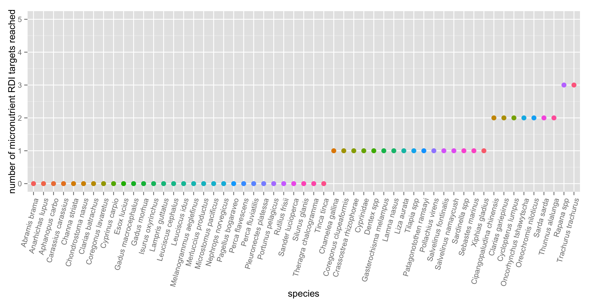
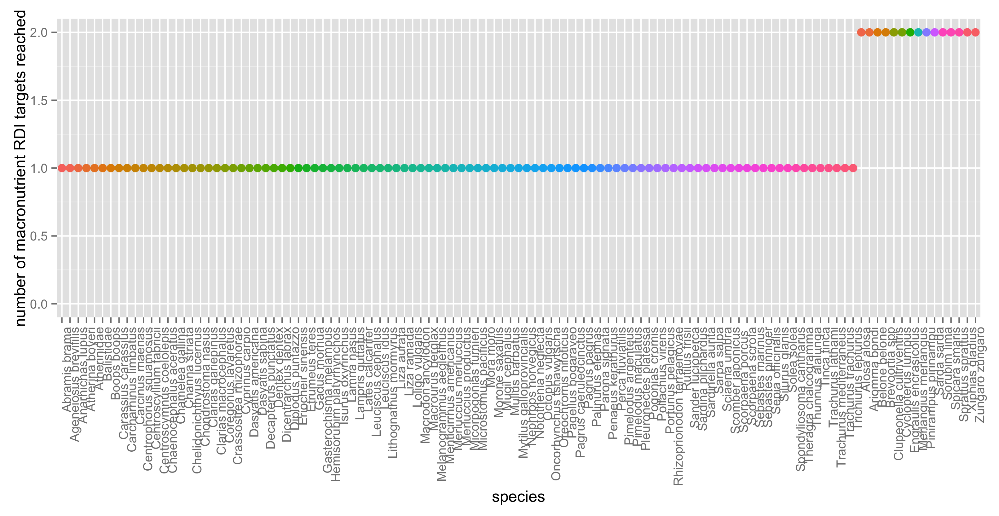

# FD

Hi Mary!

Load packages

```r
library(ggplot2)
library(broom)
library(plyr)
suppressPackageStartupMessages(library(dplyr))
library(knitr)
library(tidyr)
library(readr)
```

Import and clean data


```r
nut_dec3 <- read.csv("~/Desktop/Nutrient_databases/nut_dec3.csv", comment.char="#")
ntbl <- tbl_df(nut_dec3)
ntbl <- ntbl %>%
  mutate(HG_mcg = as.numeric(HG_mcg)) %>% 
  mutate(PROTCNT_g = as.numeric(PROTCNT_g)) %>% 
   rename(species = ASFIS.Scientific.name,
         taxon = ISSCAAP_cat,
         max_length = SLMAX,
         FAT = FAT.g.) %>% 
   mutate(max_size = (lwA * (max_length^lwB)/1000)) %>% 
            mutate(species = revalue(species,
                               c("Oreochromis _=Tilapia spp" = "Tilapia spp",
                                 "Tilapia\x86zillii\x86\x86" = "Tilapia zillii",
                                 "Thaleichthys\x86pacificus" = "Thaleichthys pacificus", 
                                 "Zungaro\x86zungaro" = "Zungaro zungaro",
                                 "Pinirampus\x86pirinampu\x86" = "Pinirampus pirinampu",
                                 "Platichthys\x86stellatus" = "Platichthys stellatus",
                                 "Parambassis\x86wolffii" = "Parambassis wolffii",
                                 "Oncorhynchus\x86mykiss" = "Oncorhynchus mykiss",
                                 "Oncorhynchus\x86tshawytscha" = "Oncorhynchus tshawytscha",
                                 "Oncorhynchus\x86keta" = "Oncorhynchus keta",
                                 "Oncorhynchus\x86nerka\x86" = "Oncorhynchus nerka"))) %>%
  select(species, taxon, max_size, max_length, TL, CA_mg, EPA_g, DHA_g, FE_mg, ZN_mg, HG_mcg, FAT, PROTCNT_g, lwA, lwB, Habitat, Subgroup, Abs_lat)
```


```r
ntbl.RDI.mac <- ntbl%>% 
  group_by(species) %>% 
    summarise(mean.FAT = mean(FAT, na.rm = TRUE),
              mean.PRO = mean(PROTCNT_g, na.rm = TRUE)) %>% 
  mutate(RDI.FAT = (mean.FAT > 7)) %>% 
  mutate(RDI.PRO = (mean.PRO > 5)) %>% 
  mutate(RDI.macro.tot = rowSums(.[4:5])) %>% 
  filter(!is.na(RDI.macro.tot)) %>% 
ggplot(., aes(x = reorder(species, RDI.macro.tot), y = RDI.macro.tot, na.rm = TRUE, color = species)) + geom_point(size = 3) + theme(axis.text.x = element_text(angle = 75, hjust = 1)) + theme(legend.position="none")
ggsave("RDI.tot.mac.png")
```

```
## Saving 7 x 5 in image
```

```r
ntbl.RDI.mic <- ntbl %>% 
  group_by(species) %>% 
    summarise(mean.CA = mean(CA_mg, na.rm = TRUE),
            mean.EPA = mean(EPA_g, na.rm = TRUE), 
            mean.DHA = mean(DHA_g, na.rm = TRUE), 
            mean.ZN = mean(ZN_mg, na.rm = TRUE), 
            mean.FE = mean(FE_mg, na.rm = TRUE)) %>% 
  mutate(RDI.CA = (mean.CA > 300)) %>% 
  mutate(RDI.FE = (mean.FE > 4.5)) %>% 
  mutate(RDI.ZN = (mean.ZN > 2.75)) %>% 
  mutate(RDI.EPA = (mean.EPA > 0.25)) %>% 
  mutate(RDI.DHA = (mean.DHA > 0.25)) %>% 
  mutate(RDI.micro.tot = rowSums(.[7:11])) %>% 
  filter(!is.na(RDI.micro.tot)) %>%
    ggplot(., aes(x = reorder(species, RDI.micro.tot), y = RDI.micro.tot, na.rm = TRUE, color = species)) + geom_point(size = 3) + theme(axis.text.x = element_text(angle = 75, hjust = 1)) + theme(legend.position="none") + ylim(0,5)
ggsave("RDI.tot.mic.png")
```

```
## Saving 7 x 5 in image
```





How many species reach RDI targets for macro vs. micronutrients?

```r
ntbl%>% 
  group_by(species) %>% 
    summarise(mean.FAT = mean(FAT, na.rm = TRUE),
              mean.PRO = mean(PROTCNT_g, na.rm = TRUE)) %>% 
  mutate(RDI.FAT = (mean.FAT > 7)) %>% 
  mutate(RDI.PRO = (mean.PRO > 5)) %>% 
  mutate(RDI.macro.tot = rowSums(.[4:5])) %>% 
  filter(!is.na(RDI.macro.tot)) %>% 
  filter(RDI.macro.tot == 1) %>% #' 15 out of 113 hit 2/2 RDI targets for protein and fat, and 98 out of 113 hit the protein RDI target.
  tally()
```

```
## Source: local data frame [1 x 1]
## 
##       n
##   (int)
## 1    98
```

```r
ntbl %>% 
  group_by(species) %>% 
    summarise(mean.CA = mean(CA_mg, na.rm = TRUE),
            mean.EPA = mean(EPA_g, na.rm = TRUE), 
            mean.DHA = mean(DHA_g, na.rm = TRUE), 
            mean.ZN = mean(ZN_mg, na.rm = TRUE), 
            mean.FE = mean(FE_mg, na.rm = TRUE)) %>% 
  mutate(RDI.CA = (mean.CA > 300)) %>% 
  mutate(RDI.FE = (mean.FE > 4.5)) %>% 
  mutate(RDI.ZN = (mean.ZN > 2.75)) %>% 
  mutate(RDI.EPA = (mean.EPA > 0.25)) %>% 
  mutate(RDI.DHA = (mean.DHA > 0.25)) %>% 
  mutate(RDI.micro.tot = rowSums(.[7:11])) %>% 
  filter(!is.na(RDI.micro.tot)) %>% 
  filter(RDI.micro.tot >= 0)
```

```
## Source: local data frame [55 x 12]
## 
##                      species    mean.CA    mean.EPA    mean.DHA   mean.ZN
##                       (fctr)      (dbl)       (dbl)       (dbl)     (dbl)
## 1              Abramis brama   26.84833 0.093220000 0.120870000 0.5675133
## 2           Anarhichas lupus    6.80000 0.161041269 0.148577180 0.7800000
## 3            Aphanopus carbo   12.95000 0.045188150 0.131603375 0.3850000
## 4        Carassius carassius   58.00000 0.075390000 0.050260000 0.5500000
## 5           Chamelea gallina  218.70000 0.143604026 0.129164672 1.2560000
## 6             Channa striata   71.00000 0.005620824 0.084197352 0.7000000
## 7         Chondrostoma nasus   55.00000 0.064194000 0.096291000 0.5000000
## 8  Cipangopaludina chinensis 1200.00000 0.003342480 0.003676728 8.1000000
## 9          Clarias batrachus  299.00000 0.053120000 0.039840000 0.9000000
## 10        Clarias gariepinus  832.00000 0.076306630 0.221978699 8.0000000
## ..                       ...        ...         ...         ...       ...
## Variables not shown: mean.FE (dbl), RDI.CA (lgl), RDI.FE (lgl), RDI.ZN
##   (lgl), RDI.EPA (lgl), RDI.DHA (lgl), RDI.micro.tot (dbl)
```

```r
#' 2 hit 3/5 of RDI micronutrient targets, 7 hit 2/5 targets, 16 hit 1/5 targets  #' (out of 55)
```


```r
# ?FD
# library(FD)
# ntbl.RDI.mic
# ntbl.matrix.mic <- data.matrix(ntbl.RDI.mic[, 2:6])
# rownames(ntbl.matrix.mic) <- ntbl.RDI.mic$species
# 
# FD.mic <- dbFD(ntbl.matrix.mic)
# FD.mic
# 
# 
# ntbl.mac.matrix <- data.matrix(ntbl.RDI.mac[, 2:3])
# rownames(ntbl.mac.matrix) <- ntbl.RDI.mac$species
# 
# FD.mac <- dbFD(ntbl.mac.matrix)
# (as.data.frame(FD.mac))
# (as.data.frame(FD.mic))
```
