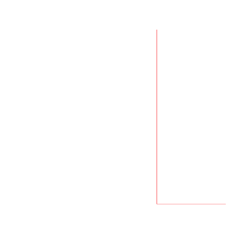

Hi Mary!

Load packages
```{r}
library(ggplot2)
library(broom)
library(plyr)
suppressPackageStartupMessages(library(dplyr))
library(knitr)
library(tidyr)
library(readr)
```

Import and clean data

```{r}
nut_dec3 <- read.csv("~/Desktop/Nutrient_databases/nut_dec3.csv", comment.char="#")
ntbl <- tbl_df(nut_dec3)
ntbl <- ntbl %>%
  mutate(HG_mcg = as.numeric(HG_mcg)) %>% 
  mutate(PROTCNT_g = as.numeric(PROTCNT_g)) %>% 
   rename(species = ASFIS.Scientific.name,
         taxon = ISSCAAP_cat,
         max_length = SLMAX,
         FAT = FAT.g.) %>% 
   mutate(max_size = (lwA * (max_length^lwB)/1000)) %>% 
            mutate(species = revalue(species,
                               c("Oreochromis _=Tilapia spp" = "Tilapia spp",
                                 "Tilapia\x86zillii\x86\x86" = "Tilapia zillii",
                                 "Thaleichthys\x86pacificus" = "Thaleichthys pacificus", 
                                 "Zungaro\x86zungaro" = "Zungaro zungaro",
                                 "Pinirampus\x86pirinampu\x86" = "Pinirampus pirinampu",
                                 "Platichthys\x86stellatus" = "Platichthys stellatus",
                                 "Parambassis\x86wolffii" = "Parambassis wolffii",
                                 "Oncorhynchus\x86mykiss" = "Oncorhynchus mykiss",
                                 "Oncorhynchus\x86tshawytscha" = "Oncorhynchus tshawytscha",
                                 "Oncorhynchus\x86keta" = "Oncorhynchus keta",
                                 "Oncorhynchus\x86nerka\x86" = "Oncorhynchus nerka"))) %>%
  select(species, taxon, max_size, max_length, TL, CA_mg, EPA_g, DHA_g, FE_mg, ZN_mg, HG_mcg, FAT, PROTCNT_g, lwA, lwB, Habitat, Subgroup, Abs_lat)

```


Out of the species for which we have the full suite of micronutrient data (i.e. 5 micronutrients), how many RDI targets do they reach?
```{r macronutrients}

ntbl.RDI.mac <- ntbl%>% 
  group_by(species) %>% 
    summarise(mean.FAT = mean(FAT, na.rm = TRUE),
              mean.PRO = mean(PROTCNT_g, na.rm = TRUE)) %>% 
  mutate(RDI.FAT = (mean.FAT > 7)) %>% 
  mutate(RDI.PRO = (mean.PRO > 5)) %>% 
  mutate(RDI.macro.tot = rowSums(.[4:5])) %>% 
  filter(!is.na(RDI.macro.tot)) %>% 
ggplot(., aes(x = reorder(species, RDI.macro.tot), y = RDI.macro.tot, na.rm = TRUE, color = species)) + geom_point(size = 3) + theme(axis.text.x = element_text(angle = 90, hjust = 1)) + theme(legend.position="none") + ylim(0,2) + ylab("number of macronutrient RDI targets reached") + xlab("species")
ggsave("RDI.tot.mac.png")

ntbl.RDI.mic <- ntbl %>% 
  group_by(species) %>% 
    summarise(mean.CA = mean(CA_mg, na.rm = TRUE),
            mean.EPA = mean(EPA_g, na.rm = TRUE), 
            mean.DHA = mean(DHA_g, na.rm = TRUE), 
            mean.ZN = mean(ZN_mg, na.rm = TRUE), 
            mean.FE = mean(FE_mg, na.rm = TRUE)) %>% 
  mutate(RDI.CA = (mean.CA > 300)) %>% 
  mutate(RDI.FE = (mean.FE > 4.5)) %>% 
  mutate(RDI.ZN = (mean.ZN > 2.75)) %>% 
  mutate(RDI.EPA = (mean.EPA > 0.25)) %>% 
  mutate(RDI.DHA = (mean.DHA > 0.25)) %>% 
  mutate(RDI.micro.tot = rowSums(.[7:11])) %>% 
  filter(!is.na(RDI.micro.tot)) %>%
    ggplot(., aes(x = reorder(species, RDI.micro.tot), y = RDI.micro.tot, na.rm = TRUE, color = species)) + geom_point(size = 3) + theme(axis.text.x = element_text(angle = 75, hjust = 1)) + theme(legend.position="none") + ylim(0,5) + ylab("number of micronutrient RDI targets reached") + xlab("species")
ggsave("RDI.tot.mic.png")

```


How many species reach RDI targets for macro vs. micronutrients?
```{r}

macro.RDI <- ntbl%>% 
  group_by(species) %>% 
    summarise(mean.FAT = mean(FAT, na.rm = TRUE),
              mean.PRO = mean(PROTCNT_g, na.rm = TRUE)) %>% 
  mutate(RDI.FAT = (mean.FAT > 7)) %>% 
  mutate(RDI.PRO = (mean.PRO > 5)) %>% 
  mutate(RDI.macro.tot = rowSums(.[4:5])) %>% 
  filter(!is.na(RDI.macro.tot)) %>% 
  arrange(desc(RDI.macro.tot)) 
  knitr::kable(macro.RDI, align = 'c', format = 'markdown', digits = 2)
```
  
15 out of 113 hit 2/2 RDI targets for protein and fat, and 98 out of 113 hit the protein RDI target.
macro.species <- macro.100$species %>% droplevels()
intersect(macro.100$species, ntbl$species)

```{r}
ntbl.macro <- ntbl %>% 
  filter(species %in% c("Alosa alosa", "Ariomma bondi", "Belone belone", "Brevoortia spp", "Clupeonella cultriventris", "Cyclopterus lumpus", "Engraulis encrasicolus", "Merlangius merlangus", "Pinirampus pirinampu", "Sarda sarda", "Sorubim lima", "Spicara smaris", "Sprattus sprattus", "Xiphias gladius", "Zungaro zungaro"))

# 
# summary(ntbl.macro$max_size)
# summary(ntbl$max_size)
# 
# ntbl$species <- macro.species[ntbl$species]


# inner_join(ntbl,macro.species)
# macro.100per <- ntbl %>%
#     filter(grepl(macro.species, ntbl$species))
# 
# subset(ntbl, species == c("macro.species"))


ntbl.micro <- ntbl %>% 
  group_by(species) %>% 
    summarise(mean.CA = mean(CA_mg, na.rm = TRUE),
            mean.EPA = mean(EPA_g, na.rm = TRUE), 
            mean.DHA = mean(DHA_g, na.rm = TRUE), 
            mean.ZN = mean(ZN_mg, na.rm = TRUE), 
            mean.FE = mean(FE_mg, na.rm = TRUE)) %>% 
  mutate(RDI.CA = (mean.CA > 300)) %>% 
  mutate(RDI.FE = (mean.FE > 4.5)) %>% 
  mutate(RDI.ZN = (mean.ZN > 2.75)) %>% 
  mutate(RDI.EPA = (mean.EPA > 0.25)) %>% 
  mutate(RDI.DHA = (mean.DHA > 0.25)) %>% 
  mutate(RDI.micro.tot = rowSums(.[7:11])) %>% 
  filter(!is.na(RDI.micro.tot)) %>% 
  arrange(desc(RDI.micro.tot))
  knitr::kable(ntbl.micro, align = 'c', format = 'markdown', digits = 2)

ntbl.micro.2 <- ntbl %>% filter(species %in% c("Cipangopaludina chinensis", "Clarias gariepinus", "Cyclopterus lumpus", "Oncorhynchus tshawytscha", "Oreochromis niloticus", "Sarda sarda", "Thunnus alalunga"))

summary(ntbl.micro.2$max_size)

summary(ntbl$max_size, subset = species == c("Rapana spp", "Trachurus trachurus"))

# mean size of species that reach 3/5 nutrients' RDI is 30.28, mean size of those that reach 2 of RDI is 13.88

#' 2 hit 3/5 of RDI micronutrient targets, 7 hit 2/5 targets, 16 hit 1/5 targets  #' (out of 55)
```


##### Functional diversity
```{r warning = FALSE}

# library(FD)
# ntbl.RDI.mic
# ntbl.matrix.mic <- data.matrix(ntbl.RDI.mic[, 2:6])
# rownames(ntbl.matrix.mic) <- ntbl.RDI.mic$species
# 
# FD.mic <- dbFD(ntbl.matrix.mic)
# FD.mic
# 
# 
# ntbl.mac.matrix <- data.matrix(ntbl.RDI.mac[, 2:3])
# rownames(ntbl.mac.matrix) <- ntbl.RDI.mac$species
# 
# FD.mac <- dbFD(ntbl.mac.matrix)
# knitr::kable(as.data.frame(FD.mac))
# knitr::kable(as.data.frame(FD.mic))
# 
# 
# > knitr::kable(as.data.frame(FD.mic))
# 
# 
# |           | nbsp| sing.sp|     FRic| qual.FRic|      FEve|      FDiv|     FDis|     RaoQ| CWM.mean.CA| CWM.mean.EPA| CWM.mean.DHA| CWM.mean.ZN| CWM.mean.FE|
# |:----------|----:|-------:|--------:|---------:|---------:|---------:|--------:|--------:|-----------:|------------:|------------:|-----------:|-----------:|
# |Community1 |   55|      55| 54.39447|         1| 0.4758244| 0.6539231| 1.495851| 4.909091|     137.922|    0.1287276|    0.2247737|    1.466093|    2.481542|
# > knitr::kable(as.data.frame(FD.mac))
# 
# 
# |           | nbsp| sing.sp|     FRic| qual.FRic|      FEve|      FDiv|    FDis|     RaoQ| CWM.mean.FAT| CWM.mean.PRO|
# |:----------|----:|-------:|--------:|---------:|---------:|---------:|-------:|--------:|------------:|------------:|
# |Community1 |  113|     113| 16.67488|         1| 0.5896522| 0.7651128| 1.18096| 1.982301|     3.370509|     139.4703|
# > 

```


##### Micronutrients
```{r}
# ntbl.mic.matrix <- data.matrix(ntbl.RDI.mic[, 2:6])
# rownames(ntbl.mic.matrix) <- ntbl.RDI.mic$species
# 
# ntbl.mic.matrix
# 
# mydist <- function(x) dist(x, method = "euclidian")
# myhclust <- function(x) hclust(x, method = "average")
# 
# tree <- myhclust(mydist(ntbl.mic.matrix))
# png('micro.tree.png')
# plot(tree, main = "micronutrients")
# rect.hclust(tree, k = 7)
# dev.off()
```



##### Macronutrients
```{r}
# ntbl.mac.matrix <- data.matrix(ntbl.RDI.mac[, 2:3])
# rownames(ntbl.mac.matrix) <- ntbl.RDI.mac$species
# 
# mydist <- function(x) dist(x, method = "euclidian")
# myhclust <- function(x) hclust(x, method = "average")
# 
# tree <- myhclust(mydist(ntbl.mac.matrix))
# png('macro.tree.png')
# plot(tree, main = "macronutrients")
# rect.hclust(tree, k = 7)
# dev.off()
```


##### Country-specific functional diversity

```{r}
####### Import Cambodia spp

cambodia.spp <- read_csv("/Users/Joey/Documents/Nutrient_Analysis/data/cambodia.spp.csv")


nspecies <- unique(ntbl$species)
ntbl.cambodia.spp <- list(c(intersect(nspecies,cambodia.spp$Species)))
cam.spp <- c("Anabas testudineus", "Anguilla bicolor", "Anguilla japonica", "Channa marulius", "Channa micropeltes", "Channa striata")

cam.spp <- c("Anabas testudineus", "Anguilla bicolor", "Anguilla japonica", "Channa marulius", "Channa micropeltes", "Channa striata", "Clarias gariepinus", "Clarias macrocephalus", "Clupeoides borneensis", "Cyclocheilichthys apogon", "Cyprinus carpio", "Henicorhynchus siamensis", "Lates calcarifer", "Lutjanus argentimaculatus", "Monopterus albus", "Mastacembelus armatus", "Nandus nandus", "Notopterus notopterus", "Oreochromis niloticus", "Parambassis wolffii", "Plotosus canius", "Puntioplites proctozystron", "Rasbora tornieri", "Sillago sihama", "Thynnichthys thynnoides", "Xenentodon cancila") 


#### FD on cambodia spp

cam.RDI.micro <- ntbl %>% 
  filter(species %in% cam.spp) %>% 
  group_by(species) %>% 
  summarise(mean.CA = mean(CA_mg, na.rm = TRUE),
            mean.EPA = mean(EPA_g, na.rm = TRUE), 
            mean.DHA = mean(DHA_g, na.rm = TRUE), 
            mean.ZN = mean(ZN_mg, na.rm = TRUE), 
            mean.FE = mean(FE_mg, na.rm = TRUE)) %>% 
  mutate(RDI.CA = (mean.CA > 300)) %>% 
  mutate(RDI.FE = (mean.FE > 4.5)) %>% 
  mutate(RDI.ZN = (mean.ZN > 2.75)) %>% 
  mutate(RDI.EPA = (mean.EPA > 0.25)) %>% 
  mutate(RDI.DHA = (mean.DHA > 0.25)) %>% 
  mutate(RDI.micro.tot = rowSums(.[7:11])) %>% 
  filter(!is.na(RDI.micro.tot))
 
#   
# cam.matrix.mic <- data.matrix(cam.RDI.micro[, 2:6])
# rownames(cam.matrix.mic) <- cam.RDI.micro$species
#   
# cam.FD.mic <- as.data.frame(dbFD(cam.matrix.mic))
# knitr::kable(cam.FD.mic)

#### How does FDis differ between the entire dataset and just the Cambodian species?
# # > (FD.mic)
#   nbsp sing.sp     FRic qual.FRic      FEve      FDiv     FDis     RaoQ CWM.mean.CA
#   Community1   55      55 54.39447         1 0.4758244 0.6539231 1.495851 4.909091     137.922
#   CWM.mean.EPA CWM.mean.DHA CWM.mean.ZN CWM.mean.FE
#   Community1    0.1287276    0.2247737    1.466092    2.481542
#   > 
  
# 
# > knitr::kable(cam.FD.mic)
# 
# 
# |           | nbsp| sing.sp|     FRic| qual.FRic|      FEve|      FDiv|     FDis| RaoQ| CWM.mean.CA| CWM.mean.EPA| CWM.mean.DHA| CWM.mean.ZN| CWM.mean.FE|
# |:----------|----:|-------:|--------:|---------:|---------:|---------:|--------:|----:|-----------:|------------:|------------:|-----------:|-----------:|
# |Community1 |    4|       4| 1.300584|         1| 0.8004751| 0.9047908| 1.920415| 3.75|    458.3708|    0.0480374|    0.1268583|    4.125948|    1.698333|

#  > knitr::kable(as.data.frame(FD.mic))
# 
# 
# |           | nbsp| sing.sp|     FRic| qual.FRic|      FEve|      FDiv|     FDis|     RaoQ| CWM.mean.CA| CWM.mean.EPA| CWM.mean.DHA| CWM.mean.ZN| CWM.mean.FE|
# |:----------|----:|-------:|--------:|---------:|---------:|---------:|--------:|--------:|-----------:|------------:|------------:|-----------:|-----------:|
# |Community1 |   55|      55| 54.39447|         1| 0.4758244| 0.6539231| 1.495851| 4.909091|     137.922|    0.1287276|    0.2247737|    1.466093|    2.481542|
```

