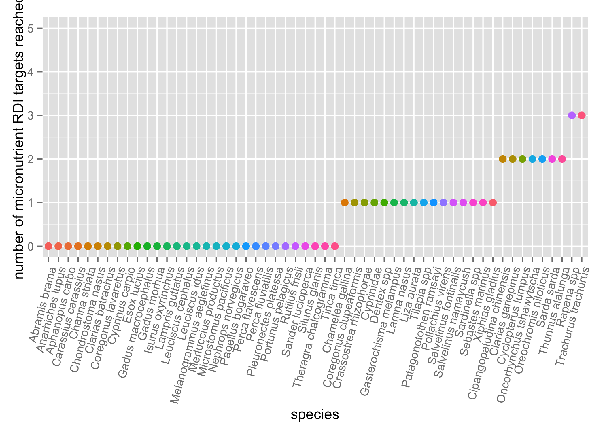
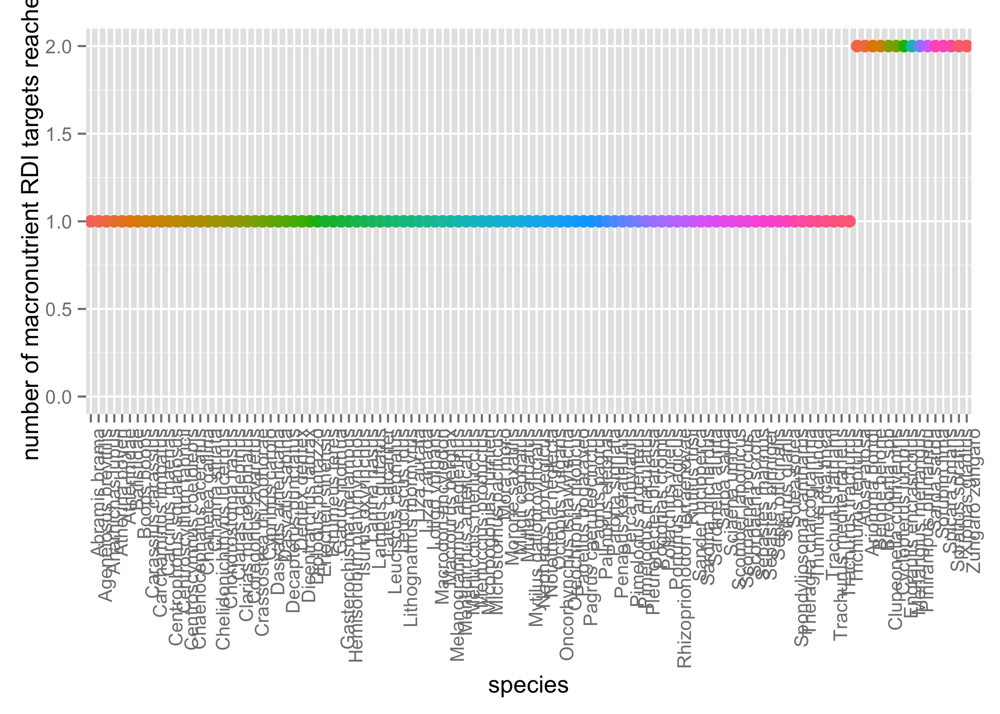

# FD

Hi Mary!

Load packages

```r
library(ggplot2)
library(broom)
library(plyr)
suppressPackageStartupMessages(library(dplyr))
library(knitr)
library(tidyr)
library(readr)
```

Import and clean data


```r
nut_dec3 <- read.csv("~/Desktop/Nutrient_databases/nut_dec3.csv", comment.char="#")
ntbl <- tbl_df(nut_dec3)
ntbl <- ntbl %>%
  mutate(HG_mcg = as.numeric(HG_mcg)) %>% 
  mutate(PROTCNT_g = as.numeric(PROTCNT_g)) %>% 
   rename(species = ASFIS.Scientific.name,
         taxon = ISSCAAP_cat,
         max_length = SLMAX,
         FAT = FAT.g.) %>% 
   mutate(max_size = (lwA * (max_length^lwB)/1000)) %>% 
            mutate(species = revalue(species,
                               c("Oreochromis _=Tilapia spp" = "Tilapia spp",
                                 "Tilapia\x86zillii\x86\x86" = "Tilapia zillii",
                                 "Thaleichthys\x86pacificus" = "Thaleichthys pacificus", 
                                 "Zungaro\x86zungaro" = "Zungaro zungaro",
                                 "Pinirampus\x86pirinampu\x86" = "Pinirampus pirinampu",
                                 "Platichthys\x86stellatus" = "Platichthys stellatus",
                                 "Parambassis\x86wolffii" = "Parambassis wolffii",
                                 "Oncorhynchus\x86mykiss" = "Oncorhynchus mykiss",
                                 "Oncorhynchus\x86tshawytscha" = "Oncorhynchus tshawytscha",
                                 "Oncorhynchus\x86keta" = "Oncorhynchus keta",
                                 "Oncorhynchus\x86nerka\x86" = "Oncorhynchus nerka"))) %>%
  select(species, taxon, max_size, max_length, TL, CA_mg, EPA_g, DHA_g, FE_mg, ZN_mg, HG_mcg, FAT, PROTCNT_g, lwA, lwB, Habitat, Subgroup, Abs_lat)
```


Out of the species for which we have the full suite of micronutrient data (i.e. 5 micronutrients), how many RDI targets do they reach?

```r
ntbl.RDI.mac <- ntbl%>% 
  group_by(species) %>% 
    summarise(mean.FAT = mean(FAT, na.rm = TRUE),
              mean.PRO = mean(PROTCNT_g, na.rm = TRUE)) %>% 
  mutate(RDI.FAT = (mean.FAT > 7)) %>% 
  mutate(RDI.PRO = (mean.PRO > 5)) %>% 
  mutate(RDI.macro.tot = rowSums(.[4:5])) %>% 
  filter(!is.na(RDI.macro.tot)) %>% 
ggplot(., aes(x = reorder(species, RDI.macro.tot), y = RDI.macro.tot, na.rm = TRUE, color = species)) + geom_point(size = 3) + theme(axis.text.x = element_text(angle = 90, hjust = 1)) + theme(legend.position="none") + ylim(0,2) + ylab("number of macronutrient RDI targets reached") + xlab("species")
ggsave("RDI.tot.mac.png")
```

```
## Saving 7 x 5 in image
```

```r
ntbl.RDI.mic <- ntbl %>% 
  group_by(species) %>% 
    summarise(mean.CA = mean(CA_mg, na.rm = TRUE),
            mean.EPA = mean(EPA_g, na.rm = TRUE), 
            mean.DHA = mean(DHA_g, na.rm = TRUE), 
            mean.ZN = mean(ZN_mg, na.rm = TRUE), 
            mean.FE = mean(FE_mg, na.rm = TRUE)) %>% 
  mutate(RDI.CA = (mean.CA > 300)) %>% 
  mutate(RDI.FE = (mean.FE > 4.5)) %>% 
  mutate(RDI.ZN = (mean.ZN > 2.75)) %>% 
  mutate(RDI.EPA = (mean.EPA > 0.25)) %>% 
  mutate(RDI.DHA = (mean.DHA > 0.25)) %>% 
  mutate(RDI.micro.tot = rowSums(.[7:11])) %>% 
  filter(!is.na(RDI.micro.tot)) %>%
    ggplot(., aes(x = reorder(species, RDI.micro.tot), y = RDI.micro.tot, na.rm = TRUE, color = species)) + geom_point(size = 3) + theme(axis.text.x = element_text(angle = 75, hjust = 1)) + theme(legend.position="none") + ylim(0,5) + ylab("number of micronutrient RDI targets reached") + xlab("species")
ggsave("RDI.tot.mic.png")
```

```
## Saving 7 x 5 in image
```





How many species reach RDI targets for macro vs. micronutrients?

```r
macro.RDI <- ntbl%>% 
  group_by(species) %>% 
    summarise(mean.FAT = mean(FAT, na.rm = TRUE),
              mean.PRO = mean(PROTCNT_g, na.rm = TRUE)) %>% 
  mutate(RDI.FAT = (mean.FAT > 7)) %>% 
  mutate(RDI.PRO = (mean.PRO > 5)) %>% 
  mutate(RDI.macro.tot = rowSums(.[4:5])) %>% 
  filter(!is.na(RDI.macro.tot)) %>% 
  arrange(desc(RDI.macro.tot)) 
  knitr::kable(macro.RDI, align = 'c', format = 'markdown', digits = 2)
```


|          species           | mean.FAT | mean.PRO | RDI.FAT | RDI.PRO | RDI.macro.tot |
|:--------------------------:|:--------:|:--------:|:-------:|:-------:|:-------------:|
|        Alosa alosa         |  15.91   |  249.00  |  TRUE   |  TRUE   |       2       |
|       Ariomma bondi        |   7.35   |  230.00  |  TRUE   |  TRUE   |       2       |
|       Belone belone        |  13.42   |  182.00  |  TRUE   |  TRUE   |       2       |
|       Brevoortia spp       |  13.60   |  153.00  |  TRUE   |  TRUE   |       2       |
| Clupeonella cultriventris  |  10.23   |  114.00  |  TRUE   |  TRUE   |       2       |
|     Cyclopterus lumpus     |  22.83   |  11.00   |  TRUE   |  TRUE   |       2       |
|   Engraulis encrasicolus   |   9.59   |  112.00  |  TRUE   |  TRUE   |       2       |
|    Merlangius merlangus    |  18.30   |  79.00   |  TRUE   |  TRUE   |       2       |
|    Pinirampus pirinampu    |   7.30   |  50.00   |  TRUE   |  TRUE   |       2       |
|        Sarda sarda         |  10.38   |  202.73  |  TRUE   |  TRUE   |       2       |
|        Sorubim lima        |  11.19   |  42.00   |  TRUE   |  TRUE   |       2       |
|       Spicara smaris       |  17.49   |  104.00  |  TRUE   |  TRUE   |       2       |
|     Sprattus sprattus      |   9.42   |  253.00  |  TRUE   |  TRUE   |       2       |
|      Xiphias gladius       |  12.00   |  91.00   |  TRUE   |  TRUE   |       2       |
|      Zungaro zungaro       |  10.44   |  66.00   |  TRUE   |  TRUE   |       2       |
|       Abramis brama        |   1.00   |  159.00  |  FALSE  |  TRUE   |       1       |
|   Ageneiosus brevifilis    |   0.36   |  92.00   |  FALSE  |  TRUE   |       1       |
|      Anarhichas lupus      |   1.66   |  48.00   |  FALSE  |  TRUE   |       1       |
|      Atherina boyeri       |   6.20   |  154.00  |  FALSE  |  TRUE   |       1       |
|        Atherinidae         |   5.74   |  127.00  |  FALSE  |  TRUE   |       1       |
|         Balistidae         |   0.53   |  69.00   |  FALSE  |  TRUE   |       1       |
|        Boops boops         |   3.64   |  116.33  |  FALSE  |  TRUE   |       1       |
|    Carassius carassius     |   1.50   |  101.00  |  FALSE  |  TRUE   |       1       |
|   Carcharhinus limbatus    |   0.46   |  270.00  |  FALSE  |  TRUE   |       1       |
|      Carcinus maenas       |   0.50   |  60.00   |  FALSE  |  TRUE   |       1       |
|   Centrophorus squamosus   |   0.99   |  180.00  |  FALSE  |  TRUE   |       1       |
|  Centroscyllium fabricii   |   0.70   |  69.00   |  FALSE  |  TRUE   |       1       |
|  Centroscymnus coelolepis  |   0.95   |  214.00  |  FALSE  |  TRUE   |       1       |
|  Chaenocephalus aceratus   |   3.06   |  75.00   |  FALSE  |  TRUE   |       1       |
|      Chamelea gallina      |   1.17   |  100.44  |  FALSE  |  TRUE   |       1       |
|       Channa striata       |   0.99   |  149.00  |  FALSE  |  TRUE   |       1       |
| Chelidonichthyus lucernus  |   1.25   |  156.33  |  FALSE  |  TRUE   |       1       |
|     Chondrostoma nasus     |   1.30   |  101.00  |  FALSE  |  TRUE   |       1       |
|     Clarias gariepinus     |   3.21   |  129.00  |  FALSE  |  TRUE   |       1       |
|   Clarias macrocephalus    |   1.03   |  94.00   |  FALSE  |  TRUE   |       1       |
|    Coregonus lavaretus     |   2.67   |  146.67  |  FALSE  |  TRUE   |       1       |
|  Crassostrea rhizophorae   |   1.65   |  232.80  |  FALSE  |  TRUE   |       1       |
|      Cyprinus carpio       |   1.96   |  135.00  |  FALSE  |  TRUE   |       1       |
|     Dasyatis americana     |   0.60   |  270.50  |  FALSE  |  TRUE   |       1       |
|      Dasyatis sabina       |   0.46   |  253.50  |  FALSE  |  TRUE   |       1       |
|    Decapterus punctatus    |   1.75   |  240.50  |  FALSE  |  TRUE   |       1       |
|       Dentex dentex        |   1.61   |  238.00  |  FALSE  |  TRUE   |       1       |
|    Dicentrarchus labrax    |   3.34   |  182.50  |  FALSE  |  TRUE   |       1       |
|     Diplodus puntazzo      |   2.24   |  146.00  |  FALSE  |  TRUE   |       1       |
|     Eriocheir sinensis     |   1.80   |  165.00  |  FALSE  |  TRUE   |       1       |
|       Etrumeus teres       |   1.30   |  219.20  |  FALSE  |  TRUE   |       1       |
|        Gadus morhua        |   0.62   |  84.00   |  FALSE  |  TRUE   |       1       |
|   Gasterochisma melampus   |   2.00   |  264.00  |  FALSE  |  TRUE   |       1       |
| Hemisorubim platyrhynchos  |   6.35   |  103.00  |  FALSE  |  TRUE   |       1       |
|     Isurus oxyrinchus      |   1.20   |  220.00  |  FALSE  |  TRUE   |       1       |
|        Lamna nasus         |   1.30   |  138.00  |  FALSE  |  TRUE   |       1       |
|      Lampris guttatus      |   1.00   |  259.00  |  FALSE  |  TRUE   |       1       |
|      Lates calcarifer      |   0.67   |  202.50  |  FALSE  |  TRUE   |       1       |
|     Leuciscus cephalus     |   1.30   |  159.00  |  FALSE  |  TRUE   |       1       |
|       Leuciscus idus       |   1.60   |  138.00  |  FALSE  |  TRUE   |       1       |
|   Lithognathus mormyrus    |   1.21   |  117.00  |  FALSE  |  TRUE   |       1       |
|        Liza aurata         |   3.61   |  226.00  |  FALSE  |  TRUE   |       1       |
|        Liza ramada         |   1.34   |  63.67   |  FALSE  |  TRUE   |       1       |
|      Loligo vulgaris       |   1.80   |  96.50   |  FALSE  |  TRUE   |       1       |
|     Macrodon ancylodon     |   0.56   |  145.00  |  FALSE  |  TRUE   |       1       |
|     Macrourus berglax      |   0.61   |  58.00   |  FALSE  |  TRUE   |       1       |
|  Melanogrammus aeglefinus  |   0.55   |  91.00   |  FALSE  |  TRUE   |       1       |
|  Menticirrhus americanus   |   6.70   |  169.00  |  FALSE  |  TRUE   |       1       |
|   Merluccius merluccius    |   0.76   |  82.50   |  FALSE  |  TRUE   |       1       |
|    Merluccius productus    |   0.73   |  63.00   |  FALSE  |  TRUE   |       1       |
|   Micorpogonias furnieri   |   1.29   |  211.00  |  FALSE  |  TRUE   |       1       |
|   Microstomus pacificus    |   1.00   |  61.00   |  FALSE  |  TRUE   |       1       |
|         Mora moro          |   0.41   |  85.00   |  FALSE  |  TRUE   |       1       |
|      Morone saxatilis      |   2.49   |  147.57  |  FALSE  |  TRUE   |       1       |
|       Mugil cephalus       |   2.11   |  167.00  |  FALSE  |  TRUE   |       1       |
|      Mullus barbatus       |   6.12   |  117.12  |  FALSE  |  TRUE   |       1       |
| Mytilus galloprovincialis  |   2.27   |  150.25  |  FALSE  |  TRUE   |       1       |
|    Nephrops norvegicus     |   0.64   |  89.75   |  FALSE  |  TRUE   |       1       |
|    Notothenia neglecta     |   3.19   |  141.00  |  FALSE  |  TRUE   |       1       |
|      Octopus vulgaris      |   0.82   |  16.00   |  FALSE  |  TRUE   |       1       |
|  Oncorhynchus tshawytscha  |   7.00   |  94.50   |  FALSE  |  TRUE   |       1       |
|   Oreochromis niloticus    |   0.97   |  109.50  |  FALSE  |  TRUE   |       1       |
|     Pagellus bogaraveo     |   0.56   |  220.00  |  FALSE  |  TRUE   |       1       |
|   Pagrus caeruleocinctus   |   1.02   |  105.00  |  FALSE  |  TRUE   |       1       |
|       Pagrus pagrus        |   0.86   |  229.00  |  FALSE  |  TRUE   |       1       |
|     Palinurus elephas      |   1.61   |  104.00  |  FALSE  |  TRUE   |       1       |
|       Parona signata       |   5.50   |  211.00  |  FALSE  |  TRUE   |       1       |
|     Penaeus kerathurus     |   1.70   |  30.00   |  FALSE  |  TRUE   |       1       |
|     Perca fluviatilis      |   0.92   |  105.33  |  FALSE  |  TRUE   |       1       |
|    Pimelodus argenteus     |   0.35   |  59.00   |  FALSE  |  TRUE   |       1       |
|    Pimelodus maculatus     |   5.55   |  91.00   |  FALSE  |  TRUE   |       1       |
|   Pleuronectes platessa    |   1.70   |  37.00   |  FALSE  |  TRUE   |       1       |
|      Pogonias cromis       |   1.20   |  153.00  |  FALSE  |  TRUE   |       1       |
|     Pollachius virens      |   0.85   |  120.00  |  FALSE  |  TRUE   |       1       |
|     Portunus pelagicus     |   0.92   |  165.75  |  FALSE  |  TRUE   |       1       |
| Rhizoprionodon terraenovae |   0.52   |  262.00  |  FALSE  |  TRUE   |       1       |
|       Rutilus frisii       |   4.12   |  228.00  |  FALSE  |  TRUE   |       1       |
|     Sander lucioperca      |   0.64   |  147.71  |  FALSE  |  TRUE   |       1       |
|     Sardina pilchardus     |   2.83   |  168.43  |  FALSE  |  TRUE   |       1       |
|     Sardinella aurita      |   5.66   |  174.12  |  FALSE  |  TRUE   |       1       |
|        Sarpa salpa         |   0.95   |  101.00  |  FALSE  |  TRUE   |       1       |
|       Sciaena umbra        |   1.47   |  213.00  |  FALSE  |  TRUE   |       1       |
|     Scomber japonicus      |   3.29   |  233.71  |  FALSE  |  TRUE   |       1       |
|      Scorpaena porcus      |   0.80   |  93.00   |  FALSE  |  TRUE   |       1       |
|      Scorpaena scrofa      |   0.74   |  145.00  |  FALSE  |  TRUE   |       1       |
|      Sebastes marinus      |   3.04   |  77.00   |  FALSE  |  TRUE   |       1       |
|     Sebastes pinniger      |   3.31   |  131.00  |  FALSE  |  TRUE   |       1       |
|     Sepia officinalis      |   1.34   |  65.00   |  FALSE  |  TRUE   |       1       |
|       Silurus glanis       |   2.02   |  91.00   |  FALSE  |  TRUE   |       1       |
|        Solea solea         |   0.74   |  70.50   |  FALSE  |  TRUE   |       1       |
|  Spondyliosoma cantharus   |   0.74   |  138.00  |  FALSE  |  TRUE   |       1       |
|   Theragra chalcogramma    |   0.79   |  14.00   |  FALSE  |  TRUE   |       1       |
|      Thunnus alalunga      |   5.00   |  268.00  |  FALSE  |  TRUE   |       1       |
|        Tinca tinca         |   0.61   |  138.00  |  FALSE  |  TRUE   |       1       |
|     Trachurus lathami      |   1.50   |  174.40  |  FALSE  |  TRUE   |       1       |
|  Trachurus mediterraneus   |   4.43   |  201.15  |  FALSE  |  TRUE   |       1       |
|    Trachurus trachurus     |   3.55   |  130.65  |  FALSE  |  TRUE   |       1       |
|    Trichiurus lepturus     |   2.75   |  164.00  |  FALSE  |  TRUE   |       1       |
  
15 out of 113 hit 2/2 RDI targets for protein and fat, and 98 out of 113 hit the protein RDI target.
macro.species <- macro.100$species %>% droplevels()
intersect(macro.100$species, ntbl$species)


```r
ntbl.macro <- ntbl %>% 
  filter(species %in% c("Alosa alosa", "Ariomma bondi", "Belone belone", "Brevoortia spp", "Clupeonella cultriventris", "Cyclopterus lumpus", "Engraulis encrasicolus", "Merlangius merlangus", "Pinirampus pirinampu", "Sarda sarda", "Sorubim lima", "Spicara smaris", "Sprattus sprattus", "Xiphias gladius", "Zungaro zungaro"))

# 
# summary(ntbl.macro$max_size)
# summary(ntbl$max_size)
# 
# ntbl$species <- macro.species[ntbl$species]


# inner_join(ntbl,macro.species)
# macro.100per <- ntbl %>%
#     filter(grepl(macro.species, ntbl$species))
# 
# subset(ntbl, species == c("macro.species"))


ntbl.micro <- ntbl %>% 
  group_by(species) %>% 
    summarise(mean.CA = mean(CA_mg, na.rm = TRUE),
            mean.EPA = mean(EPA_g, na.rm = TRUE), 
            mean.DHA = mean(DHA_g, na.rm = TRUE), 
            mean.ZN = mean(ZN_mg, na.rm = TRUE), 
            mean.FE = mean(FE_mg, na.rm = TRUE)) %>% 
  mutate(RDI.CA = (mean.CA > 300)) %>% 
  mutate(RDI.FE = (mean.FE > 4.5)) %>% 
  mutate(RDI.ZN = (mean.ZN > 2.75)) %>% 
  mutate(RDI.EPA = (mean.EPA > 0.25)) %>% 
  mutate(RDI.DHA = (mean.DHA > 0.25)) %>% 
  mutate(RDI.micro.tot = rowSums(.[7:11])) %>% 
  filter(!is.na(RDI.micro.tot)) %>% 
  arrange(desc(RDI.micro.tot))
  knitr::kable(ntbl.micro, align = 'c', format = 'markdown', digits = 2)
```


|          species          | mean.CA | mean.EPA | mean.DHA | mean.ZN | mean.FE | RDI.CA | RDI.FE | RDI.ZN | RDI.EPA | RDI.DHA | RDI.micro.tot |
|:-------------------------:|:-------:|:--------:|:--------:|:-------:|:-------:|:------:|:------:|:------:|:-------:|:-------:|:-------------:|
|        Rapana spp         | 628.00  |   0.00   |   0.00   |  9.45   |  75.00  |  TRUE  |  TRUE  |  TRUE  |  FALSE  |  FALSE  |       3       |
|    Trachurus trachurus    | 272.04  |   0.28   |   0.57   |  2.25   |  7.30   | FALSE  |  TRUE  | FALSE  |  TRUE   |  TRUE   |       3       |
| Cipangopaludina chinensis | 1200.00 |   0.00   |   0.00   |  8.10   |  4.30   |  TRUE  | FALSE  |  TRUE  |  FALSE  |  FALSE  |       2       |
|    Clarias gariepinus     | 832.00  |   0.08   |   0.22   |  8.00   |  3.00   |  TRUE  | FALSE  |  TRUE  |  FALSE  |  FALSE  |       2       |
|    Cyclopterus lumpus     |  7.90   |   1.61   |   1.67   |  0.61   |  0.46   | FALSE  | FALSE  | FALSE  |  TRUE   |  TRUE   |       2       |
| Oncorhynchus tshawytscha  |  26.00  |   0.44   |   0.55   |  0.44   |  0.30   | FALSE  | FALSE  | FALSE  |  TRUE   |  TRUE   |       2       |
|   Oreochromis niloticus   | 883.00  |   0.04   |   0.14   |  7.00   |  3.00   |  TRUE  | FALSE  |  TRUE  |  FALSE  |  FALSE  |       2       |
|        Sarda sarda        |  47.82  |   0.32   |   0.15   |  0.98   |  6.18   | FALSE  |  TRUE  | FALSE  |  TRUE   |  FALSE  |       2       |
|     Thunnus alalunga      |  18.00  |   0.29   |   0.86   |  0.50   |  0.60   | FALSE  | FALSE  | FALSE  |  TRUE   |  TRUE   |       2       |
|     Chamelea gallina      | 218.70  |   0.14   |   0.13   |  1.26   |  7.68   | FALSE  |  TRUE  | FALSE  |  FALSE  |  FALSE  |       1       |
|  Coregonus clupeaformis   |  5.67   |   0.08   |   0.30   |  0.47   |  0.24   | FALSE  | FALSE  | FALSE  |  FALSE  |  TRUE   |       1       |
|  Crassostrea rhizophorae  |  13.14  |   0.11   |   0.06   |  11.87  |  2.39   | FALSE  | FALSE  |  TRUE  |  FALSE  |  FALSE  |       1       |
|        Cyprinidae         | 753.34  |   0.02   |   0.07   |  2.54   |  3.35   |  TRUE  | FALSE  | FALSE  |  FALSE  |  FALSE  |       1       |
|        Dentex spp         | 249.29  |   0.14   |   0.43   |  0.61   |  0.71   | FALSE  | FALSE  | FALSE  |  FALSE  |  TRUE   |       1       |
|  Gasterochisma melampus   |  11.00  |   0.09   |   0.33   |  0.50   |  0.90   | FALSE  | FALSE  | FALSE  |  FALSE  |  TRUE   |       1       |
|        Lamna nasus        |  10.00  |   0.03   |   0.29   |  0.40   |  1.80   | FALSE  | FALSE  | FALSE  |  FALSE  |  TRUE   |       1       |
|        Liza aurata        |  6.90   |   0.27   |   0.07   |  0.19   |  0.16   | FALSE  | FALSE  | FALSE  |  TRUE   |  FALSE  |       1       |
|        Tilapia spp        | 621.60  |   0.04   |   0.13   |  1.32   |  0.83   |  TRUE  | FALSE  | FALSE  |  FALSE  |  FALSE  |       1       |
|  Patagonotothen ramsayi   |  8.63   |   0.10   |   0.26   |  0.68   |  0.33   | FALSE  | FALSE  | FALSE  |  FALSE  |  TRUE   |       1       |
|     Pollachius virens     |  10.00  |   0.07   |   0.25   |  0.38   |  0.25   | FALSE  | FALSE  | FALSE  |  FALSE  |  TRUE   |       1       |
|   Salvelinus fontinalis   |  7.90   |   0.16   |   0.42   |  0.80   |  0.26   | FALSE  | FALSE  | FALSE  |  FALSE  |  TRUE   |       1       |
|   Salvelinus namaycush    |  3.00   |   0.14   |   0.30   |  0.50   |  0.20   | FALSE  | FALSE  | FALSE  |  FALSE  |  TRUE   |       1       |
|      Sardinella spp       | 398.52  |   0.00   |   0.03   |  1.57   |  1.83   |  TRUE  | FALSE  | FALSE  |  FALSE  |  FALSE  |       1       |
|     Sebastes marinus      |  13.00  |   0.19   |   0.31   |  0.31   |  0.20   | FALSE  | FALSE  | FALSE  |  FALSE  |  TRUE   |       1       |
|      Xiphias gladius      |  39.00  |   0.24   |   1.33   |  1.30   |  1.20   | FALSE  | FALSE  | FALSE  |  FALSE  |  TRUE   |       1       |
|       Abramis brama       |  26.85  |   0.09   |   0.12   |  0.57   |  0.34   | FALSE  | FALSE  | FALSE  |  FALSE  |  FALSE  |       0       |
|     Anarhichas lupus      |  6.80   |   0.16   |   0.15   |  0.78   |  0.15   | FALSE  | FALSE  | FALSE  |  FALSE  |  FALSE  |       0       |
|      Aphanopus carbo      |  12.95  |   0.05   |   0.13   |  0.38   |  0.10   | FALSE  | FALSE  | FALSE  |  FALSE  |  FALSE  |       0       |
|    Carassius carassius    |  58.00  |   0.08   |   0.05   |  0.55   |  0.85   | FALSE  | FALSE  | FALSE  |  FALSE  |  FALSE  |       0       |
|      Channa striata       |  71.00  |   0.01   |   0.08   |  0.70   |  0.30   | FALSE  | FALSE  | FALSE  |  FALSE  |  FALSE  |       0       |
|    Chondrostoma nasus     |  55.00  |   0.06   |   0.10   |  0.50   |  0.95   | FALSE  | FALSE  | FALSE  |  FALSE  |  FALSE  |       0       |
|     Clarias batrachus     | 299.00  |   0.05   |   0.04   |  0.90   |  0.60   | FALSE  | FALSE  | FALSE  |  FALSE  |  FALSE  |       0       |
|    Coregonus lavaretus    |  33.52  |   0.19   |   0.18   |  0.61   |  0.36   | FALSE  | FALSE  | FALSE  |  FALSE  |  FALSE  |       0       |
|      Cyprinus carpio      |  47.48  |   0.07   |   0.06   |  0.80   |  0.49   | FALSE  | FALSE  | FALSE  |  FALSE  |  FALSE  |       0       |
|        Esox lucius        |  9.60   |   0.05   |   0.21   |  0.90   |  0.10   | FALSE  | FALSE  | FALSE  |  FALSE  |  FALSE  |       0       |
|    Gadus macrocephalus    |  11.80  |   0.05   |   0.14   |  0.38   |  0.18   | FALSE  | FALSE  | FALSE  |  FALSE  |  FALSE  |       0       |
|       Gadus morhua        |  8.70   |   0.05   |   0.13   |  0.34   |  0.12   | FALSE  | FALSE  | FALSE  |  FALSE  |  FALSE  |       0       |
|     Isurus oxyrinchus     |  12.00  |   0.03   |   0.21   |  0.40   |  1.20   | FALSE  | FALSE  | FALSE  |  FALSE  |  FALSE  |       0       |
|     Lampris guttatus      |  6.00   |   0.03   |   0.17   |  0.30   |  1.00   | FALSE  | FALSE  | FALSE  |  FALSE  |  FALSE  |       0       |
|    Leuciscus cephalus     |  61.50  |   0.07   |   0.06   |  0.50   |  0.60   | FALSE  | FALSE  | FALSE  |  FALSE  |  FALSE  |       0       |
|      Leuciscus idus       |  60.00  |   0.13   |   0.07   |  0.55   |  0.55   | FALSE  | FALSE  | FALSE  |  FALSE  |  FALSE  |       0       |
| Melanogrammus aeglefinus  |  7.80   |   0.05   |   0.12   |  0.29   |  0.11   | FALSE  | FALSE  | FALSE  |  FALSE  |  FALSE  |       0       |
|   Merluccius productus    |  9.80   |   0.07   |   0.12   |  0.35   |  0.25   | FALSE  | FALSE  | FALSE  |  FALSE  |  FALSE  |       0       |
|   Microstomus pacificus   |  14.53  |   0.08   |   0.09   |  0.39   |  0.21   | FALSE  | FALSE  | FALSE  |  FALSE  |  FALSE  |       0       |
|    Nephrops norvegicus    |  90.67  |   0.04   |   0.04   |  1.51   |  2.22   | FALSE  | FALSE  | FALSE  |  FALSE  |  FALSE  |       0       |
|    Pagellus bogaraveo     |  57.33  |   0.02   |   0.22   |  0.29   |  0.16   | FALSE  | FALSE  | FALSE  |  FALSE  |  FALSE  |       0       |
|     Perca flavescens      |  2.99   |   0.00   |   0.06   |  0.14   |  0.09   | FALSE  | FALSE  | FALSE  |  FALSE  |  FALSE  |       0       |
|     Perca fluviatilis     |  32.47  |   0.04   |   0.14   |  0.52   |  0.14   | FALSE  | FALSE  | FALSE  |  FALSE  |  FALSE  |       0       |
|   Pleuronectes platessa   |  28.00  |   0.17   |   0.16   |  0.48   |  0.19   | FALSE  | FALSE  | FALSE  |  FALSE  |  FALSE  |       0       |
|    Portunus pelagicus     | 113.50  |   0.09   |   0.07   |  2.45   |  0.38   | FALSE  | FALSE  | FALSE  |  FALSE  |  FALSE  |       0       |
|      Rutilus frisii       |  7.59   |   0.23   |   0.13   |  0.11   |  0.34   | FALSE  | FALSE  | FALSE  |  FALSE  |  FALSE  |       0       |
|     Sander lucioperca     |  55.52  |   0.02   |   0.05   |  0.71   |  0.39   | FALSE  | FALSE  | FALSE  |  FALSE  |  FALSE  |       0       |
|      Silurus glanis       |  25.50  |   0.13   |   0.21   |  0.70   |  0.60   | FALSE  | FALSE  | FALSE  |  FALSE  |  FALSE  |       0       |
|   Theragra chalcogramma   |  12.37  |   0.05   |   0.11   |  0.39   |  0.19   | FALSE  | FALSE  | FALSE  |  FALSE  |  FALSE  |       0       |
|        Tinca tinca        |  63.00  |   0.04   |   0.07   |  1.10   |  0.85   | FALSE  | FALSE  | FALSE  |  FALSE  |  FALSE  |       0       |

```r
ntbl.micro.2 <- ntbl %>% filter(species %in% c("Cipangopaludina chinensis", "Clarias gariepinus", "Cyclopterus lumpus", "Oncorhynchus tshawytscha", "Oreochromis niloticus", "Sarda sarda", "Thunnus alalunga"))

summary(ntbl.micro.2$max_size)
```

```
##    Min. 1st Qu.  Median    Mean 3rd Qu.    Max.    NA's 
##   3.658   3.658   8.357  13.880  25.610  57.850       1
```

```r
summary(ntbl$max_size, subset = species == c("Rapana spp", "Trachurus trachurus"))
```

```
##     Min.  1st Qu.   Median     Mean  3rd Qu.     Max.     NA's 
##    0.000    0.680    2.997   30.280    9.862 6077.000      205
```

```r
# mean size of species that reach 3/5 nutrients' RDI is 30.28, mean size of those that reach 2 of RDI is 13.88

#' 2 hit 3/5 of RDI micronutrient targets, 7 hit 2/5 targets, 16 hit 1/5 targets  #' (out of 55)
```


##### Functional diversity

```r
# library(FD)
# ntbl.RDI.mic
# ntbl.matrix.mic <- data.matrix(ntbl.RDI.mic[, 2:6])
# rownames(ntbl.matrix.mic) <- ntbl.RDI.mic$species
# 
# FD.mic <- dbFD(ntbl.matrix.mic)
# FD.mic
# 
# 
# ntbl.mac.matrix <- data.matrix(ntbl.RDI.mac[, 2:3])
# rownames(ntbl.mac.matrix) <- ntbl.RDI.mac$species
# 
# FD.mac <- dbFD(ntbl.mac.matrix)
# knitr::kable(as.data.frame(FD.mac))
# knitr::kable(as.data.frame(FD.mic))
# 
# 
# > knitr::kable(as.data.frame(FD.mic))
# 
# 
# |           | nbsp| sing.sp|     FRic| qual.FRic|      FEve|      FDiv|     FDis|     RaoQ| CWM.mean.CA| CWM.mean.EPA| CWM.mean.DHA| CWM.mean.ZN| CWM.mean.FE|
# |:----------|----:|-------:|--------:|---------:|---------:|---------:|--------:|--------:|-----------:|------------:|------------:|-----------:|-----------:|
# |Community1 |   55|      55| 54.39447|         1| 0.4758244| 0.6539231| 1.495851| 4.909091|     137.922|    0.1287276|    0.2247737|    1.466093|    2.481542|
# > knitr::kable(as.data.frame(FD.mac))
# 
# 
# |           | nbsp| sing.sp|     FRic| qual.FRic|      FEve|      FDiv|    FDis|     RaoQ| CWM.mean.FAT| CWM.mean.PRO|
# |:----------|----:|-------:|--------:|---------:|---------:|---------:|-------:|--------:|------------:|------------:|
# |Community1 |  113|     113| 16.67488|         1| 0.5896522| 0.7651128| 1.18096| 1.982301|     3.370509|     139.4703|
# > 
```


```r
# ntbl.mic.matrix <- data.matrix(ntbl.RDI.mic[, 2:6])
# rownames(ntbl.mic.matrix) <- ntbl.RDI.mic$species
# 
# ntbl.mic.matrix
# 
# mydist <- function(x) dist(x, method = "euclidian")
# myhclust <- function(x) hclust(x, method = "average")
# 
# tree <- myhclust(mydist(ntbl.mic.matrix))
# plot(tree)
# rect.hclust(tree, k = 7)
```

