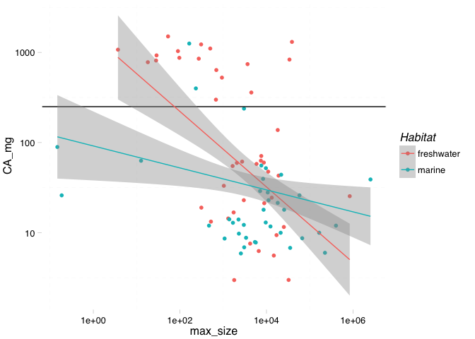

# Homework3

Initial set up

```r
library(plotrix)
library(ggthemes)
```

```
## Loading required package: ggplot2
```

```r
library(dplyr)
```

```
## 
## Attaching package: 'dplyr'
## 
## The following objects are masked from 'package:stats':
## 
##     filter, lag
## 
## The following objects are masked from 'package:base':
## 
##     intersect, setdiff, setequal, union
```

```r
library(ggplot2)
library(knitr)
library(Hmisc)
```

```
## Loading required package: grid
## Loading required package: lattice
## Loading required package: survival
## Loading required package: Formula
## 
## Attaching package: 'Hmisc'
## 
## The following objects are masked from 'package:dplyr':
## 
##     combine, src, summarize
## 
## The following objects are masked from 'package:base':
## 
##     format.pval, round.POSIXt, trunc.POSIXt, units
```

```r
nut <- read.csv("~/Desktop/Nutrient_databases/nut_sept22_lwr_dec3.csv", comment.char="#", stringsAsFactors=FALSE)

ntbl <- tbl_df(nut)

glimpse(ntbl)
```

```
## Observations: 1,188
## Variables: 98
## $ ASFIS.Scientific.name                 (chr) "Abramis brama", "Abrami...
## $ Food.name.in.English                  (chr) "Common bream, wild, ski...
## $ TaxonKey                              (int) NA, NA, NA, NA, NA, NA, ...
## $ lwA                                   (dbl) 0.00871, 0.00871, 0.0087...
## $ lwB                                   (dbl) 3.140, 3.140, 3.140, 3.1...
## $ SLMAX                                 (dbl) 82.0, 82.0, 82.0, 82.0, ...
## $ SLMAX_nov28                           (dbl) NA, NA, NA, NA, NA, NA, ...
## $ SLMAX_source                          (chr) "http://www.fishbase.org...
## $ TL                                    (dbl) 2.90, 2.90, 2.90, 2.90, ...
## $ TL_se                                 (dbl) 0.40, 0.40, 0.40, 0.40, ...
## $ TL_nov28                              (dbl) NA, NA, NA, NA, NA, NA, ...
## $ TLSE_nov28                            (dbl) NA, NA, NA, NA, NA, NA, ...
## $ X                                     (int) 1, 2, 3, 4, 5, 6, 7, 8, ...
## $ sci.name                              (chr) "Abramis abramis", "Abra...
## $ Food.Item.ID                          (int) 900684, 900123, 900159, ...
## $ Subgroup                              (chr) "Finfish", "Finfish", "F...
## $ country.region                        (chr) "Germany, Usedom, Baltic...
## $ Type                                  (chr) "W", "W", "W", "W", "W",...
## $ ISSCAAP                               (int) 11, 11, 11, 11, 11, 11, ...
## $ ISSCAAP_cat                           (chr) "Carps, barbels and othe...
## $ Habitat                               (chr) "marine", "freshwater", ...
## $ X3_alpha                              (chr) "FBM", "FBM", "FBM", "FB...
## $ Food.name.in.own.language             (chr) NA, NA, NA, NA, NA, NA, ...
## $ Processing                            (chr) "r", "r", "r", "r", "r",...
## $ ASFIS.English.name                    (chr) "Freshwater bream", "Fre...
## $ Season                                (chr) "3-Jul", "Jun-97", "Summ...
## $ Other                                 (chr) "fishing areas: North At...
## $ Latitude                              (dbl) 53.87537, 54.08424, 41.5...
## $ Abs_lat                               (dbl) 53.87537, 54.08424, 41.5...
## $ length_from_study                     (dbl) NA, NA, NA, NA, NA, NA, ...
## $ length_3                              (dbl) NA, NA, NA, NA, NA, NA, ...
## $ n.x                                   (int) NA, NA, NA, NA, NA, NA, ...
## $ WATER.g.                              (chr) NA, NA, NA, NA, NA, NA, ...
## $ FAT.g.                                (dbl) NA, NA, NA, NA, NA, NA, ...
## $ FATCE.g.                              (chr) NA, NA, NA, NA, NA, NA, ...
## $ FAT..g.                               (dbl) NA, NA, NA, NA, NA, NA, ...
## $ FASAT.g.                              (dbl) NA, NA, NA, NA, NA, NA, ...
## $ FAMS.g.                               (dbl) NA, NA, NA, NA, NA, NA, ...
## $ FAPU.g.                               (dbl) NA, NA, NA, NA, NA, NA, ...
## $ FAUN.g.                               (chr) NA, NA, NA, NA, NA, NA, ...
## $ FATRN.g.                              (dbl) NA, NA, NA, NA, NA, NA, ...
## $ FACID.g.                              (dbl) NA, NA, NA, NA, NA, NA, ...
## $ FAPUN3.g.                             (dbl) NA, NA, NA, NA, NA, NA, ...
## $ FAPUN6.g.                             (dbl) NA, NA, NA, NA, NA, NA, ...
## $ FAPUN9.g.                             (dbl) NA, NA, NA, NA, NA, NA, ...
## $ EPA_g                                 (dbl) NA, NA, NA, NA, NA, NA, ...
## $ DHA_g                                 (dbl) NA, NA, NA, NA, NA, NA, ...
## $ Food_item_id                          (int) 900684, 900123, 900159, ...
## $ max_length_study                      (dbl) NA, 33.2, 30.0, 31.6, 38...
## $ Comments.on.data.processing.methods.y (chr) NA, "Minerals given per ...
## $ Publication.year                      (int) 2006, 2009, 1989, 2009, ...
## $ BiblioID.y                            (chr) "fi105", "fi26", "fi32",...
## $ Compiler                              (chr) "DR", "DR", "DR", "DR", ...
## $ EDIBLE                                (dbl) NA, NA, NA, NA, NA, NA, ...
## $ ENERC_kJ._original                    (dbl) NA, NA, NA, NA, NA, NA, ...
## $ ENERC_kcal._original                  (dbl) NA, NA, NA, NA, NA, NA, ...
## $ ENERA_kcal                            (dbl) NA, NA, NA, NA, NA, NA, ...
## $ DM_g                                  (dbl) NA, NA, NA, NA, NA, NA, ...
## $ WATER_g                               (chr) NA, "78.76", "78", "80.0...
## $ XN                                    (dbl) NA, NA, 6.25, NA, NA, NA...
## $ NT_g                                  (dbl) NA, NA, NA, NA, NA, NA, ...
## $ PROTCNT_g                             (chr) NA, NA, "19", NA, NA, NA...
## $ PROTCNP_g                             (lgl) NA, NA, NA, NA, NA, NA, ...
## $ PROT_g                                (dbl) NA, NA, NA, NA, NA, NA, ...
## $ NPRO_g                                (dbl) NA, NA, NA, NA, NA, NA, ...
## $ NNP_mg                                (int) NA, NA, NA, NA, NA, NA, ...
## $ FAT_g                                 (dbl) 6.40, NA, 1.40, NA, NA, ...
## $ FATCE_g                               (chr) NA, NA, NA, NA, NA, NA, ...
## $ FAT_g.1                               (dbl) NA, NA, NA, NA, NA, NA, ...
## $ FASAT_g                               (dbl) NA, NA, NA, NA, NA, NA, ...
## $ FAMS_g                                (dbl) NA, NA, NA, NA, NA, NA, ...
## $ FAPU_g                                (dbl) NA, NA, NA, NA, NA, NA, ...
## $ FAUN_g                                (chr) NA, NA, NA, NA, NA, NA, ...
## $ CA_mg                                 (dbl) NA, 11.60, 53.00, 20.92,...
## $ FE_mg                                 (dbl) NA, 0.17, 0.60, 0.21, 0....
## $ ID_mcg                                (dbl) NA, NA, NA, NA, NA, NA, ...
## $ K_mg                                  (dbl) NA, 481.79, 570.00, 448....
## $ MG_mg                                 (dbl) NA, 20.41, 69.00, 19.74,...
## $ MN_mg                                 (chr) NA, "0.01", "0.09", "0.0...
## $ SE_mcg                                (chr) NA, NA, NA, NA, NA, NA, ...
## $ HG_mcg                                (chr) NA, NA, "6", NA, NA, NA,...
## $ PB_mcg                                (chr) NA, NA, "8", NA, NA, NA,...
## $ SR_mcg                                (chr) NA, NA, "nd", NA, NA, NA...
## $ RETOL_mcg                             (chr) NA, NA, NA, NA, NA, NA, ...
## $ RETOL13_mcg                           (int) NA, NA, NA, NA, NA, NA, ...
## $ RETOLDH_mcg                           (int) NA, NA, NA, NA, NA, NA, ...
## $ RETOLSUM_mcg                          (int) NA, NA, NA, NA, NA, NA, ...
## $ CARTA_mcg                             (dbl) NA, NA, NA, NA, NA, NA, ...
## $ CARTB_mcg                             (chr) NA, NA, NA, NA, NA, NA, ...
## $ ATX_mcg                               (dbl) NA, NA, NA, NA, NA, NA, ...
## $ ZEA_mcg                               (dbl) NA, NA, NA, NA, NA, NA, ...
## $ CARTOID_mcg                           (int) NA, NA, NA, NA, NA, NA, ...
## $ CHOCAL_mcg                            (dbl) 8.6, NA, NA, NA, NA, NA,...
## $ TOCPHA_mg                             (dbl) NA, NA, NA, NA, NA, NA, ...
## $ VITB6A_mg                             (dbl) NA, NA, NA, NA, NA, NA, ...
## $ VITB12_mcg                            (dbl) NA, NA, NA, NA, NA, NA, ...
## $ VITC_mg                               (chr) NA, NA, NA, NA, NA, NA, ...
## $ ZN_mg                                 (dbl) NA, 0.392940, 1.000000, ...
```

Change variable names to more intuitive names

```r
 ntbl <- ntbl %>%
  rename(species = ASFIS.Scientific.name,
         taxon = ISSCAAP_cat,
         max_length = SLMAX)
```

Pull out variables we will use in this analysis

```r
ntbl <- ntbl %>%
  select(species, taxon, max_length, TL, CA_mg, EPA_g, DHA_g, ZN_mg, HG_mcg, lwA, lwB, Habitat, Subgroup, Abs_lat)
```

Convert max length to max body size using length-weight conversion (W = a × L^b)

```r
ntbl <- ntbl %>%
  mutate(max_size = lwA * (max_length^lwB))
ntbl %>%
  glimpse()
```

```
## Observations: 1,188
## Variables: 15
## $ species    (chr) "Abramis brama", "Abramis brama", "Abramis brama", ...
## $ taxon      (chr) "Carps, barbels and other cyprinids", "Carps, barbe...
## $ max_length (dbl) 82.0, 82.0, 82.0, 82.0, 82.0, 82.0, 82.0, 82.0, 82....
## $ TL         (dbl) 2.90, 2.90, 2.90, 2.90, 2.90, 2.90, 2.90, 2.90, 2.9...
## $ CA_mg      (dbl) NA, 11.60, 53.00, 20.92, 11.46, 12.11, 52.00, NA, N...
## $ EPA_g      (dbl) NA, NA, NA, NA, NA, NA, NA, 0.093220000, NA, 0.0016...
## $ DHA_g      (dbl) NA, NA, NA, NA, NA, NA, NA, 0.12087000, NA, 0.02100...
## $ ZN_mg      (dbl) NA, 0.392940, 1.000000, 0.373252, 0.372708, 0.36618...
## $ HG_mcg     (chr) NA, NA, "6", NA, NA, NA, "14", NA, NA, NA, NA, NA, ...
## $ lwA        (dbl) 0.00871, 0.00871, 0.00871, 0.00871, 0.00871, 0.0087...
## $ lwB        (dbl) 3.140, 3.140, 3.140, 3.140, 3.140, 3.140, 3.140, 3....
## $ Habitat    (chr) "marine", "freshwater", "freshwater", "freshwater",...
## $ Subgroup   (chr) "Finfish", "Finfish", "Finfish", "Finfish", "Finfis...
## $ Abs_lat    (dbl) 53.87537, 54.08424, 41.53000, 54.00394, 54.11710, 5...
## $ max_size   (dbl) 8900.07469, 8900.07469, 8900.07469, 8900.07469, 890...
```

What if we want to know the number of species in each habitat?

```r
n_obs_hab <- ntbl %>%
  group_by(Habitat) %>%
  tally
knitr::kable(n_obs_hab, align = 'c', format = 'markdown')
```


|  Habitat   |  n  |
|:----------:|:---:|
|  brackish  | 15  |
| freshwater | 381 |
|   marine   | 792 |


How does body size vary by habitat?

```r
hab.size <- ntbl %>%
  filter(Habitat %in% c("marine", "freshwater", "brackish")) %>%
  filter(!is.na(max_size)) %>% 
  group_by(Habitat) %>%
  summarise_each(funs(mean, median, std.error), max_size)
knitr::kable(hab.size, align = 'c', format = 'markdown')
```


|  Habitat   |   mean    |  median  | std.error  |
|:----------:|:---------:|:--------:|:----------:|
|  brackish  | 3076.059  | 3703.477 |  347.3409  |
| freshwater | 23428.190 | 3658.227 | 5289.1943  |
|   marine   | 34954.391 | 2753.823 | 12989.8103 |

How does body size vary by taxon?

```r
taxon.size <- ntbl %>%
  filter(Habitat %in% c("marine", "freshwater", "brackish")) %>%
  filter(!is.na(max_size)) %>% 
  group_by(taxon) %>%
  summarise_each(funs(mean, median), max_size)
knitr::kable(taxon.size, align = 'c', format = 'markdown')
```


|               taxon                |     mean     |    median    |
|:----------------------------------:|:------------:|:------------:|
|                                    | 1.468179e+04 | 1.044597e+04 |
|     Clams, cockles, arkshells      | 1.267195e+01 | 1.267195e+01 |
|    Miscellaneous coastal fishes    | 4.552768e+03 | 1.641502e+03 |
|  Miscellaneous diadromous fishes   | 5.765092e+04 | 5.909780e+04 |
|  Miscellaneous freshwater fishes   | 4.515425e+04 | 7.582467e+03 |
|    Miscellaneous pelagic fishes    | 5.472450e+03 | 2.610793e+03 |
|               Shads                | 2.796988e+03 | 3.703477e+03 |
| Carps, barbels and other cyprinids | 3.933271e+03 | 1.456166e+03 |
|       Cods, hakes, haddocks        | 2.221698e+04 | 1.230895e+04 |
|     Flounders, halibuts, soles     | 1.412065e+05 | 2.261375e+03 |
|   Herrings, sardines, anchovies    | 2.968979e+02 | 1.345720e+02 |
|   Lobsters, spiny-rock lobsters    | 1.475762e-01 | 1.475762e-01 |
|   Miscellaneous demersal fishes    | 9.172275e+03 | 2.314919e+03 |
|              Oysters               | 2.341686e-01 | 2.341686e-01 |
|             River eels             | 4.345957e+03 | 4.434354e+03 |
|      Salmons, trouts, smelts       | 7.742402e+03 | 4.039240e+03 |
|      Sharks, rays, chimaeras       | 6.237867e+04 | 1.149189e+04 |
|          Shrimps, prawns           | 4.594069e+01 | 5.897300e-02 |
|      Sturgeons, paddlefishes       | 6.076626e+06 | 6.076626e+06 |
|    Tilapias and other cichlids     | 2.843935e+03 | 3.658227e+03 |
|     Tunas, bonitos, billfishes     | 9.072954e+04 | 8.357213e+03 |


```r
ntbl %>%
  filter(!is.na(CA_mg)) %>%
  filter(Habitat == "marine") %>%
  group_by(taxon) %>%
  summarise_each(funs(min, max, mean), CA_mg)
```

```
## Source: local data frame [17 x 4]
## 
##                                 taxon    min     max      mean
##                                 (chr)  (dbl)   (dbl)     (dbl)
## 1                                       8.00  219.00  49.75000
## 2           Clams, cockles, arkshells  62.90  327.00 192.73333
## 3        Miscellaneous coastal fishes   6.90 1252.61 242.12857
## 4        Miscellaneous pelagic fishes   6.00  637.14 234.23143
## 5           Abalones, winkles, conchs 444.00 1200.00 782.60000
## 6  Carps, barbels and other cyprinids  21.45   21.45  21.45000
## 7               Cods, hakes, haddocks   7.80   14.20  10.78182
## 8                  Crabs, sea-spiders 112.00  115.00 113.50000
## 9          Flounders, halibuts, soles   5.90   28.00  15.50000
## 10      Herrings, sardines, anchovies 398.52  398.52 398.52000
## 11      Lobsters, spiny-rock lobsters  72.00  110.00  90.66667
## 12      Miscellaneous demersal fishes   6.80   14.00  10.60500
## 13                            Mussels  67.76   67.76  67.76000
## 14                            Oysters  13.14   13.14  13.14000
## 15            Sharks, rays, chimaeras  10.00   12.00  11.00000
## 16                    Shrimps, prawns  59.10   62.40  60.37500
## 17         Tunas, bonitos, billfishes  11.00   83.49  42.78600
```

How does calcium vary with body size?

```r
ggplot(subset(ntbl, Habitat %in% c("marine", "freshwater")), aes(x=log(max_size), y=log(CA_mg), group = Habitat, color = Habitat)) + geom_point() + stat_summary(aes(y = log(CA_mg)), fun.y= mean, geom = "point") + geom_hline(aes(yintercept=log(250))) + stat_smooth(method = "lm") + theme_pander()
```

```
## Warning: Removed 1016 rows containing missing values (stat_summary).
```

```
## Warning: Removed 297 rows containing missing values (stat_smooth).
```

```
## Warning: Removed 719 rows containing missing values (stat_smooth).
```

```
## Warning: Removed 1016 rows containing missing values (geom_point).
```

 

How many species in the dataset have 50% of RDI for EPA in one portion?

```r
EPA.RDI <- ntbl %>%
  filter(EPA_g > 0.5) %>% 
group_by(taxon) %>%
  tally
knitr::kable(EPA.RDI, align = 'c', format = 'markdown')
```


|              taxon              | n  |
|:-------------------------------:|:--:|
|  Miscellaneous coastal fishes   | 4  |
| Miscellaneous freshwater fishes | 1  |
|  Miscellaneous pelagic fishes   | 8  |
|              Shads              | 2  |
|    Abalones, winkles, conchs    | 1  |
|      Cods, hakes, haddocks      | 1  |
|       Crabs, sea-spiders        | 2  |
|  Herrings, sardines, anchovies  | 16 |
|  Miscellaneous demersal fishes  | 3  |
|     Salmons, trouts, smelts     | 1  |
|   Tunas, bonitos, billfishes    | 6  |
