# nutrient_results

#### Script for the results section of the Nutritional diversity paper

Load packages and data

```r
library(plyr)
suppressPackageStartupMessages(library(dplyr))
suppressPackageStartupMessages(library(vegan))
library(readr)
library(ggplot2)
library(tidyr)
library(ggthemes)
library(knitr)
suppressPackageStartupMessages(library(ggtree))
library(arm)
```

```
## Loading required package: MASS
## 
## Attaching package: 'MASS'
## 
## The following object is masked from 'package:dplyr':
## 
##     select
## 
## Loading required package: Matrix
## 
## Attaching package: 'Matrix'
## 
## The following object is masked from 'package:ggtree':
## 
##     expand
## 
## The following object is masked from 'package:tidyr':
## 
##     expand
## 
## Loading required package: lme4
## 
## arm (Version 1.8-6, built: 2015-7-7)
## 
## Working directory is /Users/Joey/Documents/Nutrient_Analysis/R_Plots_models
```

```r
library(broom)
library(coefplot)
```

```
## 
## Attaching package: 'coefplot'
## 
## The following objects are masked from 'package:arm':
## 
##     coefplot, coefplot.default
```

```r
ntbl <- read_csv("/Users/Joey/Documents/Nutrient_Analysis/data/ntbl2.csv")
n.long <- read_csv("/Users/Joey/Documents/Nutrient_Analysis/data/ntbl.long.csv")
```

```
## Warning: 1188 parsing failures.
##  row col   expected actual
## 5941 RDI an integer HG_mcg
## 5942 RDI an integer HG_mcg
## 5943 RDI an integer HG_mcg
## 5944 RDI an integer HG_mcg
## 5945 RDI an integer HG_mcg
## .... ... .......... ......
## .See problems(...) for more details.
```


#### Result 1. There is considerable variability in nutritional profile among aquatic taxa.


```r
# facetted histograms for the nutrient ranges
g <- ggplot(n.long, aes(log(concentration))) + geom_histogram()
g + facet_grid(nutrient ~ .) + theme_bw()
```

```
## stat_bin: binwidth defaulted to range/30. Use 'binwidth = x' to adjust this.
## stat_bin: binwidth defaulted to range/30. Use 'binwidth = x' to adjust this.
## stat_bin: binwidth defaulted to range/30. Use 'binwidth = x' to adjust this.
## stat_bin: binwidth defaulted to range/30. Use 'binwidth = x' to adjust this.
## stat_bin: binwidth defaulted to range/30. Use 'binwidth = x' to adjust this.
## stat_bin: binwidth defaulted to range/30. Use 'binwidth = x' to adjust this.
## stat_bin: binwidth defaulted to range/30. Use 'binwidth = x' to adjust this.
## stat_bin: binwidth defaulted to range/30. Use 'binwidth = x' to adjust this.
```

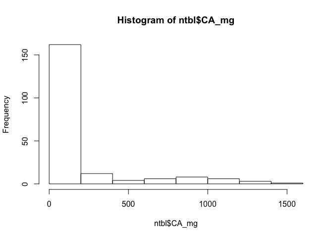 

```r
n.micro <- n.long %>% 
  filter(nutrient %in% c("CA_mg", "ZN_mg", "FE_mg", "DHA_g", "EPA_g")) 

#now just for micronutrients
g <- ggplot(n.micro, aes(concentration)) + geom_histogram(binwidth = 0.07)
g + facet_grid(nutrient ~ .) + theme_bw() + scale_x_log10()
```

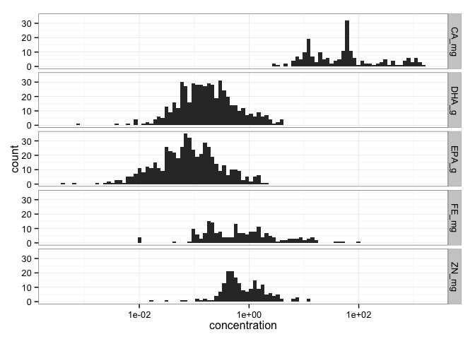 

```r
ggsave("/Users/Joey/Documents/Nutrient_Analysis/figures/nut-hist.png")
```

```
## Saving 7 x 5 in image
```

```r
#an alternative
ggplot(n.micro, aes(x = concentration, fill=nutrient)) + geom_density(alpha=.3) + scale_x_log10()
```

```
## Warning: Removed 986 rows containing non-finite values (stat_density).
```

```
## Warning: Removed 672 rows containing non-finite values (stat_density).
```

```
## Warning: Removed 666 rows containing non-finite values (stat_density).
```

```
## Warning: Removed 987 rows containing non-finite values (stat_density).
```

```
## Warning: Removed 992 rows containing non-finite values (stat_density).
```

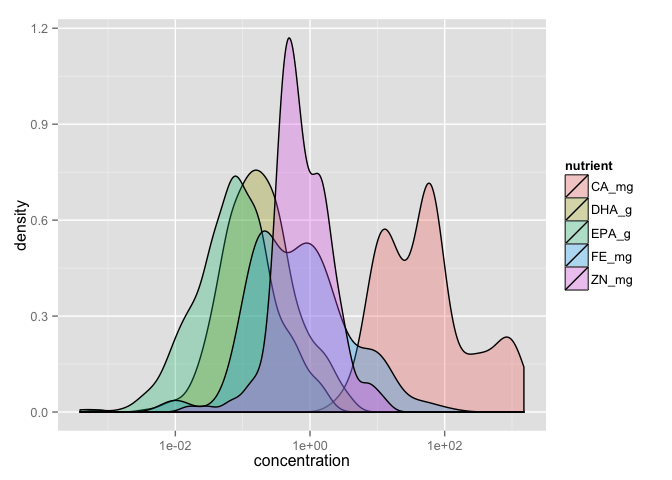 

Find the min and max for each nutrient.
#### Calcium ####

```r
hist(log(ntbl$CA_mg))
```

 

```r
hist(ntbl$CA_mg)
```

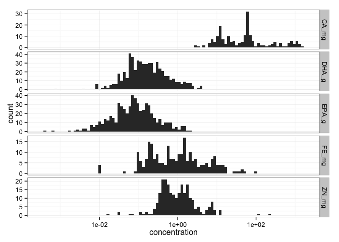 

```r
summary(ntbl$CA_mg)
```

```
##    Min. 1st Qu.  Median    Mean 3rd Qu.    Max.    NA's 
##    2.99   13.48   53.50  173.20   88.85 1503.00     986
```

```r
length(!is.na(ntbl$CA_mg))
```

```
## [1] 1188
```

```r
ggplot(ntbl, aes(CA_mg)) + geom_histogram()
```

```
## stat_bin: binwidth defaulted to range/30. Use 'binwidth = x' to adjust this.
```

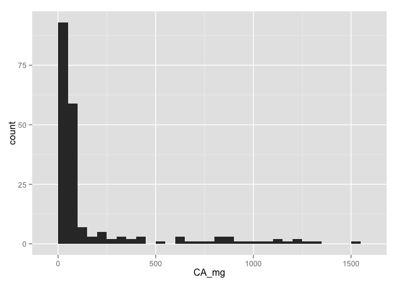 

```r
#" How many species do we have calcium data for? 99 species.
ntbl %>% 
  filter(!is.na(CA_mg)) %>% 
  distinct(species) %>%
  count()
```

```
## Source: local data frame [1 x 1]
## 
##       n
##   (int)
## 1    99
```

```r
#' average by taxon
ntbl %>% 
  filter(!is.na(CA_mg)) %>% 
  group_by(taxon) %>% 
  summarise(mean.CA = mean(CA_mg),
            n = n_distinct(species)) %>% 
  arrange(desc(mean.CA)) %>%
  kable(.)
```


taxon                                   mean.CA    n
-----------------------------------  ----------  ---
Abalones, winkles, conchs             782.60000    3
Tilapias and other cichlids           752.30000    2
Herrings, sardines, anchovies         398.52000    1
Miscellaneous pelagic fishes          339.37563    4
Miscellaneous freshwater fishes       251.47419   17
Miscellaneous coastal fishes          242.12857    5
Carps, barbels and other cyprinids    229.84050   18
Clams, cockles, arkshells             192.73333    2
Flounders, halibuts, soles            185.00500    4
Freshwater molluscs                   124.00000    1
Crabs, sea-spiders                    113.50000    1
Lobsters, spiny-rock lobsters          90.66667    1
Mussels                                67.76000    1
Shrimps, prawns                        60.37500    2
Shads                                  52.40929    3
NA                                     49.23077   11
Tunas, bonitos, billfishes             42.78600    4
Salmons, trouts, smelts                14.81727    5
Oysters                                13.14000    1
Sharks, rays, chimaeras                11.00000    2
Cods, hakes, haddocks                  10.78182    6
Miscellaneous demersal fishes          10.60500    6

#### Then zinc: ####

```r
hist(ntbl$ZN_mg)
```

 

```r
summary(ntbl$ZN_mg)
```

```
##    Min. 1st Qu.  Median    Mean 3rd Qu.    Max.    NA's 
##  0.0158  0.4150  0.6650  1.2490  1.3970 12.0000     992
```

```r
length(!is.na(ntbl$ZN_mg))
```

```
## [1] 1188
```

```r
#" How many species do we have zinc data for? 101 species.
ntbl %>% 
  filter(!is.na(ZN_mg)) %>% 
  distinct(species) %>%
  count()
```

```
## Source: local data frame [1 x 1]
## 
##       n
##   (int)
## 1   101
```

```r
#' average by taxon
ntbl %>% 
  filter(!is.na(ZN_mg)) %>% 
  group_by(taxon) %>% 
  summarise(mean.ZN = mean(ZN_mg),
            n = n_distinct(species)) %>% 
  arrange(desc(mean.ZN)) %>%
  kable(.)
```


taxon                                    mean.ZN    n
-----------------------------------  -----------  ---
Oysters                               11.8710630    1
Abalones, winkles, conchs              9.0000000    2
Tilapias and other cichlids            4.1604500    2
Freshwater molluscs                    3.9000000    1
Freshwater crustaceans                 3.1000000    1
Crabs, sea-spiders                     2.4500000    1
Miscellaneous pelagic fishes           2.0908000    4
Herrings, sardines, anchovies          1.5670200    1
Lobsters, spiny-rock lobsters          1.5100000    1
Mussels                                1.4434692    3
Miscellaneous freshwater fishes        1.2458389   15
Clams, cockles, arkshells              1.1866667    2
Carps, barbels and other cyprinids     0.9913887   18
Tunas, bonitos, billfishes             0.9390000    4
NA                                     0.7346154   11
Salmons, trouts, smelts                0.5997203    5
Miscellaneous coastal fishes           0.5824870    8
Flounders, halibuts, soles             0.5376109    5
Miscellaneous demersal fishes          0.4875000    6
Shads                                  0.4411580    2
Sharks, rays, chimaeras                0.4000000    2
Cods, hakes, haddocks                  0.3663636    6
Pearls, mother-of-pearl, shells        0.0297900    1

#### Then iron: ####

```r
hist(ntbl$FE_mg)
```

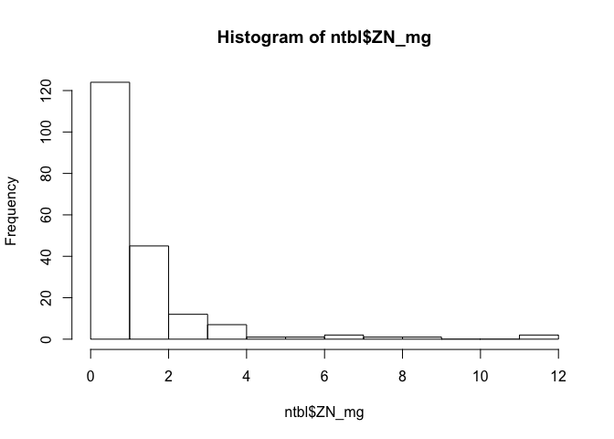 

```r
summary(ntbl$FE_mg)
```

```
##    Min. 1st Qu.  Median    Mean 3rd Qu.    Max.    NA's 
##   0.010   0.200   0.600   3.064   1.800 102.000     987
```

```r
#" How many species do we have iron data for? 101 species.
ntbl %>% 
  filter(!is.na(FE_mg)) %>% 
  distinct(species) %>%
  count()
```

```
## Source: local data frame [1 x 1]
## 
##       n
##   (int)
## 1   104
```

```r
#' average by taxon
ntbl %>% 
  filter(!is.na(FE_mg)) %>% 
  group_by(taxon) %>% 
  summarise(mean.FE = mean(FE_mg),
            n = n_distinct(species)) %>% 
  arrange(desc(mean.FE)) %>%
  kable(.)
```


taxon                                    mean.FE    n
-----------------------------------  -----------  ---
Abalones, winkles, conchs             20.3050000    4
Mussels                               19.2600000    2
Freshwater molluscs                   16.6000000    1
Freshwater crustaceans                10.0000000    1
Clams, cockles, arkshells              7.2800000    2
Miscellaneous pelagic fishes           5.9281250    4
NA                                     5.6030769   11
Tunas, bonitos, billfishes             5.1273333    4
Oysters                                2.3900000    1
Lobsters, spiny-rock lobsters          2.2166667    1
Tilapias and other cichlids            1.9150000    2
Herrings, sardines, anchovies          1.8300000    1
Shrimps, prawns                        1.5200000    2
Sharks, rays, chimaeras                1.5000000    2
Carps, barbels and other cyprinids     0.8863415   18
Miscellaneous coastal fishes           0.5966667    8
Miscellaneous freshwater fishes        0.5420690   15
Shads                                  0.5350000    2
Crabs, sea-spiders                     0.3750000    1
Flounders, halibuts, soles             0.3185714    5
Pearls, mother-of-pearl, shells        0.2800000    1
Salmons, trouts, smelts                0.2754545    5
Miscellaneous demersal fishes          0.2310833    6
Cods, hakes, haddocks                  0.1909091    6

#### EPA ####

```r
hist(ntbl$EPA_g)
```

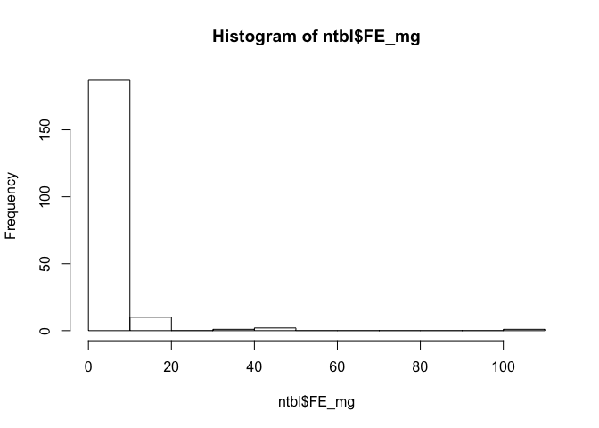 

```r
summary(ntbl$EPA_g)
```

```
##    Min. 1st Qu.  Median    Mean 3rd Qu.    Max.    NA's 
##  0.0004  0.0333  0.0775  0.1723  0.1751  1.9890     666
```

```r
#" How many species do we have EPA data for? 238 species.
ntbl %>% 
  filter(!is.na(EPA_g)) %>% 
  distinct(species) %>%
  count()
```

```
## Source: local data frame [1 x 1]
## 
##       n
##   (int)
## 1   238
```

```r
#' average by taxon
ntbl %>% 
  filter(!is.na(EPA_g)) %>% 
  group_by(taxon) %>% 
  summarise(mean.EPA = mean(EPA_g),
            n = n_distinct(species)) %>% 
  arrange(desc(mean.EPA)) %>%
  kable(.)
```


taxon                                  mean.EPA    n
-----------------------------------  ----------  ---
Shads                                 0.6017186    2
Herrings, sardines, anchovies         0.5343265   14
Tunas, bonitos, billfishes            0.3635974   11
Crabs, sea-spiders                    0.3500597    4
Mussels                               0.2593693    1
Miscellaneous demersal fishes         0.2530550   17
Miscellaneous pelagic fishes          0.2329137   21
Abalones, winkles, conchs             0.2162038    3
Miscellaneous coastal fishes          0.1456717   47
Salmons, trouts, smelts               0.1421940   11
Squids, cuttlefishes, octopuses       0.1159885    5
Oysters                               0.1128395    1
Miscellaneous diadromous fishes       0.1098986    2
Cods, hakes, haddocks                 0.1078687   13
Flounders, halibuts, soles            0.1010369   11
Clams, cockles, arkshells             0.0999067    2
King crabs, squat-lobsters            0.0918169    2
Freshwater crustaceans                0.0916625    3
River eels                            0.0856776    1
Carps, barbels and other cyprinids    0.0854440   10
Lobsters, spiny-rock lobsters         0.0783054    2
Miscellaneous freshwater fishes       0.0679509   30
Shrimps, prawns                       0.0602813   10
Tilapias and other cichlids           0.0276115    5
Krill, planktonic crustaceans         0.0269600    1
Sharks, rays, chimaeras               0.0163765    9

#### DHA

```r
hist(ntbl$DHA_g)
```

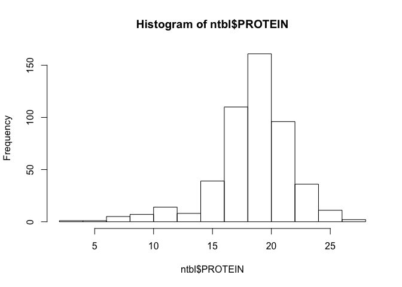 

```r
summary(ntbl$DHA_g)
```

```
##    Min. 1st Qu.  Median    Mean 3rd Qu.    Max.    NA's 
##  0.0007  0.0733  0.1660  0.3679  0.3712  4.0190     672
```

```r
#" How many species do we have DHA data for? 235 species.
ntbl %>% 
  filter(!is.na(DHA_g)) %>% 
  distinct(species) %>%
  count()
```

```
## Source: local data frame [1 x 1]
## 
##       n
##   (int)
## 1   235
```

```r
#' average by taxon
ntbl %>% 
  filter(!is.na(DHA_g)) %>% 
  group_by(taxon) %>% 
  summarise(mean.DHA = mean(DHA_g),
            n = n_distinct(species)) %>% 
  arrange(desc(mean.DHA)) %>%
  knitr::kable(., align = 'c', format = 'markdown', digits = 2)
```


|               taxon                | mean.DHA | n  |
|:----------------------------------:|:--------:|:--:|
|               Shads                |   1.86   | 1  |
|     Tunas, bonitos, billfishes     |   1.28   | 11 |
|   Herrings, sardines, anchovies    |   0.89   | 14 |
|    Miscellaneous pelagic fishes    |   0.64   | 21 |
|   Miscellaneous demersal fishes    |   0.41   | 17 |
|         Crabs, sea-spiders         |   0.40   | 4  |
|      Salmons, trouts, smelts       |   0.32   | 11 |
|       Cods, hakes, haddocks        |   0.31   | 13 |
|    Miscellaneous coastal fishes    |   0.27   | 47 |
|     Abalones, winkles, conchs      |   0.25   | 3  |
|  Squids, cuttlefishes, octopuses   |   0.24   | 5  |
|  Miscellaneous freshwater fishes   |   0.19   | 29 |
|              Mussels               |   0.17   | 1  |
|             River eels             |   0.16   | 1  |
|     Flounders, halibuts, soles     |   0.15   | 11 |
|      Sharks, rays, chimaeras       |   0.15   | 9  |
|  Miscellaneous diadromous fishes   |   0.12   | 2  |
|    Tilapias and other cichlids     |   0.11   | 5  |
|     Clams, cockles, arkshells      |   0.09   | 2  |
|       Freshwater crustaceans       |   0.08   | 2  |
| Carps, barbels and other cyprinids |   0.07   | 10 |
|          Shrimps, prawns           |   0.07   | 10 |
|   Lobsters, spiny-rock lobsters    |   0.06   | 2  |
|              Oysters               |   0.06   | 1  |
|     King crabs, squat-lobsters     |   0.04   | 2  |
|   Krill, planktonic crustaceans    |   0.01   | 1  |

#### Protein

```r
hist(ntbl$PROTEIN)
```

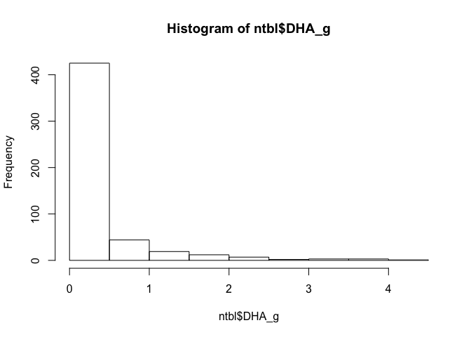 

```r
summary(ntbl$PROTEIN)
```

```
##    Min. 1st Qu.  Median    Mean 3rd Qu.    Max.    NA's 
##    3.22   17.20   19.00   18.49   20.36   27.30     697
```

```r
#" How many species do we have DHA data for? 235 species.
ntbl %>% 
  filter(!is.na(PROTEIN)) %>% 
  distinct(species) %>%
  count()
```

```
## Source: local data frame [1 x 1]
## 
##       n
##   (int)
## 1   251
```

```r
#' average by taxon
ntbl %>% 
  filter(!is.na(PROTEIN)) %>% 
  group_by(taxon) %>% 
  summarise(mean.protein = mean(PROTEIN),
            n = n_distinct(species)) %>% 
  arrange(desc(mean.protein)) %>%
  kable(.)
```


taxon                                 mean.protein    n
-----------------------------------  -------------  ---
Tunas, bonitos, billfishes                21.85360    8
Sharks, rays, chimaeras                   21.41778   16
Shrimps, prawns                           20.55000   13
Miscellaneous pelagic fishes              19.95812   24
Herrings, sardines, anchovies             19.84032   11
Miscellaneous diadromous fishes           19.58444    2
Carps, barbels and other cyprinids        19.19480   13
Miscellaneous coastal fishes              18.97313   50
Tilapias and other cichlids               18.12000    3
Salmons, trouts, smelts                   18.11875    8
Miscellaneous freshwater fishes           18.05214   26
Crabs, sea-spiders                        17.99857    3
Lobsters, spiny-rock lobsters             17.74200    2
Miscellaneous demersal fishes             17.66786   22
Sturgeons, paddlefishes                   17.63000    1
Flounders, halibuts, soles                17.39643   12
Cods, hakes, haddocks                     17.35063   11
Shads                                     16.90533    4
Freshwater crustaceans                    16.67000    4
Squids, cuttlefishes, octopuses           15.54100    5
Abalones, winkles, conchs                 14.97875    4
Mussels                                   11.39600    2
Clams, cockles, arkshells                 10.68000    4
Oysters                                    7.73500    3
Freshwater molluscs                        6.60000    1

#### Fat

```r
hist(ntbl$FAT)
```

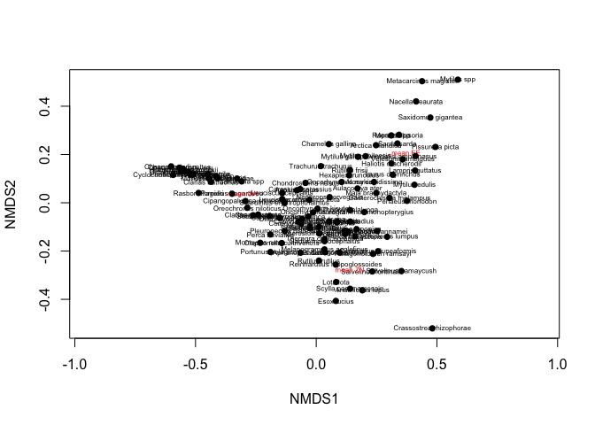 

```r
summary(ntbl$FAT)
```

```
##    Min. 1st Qu.  Median    Mean 3rd Qu.    Max.    NA's 
##   0.100   0.910   1.585   3.413   3.793  26.500     568
```

```r
#" How many species do we have DHA data for? 235 species.
ntbl %>% 
  filter(!is.na(FAT)) %>% 
  distinct(species) %>%
  count()
```

```
## Source: local data frame [1 x 1]
## 
##       n
##   (int)
## 1   277
```

```r
#' average by taxon
ntbl %>% 
  filter(!is.na(FAT)) %>% 
  group_by(taxon) %>% 
  summarise(mean.FAT = mean(FAT),
            n = n_distinct(species)) %>% 
  arrange(desc(mean.FAT)) %>%
  kable(.)
```


taxon                                   mean.FAT    n
-----------------------------------  -----------  ---
Shads                                 12.7475000    4
River eels                            11.6000000    1
Herrings, sardines, anchovies          6.8074286   15
Salmons, trouts, smelts                6.1907143    8
Tunas, bonitos, billfishes             6.0375000    9
Miscellaneous pelagic fishes           5.5193151   27
NA                                     4.6571429   12
Crabs, sea-spiders                     3.9237500    4
Miscellaneous demersal fishes          3.2929630   25
Miscellaneous coastal fishes           2.6014130   56
Miscellaneous freshwater fishes        2.3164151   20
Miscellaneous diadromous fishes        2.3077778    2
Mussels                                2.2700000    1
Carps, barbels and other cyprinids     2.1553846   14
Oysters                                1.8900000    2
Clams, cockles, arkshells              1.8900000    3
Flounders, halibuts, soles             1.4825926   16
Freshwater molluscs                    1.4000000    1
Squids, cuttlefishes, octopuses        1.3483333    6
Cods, hakes, haddocks                  1.3328571   18
Abalones, winkles, conchs              1.3257143    2
Tilapias and other cichlids            1.2336364    4
Freshwater crustaceans                 1.1200000    3
Shrimps, prawns                        1.0972222   10
Sharks, rays, chimaeras                1.0840000   13
Lobsters, spiny-rock lobsters          0.9281818    2
King crabs, squat-lobsters             0.6050000    2

#### Result 2: Functional groups have distinct multi-nutrient profiles (mds plot with finfish/crustaceans/molluscs color coded).


```r
ntbl.raw <- read.csv("~/Documents/Nutrient_Analysis/data/ntbl2.csv")
inverts.new <- read.csv("~/Documents/Nutrient_Analysis/data/aquatic_inverts_micronutrients.csv")
str(ntbl.raw)
```

```
## 'data.frame':	1188 obs. of  21 variables:
##  $ Food.Item.ID    : int  900159 900158 900684 900123 900122 900124 900125 900225 902192 900073 ...
##  $ species         : Factor w/ 430 levels "Abramis brama",..: 1 1 1 1 1 1 1 1 2 3 ...
##  $ taxon           : Factor w/ 29 levels "Abalones, winkles, conchs",..: 2 2 2 2 2 2 2 2 2 16 ...
##  $ max_size        : num  8.9 8.9 8.9 8.9 8.9 ...
##  $ max_length      : num  82 82 82 82 82 82 82 82 82 59 ...
##  $ TL              : num  2.9 2.9 2.9 2.9 2.9 2.9 2.9 2.9 2.9 4 ...
##  $ CA_mg           : num  53 52 NA 11.6 20.9 ...
##  $ EPA_g           : num  NA NA NA NA NA ...
##  $ DHA_g           : num  NA NA NA NA NA ...
##  $ FE_mg           : num  0.6 0.7 NA 0.17 0.21 0.18 0.19 NA NA NA ...
##  $ ZN_mg           : num  1 0.9 NA 0.393 0.373 ...
##  $ HG_mcg          : num  6 14 NA NA NA NA NA NA NA NA ...
##  $ FAT             : num  1.4 0.7 6.4 NA NA NA NA 1 NA 0.36 ...
##  $ PROTEIN         : num  19 20 NA NA NA ...
##  $ lwA             : num  0.00871 0.00871 0.00871 0.00871 0.00871 0.00871 0.00871 0.00871 0.00871 0.0055 ...
##  $ lwB             : num  3.14 3.14 3.14 3.14 3.14 3.14 3.14 3.14 3.14 3.19 ...
##  $ Habitat         : Factor w/ 3 levels "brackish","freshwater",..: 2 2 3 2 2 2 2 2 3 2 ...
##  $ Subgroup        : Factor w/ 3 levels "Crustacean","Finfish",..: 2 2 2 2 2 2 2 2 2 2 ...
##  $ Abs_lat         : num  41.5 41.5 53.9 54.1 54 ...
##  $ Latitude        : num  41.5 41.5 53.9 54.1 54 ...
##  $ max_length_study: num  30 36 NA 33.2 31.6 38 50.5 NA NA 39 ...
```

```r
ntbl.raw <- tbl_df(ntbl.raw)
```

What I did here was to run the same multivariate analysis using the new inverts data, just for CA, FE and ZN.

```r
ntbl.minerals <- ntbl.raw %>% 
  dplyr::select(Subgroup, species, CA_mg, FE_mg, ZN_mg)
```

```r
inverts.minerals <- inverts.new %>% 
  dplyr::select(Subgroup, species, CA_mg, FE_mg, ZN_mg) %>% 
  filter(Subgroup != "Echinoderm") 
```


```r
minerals <- bind_rows(ntbl.minerals, inverts.minerals)
```

```
## Warning in rbind_all(x, .id): Unequal factor levels: coercing to character
```

```
## Warning in rbind_all(x, .id): Unequal factor levels: coercing to character
```

```r
min.mat <- minerals %>% 
  group_by(species) %>% 
  summarise(mean.CA = mean(CA_mg*1000, na.rm = TRUE),
            mean.ZN = mean(ZN_mg*1000, na.rm = TRUE), 
            mean.FE = mean(FE_mg*1000, na.rm = TRUE)) %>%
  filter(!is.na(mean.CA)) %>%
  filter(!is.na(mean.ZN)) %>%
  filter(!is.na(mean.FE)) 

matrix.min <- data.matrix(min.mat[, 2:4])
rownames(matrix.min) <- min.mat$species 
```

```r
names(minerals)
```

```
## [1] "Subgroup" "species"  "CA_mg"    "FE_mg"    "ZN_mg"
```

```r
minerals$Subgroup <- as.factor(minerals$Subgroup)
minerals$species <- as.factor(minerals$species)

str(minerals)
```

```
## Classes 'tbl_df', 'tbl' and 'data.frame':	1249 obs. of  5 variables:
##  $ Subgroup: Factor w/ 3 levels "Crustacean","Finfish",..: 2 2 2 2 2 2 2 2 2 2 ...
##  $ species : Factor w/ 447 levels "Abramis brama",..: 1 1 1 1 1 1 1 1 2 4 ...
##  $ CA_mg   : num  53 52 NA 11.6 20.9 ...
##  $ FE_mg   : num  0.6 0.7 NA 0.17 0.21 0.18 0.19 NA NA NA ...
##  $ ZN_mg   : num  1 0.9 NA 0.393 0.373 ...
```

```r
min.taxon <- minerals %>% 
  dplyr::group_by(species) %>% 
  dplyr::select(Subgroup) %>% 
  distinct(species)

min.env <- semi_join(min.taxon, min.mat, by = "species")
```

```
## Warning in semi_join_impl(x, y, by$x, by$y): joining factor and character
## vector, coercing into character vector
```

```r
rownames(min.env) <- min.env$species 
dim(min.env)
```

```
## [1] 106   2
```
##### ordination

```r
ord.mine <- metaMDS(matrix.min, distance="bray", trymax=100)
```

```
## Square root transformation
## Wisconsin double standardization
## Run 0 stress 0.02858309 
## Run 1 stress 0.02861079 
## ... procrustes: rmse 0.0006808349  max resid 0.005929378 
## *** Solution reached
```

```r
ord.mine$stress
```

```
## [1] 0.02858309
```

```r
plot(ord.mine, type = "t",cex=.5)
site.scaling <- as.data.frame(ord.mine$points)
points(site.scaling,pch=16)
```

 

```r
site.scaling$nfi_plot <- row.names(site.scaling)
min.env$nfi_plot <- row.names(min.env)

new.compiled <- merge(site.scaling, min.env, by=c("nfi_plot"))
new.compiled$Subgroup <- as.factor(new.compiled$Subgroup)
```

####now replot ordination, with sites colour-coded##

```r
plot(ord.mine, type = "n", cex=1)
points(new.compiled$MDS1, new.compiled$MDS2, pch= as.integer(new.compiled$Subgroup), cex = 1)
points(new.compiled$MDS1, new.compiled$MDS2, col = (as.integer(new.compiled$Subgroup)), pch= as.integer(new.compiled$Subgroup), cex = 1)

## add confidence ellipses around subgroups

ordiellipse(ord.mine, draw = "polygon", new.compiled$Subgroup, conf = 0.95, label = T)
ordispider(ord.mine, new.compiled$Subgroup,col="grey")
legend('topleft', legend = levels(new.compiled$Subgroup), col = 1:3, pch = 16, cex = 0.8)
```

 

calculate Bray-Curtis distance among samples

```r
comm.bc.dist <- vegdist(matrix.min, method = "bray")
hist(comm.bc.dist)
```

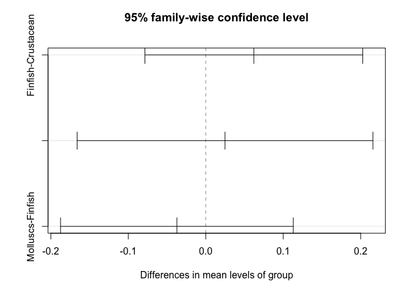 

```r
# cluster communities using average-linkage algorithm
comm.bc.clust <- hclust(comm.bc.dist, method = "average")

# plot cluster diagram
plot(comm.bc.clust, ylab = "Bray-Curtis dissimilarity")
```

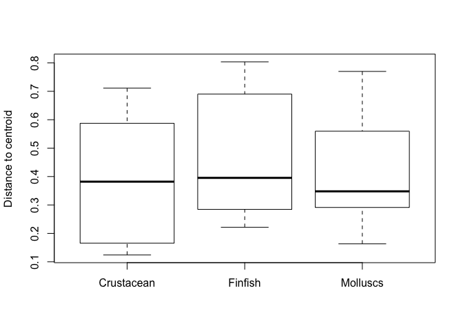 

Use betadisper to test the significance of the multivariate groups

```r
min.subgroup <- min.env$Subgroup
mod <- betadisper(comm.bc.dist, min.subgroup)

## Perform test
anova(mod)
```

```
## Analysis of Variance Table
## 
## Response: Distances
##            Df Sum Sq  Mean Sq F value Pr(>F)
## Groups      2 0.0543 0.027132  0.6514 0.5234
## Residuals 103 4.2899 0.041650
```

```r
## Permutation test for F
permutest(mod, pairwise = TRUE, permutations = 99)
```

```
## 
## Permutation test for homogeneity of multivariate dispersions
## Permutation: free
## Number of permutations: 99
## 
## Response: Distances
##            Df Sum Sq  Mean Sq      F N.Perm Pr(>F)
## Groups      2 0.0543 0.027132 0.6514     99   0.58
## Residuals 103 4.2899 0.041650                     
## 
## Pairwise comparisons:
## (Observed p-value below diagonal, permuted p-value above diagonal)
##            Crustacean Finfish Molluscs
## Crustacean            0.36000     0.84
## Finfish       0.30013             0.59
## Molluscs      0.76419 0.55174
```

```r
## Tukey's Honest Significant Differences
(mod.HSD <- TukeyHSD(mod))
```

```
##   Tukey multiple comparisons of means
##     95% family-wise confidence level
## 
## Fit: aov(formula = distances ~ group, data = df)
## 
## $group
##                            diff         lwr       upr     p adj
## Finfish-Crustacean   0.06209193 -0.07850792 0.2026918 0.5470991
## Molluscs-Crustacean  0.02486995 -0.16605468 0.2157946 0.9485075
## Molluscs-Finfish    -0.03722197 -0.18746289 0.1130189 0.8262340
```

```r
plot(mod.HSD)
```

 

```r
boxplot(mod)
```

 

```r
## Using group centroids
mod3 <- betadisper(comm.bc.dist, min.subgroup, bias.adjust = TRUE)
mod3
```

```
## 
## 	Homogeneity of multivariate dispersions
## 
## Call: betadisper(d = comm.bc.dist, group = min.subgroup,
## bias.adjust = TRUE)
## 
## No. of Positive Eigenvalues: 44
## No. of Negative Eigenvalues: 60
## 
## Average distance to median:
## Crustacean    Finfish   Molluscs 
##     0.4106     0.4607     0.4392 
## 
## Eigenvalues for PCoA axes:
##   PCoA1   PCoA2   PCoA3   PCoA4   PCoA5   PCoA6   PCoA7   PCoA8 
## 13.5618  6.5907  1.9388  1.5925  0.8023  0.5326  0.4246  0.3320
```

```r
permutest(mod3, permutations = 99)
```

```
## 
## Permutation test for homogeneity of multivariate dispersions
## Permutation: free
## Number of permutations: 99
## 
## Response: Distances
##            Df Sum Sq  Mean Sq      F N.Perm Pr(>F)
## Groups      2 0.0319 0.015956 0.3721     99   0.77
## Residuals 103 4.4167 0.042881
```

```r
anova(mod3)
```

```
## Analysis of Variance Table
## 
## Response: Distances
##            Df Sum Sq  Mean Sq F value Pr(>F)
## Groups      2 0.0319 0.015956  0.3721 0.6902
## Residuals 103 4.4167 0.042881
```

```r
plot(mod3)
```

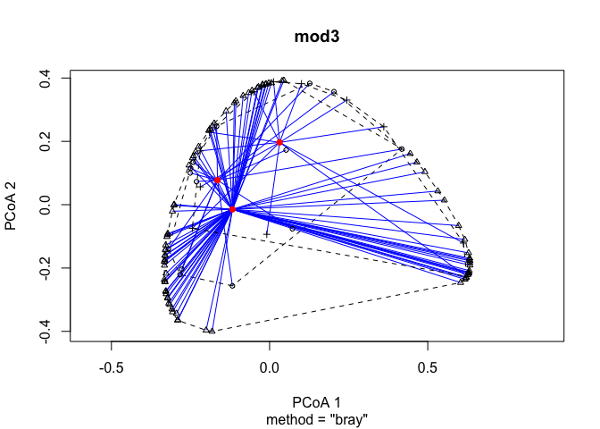 

```r
boxplot(mod3)
```

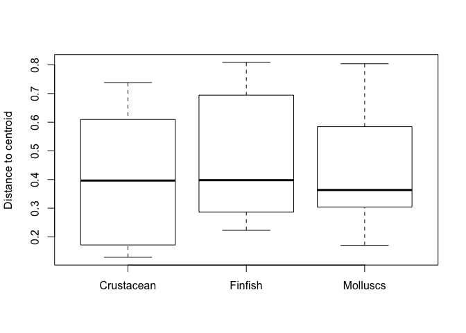 

```r
plot(TukeyHSD(mod3))
```

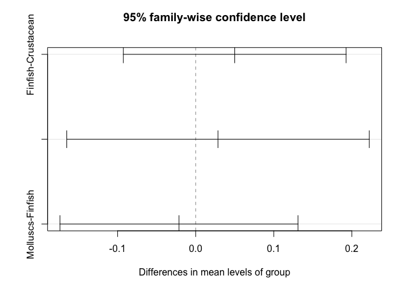 

#### Use adonis to ask whether the group means in multivariate space are different from each other ####

```r
min.subgroup %>% 
  data_frame(subgrp = .) %>% 
  adonis(comm.bc.dist ~ subgrp, data = .)
```

```
## 
## Call:
## adonis(formula = comm.bc.dist ~ subgrp, data = .) 
## 
## Permutation: free
## Number of permutations: 999
## 
## Terms added sequentially (first to last)
## 
##            Df SumsOfSqs MeanSqs F.Model      R2 Pr(>F)   
## subgrp      2    1.5935 0.79676  3.4299 0.06244  0.004 **
## Residuals 103   23.9272 0.23230         0.93756          
## Total     105   25.5207                 1.00000          
## ---
## Signif. codes:  0 '***' 0.001 '**' 0.01 '*' 0.05 '.' 0.1 ' ' 1
```

#### Result 3.	Few species contain reach DRI targets for multiple nutrients. 

Now let's find out how many species reach more than one mineral RDI target

```r
ntbl.RDI.tot <- minerals %>% 
  group_by(species) %>% 
  summarise(mean.CA = mean(CA_mg, na.rm = TRUE),
            mean.ZN = mean(ZN_mg, na.rm = TRUE), 
            mean.FE = mean(FE_mg, na.rm = TRUE)) %>% 
  mutate(RDI.CA = ifelse(mean.CA > 300, 1, 0)) %>% 
  mutate(RDI.FE = ifelse(mean.FE > 4.5, 1, 0)) %>% 
  mutate(RDI.ZN = ifelse(mean.ZN > 2.75, 1, 0)) %>%
  mutate(RDI.micro.tot = rowSums(.[5:7])) %>% 
  filter(!is.na(RDI.micro.tot)) %>% 
  arrange(., RDI.micro.tot) 

table(ntbl.RDI.tot$RDI.micro.tot)
```

```
## 
##  0  1  2  3 
## 66 29 10  1
```

```r
RDI.freq <- read.csv("/Users/Joey/Documents/Nutrient_Analysis/data/RDI.freq.csv")
RDI.freq <- read.csv("~/Documents/Nutrient_Analysis/data/RDI.freq.csv")
str(RDI.freq)
```

```
## 'data.frame':	8 obs. of  3 variables:
##  $ number_targets: Factor w/ 4 levels "none","one or more",..: 1 2 4 3 1 2 4 3
##  $ target        : Factor w/ 2 levels "10 percent","25 percent": 1 1 1 1 2 2 2 2
##  $ frequency     : int  56 50 41 15 66 40 5 2
```

```r
ggplot(subset(RDI.freq, target == "25 percent"), aes(x = reorder(number_targets, -frequency), y = frequency)) +  geom_bar(stat = "identity", width = 0.5) + xlab("number of 10% RDI targets reached") + theme(axis.text=element_text(size=14),
        axis.title=element_text(size=14,face="bold"))
```

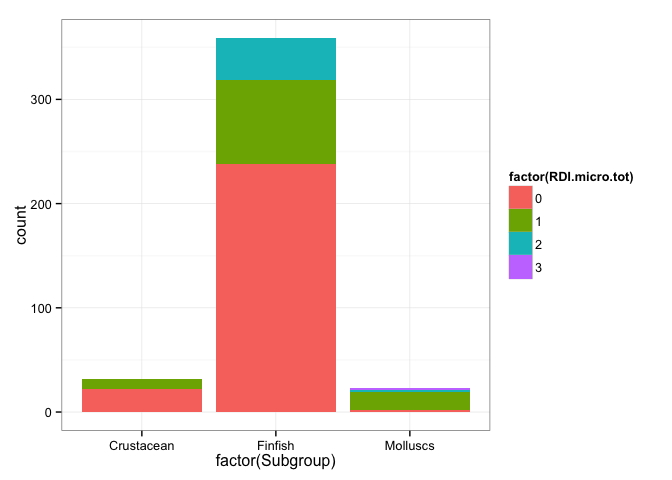 

```r
ggsave("/Users/Joey/Documents/Nutrient_Analysis/figures/RDI.25-targets-barchart.png")
```

```
## Saving 7 x 5 in image
```

```r
#' for the 25% RDI targets, for the 106 species for which we have data for all 3 minerals, 65 spp reach 0 targets, 30 reach 1 target, 9 reach 2 targets, and 2 reach all 3 targets. In other words, 41 reach 1 or more targets, 39 reach two or more targets and 2 reach all three targets.  
#' for the 10% RDI targets,  56 reach 0 targets, 9 reach 1 target, 26 reach 2 targets and 15 reach all 3 targets. Or, in other words, 50 reach one or more targets, 41 reach 2 or more targets, and 15 reach all three targets. 
```

#### How many species reach RDI, for each nutrient invidually?


```r
n.long <- read_csv("/Users/Joey/Documents/Nutrient_Analysis/data/ntbl.long.csv")
```

```
## Warning: 1188 parsing failures.
##  row col   expected actual
## 5941 RDI an integer HG_mcg
## 5942 RDI an integer HG_mcg
## 5943 RDI an integer HG_mcg
## 5944 RDI an integer HG_mcg
## 5945 RDI an integer HG_mcg
## .... ... .......... ......
## .See problems(...) for more details.
```

```r
n.long <- n.long %>% 
  mutate(RDI.25per = (concentration/(RDI/4)),
         RDI.per = (concentration/RDI),
         RDI.20per = (concentration/(RDI/5)),
         RDI.15per = (concentration/(RDI/6)),
         RDI.target = (concentration > (RDI/10)))

# RDI.prop <- lm(log(mean.RDI) ~ log(max_size), data = n.long)
# summary(RDI.prop)
# confint(RDI.prop)
# visreg::visreg(RDI.prop, xtrans = log)
```
body.prop: If max size is less than 100g, gets whole, if not, gets part. bones.body is a combo of fish less than 100g and those from Cambodia where study noted that bones were eaten.

```r
n.long <- n.long %>% 
  mutate(body.whole = (max_size < 0.1),
         eat.bones = (Abs_lat == 12.265754 | Abs_lat == 11.066667),
         bones.body = (max_size < 0.1 | Abs_lat == 12.265754 | Abs_lat == 11.066667),
         bones.body.invert = (max_size < 0.1 | Abs_lat == 12.265754 | Abs_lat == 11.066667 | Subgroup != "Finfish"))


### this code gets me the results of what percentage of observations reach 10% RDI for whole body or just part
n.long %>% 
  # filter(nutrient == "CA_mg") %>% 
  dplyr::select(nutrient, RDI.target, bones.body) %>% 
  table()
```

```
## , , bones.body = FALSE
## 
##          RDI.target
## nutrient  FALSE TRUE
##   CA_mg     131   15
##   DHA_g     105  287
##   EPA_g     238  158
##   FAT       398   75
##   FE_mg     115   23
##   HG_mcg      0    0
##   PROTEIN     0  360
##   ZN_mg     116   26
## 
## , , bones.body = TRUE
## 
##          RDI.target
## nutrient  FALSE TRUE
##   CA_mg       6   20
##   DHA_g      13   17
##   EPA_g      13   18
##   FAT        29    7
##   FE_mg      15   11
##   HG_mcg      0    0
##   PROTEIN     0   31
##   ZN_mg       3   23
```

```r
table <- n.long %>% 
  # filter(nutrient == "CA_mg") %>% 
  dplyr::select(RDI.target, bones.body) %>% 
  table()

mosaicplot(table)
```

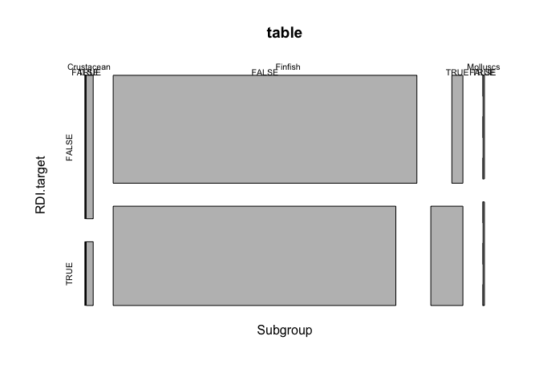 

```r
n.long %>% 
  filter(nutrient == "PROTEIN",
         bones.body.invert == FALSE) %>% 
  dplyr::select(RDI.target) %>% 
table()
```

```
## .
## TRUE 
##  359
```


```r
n.long %>% 
  filter(!is.na(bones.body)) %>% 
  # arrange(desc(nutrient)) %>% 
  ggplot(., aes(x = nutrient, y = log(RDI.per), fill = bones.body, geom = "boxplot")) +
 geom_boxplot() +
  theme_minimal() +
  geom_hline(yintercept=log(.10)) +
  ylab("percentage of RDI in edible portion, log scale")
```

```
## Warning: Removed 5539 rows containing non-finite values (stat_boxplot).
```

 

```r
ggsave("/Users/Joey/Documents/Nutrient_Analysis/figures/bones.body-RDI.png")
```

```
## Saving 7 x 5 in image
```

```
## Warning: Removed 5539 rows containing non-finite values (stat_boxplot).
```


####Result 4. Few species reach DRI for multiple nutrients.

How many species reach RDI for each nutrient?
10% RDI: calcium: 28/99, zinc: 39/101, iron: 23/104, EPA: 117/238, DHA: 168/235, Fat: 47/277, Protein: 251/251  

```r
n.long <- read_csv("/Users/Joey/Documents/Nutrient_Analysis/data/ntbl.long.csv")
```

```
## Warning: 1188 parsing failures.
##  row col   expected actual
## 5941 RDI an integer HG_mcg
## 5942 RDI an integer HG_mcg
## 5943 RDI an integer HG_mcg
## 5944 RDI an integer HG_mcg
## 5945 RDI an integer HG_mcg
## .... ... .......... ......
## .See problems(...) for more details.
```

```r
str(n.long)
```

```
## Classes 'tbl_df', 'tbl' and 'data.frame':	9504 obs. of  16 variables:
##  $ Food.Item.ID    : int  900159 900158 900684 900123 900122 900124 900125 900225 902192 900073 ...
##  $ species         : chr  "Abramis brama" "Abramis brama" "Abramis brama" "Abramis brama" ...
##  $ taxon           : chr  "Carps, barbels and other cyprinids" "Carps, barbels and other cyprinids" "Carps, barbels and other cyprinids" "Carps, barbels and other cyprinids" ...
##  $ max_size        : num  8.9 8.9 8.9 8.9 8.9 ...
##  $ max_length      : num  82 82 82 82 82 82 82 82 82 59 ...
##  $ TL              : num  2.9 2.9 2.9 2.9 2.9 2.9 2.9 2.9 2.9 4 ...
##  $ lwA             : num  0.00871 0.00871 0.00871 0.00871 0.00871 0.00871 0.00871 0.00871 0.00871 0.0055 ...
##  $ lwB             : num  3.14 3.14 3.14 3.14 3.14 3.14 3.14 3.14 3.14 3.19 ...
##  $ Habitat         : chr  "freshwater" "freshwater" "marine" "freshwater" ...
##  $ Subgroup        : chr  "Finfish" "Finfish" "Finfish" "Finfish" ...
##  $ Abs_lat         : num  41.5 41.5 53.9 54.1 54 ...
##  $ Latitude        : num  41.5 41.5 53.9 54.1 54 ...
##  $ max_length_study: num  30 36 NA 33.2 31.6 38 50.5 NA NA 39 ...
##  $ nutrient        : chr  "CA_mg" "CA_mg" "CA_mg" "CA_mg" ...
##  $ concentration   : num  53 52 NA 11.6 20.9 ...
##  $ RDI             : int  1200 1200 1200 1200 1200 1200 1200 1200 1200 1200 ...
##  - attr(*, "problems")=Classes 'tbl_df', 'tbl' and 'data.frame':	1188 obs. of  4 variables:
##   ..$ row     : int  5941 5942 5943 5944 5945 5946 5947 5948 5949 5950 ...
##   ..$ col     : chr  "RDI" "RDI" "RDI" "RDI" ...
##   ..$ expected: chr  "an integer" "an integer" "an integer" "an integer" ...
##   ..$ actual  : chr  "HG_mcg" "HG_mcg" "HG_mcg" "HG_mcg" ...
```

```r
n.long$species <- as.factor(n.long$species)

n.long %>% 
  filter(nutrient == "PROTEIN") %>% 
  filter(!is.na(concentration)) %>%
  distinct(species) %>% 
  count()
```

```
## Source: local data frame [1 x 1]
## 
##       n
##   (int)
## 1   251
```

```r
n.long %>% 
  filter(nutrient == "PROTEIN") %>%
  mutate(RDI.10 = (concentration > (RDI/10))) %>% 
    filter(RDI.10 == "TRUE") %>% 
  distinct(species) %>% 
  count()
```

```
## Source: local data frame [1 x 1]
## 
##       n
##   (int)
## 1   251
```

#### Result 5. Within functional groups, some traits such body size and latitude are strongly associated with nutritional profile ####


```r
fb.all <- read_csv("/Users/Joey/Documents/Nutrient_Analysis/data/fb.all.csv")
fb.length <- fb.all %>% 
   dplyr::select(species, CA_mg, ZN_mg, FE_mg, EPA_g, DHA_g, Length, max_length, Subgroup, Habitat, TL, FoodTroph.x, Herbivory2, Abs_lat, DemersPelag, taxon, max_size) %>% 
  rename(FoodTroph = FoodTroph.x) %>% 
  mutate(species = as.factor(species))

table(fb.length$Subgroup)
```

```
## 
## Finfish 
##     877
```

```r
ZN.all <- standardize(lm(log(ZN_mg) ~ log(Length) + TL + Habitat + Abs_lat, data = fb.length, na.action = "na.omit"))
```

```
## Warning in log(z.Length): NaNs produced
```

```r
test.ZN.all <- tidy(ZN.all, conf.int =TRUE)
summary(ZN.all)
```

```
## 
## Call:
## lm(formula = log(ZN_mg) ~ log(z.Length) + z.TL + Habitat + z.Abs_lat, 
##     data = fb.length, na.action = "na.omit")
## 
## Residuals:
##      Min       1Q   Median       3Q      Max 
## -2.40319 -0.33925 -0.07821  0.38483  1.53053 
## 
## Coefficients:
##                Estimate Std. Error t value Pr(>|t|)   
## (Intercept)   -0.012176   0.158448  -0.077  0.93898   
## log(z.Length)  0.004353   0.064707   0.067  0.94657   
## z.TL          -0.327669   0.229013  -1.431  0.15721   
## Habitatmarine -0.376122   0.193325  -1.946  0.05597 . 
## z.Abs_lat     -0.708735   0.207011  -3.424  0.00107 **
## ---
## Signif. codes:  0 '***' 0.001 '**' 0.01 '*' 0.05 '.' 0.1 ' ' 1
## 
## Residual standard error: 0.6931 on 66 degrees of freedom
##   (806 observations deleted due to missingness)
## Multiple R-squared:  0.3279,	Adjusted R-squared:  0.2872 
## F-statistic:  8.05 on 4 and 66 DF,  p-value: 2.387e-05
```

```r
test.ZN.all$term <- factor(test.ZN.all$term, levels=unique(test.ZN.all$term))
ggplot(test.ZN.all, aes(x=term, y=estimate, ymin=conf.low, ymax=conf.high)) +
  geom_pointrange() + 
  coord_flip() + 
  geom_hline(aes(x=0), lty=2) +
  xlab('term ZN') +
  ylab('Regression Coefficient') + theme(legend.position="none")
```

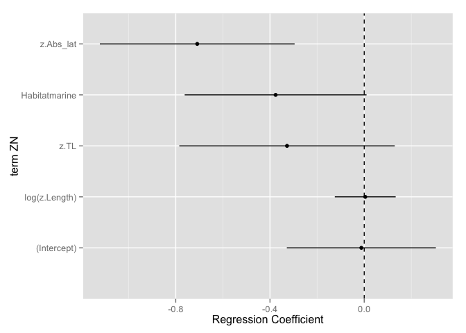 

```r
CA.all <- standardize(lm(log(CA_mg) ~ log(max_size) + TL + Habitat + Abs_lat, data = fb.length, na.action = "na.omit"))
```

```
## Warning in log(z.max_size): NaNs produced
```

```r
test.CA.all <- tidy(CA.all, conf.int =TRUE) 

test.CA.all$term <- factor(test.CA.all$term, levels=unique(test.CA.all$term))
ggplot(test.CA.all, aes(x=term, y=estimate, ymin=conf.low, ymax=conf.high)) +
  geom_pointrange() + 
  coord_flip() + 
  geom_hline(aes(x=0), lty=2) +
  xlab('term CA') +
  ylab('Regression Coefficient') + theme(legend.position="none")
```

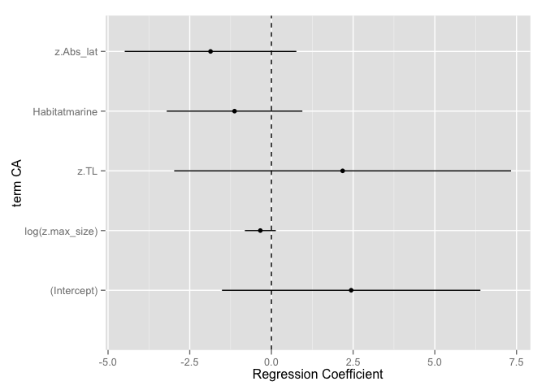 

```r
coefplot(CA.all, innerCI = 2, intercept = FALSE)
```

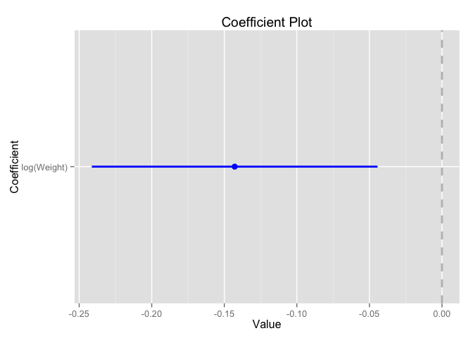 

```r
ZN.all <- standardize(lm(log(ZN_mg) ~ log(Length) + TL + Habitat + Abs_lat, data = fb.length, na.action = "na.omit"))
```

```
## Warning in log(z.Length): NaNs produced
```

```r
test.ZN.all <- tidy(ZN.all, conf.int =TRUE) 

CA.all <- standardize(lm(log(CA_mg) ~ log(Length) + TL + Habitat + Abs_lat, data = fb.length, na.action = "na.omit"))
```

```
## Warning in log(z.Length): NaNs produced
```

```r
test.CA.all <- tidy(CA.all, conf.int =TRUE)

FE.all <- standardize(lm(log(FE_mg) ~ log(Length) + TL + Habitat + Abs_lat, data = fb.length, na.action = "na.omit"))
```

```
## Warning in log(z.Length): NaNs produced
```

```r
test.FE.all <- tidy(FE.all, conf.int =TRUE) 

EPA.all <- standardize(lm(log(EPA_g) ~ log(Length) + TL + Habitat + Abs_lat, data = fb.length, na.action = "na.omit"))
```

```
## Warning in log(z.Length): NaNs produced
```

```r
test.EPA.all <- tidy(EPA.all, conf.int =TRUE)

DHA.all <- standardize(lm(log(DHA_g) ~ log(Length) + TL + Habitat + Abs_lat, data = fb.length, na.action = "na.omit"))
```

```
## Warning in log(z.Length): NaNs produced
```

```r
test.DHA.all <- tidy(DHA.all, conf.int =TRUE) 

multiplot(ZN.all, CA.all, FE.all, EPA.all, DHA.all, innerCI = 2, intercept = FALSE)
```

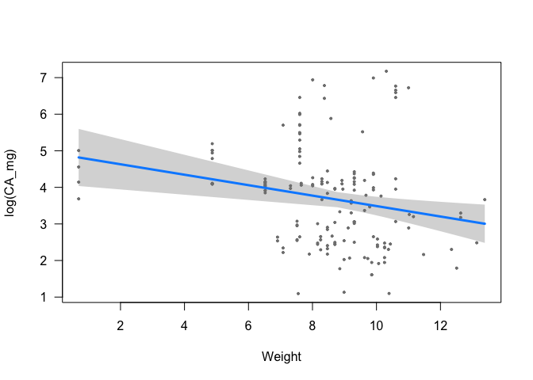 

```r
ggsave("/Users/Joey/Documents/Nutrient_Analysis/figures/coefplot.png")
```

```
## Saving 7 x 5 in image
```

Inverts traits

```r
intbl <- read_csv("/Users/Joey/Documents/Nutrient_Analysis/data/intbl.all.csv")
intbl <- intbl %>% 
  mutate(Subgroup = as.factor(Subgroup),
         DemersPelag = as.factor(DemersPelag),
         taxon = as.factor(taxon),
         Habitat = as.factor(Habitat))

table(intbl$DemersPelag)
```

```
## 
##    bathypelagic         benthic   benthopelagic        demersal 
##               7              94              16              40 
##         pelagic reef-associated         sessile 
##               2              13              13
```

```r
hist(intbl$Weight)
```

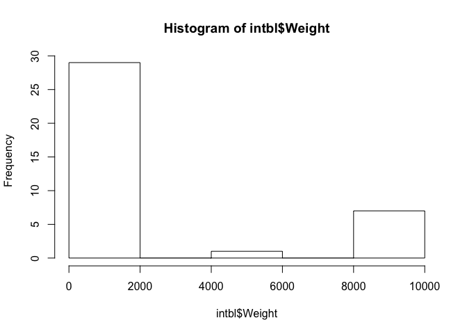 

```r
class(intbl$Weight)
```

```
## [1] "integer"
```

```r
summary(intbl$FoodTroph)
```

```
##    Min. 1st Qu.  Median    Mean 3rd Qu.    Max.    NA's 
##   2.000   2.870   3.300   3.212   3.613   4.720      93
```

```r
intbl$Weight <- as.numeric(intbl$Weight)

inv.length <- lm(log(CA_mg) ~ log(Length) + FoodTroph, data = intbl)
inv.size <- lm(log(CA_mg) ~ log(Length), data = intbl)
summary(inv.length)
```

```
## 
## Call:
## lm(formula = log(CA_mg) ~ log(Length) + FoodTroph, data = intbl)
## 
## Residuals:
##     Min      1Q  Median      3Q     Max 
## -0.6242 -0.3625 -0.1701  0.4243  0.7527 
## 
## Coefficients:
##             Estimate Std. Error t value Pr(>|t|)  
## (Intercept) -0.04855    1.68595  -0.029   0.9774  
## log(Length)  1.56991    0.67214   2.336   0.0329 *
## FoodTroph   -0.02442    0.21357  -0.114   0.9104  
## ---
## Signif. codes:  0 '***' 0.001 '**' 0.01 '*' 0.05 '.' 0.1 ' ' 1
## 
## Residual standard error: 0.4908 on 16 degrees of freedom
##   (166 observations deleted due to missingness)
## Multiple R-squared:  0.3396,	Adjusted R-squared:  0.257 
## F-statistic: 4.114 on 2 and 16 DF,  p-value: 0.03618
```

```r
summary(inv.size)
```

```
## 
## Call:
## lm(formula = log(CA_mg) ~ log(Length), data = intbl)
## 
## Residuals:
##     Min      1Q  Median      3Q     Max 
## -1.6782 -0.3896 -0.1452  0.3949  2.2680 
## 
## Coefficients:
##             Estimate Std. Error t value Pr(>|t|)   
## (Intercept)   2.8133     0.9421   2.986  0.00486 **
## log(Length)   0.5797     0.3325   1.744  0.08911 . 
## ---
## Signif. codes:  0 '***' 0.001 '**' 0.01 '*' 0.05 '.' 0.1 ' ' 1
## 
## Residual standard error: 0.7203 on 39 degrees of freedom
##   (144 observations deleted due to missingness)
## Multiple R-squared:  0.07231,	Adjusted R-squared:  0.04853 
## F-statistic:  3.04 on 1 and 39 DF,  p-value: 0.08911
```

```r
confint(inv.size)
```

```
##                   2.5 %   97.5 %
## (Intercept)  0.90762886 4.718943
## log(Length) -0.09280031 1.252271
```

```r
coefplot::coefplot(inv.length, innerCI = 2, intercept = FALSE)
```

 

```r
length(!is.na(intbl$taxon))
```

```
## [1] 185
```

```r
### merge the inverts and verts
fb <- fb.all %>% 
   dplyr::select(species, CA_mg, ZN_mg, FE_mg, EPA_g, DHA_g, Length, max_length, Subgroup, Habitat, TL, FoodTroph.x, Herbivory2, Abs_lat, DemersPelag, taxon, max_size, Weight) %>% 
  rename(FoodTroph = FoodTroph.x) %>% 
  mutate(species = as.factor(species))
sb <- intbl %>% 
   dplyr::select(species, CA_mg, ZN_mg, FE_mg, EPA_g, DHA_g, Length, max_length, Subgroup, Habitat, TL, FoodTroph, Herbivory2, Abs_lat, DemersPelag, taxon, max_size, Weight) %>% 
  mutate(species = as.factor(species))

ntbl <- bind_rows(fb, sb)
```

```
## Warning in rbind_all(x, .id): Unequal factor levels: coercing to character
```

```r
class(ntbl$FoodTroph)
```

```
## [1] "numeric"
```

```r
ntbl <- ntbl %>% 
  mutate(Subgroup = as.factor(Subgroup),
         DemersPelag = as.factor(DemersPelag),
         taxon = as.factor(taxon),
         Habitat = as.factor(Habitat))

ntbl.CA <- ntbl %>% 
  filter(!is.na(CA_mg),
         !is.na(max_size),
         !is.na(Abs_lat),
         !is.na(Subgroup),
         !is.na(taxon),
         !is.na(Habitat),
         !is.na(DemersPelag))

ntbl.CA$Subgroup <- droplevels(ntbl.CA$Subgroup)

ntbl.CA <- ntbl.CA %>% 
  mutate(Subgroup = droplevels(Subgroup),
         Habitat = droplevels(Habitat),
         DemersPelag = droplevels(DemersPelag),
         taxon = droplevels(taxon))

mod1 <- lm(log(CA_mg) ~ log(max_size) + FoodTroph + Subgroup + taxon + Habitat + Abs_lat, data = ntbl)
mod2 <- lm(log(CA_mg) ~ log(Length) + FoodTroph + Habitat + Abs_lat + Subgroup, data = ntbl)
# mod2 <- standardize(lm(log(CA_mg) ~ log(max_size) + FoodTroph + Habitat + Abs_lat + Subgroup, data = ntbl))
# mod1 <- standardize(lm(log(CA_mg) ~ log(max_size) + FoodTroph + Subgroup + DemersPelag + taxon + Habitat + Abs_lat, data = ntbl.CA))
# mod1.tidy <- tidy(mod1, conf.int = TRUE)
summary(mod2)
```

```
## 
## Call:
## lm(formula = log(CA_mg) ~ log(Length) + FoodTroph + Habitat + 
##     Abs_lat + Subgroup, data = ntbl)
## 
## Residuals:
##     Min      1Q  Median      3Q     Max 
## -3.7676 -0.5520  0.0670  0.5175  2.5145 
## 
## Coefficients:
##                    Estimate Std. Error t value Pr(>|t|)    
## (Intercept)        7.349781   0.578907  12.696  < 2e-16 ***
## log(Length)       -0.424134   0.175905  -2.411 0.017000 *  
## FoodTroph         -0.016695   0.168143  -0.099 0.921030    
## Habitatfreshwater  1.073422   0.306901   3.498 0.000603 ***
## Habitatmarine      1.327856   0.344081   3.859 0.000163 ***
## Abs_lat           -0.074021   0.005517 -13.418  < 2e-16 ***
## SubgroupFinfish    0.166088   0.408467   0.407 0.684820    
## SubgroupMolluscs   0.185163   0.653797   0.283 0.777369    
## ---
## Signif. codes:  0 '***' 0.001 '**' 0.01 '*' 0.05 '.' 0.1 ' ' 1
## 
## Residual standard error: 0.9625 on 165 degrees of freedom
##   (889 observations deleted due to missingness)
## Multiple R-squared:  0.5568,	Adjusted R-squared:  0.538 
## F-statistic: 29.62 on 7 and 165 DF,  p-value: < 2.2e-16
```

```r
coefs <- buildModelCI(mod1) 
confint(mod2)
```

```
##                         2.5 %      97.5 %
## (Intercept)        6.20676015  8.49280192
## log(Length)       -0.77144850 -0.07681868
## FoodTroph         -0.34868445  0.31529519
## Habitatfreshwater  0.46746304  1.67938132
## Habitatmarine      0.64848739  2.00722459
## Abs_lat           -0.08491273 -0.06312854
## SubgroupFinfish   -0.64040907  0.97258436
## SubgroupMolluscs  -1.10572268  1.47604944
```

```r
mod2 <- lm(log(CA_mg) ~ log(Weight), data = ntbl)
coefplot(mod2, innerCI = 2, intercept = FALSE)
```

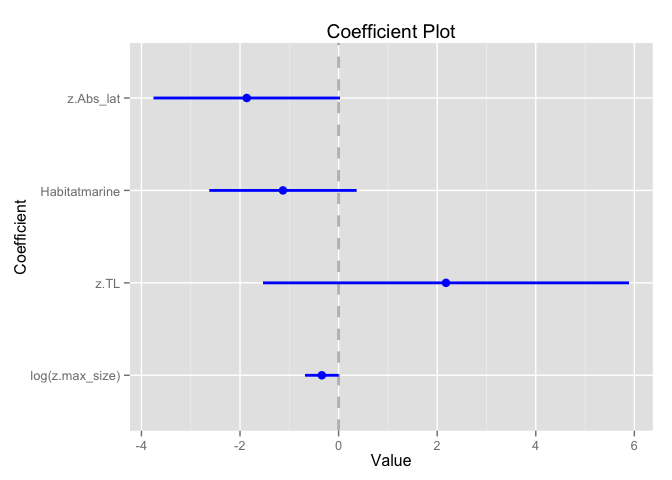 

```r
ggsave("/Users/Joey/Documents/Nutrient_Analysis/figures/CA_length_coefplot.png")
```

```
## Saving 7 x 5 in image
```

```r
modZN <- lm(log(ZN_mg) ~ log(max_size) + FoodTroph + Habitat + Abs_lat, data = ntbl)
summary(modZN)
```

```
## 
## Call:
## lm(formula = log(ZN_mg) ~ log(max_size) + FoodTroph + Habitat + 
##     Abs_lat, data = ntbl)
## 
## Residuals:
##      Min       1Q   Median       3Q      Max 
## -2.54502 -0.31600 -0.07703  0.42286  1.75227 
## 
## Coefficients:
##                    Estimate Std. Error t value Pr(>|t|)    
## (Intercept)       -0.187133   0.844952  -0.221   0.8250    
## log(max_size)     -0.070130   0.028970  -2.421   0.0167 *  
## FoodTroph          0.070035   0.119485   0.586   0.5587    
## Habitatfreshwater  0.812282   0.736611   1.103   0.2719    
## Habitatmarine      0.796084   0.735392   1.083   0.2808    
## Abs_lat           -0.026729   0.004506  -5.932 2.01e-08 ***
## ---
## Signif. codes:  0 '***' 0.001 '**' 0.01 '*' 0.05 '.' 0.1 ' ' 1
## 
## Residual standard error: 0.7207 on 149 degrees of freedom
##   (907 observations deleted due to missingness)
## Multiple R-squared:  0.2359,	Adjusted R-squared:  0.2103 
## F-statistic: 9.201 on 5 and 149 DF,  p-value: 1.192e-07
```

```r
confint(modZN)
```

```
##                         2.5 %      97.5 %
## (Intercept)       -1.85676859  1.48250237
## log(max_size)     -0.12737461 -0.01288556
## FoodTroph         -0.16606819  0.30613909
## Habitatfreshwater -0.64327053  2.26783414
## Habitatmarine     -0.65705997  2.24922835
## Abs_lat           -0.03563315 -0.01782548
```

```r
modFE <- lm(log(FE_mg) ~ log(max_size) + FoodTroph + Habitat + Abs_lat, data = ntbl)
summary(modFE)
```

```
## 
## Call:
## lm(formula = log(FE_mg) ~ log(max_size) + FoodTroph + Habitat + 
##     Abs_lat, data = ntbl)
## 
## Residuals:
##      Min       1Q   Median       3Q      Max 
## -2.70542 -0.77517 -0.01293  0.66113  2.69278 
## 
## Coefficients:
##                    Estimate Std. Error t value Pr(>|t|)    
## (Intercept)       -1.048652   1.312131  -0.799   0.4255    
## log(max_size)     -0.079238   0.045670  -1.735   0.0849 .  
## FoodTroph          0.159487   0.188166   0.848   0.3981    
## Habitatfreshwater  1.631973   1.139711   1.432   0.1543    
## Habitatmarine      2.660890   1.138111   2.338   0.0208 *  
## Abs_lat           -0.048974   0.006991  -7.005 8.58e-11 ***
## ---
## Signif. codes:  0 '***' 0.001 '**' 0.01 '*' 0.05 '.' 0.1 ' ' 1
## 
## Residual standard error: 1.115 on 145 degrees of freedom
##   (911 observations deleted due to missingness)
## Multiple R-squared:  0.3459,	Adjusted R-squared:  0.3233 
## F-statistic: 15.33 on 5 and 145 DF,  p-value: 4.344e-12
```

```r
confint(modFE)
```

```
##                         2.5 %      97.5 %
## (Intercept)       -3.64202609  1.54472197
## log(max_size)     -0.16950190  0.01102643
## FoodTroph         -0.21241568  0.53138903
## Habitatfreshwater -0.62061975  3.88456568
## Habitatmarine      0.41145946  4.91032020
## Abs_lat           -0.06279195 -0.03515530
```

```r
length(unique(ntbl$Weight))
```

```
## [1] 151
```

```r
visreg::visreg(mod2, xtrans = log)
```

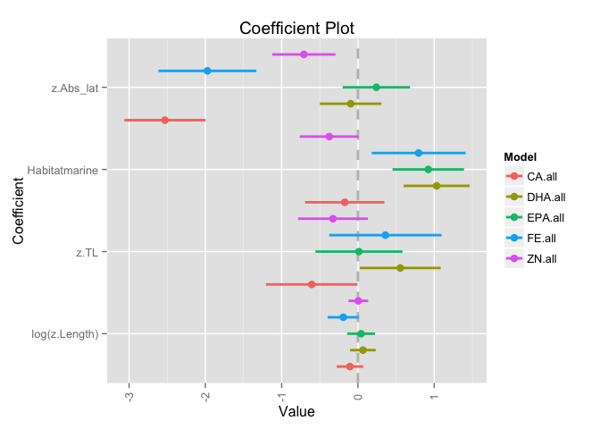 

```r
hist(ntbl$Weight)
```

 

#### Result 6.	Functional group diversity enhances dietary nutritional diversity and nutritional benefits that human communities may derive from seafood assemblages. (nutrient accumulation curve). 

#####How important is functional diversity?

Here we look at the three minerals. 

```r
ntbl.raw <- read.csv("/Users/Joey/Documents/Nutrient_Analysis/data/ntbl2.csv")
inverts.new <- read_csv("/Users/Joey/Documents/Nutrient_Analysis/data/aquatic_inverts_micronutrients.csv")

#create a df that is just the minerals and the species info
ntbl.minerals <- ntbl.raw %>% 
  dplyr::select(Subgroup, species, CA_mg, FE_mg, ZN_mg)


inverts.minerals <- inverts.new %>% 
  dplyr::select(Subgroup, species, CA_mg, FE_mg, ZN_mg)
  # filter(Subgroup != "Echinoderm") 

#join the new old ntbl data with the new inverts mineral data
minerals <- bind_rows(ntbl.minerals, inverts.minerals)
```


#### SAC

```r
#step 1. create a matrix with just 0 and 1 for whether a given species reaches RDI
ntbl.RDI <- minerals %>% 
  group_by(species) %>% 
  summarise(mean.CA = mean(CA_mg, na.rm = TRUE),
            mean.ZN = mean(ZN_mg, na.rm = TRUE), 
            mean.FE = mean(FE_mg, na.rm = TRUE)) %>% 
  mutate(RDI.CA = ifelse(mean.CA > 300, 1, 0)) %>% 
  mutate(RDI.FE = ifelse(mean.FE > 4.5, 1, 0)) %>% 
  mutate(RDI.ZN = ifelse(mean.ZN > 2.75, 1, 0)) %>%
  mutate(RDI.micro.tot = rowSums(.[5:7])) %>% 
  filter(!is.na(RDI.micro.tot)) %>% 
  # arrange(., RDI.micro.tot) %>% 
  # select(., c(1,5:7))
  dplyr::select(., 5:7)

#step 2. create the same matrix, but this time remove the molluscs
ntbl.RDI.noMoll <- minerals %>% 
  group_by(species) %>% 
  filter(Subgroup != "Molluscs") %>% 
  summarise(mean.CA = mean(CA_mg, na.rm = TRUE),
            mean.ZN = mean(ZN_mg, na.rm = TRUE), 
            mean.FE = mean(FE_mg, na.rm = TRUE)) %>% 
  mutate(RDI.CA = ifelse(mean.CA > 300, 1, 0)) %>% 
  mutate(RDI.FE = ifelse(mean.FE > 4.5, 1, 0)) %>% 
  mutate(RDI.ZN = ifelse(mean.ZN > 2.75, 1, 0)) %>%
  mutate(RDI.micro.tot = rowSums(.[5:7])) %>% 
  filter(!is.na(RDI.micro.tot)) %>% 
  # arrange(., RDI.micro.tot) %>% 
  # select(., c(1,5:7))
  dplyr::select(., 5:7)
```

#####Create the species/nutrient accumulation curve

```r
spa.rand <- specaccum(ntbl.RDI, method = "random")
# png(filename = "sac.full.vs.noMoll.png", width = 6, height = 4, units = 'in', res = 300)
plot(spa.rand, col = "cadetblue", lwd = 2, ci = 1, ci.type = "bar", ci.lty = 3,  ci.col = "cadetblue", ylim = c(0,4), xlim = c(0,80), xlab = "number of fish species in diet", ylab = "number of distinct RDI targets reached", main = "25% RDI targets")
abline( v= 15, col = "cadetblue")
abline( v = 26, col = "pink")
```

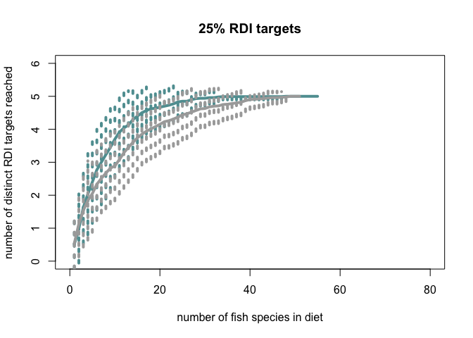 

```r
# dev.off()
summary(spa.rand)
```

```
##  1 sites        2 sites        3 sites       4 sites        5 sites       
##  Min.   :0.00   Min.   :0.00   Min.   :0.0   Min.   :0.00   Min.   :0.00  
##  1st Qu.:0.00   1st Qu.:0.00   1st Qu.:1.0   1st Qu.:1.00   1st Qu.:1.00  
##  Median :0.00   Median :1.00   Median :1.0   Median :2.00   Median :2.00  
##  Mean   :0.56   Mean   :1.05   Mean   :1.3   Mean   :1.62   Mean   :1.85  
##  3rd Qu.:1.00   3rd Qu.:2.00   3rd Qu.:2.0   3rd Qu.:3.00   3rd Qu.:3.00  
##  Max.   :3.00   Max.   :3.00   Max.   :3.0   Max.   :3.00   Max.   :3.00  
##  6 sites        7 sites        8 sites        9 sites       
##  Min.   :0.00   Min.   :0.00   Min.   :0.00   Min.   :0.00  
##  1st Qu.:1.00   1st Qu.:1.00   1st Qu.:2.00   1st Qu.:2.00  
##  Median :2.00   Median :2.00   Median :3.00   Median :3.00  
##  Mean   :2.02   Mean   :2.15   Mean   :2.27   Mean   :2.39  
##  3rd Qu.:3.00   3rd Qu.:3.00   3rd Qu.:3.00   3rd Qu.:3.00  
##  Max.   :3.00   Max.   :3.00   Max.   :3.00   Max.   :3.00  
##  10 sites       11 sites       12 sites       13 sites      
##  Min.   :1.00   Min.   :1.00   Min.   :1.00   Min.   :1.00  
##  1st Qu.:2.00   1st Qu.:2.00   1st Qu.:2.00   1st Qu.:3.00  
##  Median :3.00   Median :3.00   Median :3.00   Median :3.00  
##  Mean   :2.52   Mean   :2.61   Mean   :2.65   Mean   :2.71  
##  3rd Qu.:3.00   3rd Qu.:3.00   3rd Qu.:3.00   3rd Qu.:3.00  
##  Max.   :3.00   Max.   :3.00   Max.   :3.00   Max.   :3.00  
##  14 sites       15 sites      16 sites       17 sites       18 sites      
##  Min.   :1.00   Min.   :1.0   Min.   :1.00   Min.   :1.00   Min.   :1.00  
##  1st Qu.:3.00   1st Qu.:3.0   1st Qu.:3.00   1st Qu.:3.00   1st Qu.:3.00  
##  Median :3.00   Median :3.0   Median :3.00   Median :3.00   Median :3.00  
##  Mean   :2.76   Mean   :2.8   Mean   :2.84   Mean   :2.85   Mean   :2.91  
##  3rd Qu.:3.00   3rd Qu.:3.0   3rd Qu.:3.00   3rd Qu.:3.00   3rd Qu.:3.00  
##  Max.   :3.00   Max.   :3.0   Max.   :3.00   Max.   :3.00   Max.   :3.00  
##  19 sites       20 sites       21 sites       22 sites      
##  Min.   :1.00   Min.   :2.00   Min.   :2.00   Min.   :2.00  
##  1st Qu.:3.00   1st Qu.:3.00   1st Qu.:3.00   1st Qu.:3.00  
##  Median :3.00   Median :3.00   Median :3.00   Median :3.00  
##  Mean   :2.93   Mean   :2.94   Mean   :2.97   Mean   :2.98  
##  3rd Qu.:3.00   3rd Qu.:3.00   3rd Qu.:3.00   3rd Qu.:3.00  
##  Max.   :3.00   Max.   :3.00   Max.   :3.00   Max.   :3.00  
##  23 sites       24 sites       25 sites    26 sites    27 sites   
##  Min.   :2.00   Min.   :2.00   Min.   :3   Min.   :3   Min.   :3  
##  1st Qu.:3.00   1st Qu.:3.00   1st Qu.:3   1st Qu.:3   1st Qu.:3  
##  Median :3.00   Median :3.00   Median :3   Median :3   Median :3  
##  Mean   :2.99   Mean   :2.99   Mean   :3   Mean   :3   Mean   :3  
##  3rd Qu.:3.00   3rd Qu.:3.00   3rd Qu.:3   3rd Qu.:3   3rd Qu.:3  
##  Max.   :3.00   Max.   :3.00   Max.   :3   Max.   :3   Max.   :3  
##  28 sites    29 sites    30 sites    31 sites    32 sites    33 sites   
##  Min.   :3   Min.   :3   Min.   :3   Min.   :3   Min.   :3   Min.   :3  
##  1st Qu.:3   1st Qu.:3   1st Qu.:3   1st Qu.:3   1st Qu.:3   1st Qu.:3  
##  Median :3   Median :3   Median :3   Median :3   Median :3   Median :3  
##  Mean   :3   Mean   :3   Mean   :3   Mean   :3   Mean   :3   Mean   :3  
##  3rd Qu.:3   3rd Qu.:3   3rd Qu.:3   3rd Qu.:3   3rd Qu.:3   3rd Qu.:3  
##  Max.   :3   Max.   :3   Max.   :3   Max.   :3   Max.   :3   Max.   :3  
##  34 sites    35 sites    36 sites    37 sites    38 sites    39 sites   
##  Min.   :3   Min.   :3   Min.   :3   Min.   :3   Min.   :3   Min.   :3  
##  1st Qu.:3   1st Qu.:3   1st Qu.:3   1st Qu.:3   1st Qu.:3   1st Qu.:3  
##  Median :3   Median :3   Median :3   Median :3   Median :3   Median :3  
##  Mean   :3   Mean   :3   Mean   :3   Mean   :3   Mean   :3   Mean   :3  
##  3rd Qu.:3   3rd Qu.:3   3rd Qu.:3   3rd Qu.:3   3rd Qu.:3   3rd Qu.:3  
##  Max.   :3   Max.   :3   Max.   :3   Max.   :3   Max.   :3   Max.   :3  
##  40 sites    41 sites    42 sites    43 sites    44 sites    45 sites   
##  Min.   :3   Min.   :3   Min.   :3   Min.   :3   Min.   :3   Min.   :3  
##  1st Qu.:3   1st Qu.:3   1st Qu.:3   1st Qu.:3   1st Qu.:3   1st Qu.:3  
##  Median :3   Median :3   Median :3   Median :3   Median :3   Median :3  
##  Mean   :3   Mean   :3   Mean   :3   Mean   :3   Mean   :3   Mean   :3  
##  3rd Qu.:3   3rd Qu.:3   3rd Qu.:3   3rd Qu.:3   3rd Qu.:3   3rd Qu.:3  
##  Max.   :3   Max.   :3   Max.   :3   Max.   :3   Max.   :3   Max.   :3  
##  46 sites    47 sites    48 sites    49 sites    50 sites    51 sites   
##  Min.   :3   Min.   :3   Min.   :3   Min.   :3   Min.   :3   Min.   :3  
##  1st Qu.:3   1st Qu.:3   1st Qu.:3   1st Qu.:3   1st Qu.:3   1st Qu.:3  
##  Median :3   Median :3   Median :3   Median :3   Median :3   Median :3  
##  Mean   :3   Mean   :3   Mean   :3   Mean   :3   Mean   :3   Mean   :3  
##  3rd Qu.:3   3rd Qu.:3   3rd Qu.:3   3rd Qu.:3   3rd Qu.:3   3rd Qu.:3  
##  Max.   :3   Max.   :3   Max.   :3   Max.   :3   Max.   :3   Max.   :3  
##  52 sites    53 sites    54 sites    55 sites    56 sites    57 sites   
##  Min.   :3   Min.   :3   Min.   :3   Min.   :3   Min.   :3   Min.   :3  
##  1st Qu.:3   1st Qu.:3   1st Qu.:3   1st Qu.:3   1st Qu.:3   1st Qu.:3  
##  Median :3   Median :3   Median :3   Median :3   Median :3   Median :3  
##  Mean   :3   Mean   :3   Mean   :3   Mean   :3   Mean   :3   Mean   :3  
##  3rd Qu.:3   3rd Qu.:3   3rd Qu.:3   3rd Qu.:3   3rd Qu.:3   3rd Qu.:3  
##  Max.   :3   Max.   :3   Max.   :3   Max.   :3   Max.   :3   Max.   :3  
##  58 sites    59 sites    60 sites    61 sites    62 sites    63 sites   
##  Min.   :3   Min.   :3   Min.   :3   Min.   :3   Min.   :3   Min.   :3  
##  1st Qu.:3   1st Qu.:3   1st Qu.:3   1st Qu.:3   1st Qu.:3   1st Qu.:3  
##  Median :3   Median :3   Median :3   Median :3   Median :3   Median :3  
##  Mean   :3   Mean   :3   Mean   :3   Mean   :3   Mean   :3   Mean   :3  
##  3rd Qu.:3   3rd Qu.:3   3rd Qu.:3   3rd Qu.:3   3rd Qu.:3   3rd Qu.:3  
##  Max.   :3   Max.   :3   Max.   :3   Max.   :3   Max.   :3   Max.   :3  
##  64 sites    65 sites    66 sites    67 sites    68 sites    69 sites   
##  Min.   :3   Min.   :3   Min.   :3   Min.   :3   Min.   :3   Min.   :3  
##  1st Qu.:3   1st Qu.:3   1st Qu.:3   1st Qu.:3   1st Qu.:3   1st Qu.:3  
##  Median :3   Median :3   Median :3   Median :3   Median :3   Median :3  
##  Mean   :3   Mean   :3   Mean   :3   Mean   :3   Mean   :3   Mean   :3  
##  3rd Qu.:3   3rd Qu.:3   3rd Qu.:3   3rd Qu.:3   3rd Qu.:3   3rd Qu.:3  
##  Max.   :3   Max.   :3   Max.   :3   Max.   :3   Max.   :3   Max.   :3  
##  70 sites    71 sites    72 sites    73 sites    74 sites    75 sites   
##  Min.   :3   Min.   :3   Min.   :3   Min.   :3   Min.   :3   Min.   :3  
##  1st Qu.:3   1st Qu.:3   1st Qu.:3   1st Qu.:3   1st Qu.:3   1st Qu.:3  
##  Median :3   Median :3   Median :3   Median :3   Median :3   Median :3  
##  Mean   :3   Mean   :3   Mean   :3   Mean   :3   Mean   :3   Mean   :3  
##  3rd Qu.:3   3rd Qu.:3   3rd Qu.:3   3rd Qu.:3   3rd Qu.:3   3rd Qu.:3  
##  Max.   :3   Max.   :3   Max.   :3   Max.   :3   Max.   :3   Max.   :3  
##  76 sites    77 sites    78 sites    79 sites    80 sites    81 sites   
##  Min.   :3   Min.   :3   Min.   :3   Min.   :3   Min.   :3   Min.   :3  
##  1st Qu.:3   1st Qu.:3   1st Qu.:3   1st Qu.:3   1st Qu.:3   1st Qu.:3  
##  Median :3   Median :3   Median :3   Median :3   Median :3   Median :3  
##  Mean   :3   Mean   :3   Mean   :3   Mean   :3   Mean   :3   Mean   :3  
##  3rd Qu.:3   3rd Qu.:3   3rd Qu.:3   3rd Qu.:3   3rd Qu.:3   3rd Qu.:3  
##  Max.   :3   Max.   :3   Max.   :3   Max.   :3   Max.   :3   Max.   :3  
##  82 sites    83 sites    84 sites    85 sites    86 sites    87 sites   
##  Min.   :3   Min.   :3   Min.   :3   Min.   :3   Min.   :3   Min.   :3  
##  1st Qu.:3   1st Qu.:3   1st Qu.:3   1st Qu.:3   1st Qu.:3   1st Qu.:3  
##  Median :3   Median :3   Median :3   Median :3   Median :3   Median :3  
##  Mean   :3   Mean   :3   Mean   :3   Mean   :3   Mean   :3   Mean   :3  
##  3rd Qu.:3   3rd Qu.:3   3rd Qu.:3   3rd Qu.:3   3rd Qu.:3   3rd Qu.:3  
##  Max.   :3   Max.   :3   Max.   :3   Max.   :3   Max.   :3   Max.   :3  
##  88 sites    89 sites    90 sites    91 sites    92 sites    93 sites   
##  Min.   :3   Min.   :3   Min.   :3   Min.   :3   Min.   :3   Min.   :3  
##  1st Qu.:3   1st Qu.:3   1st Qu.:3   1st Qu.:3   1st Qu.:3   1st Qu.:3  
##  Median :3   Median :3   Median :3   Median :3   Median :3   Median :3  
##  Mean   :3   Mean   :3   Mean   :3   Mean   :3   Mean   :3   Mean   :3  
##  3rd Qu.:3   3rd Qu.:3   3rd Qu.:3   3rd Qu.:3   3rd Qu.:3   3rd Qu.:3  
##  Max.   :3   Max.   :3   Max.   :3   Max.   :3   Max.   :3   Max.   :3  
##  94 sites    95 sites    96 sites    97 sites    98 sites    99 sites   
##  Min.   :3   Min.   :3   Min.   :3   Min.   :3   Min.   :3   Min.   :3  
##  1st Qu.:3   1st Qu.:3   1st Qu.:3   1st Qu.:3   1st Qu.:3   1st Qu.:3  
##  Median :3   Median :3   Median :3   Median :3   Median :3   Median :3  
##  Mean   :3   Mean   :3   Mean   :3   Mean   :3   Mean   :3   Mean   :3  
##  3rd Qu.:3   3rd Qu.:3   3rd Qu.:3   3rd Qu.:3   3rd Qu.:3   3rd Qu.:3  
##  Max.   :3   Max.   :3   Max.   :3   Max.   :3   Max.   :3   Max.   :3  
##  100 sites   101 sites   102 sites   103 sites   104 sites   105 sites  
##  Min.   :3   Min.   :3   Min.   :3   Min.   :3   Min.   :3   Min.   :3  
##  1st Qu.:3   1st Qu.:3   1st Qu.:3   1st Qu.:3   1st Qu.:3   1st Qu.:3  
##  Median :3   Median :3   Median :3   Median :3   Median :3   Median :3  
##  Mean   :3   Mean   :3   Mean   :3   Mean   :3   Mean   :3   Mean   :3  
##  3rd Qu.:3   3rd Qu.:3   3rd Qu.:3   3rd Qu.:3   3rd Qu.:3   3rd Qu.:3  
##  Max.   :3   Max.   :3   Max.   :3   Max.   :3   Max.   :3   Max.   :3  
##  106 sites  
##  Min.   :3  
##  1st Qu.:3  
##  Median :3  
##  Mean   :3  
##  3rd Qu.:3  
##  Max.   :3
```

```r
#Now create the analagous curve for the no mollusc dataset, and plot both curves on the same axis (question to self...is it a fair comparison to compare against the full dataset? should I also remove the same amount of finfish from the full dataset to make a fair comparison?)

# png(filename = "/Users/Joey/Documents/Nutrient_Analysis/figures/sac.full.vs.noMoll.png", width = 10, height = 8, units = 'in', res = 300)
spa.rand.noMoll <- specaccum(ntbl.RDI.noMoll, method = "random")
plot(spa.rand, col = "black", lwd = 4, ci = 1, ci.type = "bar", ci.lty = 3,  ci.col = "blue", ylim = c(0,3.5), xlim = c(0,60), xlab = "number of fish species in diet", ylab = "number of distinct RDI targets reached", main = "micronutrients: 25% RDI targets")
plot(spa.rand.noMoll, add = TRUE, col = "darkgrey", lwd = 4, ci = 1, ci.type = "bar", ci.lty = 3,  ci.col = "darkgrey", ylim = c(0,3.5), xlim = c(0,60), xlab = "number of fish species in diet", ylab = "number of distinct RDI targets reached", main = "25% RDI targets")
# dev.off()
legend('bottomright', legend = c("full", "no molluscs"), lty=c(1,1), lwd=c(4.4), col=c('black', 'darkgrey')) # gives the legend lines the correct color and width))
```

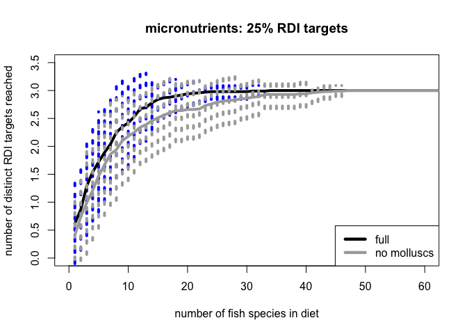 

```r
summary(spa.rand.noMoll)
```

```
##  1 sites       2 sites        3 sites        4 sites        5 sites       
##  Min.   :0.0   Min.   :0.00   Min.   :0.00   Min.   :0.00   Min.   :0.00  
##  1st Qu.:0.0   1st Qu.:0.00   1st Qu.:0.00   1st Qu.:1.00   1st Qu.:1.00  
##  Median :0.0   Median :1.00   Median :1.00   Median :1.00   Median :1.00  
##  Mean   :0.4   Mean   :0.75   Mean   :0.98   Mean   :1.17   Mean   :1.33  
##  3rd Qu.:1.0   3rd Qu.:1.00   3rd Qu.:1.00   3rd Qu.:2.00   3rd Qu.:2.00  
##  Max.   :2.0   Max.   :3.00   Max.   :3.00   Max.   :3.00   Max.   :3.00  
##  6 sites       7 sites        8 sites       9 sites        10 sites      
##  Min.   :0.0   Min.   :0.00   Min.   :0.0   Min.   :0.00   Min.   :0.00  
##  1st Qu.:1.0   1st Qu.:1.00   1st Qu.:1.0   1st Qu.:1.00   1st Qu.:1.00  
##  Median :1.0   Median :1.50   Median :2.0   Median :2.00   Median :2.00  
##  Mean   :1.5   Mean   :1.61   Mean   :1.7   Mean   :1.81   Mean   :1.92  
##  3rd Qu.:2.0   3rd Qu.:2.00   3rd Qu.:2.0   3rd Qu.:2.00   3rd Qu.:3.00  
##  Max.   :3.0   Max.   :3.00   Max.   :3.0   Max.   :3.00   Max.   :3.00  
##  11 sites       12 sites       13 sites       14 sites      15 sites      
##  Min.   :1.00   Min.   :1.00   Min.   :1.00   Min.   :1.0   Min.   :1.00  
##  1st Qu.:1.75   1st Qu.:2.00   1st Qu.:2.00   1st Qu.:2.0   1st Qu.:2.00  
##  Median :2.00   Median :2.00   Median :2.00   Median :2.0   Median :2.00  
##  Mean   :2.05   Mean   :2.17   Mean   :2.24   Mean   :2.3   Mean   :2.37  
##  3rd Qu.:3.00   3rd Qu.:3.00   3rd Qu.:3.00   3rd Qu.:3.0   3rd Qu.:3.00  
##  Max.   :3.00   Max.   :3.00   Max.   :3.00   Max.   :3.0   Max.   :3.00  
##  16 sites       17 sites       18 sites      19 sites       20 sites      
##  Min.   :1.00   Min.   :1.00   Min.   :1.0   Min.   :1.00   Min.   :1.00  
##  1st Qu.:2.00   1st Qu.:2.00   1st Qu.:2.0   1st Qu.:2.00   1st Qu.:2.00  
##  Median :2.00   Median :2.00   Median :3.0   Median :3.00   Median :3.00  
##  Mean   :2.41   Mean   :2.44   Mean   :2.5   Mean   :2.57   Mean   :2.64  
##  3rd Qu.:3.00   3rd Qu.:3.00   3rd Qu.:3.0   3rd Qu.:3.00   3rd Qu.:3.00  
##  Max.   :3.00   Max.   :3.00   Max.   :3.0   Max.   :3.00   Max.   :3.00  
##  21 sites       22 sites      23 sites       24 sites       25 sites     
##  Min.   :1.00   Min.   :1.0   Min.   :2.00   Min.   :2.00   Min.   :2.0  
##  1st Qu.:2.00   1st Qu.:2.0   1st Qu.:2.00   1st Qu.:3.00   1st Qu.:3.0  
##  Median :3.00   Median :3.0   Median :3.00   Median :3.00   Median :3.0  
##  Mean   :2.68   Mean   :2.7   Mean   :2.74   Mean   :2.76   Mean   :2.8  
##  3rd Qu.:3.00   3rd Qu.:3.0   3rd Qu.:3.00   3rd Qu.:3.00   3rd Qu.:3.0  
##  Max.   :3.00   Max.   :3.0   Max.   :3.00   Max.   :3.00   Max.   :3.0  
##  26 sites       27 sites       28 sites       29 sites      
##  Min.   :2.00   Min.   :2.00   Min.   :2.00   Min.   :2.00  
##  1st Qu.:3.00   1st Qu.:3.00   1st Qu.:3.00   1st Qu.:3.00  
##  Median :3.00   Median :3.00   Median :3.00   Median :3.00  
##  Mean   :2.81   Mean   :2.83   Mean   :2.84   Mean   :2.86  
##  3rd Qu.:3.00   3rd Qu.:3.00   3rd Qu.:3.00   3rd Qu.:3.00  
##  Max.   :3.00   Max.   :3.00   Max.   :3.00   Max.   :3.00  
##  30 sites       31 sites      32 sites       33 sites       34 sites      
##  Min.   :2.00   Min.   :2.0   Min.   :2.00   Min.   :2.00   Min.   :2.00  
##  1st Qu.:3.00   1st Qu.:3.0   1st Qu.:3.00   1st Qu.:3.00   1st Qu.:3.00  
##  Median :3.00   Median :3.0   Median :3.00   Median :3.00   Median :3.00  
##  Mean   :2.87   Mean   :2.9   Mean   :2.91   Mean   :2.91   Mean   :2.93  
##  3rd Qu.:3.00   3rd Qu.:3.0   3rd Qu.:3.00   3rd Qu.:3.00   3rd Qu.:3.00  
##  Max.   :3.00   Max.   :3.0   Max.   :3.00   Max.   :3.00   Max.   :3.00  
##  35 sites       36 sites       37 sites       38 sites      
##  Min.   :2.00   Min.   :2.00   Min.   :2.00   Min.   :2.00  
##  1st Qu.:3.00   1st Qu.:3.00   1st Qu.:3.00   1st Qu.:3.00  
##  Median :3.00   Median :3.00   Median :3.00   Median :3.00  
##  Mean   :2.93   Mean   :2.93   Mean   :2.94   Mean   :2.96  
##  3rd Qu.:3.00   3rd Qu.:3.00   3rd Qu.:3.00   3rd Qu.:3.00  
##  Max.   :3.00   Max.   :3.00   Max.   :3.00   Max.   :3.00  
##  39 sites       40 sites       41 sites       42 sites      
##  Min.   :2.00   Min.   :2.00   Min.   :2.00   Min.   :2.00  
##  1st Qu.:3.00   1st Qu.:3.00   1st Qu.:3.00   1st Qu.:3.00  
##  Median :3.00   Median :3.00   Median :3.00   Median :3.00  
##  Mean   :2.97   Mean   :2.97   Mean   :2.97   Mean   :2.97  
##  3rd Qu.:3.00   3rd Qu.:3.00   3rd Qu.:3.00   3rd Qu.:3.00  
##  Max.   :3.00   Max.   :3.00   Max.   :3.00   Max.   :3.00  
##  43 sites       44 sites       45 sites       46 sites      
##  Min.   :2.00   Min.   :2.00   Min.   :2.00   Min.   :2.00  
##  1st Qu.:3.00   1st Qu.:3.00   1st Qu.:3.00   1st Qu.:3.00  
##  Median :3.00   Median :3.00   Median :3.00   Median :3.00  
##  Mean   :2.97   Mean   :2.97   Mean   :2.97   Mean   :2.97  
##  3rd Qu.:3.00   3rd Qu.:3.00   3rd Qu.:3.00   3rd Qu.:3.00  
##  Max.   :3.00   Max.   :3.00   Max.   :3.00   Max.   :3.00  
##  47 sites       48 sites       49 sites       50 sites      
##  Min.   :2.00   Min.   :2.00   Min.   :2.00   Min.   :2.00  
##  1st Qu.:3.00   1st Qu.:3.00   1st Qu.:3.00   1st Qu.:3.00  
##  Median :3.00   Median :3.00   Median :3.00   Median :3.00  
##  Mean   :2.99   Mean   :2.99   Mean   :2.99   Mean   :2.99  
##  3rd Qu.:3.00   3rd Qu.:3.00   3rd Qu.:3.00   3rd Qu.:3.00  
##  Max.   :3.00   Max.   :3.00   Max.   :3.00   Max.   :3.00  
##  51 sites       52 sites       53 sites       54 sites      
##  Min.   :2.00   Min.   :2.00   Min.   :2.00   Min.   :2.00  
##  1st Qu.:3.00   1st Qu.:3.00   1st Qu.:3.00   1st Qu.:3.00  
##  Median :3.00   Median :3.00   Median :3.00   Median :3.00  
##  Mean   :2.99   Mean   :2.99   Mean   :2.99   Mean   :2.99  
##  3rd Qu.:3.00   3rd Qu.:3.00   3rd Qu.:3.00   3rd Qu.:3.00  
##  Max.   :3.00   Max.   :3.00   Max.   :3.00   Max.   :3.00  
##  55 sites       56 sites    57 sites    58 sites    59 sites   
##  Min.   :2.00   Min.   :3   Min.   :3   Min.   :3   Min.   :3  
##  1st Qu.:3.00   1st Qu.:3   1st Qu.:3   1st Qu.:3   1st Qu.:3  
##  Median :3.00   Median :3   Median :3   Median :3   Median :3  
##  Mean   :2.99   Mean   :3   Mean   :3   Mean   :3   Mean   :3  
##  3rd Qu.:3.00   3rd Qu.:3   3rd Qu.:3   3rd Qu.:3   3rd Qu.:3  
##  Max.   :3.00   Max.   :3   Max.   :3   Max.   :3   Max.   :3  
##  60 sites    61 sites    62 sites    63 sites    64 sites    65 sites   
##  Min.   :3   Min.   :3   Min.   :3   Min.   :3   Min.   :3   Min.   :3  
##  1st Qu.:3   1st Qu.:3   1st Qu.:3   1st Qu.:3   1st Qu.:3   1st Qu.:3  
##  Median :3   Median :3   Median :3   Median :3   Median :3   Median :3  
##  Mean   :3   Mean   :3   Mean   :3   Mean   :3   Mean   :3   Mean   :3  
##  3rd Qu.:3   3rd Qu.:3   3rd Qu.:3   3rd Qu.:3   3rd Qu.:3   3rd Qu.:3  
##  Max.   :3   Max.   :3   Max.   :3   Max.   :3   Max.   :3   Max.   :3  
##  66 sites    67 sites    68 sites    69 sites    70 sites    71 sites   
##  Min.   :3   Min.   :3   Min.   :3   Min.   :3   Min.   :3   Min.   :3  
##  1st Qu.:3   1st Qu.:3   1st Qu.:3   1st Qu.:3   1st Qu.:3   1st Qu.:3  
##  Median :3   Median :3   Median :3   Median :3   Median :3   Median :3  
##  Mean   :3   Mean   :3   Mean   :3   Mean   :3   Mean   :3   Mean   :3  
##  3rd Qu.:3   3rd Qu.:3   3rd Qu.:3   3rd Qu.:3   3rd Qu.:3   3rd Qu.:3  
##  Max.   :3   Max.   :3   Max.   :3   Max.   :3   Max.   :3   Max.   :3  
##  72 sites    73 sites    74 sites    75 sites    76 sites    77 sites   
##  Min.   :3   Min.   :3   Min.   :3   Min.   :3   Min.   :3   Min.   :3  
##  1st Qu.:3   1st Qu.:3   1st Qu.:3   1st Qu.:3   1st Qu.:3   1st Qu.:3  
##  Median :3   Median :3   Median :3   Median :3   Median :3   Median :3  
##  Mean   :3   Mean   :3   Mean   :3   Mean   :3   Mean   :3   Mean   :3  
##  3rd Qu.:3   3rd Qu.:3   3rd Qu.:3   3rd Qu.:3   3rd Qu.:3   3rd Qu.:3  
##  Max.   :3   Max.   :3   Max.   :3   Max.   :3   Max.   :3   Max.   :3  
##  78 sites    79 sites    80 sites    81 sites    82 sites    83 sites   
##  Min.   :3   Min.   :3   Min.   :3   Min.   :3   Min.   :3   Min.   :3  
##  1st Qu.:3   1st Qu.:3   1st Qu.:3   1st Qu.:3   1st Qu.:3   1st Qu.:3  
##  Median :3   Median :3   Median :3   Median :3   Median :3   Median :3  
##  Mean   :3   Mean   :3   Mean   :3   Mean   :3   Mean   :3   Mean   :3  
##  3rd Qu.:3   3rd Qu.:3   3rd Qu.:3   3rd Qu.:3   3rd Qu.:3   3rd Qu.:3  
##  Max.   :3   Max.   :3   Max.   :3   Max.   :3   Max.   :3   Max.   :3  
##  84 sites    85 sites    86 sites    87 sites    88 sites    89 sites   
##  Min.   :3   Min.   :3   Min.   :3   Min.   :3   Min.   :3   Min.   :3  
##  1st Qu.:3   1st Qu.:3   1st Qu.:3   1st Qu.:3   1st Qu.:3   1st Qu.:3  
##  Median :3   Median :3   Median :3   Median :3   Median :3   Median :3  
##  Mean   :3   Mean   :3   Mean   :3   Mean   :3   Mean   :3   Mean   :3  
##  3rd Qu.:3   3rd Qu.:3   3rd Qu.:3   3rd Qu.:3   3rd Qu.:3   3rd Qu.:3  
##  Max.   :3   Max.   :3   Max.   :3   Max.   :3   Max.   :3   Max.   :3  
##  90 sites    91 sites    92 sites    93 sites    94 sites   
##  Min.   :3   Min.   :3   Min.   :3   Min.   :3   Min.   :3  
##  1st Qu.:3   1st Qu.:3   1st Qu.:3   1st Qu.:3   1st Qu.:3  
##  Median :3   Median :3   Median :3   Median :3   Median :3  
##  Mean   :3   Mean   :3   Mean   :3   Mean   :3   Mean   :3  
##  3rd Qu.:3   3rd Qu.:3   3rd Qu.:3   3rd Qu.:3   3rd Qu.:3  
##  Max.   :3   Max.   :3   Max.   :3   Max.   :3   Max.   :3
```

```r
## Results from random nutrient accumulation:
## Need to sample from 14 species to get a median of all three minerals without molluscs, and need to sample from 8 species to get a median of 3 minerals when molluscs are included. 
```

#### All micronutrients accumulation ####
Now repeat the same process, but now include the three minerals plus the two fatty acids.

```r
ntbl.micronuts <- ntbl.raw %>% 
  dplyr::select(Subgroup, species, CA_mg, FE_mg, ZN_mg, EPA_g, DHA_g)

#step 1. create a matrix with just 0 and 1 for whether a given species reaches RDI
ntbl.RDI.all <- ntbl.micronuts %>% 
  group_by(species) %>% 
  summarise(mean.CA = mean(CA_mg, na.rm = TRUE),
            mean.ZN = mean(ZN_mg, na.rm = TRUE), 
            mean.FE = mean(FE_mg, na.rm = TRUE),
            mean.EPA = mean(EPA_g, na.rm = TRUE),
            mean.DHA = mean(DHA_g, na.rm = TRUE)) %>% 
  mutate(RDI.CA = ifelse(mean.CA > 300, 1, 0)) %>% 
  mutate(RDI.FE = ifelse(mean.FE > 4.5, 1, 0)) %>% 
  mutate(RDI.ZN = ifelse(mean.ZN > 2.75, 1, 0)) %>%
  mutate(RDI.EPA = ifelse(mean.EPA > 0.25, 1, 0)) %>% 
  mutate(RDI.DHA = ifelse(mean.DHA > 0.25, 1, 0)) %>% 
  mutate(RDI.micro.tot = rowSums(.[7:11])) %>% 
  filter(!is.na(RDI.micro.tot)) %>% 
  # arrange(., RDI.micro.tot) %>% 
  # dplyr::select(., c(1,5:7))
  dplyr::select(., 7:11)

ntbl.RDI.all.noMoll <- ntbl.micronuts %>% 
  group_by(species) %>% 
  filter(Subgroup != "Molluscs") %>% 
  summarise(mean.CA = mean(CA_mg, na.rm = TRUE),
            mean.ZN = mean(ZN_mg, na.rm = TRUE), 
            mean.FE = mean(FE_mg, na.rm = TRUE),
            mean.EPA = mean(EPA_g, na.rm = TRUE),
            mean.DHA = mean(DHA_g, na.rm = TRUE)) %>% 
  mutate(RDI.CA = ifelse(mean.CA > 300, 1, 0)) %>% 
  mutate(RDI.FE = ifelse(mean.FE > 4.5, 1, 0)) %>% 
  mutate(RDI.ZN = ifelse(mean.ZN > 2.75, 1, 0)) %>%
  mutate(RDI.EPA = ifelse(mean.EPA > 0.25, 1, 0)) %>% 
  mutate(RDI.DHA = ifelse(mean.DHA > 0.25, 1, 0)) %>% 
  mutate(RDI.micro.tot = rowSums(.[7:11])) %>% 
  filter(!is.na(RDI.micro.tot)) %>% 
  # arrange(., RDI.micro.tot) %>% 
  # dplyr::select(., c(1,5:7))
  dplyr::select(., 7:11)

## Create the sac

spa.rand.all <- specaccum(ntbl.RDI.all, method = "random")
spa.rand.all.noMoll <- specaccum(ntbl.RDI.all.noMoll, method = "random")
# png(filename = "sac.full.vs.noMoll.png", width = 6, height = 4, units = 'in', res = 300)
plot(spa.rand.all, col = "cadetblue", lwd = 4, ci = 1, ci.type = "bar", ci.lty = 3,  ci.col = "cadetblue", ylim = c(0,6), xlim = c(0,80), xlab = "number of fish species in diet", ylab = "number of distinct RDI targets reached", main = "25% RDI targets")
plot(spa.rand.all.noMoll, add = TRUE, col = "darkgrey", lwd = 4, ci = 1, ci.type = "bar", ci.lty = 3,  ci.col = "darkgrey", ylim = c(0,6), xlim = c(0,60), xlab = "number of fish species in diet", ylab = "number of distinct RDI targets reached", main = "25% RDI targets")
```

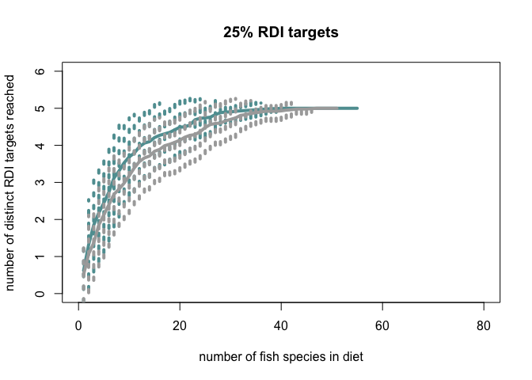 

```r
summary(spa.rand.all)
```

```
##  1 sites        2 sites        3 sites        4 sites       
##  Min.   :0.00   Min.   :0.00   Min.   :0.00   Min.   :0.00  
##  1st Qu.:0.00   1st Qu.:0.00   1st Qu.:1.00   1st Qu.:1.00  
##  Median :0.00   Median :1.00   Median :2.00   Median :2.00  
##  Mean   :0.62   Mean   :1.32   Mean   :1.85   Mean   :2.18  
##  3rd Qu.:1.00   3rd Qu.:2.00   3rd Qu.:3.00   3rd Qu.:3.00  
##  Max.   :3.00   Max.   :5.00   Max.   :5.00   Max.   :5.00  
##  5 sites        6 sites        7 sites        8 sites       
##  Min.   :0.00   Min.   :0.00   Min.   :0.00   Min.   :1.00  
##  1st Qu.:1.00   1st Qu.:2.00   1st Qu.:2.00   1st Qu.:3.00  
##  Median :2.50   Median :3.00   Median :3.00   Median :3.00  
##  Mean   :2.45   Mean   :2.74   Mean   :3.12   Mean   :3.31  
##  3rd Qu.:3.00   3rd Qu.:4.00   3rd Qu.:4.00   3rd Qu.:4.00  
##  Max.   :5.00   Max.   :5.00   Max.   :5.00   Max.   :5.00  
##  9 sites        10 sites       11 sites       12 sites      
##  Min.   :1.00   Min.   :1.00   Min.   :1.00   Min.   :1.00  
##  1st Qu.:3.00   1st Qu.:3.00   1st Qu.:3.00   1st Qu.:3.00  
##  Median :3.00   Median :4.00   Median :4.00   Median :4.00  
##  Mean   :3.53   Mean   :3.69   Mean   :3.79   Mean   :3.96  
##  3rd Qu.:4.25   3rd Qu.:5.00   3rd Qu.:5.00   3rd Qu.:5.00  
##  Max.   :5.00   Max.   :5.00   Max.   :5.00   Max.   :5.00  
##  13 sites       14 sites      15 sites       16 sites       17 sites      
##  Min.   :1.00   Min.   :1.0   Min.   :1.00   Min.   :1.00   Min.   :1.00  
##  1st Qu.:3.00   1st Qu.:3.0   1st Qu.:4.00   1st Qu.:4.00   1st Qu.:4.00  
##  Median :4.00   Median :4.0   Median :4.00   Median :4.00   Median :4.50  
##  Mean   :4.06   Mean   :4.1   Mean   :4.21   Mean   :4.27   Mean   :4.31  
##  3rd Qu.:5.00   3rd Qu.:5.0   3rd Qu.:5.00   3rd Qu.:5.00   3rd Qu.:5.00  
##  Max.   :5.00   Max.   :5.0   Max.   :5.00   Max.   :5.00   Max.   :5.00  
##  18 sites       19 sites       20 sites       21 sites      22 sites      
##  Min.   :1.00   Min.   :1.00   Min.   :1.00   Min.   :1.0   Min.   :1.00  
##  1st Qu.:4.00   1st Qu.:4.00   1st Qu.:4.00   1st Qu.:4.0   1st Qu.:4.00  
##  Median :5.00   Median :5.00   Median :5.00   Median :5.0   Median :5.00  
##  Mean   :4.35   Mean   :4.42   Mean   :4.49   Mean   :4.5   Mean   :4.55  
##  3rd Qu.:5.00   3rd Qu.:5.00   3rd Qu.:5.00   3rd Qu.:5.0   3rd Qu.:5.00  
##  Max.   :5.00   Max.   :5.00   Max.   :5.00   Max.   :5.0   Max.   :5.00  
##  23 sites       24 sites       25 sites       26 sites      
##  Min.   :3.00   Min.   :3.00   Min.   :3.00   Min.   :3.00  
##  1st Qu.:4.00   1st Qu.:5.00   1st Qu.:5.00   1st Qu.:5.00  
##  Median :5.00   Median :5.00   Median :5.00   Median :5.00  
##  Mean   :4.69   Mean   :4.73   Mean   :4.74   Mean   :4.76  
##  3rd Qu.:5.00   3rd Qu.:5.00   3rd Qu.:5.00   3rd Qu.:5.00  
##  Max.   :5.00   Max.   :5.00   Max.   :5.00   Max.   :5.00  
##  27 sites       28 sites       29 sites      30 sites      31 sites      
##  Min.   :4.00   Min.   :4.00   Min.   :4.0   Min.   :4.0   Min.   :4.00  
##  1st Qu.:5.00   1st Qu.:5.00   1st Qu.:5.0   1st Qu.:5.0   1st Qu.:5.00  
##  Median :5.00   Median :5.00   Median :5.0   Median :5.0   Median :5.00  
##  Mean   :4.83   Mean   :4.88   Mean   :4.9   Mean   :4.9   Mean   :4.92  
##  3rd Qu.:5.00   3rd Qu.:5.00   3rd Qu.:5.0   3rd Qu.:5.0   3rd Qu.:5.00  
##  Max.   :5.00   Max.   :5.00   Max.   :5.0   Max.   :5.0   Max.   :5.00  
##  32 sites       33 sites       34 sites       35 sites      
##  Min.   :4.00   Min.   :4.00   Min.   :4.00   Min.   :4.00  
##  1st Qu.:5.00   1st Qu.:5.00   1st Qu.:5.00   1st Qu.:5.00  
##  Median :5.00   Median :5.00   Median :5.00   Median :5.00  
##  Mean   :4.93   Mean   :4.94   Mean   :4.95   Mean   :4.96  
##  3rd Qu.:5.00   3rd Qu.:5.00   3rd Qu.:5.00   3rd Qu.:5.00  
##  Max.   :5.00   Max.   :5.00   Max.   :5.00   Max.   :5.00  
##  36 sites       37 sites       38 sites       39 sites       40 sites   
##  Min.   :4.00   Min.   :4.00   Min.   :4.00   Min.   :4.00   Min.   :5  
##  1st Qu.:5.00   1st Qu.:5.00   1st Qu.:5.00   1st Qu.:5.00   1st Qu.:5  
##  Median :5.00   Median :5.00   Median :5.00   Median :5.00   Median :5  
##  Mean   :4.97   Mean   :4.98   Mean   :4.99   Mean   :4.99   Mean   :5  
##  3rd Qu.:5.00   3rd Qu.:5.00   3rd Qu.:5.00   3rd Qu.:5.00   3rd Qu.:5  
##  Max.   :5.00   Max.   :5.00   Max.   :5.00   Max.   :5.00   Max.   :5  
##  41 sites    42 sites    43 sites    44 sites    45 sites    46 sites   
##  Min.   :5   Min.   :5   Min.   :5   Min.   :5   Min.   :5   Min.   :5  
##  1st Qu.:5   1st Qu.:5   1st Qu.:5   1st Qu.:5   1st Qu.:5   1st Qu.:5  
##  Median :5   Median :5   Median :5   Median :5   Median :5   Median :5  
##  Mean   :5   Mean   :5   Mean   :5   Mean   :5   Mean   :5   Mean   :5  
##  3rd Qu.:5   3rd Qu.:5   3rd Qu.:5   3rd Qu.:5   3rd Qu.:5   3rd Qu.:5  
##  Max.   :5   Max.   :5   Max.   :5   Max.   :5   Max.   :5   Max.   :5  
##  47 sites    48 sites    49 sites    50 sites    51 sites    52 sites   
##  Min.   :5   Min.   :5   Min.   :5   Min.   :5   Min.   :5   Min.   :5  
##  1st Qu.:5   1st Qu.:5   1st Qu.:5   1st Qu.:5   1st Qu.:5   1st Qu.:5  
##  Median :5   Median :5   Median :5   Median :5   Median :5   Median :5  
##  Mean   :5   Mean   :5   Mean   :5   Mean   :5   Mean   :5   Mean   :5  
##  3rd Qu.:5   3rd Qu.:5   3rd Qu.:5   3rd Qu.:5   3rd Qu.:5   3rd Qu.:5  
##  Max.   :5   Max.   :5   Max.   :5   Max.   :5   Max.   :5   Max.   :5  
##  53 sites    54 sites    55 sites   
##  Min.   :5   Min.   :5   Min.   :5  
##  1st Qu.:5   1st Qu.:5   1st Qu.:5  
##  Median :5   Median :5   Median :5  
##  Mean   :5   Mean   :5   Mean   :5  
##  3rd Qu.:5   3rd Qu.:5   3rd Qu.:5  
##  Max.   :5   Max.   :5   Max.   :5
```

```r
summary(spa.rand.all.noMoll)
```

```
##  1 sites        2 sites        3 sites        4 sites       
##  Min.   :0.00   Min.   :0.00   Min.   :0.00   Min.   :0.00  
##  1st Qu.:0.00   1st Qu.:0.00   1st Qu.:1.00   1st Qu.:1.00  
##  Median :0.00   Median :1.00   Median :1.00   Median :2.00  
##  Mean   :0.51   Mean   :1.07   Mean   :1.37   Mean   :1.85  
##  3rd Qu.:1.00   3rd Qu.:2.00   3rd Qu.:2.00   3rd Qu.:3.00  
##  Max.   :3.00   Max.   :4.00   Max.   :4.00   Max.   :5.00  
##  5 sites        6 sites       7 sites        8 sites        9 sites       
##  Min.   :0.00   Min.   :0.0   Min.   :0.00   Min.   :1.00   Min.   :1.00  
##  1st Qu.:1.00   1st Qu.:2.0   1st Qu.:2.00   1st Qu.:2.00   1st Qu.:2.00  
##  Median :2.00   Median :2.0   Median :3.00   Median :3.00   Median :3.00  
##  Mean   :2.13   Mean   :2.4   Mean   :2.68   Mean   :2.82   Mean   :2.98  
##  3rd Qu.:3.00   3rd Qu.:3.0   3rd Qu.:3.00   3rd Qu.:3.00   3rd Qu.:4.00  
##  Max.   :5.00   Max.   :5.0   Max.   :5.00   Max.   :5.00   Max.   :5.00  
##  10 sites       11 sites       12 sites       13 sites      
##  Min.   :1.00   Min.   :1.00   Min.   :1.00   Min.   :1.00  
##  1st Qu.:2.75   1st Qu.:3.00   1st Qu.:3.00   1st Qu.:3.00  
##  Median :3.00   Median :3.00   Median :4.00   Median :4.00  
##  Mean   :3.18   Mean   :3.39   Mean   :3.56   Mean   :3.66  
##  3rd Qu.:4.00   3rd Qu.:4.00   3rd Qu.:4.00   3rd Qu.:4.00  
##  Max.   :5.00   Max.   :5.00   Max.   :5.00   Max.   :5.00  
##  14 sites       15 sites       16 sites       17 sites      
##  Min.   :1.00   Min.   :1.00   Min.   :1.00   Min.   :1.00  
##  1st Qu.:3.00   1st Qu.:3.00   1st Qu.:3.00   1st Qu.:4.00  
##  Median :4.00   Median :4.00   Median :4.00   Median :4.00  
##  Mean   :3.71   Mean   :3.84   Mean   :3.89   Mean   :3.99  
##  3rd Qu.:4.00   3rd Qu.:4.00   3rd Qu.:4.00   3rd Qu.:5.00  
##  Max.   :5.00   Max.   :5.00   Max.   :5.00   Max.   :5.00  
##  18 sites       19 sites       20 sites       21 sites      
##  Min.   :1.00   Min.   :1.00   Min.   :1.00   Min.   :1.00  
##  1st Qu.:4.00   1st Qu.:4.00   1st Qu.:4.00   1st Qu.:4.00  
##  Median :4.00   Median :4.00   Median :4.00   Median :4.00  
##  Mean   :4.03   Mean   :4.08   Mean   :4.14   Mean   :4.22  
##  3rd Qu.:5.00   3rd Qu.:5.00   3rd Qu.:5.00   3rd Qu.:5.00  
##  Max.   :5.00   Max.   :5.00   Max.   :5.00   Max.   :5.00  
##  22 sites       23 sites       24 sites       25 sites      
##  Min.   :1.00   Min.   :1.00   Min.   :1.00   Min.   :1.00  
##  1st Qu.:4.00   1st Qu.:4.00   1st Qu.:4.00   1st Qu.:4.00  
##  Median :4.00   Median :4.00   Median :4.00   Median :5.00  
##  Mean   :4.27   Mean   :4.29   Mean   :4.37   Mean   :4.48  
##  3rd Qu.:5.00   3rd Qu.:5.00   3rd Qu.:5.00   3rd Qu.:5.00  
##  Max.   :5.00   Max.   :5.00   Max.   :5.00   Max.   :5.00  
##  26 sites       27 sites       28 sites      29 sites       30 sites     
##  Min.   :1.00   Min.   :3.00   Min.   :3.0   Min.   :3.00   Min.   :3.0  
##  1st Qu.:4.00   1st Qu.:4.00   1st Qu.:4.0   1st Qu.:4.00   1st Qu.:4.0  
##  Median :5.00   Median :5.00   Median :5.0   Median :5.00   Median :5.0  
##  Mean   :4.56   Mean   :4.59   Mean   :4.6   Mean   :4.66   Mean   :4.7  
##  3rd Qu.:5.00   3rd Qu.:5.00   3rd Qu.:5.0   3rd Qu.:5.00   3rd Qu.:5.0  
##  Max.   :5.00   Max.   :5.00   Max.   :5.0   Max.   :5.00   Max.   :5.0  
##  31 sites       32 sites       33 sites       34 sites      
##  Min.   :3.00   Min.   :3.00   Min.   :3.00   Min.   :4.00  
##  1st Qu.:5.00   1st Qu.:5.00   1st Qu.:5.00   1st Qu.:5.00  
##  Median :5.00   Median :5.00   Median :5.00   Median :5.00  
##  Mean   :4.74   Mean   :4.81   Mean   :4.83   Mean   :4.86  
##  3rd Qu.:5.00   3rd Qu.:5.00   3rd Qu.:5.00   3rd Qu.:5.00  
##  Max.   :5.00   Max.   :5.00   Max.   :5.00   Max.   :5.00  
##  35 sites       36 sites      37 sites       38 sites       39 sites      
##  Min.   :4.00   Min.   :4.0   Min.   :4.00   Min.   :4.00   Min.   :4.00  
##  1st Qu.:5.00   1st Qu.:5.0   1st Qu.:5.00   1st Qu.:5.00   1st Qu.:5.00  
##  Median :5.00   Median :5.0   Median :5.00   Median :5.00   Median :5.00  
##  Mean   :4.88   Mean   :4.9   Mean   :4.92   Mean   :4.92   Mean   :4.92  
##  3rd Qu.:5.00   3rd Qu.:5.0   3rd Qu.:5.00   3rd Qu.:5.00   3rd Qu.:5.00  
##  Max.   :5.00   Max.   :5.0   Max.   :5.00   Max.   :5.00   Max.   :5.00  
##  40 sites       41 sites       42 sites       43 sites      
##  Min.   :4.00   Min.   :4.00   Min.   :4.00   Min.   :4.00  
##  1st Qu.:5.00   1st Qu.:5.00   1st Qu.:5.00   1st Qu.:5.00  
##  Median :5.00   Median :5.00   Median :5.00   Median :5.00  
##  Mean   :4.93   Mean   :4.95   Mean   :4.96   Mean   :4.98  
##  3rd Qu.:5.00   3rd Qu.:5.00   3rd Qu.:5.00   3rd Qu.:5.00  
##  Max.   :5.00   Max.   :5.00   Max.   :5.00   Max.   :5.00  
##  44 sites       45 sites       46 sites       47 sites    48 sites   
##  Min.   :4.00   Min.   :4.00   Min.   :4.00   Min.   :5   Min.   :5  
##  1st Qu.:5.00   1st Qu.:5.00   1st Qu.:5.00   1st Qu.:5   1st Qu.:5  
##  Median :5.00   Median :5.00   Median :5.00   Median :5   Median :5  
##  Mean   :4.98   Mean   :4.98   Mean   :4.99   Mean   :5   Mean   :5  
##  3rd Qu.:5.00   3rd Qu.:5.00   3rd Qu.:5.00   3rd Qu.:5   3rd Qu.:5  
##  Max.   :5.00   Max.   :5.00   Max.   :5.00   Max.   :5   Max.   :5  
##  49 sites    50 sites    51 sites   
##  Min.   :5   Min.   :5   Min.   :5  
##  1st Qu.:5   1st Qu.:5   1st Qu.:5  
##  Median :5   Median :5   Median :5  
##  Mean   :5   Mean   :5   Mean   :5  
##  3rd Qu.:5   3rd Qu.:5   3rd Qu.:5  
##  Max.   :5   Max.   :5   Max.   :5
```

```r
### Result, need to sample from 15 species to reach a median of all 5 micronutrient targets (when molluscs are included), need to sample from 22 species when molluscs are excluded. 
```


