# nutrient_results

#### Script for the results section of the Nutritional diversity paper

Load packages and data

```r
library(plyr)
suppressPackageStartupMessages(library(dplyr))
suppressPackageStartupMessages(library(vegan))
library(readr)
library(ggplot2)
library(tidyr)
library(ggthemes)
library(knitr)
suppressPackageStartupMessages(library(ggtree))

ntbl <- read_csv("/Users/Joey/Documents/Nutrient_Analysis/data/ntbl2.csv")
str(ntbl)
```

```
## Classes 'tbl_df', 'tbl' and 'data.frame':	1188 obs. of  21 variables:
##  $ Food.Item.ID    : int  900159 900158 900684 900123 900122 900124 900125 900225 902192 900073 ...
##  $ species         : chr  "Abramis brama" "Abramis brama" "Abramis brama" "Abramis brama" ...
##  $ taxon           : chr  "Carps, barbels and other cyprinids" "Carps, barbels and other cyprinids" "Carps, barbels and other cyprinids" "Carps, barbels and other cyprinids" ...
##  $ max_size        : num  8.9 8.9 8.9 8.9 8.9 ...
##  $ max_length      : num  82 82 82 82 82 82 82 82 82 59 ...
##  $ TL              : num  2.9 2.9 2.9 2.9 2.9 2.9 2.9 2.9 2.9 4 ...
##  $ CA_mg           : num  53 52 NA 11.6 20.9 ...
##  $ EPA_g           : num  NA NA NA NA NA ...
##  $ DHA_g           : num  NA NA NA NA NA ...
##  $ FE_mg           : num  0.6 0.7 NA 0.17 0.21 0.18 0.19 NA NA NA ...
##  $ ZN_mg           : num  1 0.9 NA 0.393 0.373 ...
##  $ HG_mcg          : num  6 14 NA NA NA NA NA NA NA NA ...
##  $ FAT             : num  1.4 0.7 6.4 NA NA NA NA 1 NA 0.36 ...
##  $ PROTEIN         : num  19 20 NA NA NA ...
##  $ lwA             : num  0.00871 0.00871 0.00871 0.00871 0.00871 0.00871 0.00871 0.00871 0.00871 0.0055 ...
##  $ lwB             : num  3.14 3.14 3.14 3.14 3.14 3.14 3.14 3.14 3.14 3.19 ...
##  $ Habitat         : chr  "freshwater" "freshwater" "marine" "freshwater" ...
##  $ Subgroup        : chr  "Finfish" "Finfish" "Finfish" "Finfish" ...
##  $ Abs_lat         : num  41.5 41.5 53.9 54.1 54 ...
##  $ Latitude        : num  41.5 41.5 53.9 54.1 54 ...
##  $ max_length_study: num  30 36 NA 33.2 31.6 38 50.5 NA NA 39 ...
```


#### Result 1. There is considerable variability in nutritional profile among aquatic taxa.

Find the min and max for each nutrient.
#### Calcium ####

```r
hist(ntbl$CA_mg)
```

 

```r
summary(ntbl$CA_mg)
```

```
##    Min. 1st Qu.  Median    Mean 3rd Qu.    Max.    NA's 
##    2.99   13.48   53.50  173.20   88.85 1503.00     986
```

```r
length(!is.na(ntbl$CA_mg))
```

```
## [1] 1188
```

```r
#" How many species do we have calcium data for? 99 species.
ntbl %>% 
  filter(!is.na(CA_mg)) %>% 
  distinct(species) %>%
  count()
```

```
## Source: local data frame [1 x 1]
## 
##       n
##   (int)
## 1    99
```

```r
#' average by taxon
ntbl %>% 
  filter(!is.na(CA_mg)) %>% 
  group_by(taxon) %>% 
  summarise(mean.CA = mean(CA_mg),
            n = n_distinct(species)) %>% 
  arrange(desc(mean.CA)) %>%
  kable(.)
```


taxon                                   mean.CA    n
-----------------------------------  ----------  ---
Abalones, winkles, conchs             782.60000    3
Tilapias and other cichlids           752.30000    2
Herrings, sardines, anchovies         398.52000    1
Miscellaneous pelagic fishes          339.37563    4
Miscellaneous freshwater fishes       251.47419   17
Miscellaneous coastal fishes          242.12857    5
Carps, barbels and other cyprinids    229.84050   18
Clams, cockles, arkshells             192.73333    2
Flounders, halibuts, soles            185.00500    4
Freshwater molluscs                   124.00000    1
Crabs, sea-spiders                    113.50000    1
Lobsters, spiny-rock lobsters          90.66667    1
Mussels                                67.76000    1
Shrimps, prawns                        60.37500    2
Shads                                  52.40929    3
NA                                     49.23077   11
Tunas, bonitos, billfishes             42.78600    4
Salmons, trouts, smelts                14.81727    5
Oysters                                13.14000    1
Sharks, rays, chimaeras                11.00000    2
Cods, hakes, haddocks                  10.78182    6
Miscellaneous demersal fishes          10.60500    6

#### Then zinc: ####

```r
hist(ntbl$ZN_mg)
```

 

```r
summary(ntbl$ZN_mg)
```

```
##    Min. 1st Qu.  Median    Mean 3rd Qu.    Max.    NA's 
##  0.0158  0.4150  0.6650  1.2490  1.3970 12.0000     992
```

```r
length(!is.na(ntbl$ZN_mg))
```

```
## [1] 1188
```

```r
#" How many species do we have zinc data for? 101 species.
ntbl %>% 
  filter(!is.na(ZN_mg)) %>% 
  distinct(species) %>%
  count()
```

```
## Source: local data frame [1 x 1]
## 
##       n
##   (int)
## 1   101
```

```r
#' average by taxon
ntbl %>% 
  filter(!is.na(ZN_mg)) %>% 
  group_by(taxon) %>% 
  summarise(mean.ZN = mean(ZN_mg),
            n = n_distinct(species)) %>% 
  arrange(desc(mean.ZN)) %>%
  kable(.)
```


taxon                                    mean.ZN    n
-----------------------------------  -----------  ---
Oysters                               11.8710630    1
Abalones, winkles, conchs              9.0000000    2
Tilapias and other cichlids            4.1604500    2
Freshwater molluscs                    3.9000000    1
Freshwater crustaceans                 3.1000000    1
Crabs, sea-spiders                     2.4500000    1
Miscellaneous pelagic fishes           2.0908000    4
Herrings, sardines, anchovies          1.5670200    1
Lobsters, spiny-rock lobsters          1.5100000    1
Mussels                                1.4434692    3
Miscellaneous freshwater fishes        1.2458389   15
Clams, cockles, arkshells              1.1866667    2
Carps, barbels and other cyprinids     0.9913887   18
Tunas, bonitos, billfishes             0.9390000    4
NA                                     0.7346154   11
Salmons, trouts, smelts                0.5997203    5
Miscellaneous coastal fishes           0.5824870    8
Flounders, halibuts, soles             0.5376109    5
Miscellaneous demersal fishes          0.4875000    6
Shads                                  0.4411580    2
Sharks, rays, chimaeras                0.4000000    2
Cods, hakes, haddocks                  0.3663636    6
Pearls, mother-of-pearl, shells        0.0297900    1

#### Then iron: ####

```r
hist(ntbl$FE_mg)
```

 

```r
summary(ntbl$FE_mg)
```

```
##    Min. 1st Qu.  Median    Mean 3rd Qu.    Max.    NA's 
##   0.010   0.200   0.600   3.064   1.800 102.000     987
```

```r
#" How many species do we have iron data for? 101 species.
ntbl %>% 
  filter(!is.na(FE_mg)) %>% 
  distinct(species) %>%
  count()
```

```
## Source: local data frame [1 x 1]
## 
##       n
##   (int)
## 1   104
```

```r
#' average by taxon
ntbl %>% 
  filter(!is.na(FE_mg)) %>% 
  group_by(taxon) %>% 
  summarise(mean.FE = mean(FE_mg),
            n = n_distinct(species)) %>% 
  arrange(desc(mean.FE)) %>%
  kable(.)
```


taxon                                    mean.FE    n
-----------------------------------  -----------  ---
Abalones, winkles, conchs             20.3050000    4
Mussels                               19.2600000    2
Freshwater molluscs                   16.6000000    1
Freshwater crustaceans                10.0000000    1
Clams, cockles, arkshells              7.2800000    2
Miscellaneous pelagic fishes           5.9281250    4
NA                                     5.6030769   11
Tunas, bonitos, billfishes             5.1273333    4
Oysters                                2.3900000    1
Lobsters, spiny-rock lobsters          2.2166667    1
Tilapias and other cichlids            1.9150000    2
Herrings, sardines, anchovies          1.8300000    1
Shrimps, prawns                        1.5200000    2
Sharks, rays, chimaeras                1.5000000    2
Carps, barbels and other cyprinids     0.8863415   18
Miscellaneous coastal fishes           0.5966667    8
Miscellaneous freshwater fishes        0.5420690   15
Shads                                  0.5350000    2
Crabs, sea-spiders                     0.3750000    1
Flounders, halibuts, soles             0.3185714    5
Pearls, mother-of-pearl, shells        0.2800000    1
Salmons, trouts, smelts                0.2754545    5
Miscellaneous demersal fishes          0.2310833    6
Cods, hakes, haddocks                  0.1909091    6

#### EPA ####

```r
hist(ntbl$EPA_g)
```

 

```r
summary(ntbl$EPA_g)
```

```
##    Min. 1st Qu.  Median    Mean 3rd Qu.    Max.    NA's 
##  0.0004  0.0333  0.0775  0.1723  0.1751  1.9890     666
```

```r
#" How many species do we have EPA data for? 238 species.
ntbl %>% 
  filter(!is.na(EPA_g)) %>% 
  distinct(species) %>%
  count()
```

```
## Source: local data frame [1 x 1]
## 
##       n
##   (int)
## 1   238
```

```r
#' average by taxon
ntbl %>% 
  filter(!is.na(EPA_g)) %>% 
  group_by(taxon) %>% 
  summarise(mean.EPA = mean(EPA_g),
            n = n_distinct(species)) %>% 
  arrange(desc(mean.EPA)) %>%
  kable(.)
```


taxon                                  mean.EPA    n
-----------------------------------  ----------  ---
Shads                                 0.6017186    2
Herrings, sardines, anchovies         0.5343265   14
Tunas, bonitos, billfishes            0.3635974   11
Crabs, sea-spiders                    0.3500597    4
Mussels                               0.2593693    1
Miscellaneous demersal fishes         0.2530550   17
Miscellaneous pelagic fishes          0.2329137   21
Abalones, winkles, conchs             0.2162038    3
Miscellaneous coastal fishes          0.1456717   47
Salmons, trouts, smelts               0.1421940   11
Squids, cuttlefishes, octopuses       0.1159885    5
Oysters                               0.1128395    1
Miscellaneous diadromous fishes       0.1098986    2
Cods, hakes, haddocks                 0.1078687   13
Flounders, halibuts, soles            0.1010369   11
Clams, cockles, arkshells             0.0999067    2
King crabs, squat-lobsters            0.0918169    2
Freshwater crustaceans                0.0916625    3
River eels                            0.0856776    1
Carps, barbels and other cyprinids    0.0854440   10
Lobsters, spiny-rock lobsters         0.0783054    2
Miscellaneous freshwater fishes       0.0679509   30
Shrimps, prawns                       0.0602813   10
Tilapias and other cichlids           0.0276115    5
Krill, planktonic crustaceans         0.0269600    1
Sharks, rays, chimaeras               0.0163765    9

#### DHA

```r
hist(ntbl$DHA_g)
```

 

```r
summary(ntbl$DHA_g)
```

```
##    Min. 1st Qu.  Median    Mean 3rd Qu.    Max.    NA's 
##  0.0007  0.0733  0.1660  0.3679  0.3712  4.0190     672
```

```r
#" How many species do we have DHA data for? 235 species.
ntbl %>% 
  filter(!is.na(DHA_g)) %>% 
  distinct(species) %>%
  count()
```

```
## Source: local data frame [1 x 1]
## 
##       n
##   (int)
## 1   235
```

```r
#' average by taxon
ntbl %>% 
  filter(!is.na(DHA_g)) %>% 
  group_by(taxon) %>% 
  summarise(mean.DHA = mean(DHA_g),
            n = n_distinct(species)) %>% 
  arrange(desc(mean.DHA)) %>%
  kable(.)
```


taxon                                  mean.DHA    n
-----------------------------------  ----------  ---
Shads                                 1.8596803    1
Tunas, bonitos, billfishes            1.2785161   11
Herrings, sardines, anchovies         0.8895194   14
Miscellaneous pelagic fishes          0.6441173   21
Miscellaneous demersal fishes         0.4132174   17
Crabs, sea-spiders                    0.3984775    4
Salmons, trouts, smelts               0.3211838   11
Cods, hakes, haddocks                 0.3148094   13
Miscellaneous coastal fishes          0.2657740   47
Abalones, winkles, conchs             0.2462332    3
Squids, cuttlefishes, octopuses       0.2439321    5
Miscellaneous freshwater fishes       0.1929539   29
Mussels                               0.1711580    1
River eels                            0.1595376    1
Flounders, halibuts, soles            0.1500720   11
Sharks, rays, chimaeras               0.1471206    9
Miscellaneous diadromous fishes       0.1243418    2
Tilapias and other cichlids           0.1094576    5
Clams, cockles, arkshells             0.0884364    2
Freshwater crustaceans                0.0800088    2
Carps, barbels and other cyprinids    0.0733508   10
Shrimps, prawns                       0.0684260   10
Lobsters, spiny-rock lobsters         0.0645322    2
Oysters                               0.0619544    1
King crabs, squat-lobsters            0.0360585    2
Krill, planktonic crustaceans         0.0128700    1

#### Protein

```r
hist(ntbl$PROTEIN)
```

 

```r
summary(ntbl$PROTEIN)
```

```
##    Min. 1st Qu.  Median    Mean 3rd Qu.    Max.    NA's 
##    3.22   17.20   19.00   18.49   20.36   27.30     697
```

```r
#" How many species do we have DHA data for? 235 species.
ntbl %>% 
  filter(!is.na(PROTEIN)) %>% 
  distinct(species) %>%
  count()
```

```
## Source: local data frame [1 x 1]
## 
##       n
##   (int)
## 1   251
```

```r
#' average by taxon
ntbl %>% 
  filter(!is.na(PROTEIN)) %>% 
  group_by(taxon) %>% 
  summarise(mean.protein = mean(PROTEIN),
            n = n_distinct(species)) %>% 
  arrange(desc(mean.protein)) %>%
  kable(.)
```


taxon                                 mean.protein    n
-----------------------------------  -------------  ---
Tunas, bonitos, billfishes                21.85360    8
Sharks, rays, chimaeras                   21.41778   16
Shrimps, prawns                           20.55000   13
Miscellaneous pelagic fishes              19.95812   24
Herrings, sardines, anchovies             19.84032   11
Miscellaneous diadromous fishes           19.58444    2
Carps, barbels and other cyprinids        19.19480   13
Miscellaneous coastal fishes              18.97313   50
Tilapias and other cichlids               18.12000    3
Salmons, trouts, smelts                   18.11875    8
Miscellaneous freshwater fishes           18.05214   26
Crabs, sea-spiders                        17.99857    3
Lobsters, spiny-rock lobsters             17.74200    2
Miscellaneous demersal fishes             17.66786   22
Sturgeons, paddlefishes                   17.63000    1
Flounders, halibuts, soles                17.39643   12
Cods, hakes, haddocks                     17.35063   11
Shads                                     16.90533    4
Freshwater crustaceans                    16.67000    4
Squids, cuttlefishes, octopuses           15.54100    5
Abalones, winkles, conchs                 14.97875    4
Mussels                                   11.39600    2
Clams, cockles, arkshells                 10.68000    4
Oysters                                    7.73500    3
Freshwater molluscs                        6.60000    1

#### Fat

```r
hist(ntbl$FAT)
```

 

```r
summary(ntbl$FAT)
```

```
##    Min. 1st Qu.  Median    Mean 3rd Qu.    Max.    NA's 
##   0.100   0.910   1.585   3.413   3.793  26.500     568
```

```r
#" How many species do we have DHA data for? 235 species.
ntbl %>% 
  filter(!is.na(FAT)) %>% 
  distinct(species) %>%
  count()
```

```
## Source: local data frame [1 x 1]
## 
##       n
##   (int)
## 1   277
```

```r
#' average by taxon
ntbl %>% 
  filter(!is.na(FAT)) %>% 
  group_by(taxon) %>% 
  summarise(mean.FAT = mean(FAT),
            n = n_distinct(species)) %>% 
  arrange(desc(mean.FAT)) %>%
  kable(.)
```


taxon                                   mean.FAT    n
-----------------------------------  -----------  ---
Shads                                 12.7475000    4
River eels                            11.6000000    1
Herrings, sardines, anchovies          6.8074286   15
Salmons, trouts, smelts                6.1907143    8
Tunas, bonitos, billfishes             6.0375000    9
Miscellaneous pelagic fishes           5.5193151   27
NA                                     4.6571429   12
Crabs, sea-spiders                     3.9237500    4
Miscellaneous demersal fishes          3.2929630   25
Miscellaneous coastal fishes           2.6014130   56
Miscellaneous freshwater fishes        2.3164151   20
Miscellaneous diadromous fishes        2.3077778    2
Mussels                                2.2700000    1
Carps, barbels and other cyprinids     2.1553846   14
Oysters                                1.8900000    2
Clams, cockles, arkshells              1.8900000    3
Flounders, halibuts, soles             1.4825926   16
Freshwater molluscs                    1.4000000    1
Squids, cuttlefishes, octopuses        1.3483333    6
Cods, hakes, haddocks                  1.3328571   18
Abalones, winkles, conchs              1.3257143    2
Tilapias and other cichlids            1.2336364    4
Freshwater crustaceans                 1.1200000    3
Shrimps, prawns                        1.0972222   10
Sharks, rays, chimaeras                1.0840000   13
Lobsters, spiny-rock lobsters          0.9281818    2
King crabs, squat-lobsters             0.6050000    2

#### Result 2: Functional groups have distinct multi-nutrient profiles (mds plot with finfish/crustaceans/molluscs color coded).


```r
ntbl.raw <- read.csv("/Users/Joey/Documents/Nutrient_Analysis/data/ntbl2.csv")
inverts.new <- read_csv("/Users/Joey/Documents/Nutrient_Analysis/data/aquatic_inverts_micronutrients.csv")

#### What I did here was to run the same multivariate analysis using the new inverts data, just for CA, FE and ZN.
ntbl.minerals <- ntbl.raw %>% 
  select(Subgroup, species, CA_mg, FE_mg, ZN_mg)

inverts.minerals <- inverts.new %>% 
  select(Subgroup, species, CA_mg, FE_mg, ZN_mg) %>% 
  filter(Subgroup != "Echinoderm") 

minerals <- bind_rows(ntbl.minerals, inverts.minerals)

min.mat <- minerals %>% 
  group_by(species) %>% 
  summarise(mean.CA = mean(CA_mg*1000, na.rm = TRUE),
            mean.ZN = mean(ZN_mg*1000, na.rm = TRUE), 
            mean.FE = mean(FE_mg*1000, na.rm = TRUE)) %>%
  filter(!is.na(mean.CA)) %>%
  filter(!is.na(mean.ZN)) %>%
  filter(!is.na(mean.FE)) 

matrix.min <- data.matrix(min.mat[, 2:4])
rownames(matrix.min) <- min.mat$species 


min.taxon <- minerals %>% 
  group_by(species) %>% 
  select(Subgroup) %>% 
  distinct(species)

min.env <- semi_join(min.taxon, min.mat, by = "species")
rownames(min.env) <- min.env$species 
dim(min.env)
```

```
## [1] 105   2
```

```r
### ordination
ord.mine <- metaMDS(matrix.min, distance="bray", trymax=100)
```

```
## Square root transformation
## Wisconsin double standardization
## Run 0 stress 0.03068208 
## Run 1 stress 0.07531408 
## Run 2 stress 0.07529057 
## Run 3 stress 0.03068217 
## ... procrustes: rmse 6.888487e-05  max resid 0.0005390904 
## *** Solution reached
```

```r
ord.mine$stress
```

```
## [1] 0.03068208
```

```r
plot(ord.mine, type = "t",cex=.5)
site.scaling <- as.data.frame(ord.mine$points)
points(site.scaling,pch=16)
```

 

```r
site.scaling$nfi_plot <- row.names(site.scaling)
min.env$nfi_plot <- row.names(min.env)

new.compiled <- merge(site.scaling, min.env, by=c("nfi_plot"))
new.compiled$Subgroup <- as.factor(new.compiled$Subgroup)


##now replot ordination, with sites colour-coded##
plot(ord.mine, type = "n", cex=1)
points(new.compiled$MDS1, new.compiled$MDS2, pch= as.integer(new.compiled$Subgroup), cex = 1)
points(new.compiled$MDS1, new.compiled$MDS2, col = (as.integer(new.compiled$Subgroup)), pch= as.integer(new.compiled$Subgroup), cex = 1)

# add confidence ellipses around subgroups
ordiellipse(ord.mine, draw = "polygon", new.compiled$Subgroup, conf = 0.95, label = T)
ordispider(ord.mine, new.compiled$Subgroup,col="grey")
legend('topleft', legend = levels(new.compiled$Subgroup), col = 1:3, pch = 16, cex = 0.8)
```

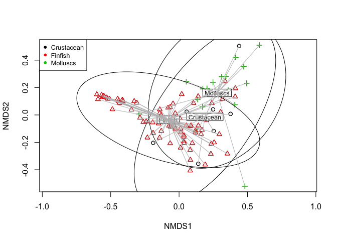 

```r
# calculate Bray-Curtis distance among samples
comm.bc.dist <- vegdist(matrix.min, method = "bray")
hist(comm.bc.dist)
```

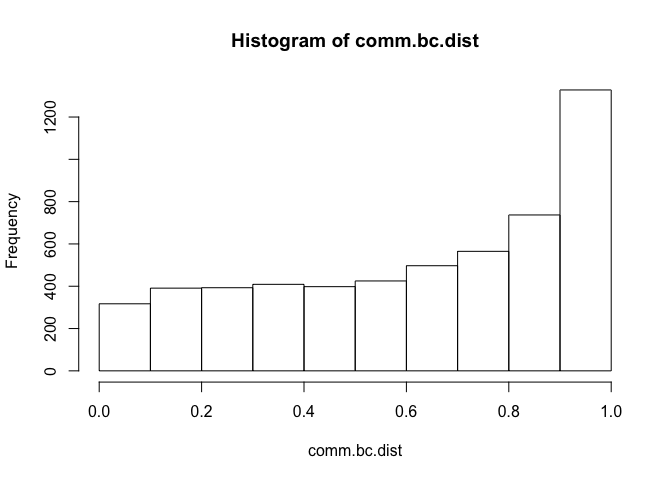 

```r
# cluster communities using average-linkage algorithm
comm.bc.clust <- hclust(comm.bc.dist, method = "average")

# plot cluster diagram
plot(comm.bc.clust, ylab = "Bray-Curtis dissimilarity")
```

 

```r
### Use betadisper to test the significance of the multivariate groups
min.subgroup <- min.env$Subgroup
mod <- betadisper(comm.bc.dist, min.subgroup)


## Perform test
anova(mod)
```

```
## Analysis of Variance Table
## 
## Response: Distances
##            Df Sum Sq  Mean Sq F value  Pr(>F)  
## Groups      2 0.3434 0.171725  3.8359 0.02476 *
## Residuals 102 4.5663 0.044768                  
## ---
## Signif. codes:  0 '***' 0.001 '**' 0.01 '*' 0.05 '.' 0.1 ' ' 1
```

```r
## Permutation test for F
permutest(mod, pairwise = TRUE, permutations = 99)
```

```
## 
## Permutation test for homogeneity of multivariate dispersions
## Permutation: free
## Number of permutations: 99
## 
## Response: Distances
##            Df Sum Sq  Mean Sq      F N.Perm Pr(>F)  
## Groups      2 0.3434 0.171725 3.8359     99   0.07 .
## Residuals 102 4.5663 0.044768                       
## ---
## Signif. codes:  0 '***' 0.001 '**' 0.01 '*' 0.05 '.' 0.1 ' ' 1
## 
## Pairwise comparisons:
## (Observed p-value below diagonal, permuted p-value above diagonal)
##            Crustacean   Finfish Molluscs
## Crustacean            0.3000000     0.67
## Finfish     0.2429916               0.03
## Molluscs    0.6351261 0.0092403
```

```r
## Tukey's Honest Significant Differences
(mod.HSD <- TukeyHSD(mod))
```

```
##   Tukey multiple comparisons of means
##     95% family-wise confidence level
## 
## Fit: aov(formula = distances ~ group, data = df)
## 
## $group
##                            diff        lwr         upr     p adj
## Finfish-Crustacean   0.09551923 -0.1028326  0.29387108 0.4885944
## Molluscs-Crustacean -0.05033462 -0.2744932  0.17382396 0.8547740
## Molluscs-Finfish    -0.14585385 -0.2771350 -0.01457269 0.0255934
```

```r
plot(mod.HSD)
```

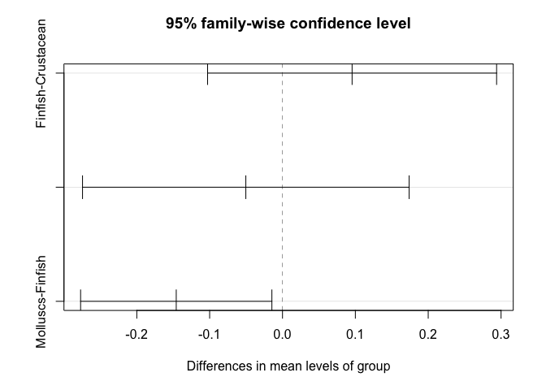 

```r
boxplot(mod)
```

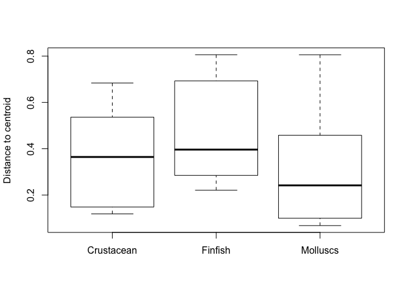 

```r
## Using group centroids
mod3 <- betadisper(comm.bc.dist, min.subgroup, bias.adjust = TRUE)
mod3
```

```
## 
## 	Homogeneity of multivariate dispersions
## 
## Call: betadisper(d = comm.bc.dist, group = min.subgroup,
## bias.adjust = TRUE)
## 
## No. of Positive Eigenvalues: 44
## No. of Negative Eigenvalues: 59
## 
## Average distance to median:
## Crustacean    Finfish   Molluscs 
##     0.3914     0.4607     0.3210 
## 
## Eigenvalues for PCoA axes:
##   PCoA1   PCoA2   PCoA3   PCoA4   PCoA5   PCoA6   PCoA7   PCoA8 
## 13.7292  7.4107  1.8010  0.7325  0.3660  0.2677  0.1783  0.1308
```

```r
permutest(mod3, permutations = 99)
```

```
## 
## Permutation test for homogeneity of multivariate dispersions
## Permutation: free
## Number of permutations: 99
## 
## Response: Distances
##            Df Sum Sq  Mean Sq      F N.Perm Pr(>F)  
## Groups      2 0.2992 0.149621 3.2356     99   0.04 *
## Residuals 102 4.7167 0.046242                       
## ---
## Signif. codes:  0 '***' 0.001 '**' 0.01 '*' 0.05 '.' 0.1 ' ' 1
```

```r
anova(mod3)
```

```
## Analysis of Variance Table
## 
## Response: Distances
##            Df Sum Sq  Mean Sq F value  Pr(>F)  
## Groups      2 0.2992 0.149621  3.2356 0.04341 *
## Residuals 102 4.7167 0.046242                  
## ---
## Signif. codes:  0 '***' 0.001 '**' 0.01 '*' 0.05 '.' 0.1 ' ' 1
```

```r
plot(mod3)
```

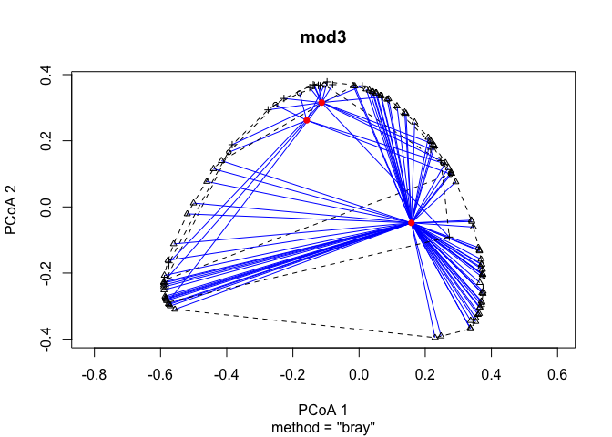 

```r
boxplot(mod3)
```

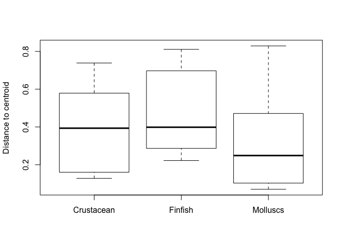 

```r
plot(TukeyHSD(mod3))
```

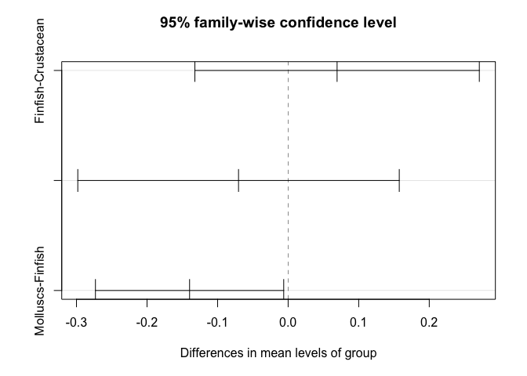 

```r
#### Use adonis to ask whether the group means in multivariate space are different from each other ####
min.subgroup %>% 
  data_frame(subgrp = .) %>% 
  adonis(comm.bc.dist ~ subgrp, data = .)
```

```
## 
## Call:
## adonis(formula = comm.bc.dist ~ subgrp, data = .) 
## 
## Permutation: free
## Number of permutations: 999
## 
## Terms added sequentially (first to last)
## 
##            Df SumsOfSqs MeanSqs F.Model      R2 Pr(>F)    
## subgrp      2    2.1466 1.07329  4.8798 0.08733  0.001 ***
## Residuals 102   22.4343 0.21994         0.91267           
## Total     104   24.5809                 1.00000           
## ---
## Signif. codes:  0 '***' 0.001 '**' 0.01 '*' 0.05 '.' 0.1 ' ' 1
```

#### Result 3.	Few species contain reach DRI targets for multiple nutrients. 

Now let's find out how many species reach more than one mineral RDI target

```r
ntbl.RDI.tot <- minerals %>% 
  group_by(species) %>% 
  summarise(mean.CA = mean(CA_mg, na.rm = TRUE),
            mean.ZN = mean(ZN_mg, na.rm = TRUE), 
            mean.FE = mean(FE_mg, na.rm = TRUE)) %>% 
  mutate(RDI.CA = ifelse(mean.CA > 300, 1, 0)) %>% 
  mutate(RDI.FE = ifelse(mean.FE > 4.5, 1, 0)) %>% 
  mutate(RDI.ZN = ifelse(mean.ZN > 2.75, 1, 0)) %>%
  mutate(RDI.micro.tot = rowSums(.[5:7])) %>% 
  filter(!is.na(RDI.micro.tot)) %>% 
  arrange(., RDI.micro.tot) 

table(ntbl.RDI.tot$RDI.micro.tot)
```

```
## 
##  0  1  2  3 
## 66 29  8  2
```

```r
RDI.freq <- read.csv("/Users/Joey/Documents/Nutrient_Analysis/data/RDI.freq.csv")
RDI.freq <- read.csv("~/Documents/Nutrient_Analysis/data/RDI.freq.csv")
str(RDI.freq)
```

```
## 'data.frame':	8 obs. of  3 variables:
##  $ number_targets: Factor w/ 4 levels "none","one or more",..: 1 2 4 3 1 2 4 3
##  $ target        : Factor w/ 2 levels "10 percent","25 percent": 1 1 1 1 2 2 2 2
##  $ frequency     : int  56 50 41 15 66 40 5 2
```

```r
ggplot(subset(RDI.freq, target == "25 percent"), aes(x = reorder(number_targets, -frequency), y = frequency)) +  geom_bar(stat = "identity", width = 0.5) + xlab("number of 10% RDI targets reached") + theme(axis.text=element_text(size=14),
        axis.title=element_text(size=14,face="bold"))
```

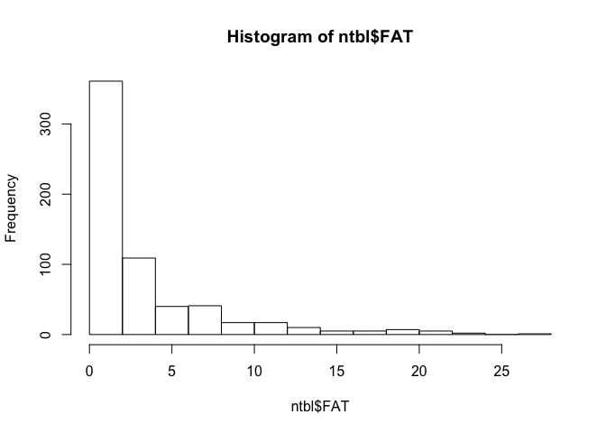 

```r
ggsave("/Users/Joey/Documents/Nutrient_Analysis/figures/RDI.25-targets-barchart.png")
```

```
## Saving 7 x 5 in image
```

```r
#' for the 25% RDI targets, for the 106 species for which we have data for all 3 minerals, 65 spp reach 0 targets, 30 reach 1 target, 9 reach 2 targets, and 2 reach all 3 targets. In other words, 41 reach 1 or more targets, 39 reach two or more targets and 2 reach all three targets.  
#' for the 10% RDI targets,  56 reach 0 targets, 9 reach 1 target, 26 reach 2 targets and 15 reach all 3 targets. Or, in other words, 50 reach one or more targets, 41 reach 2 or more targets, and 15 reach all three targets. 
```

#### How many species reach RDI, for each nutrient invidually?


```r
n.long <- read_csv("/Users/Joey/Documents/Nutrient_Analysis/data/ntbl.long.csv")
```

```
## Warning: 1188 parsing failures.
##  row col   expected actual
## 5941 RDI an integer HG_mcg
## 5942 RDI an integer HG_mcg
## 5943 RDI an integer HG_mcg
## 5944 RDI an integer HG_mcg
## 5945 RDI an integer HG_mcg
## .... ... .......... ......
## .See problems(...) for more details.
```

```r
n.long <- n.long %>% 
  mutate(RDI.25per = (concentration/(RDI/4)),
         RDI.per = (concentration/RDI),
         RDI.20per = (concentration/(RDI/5)),
         RDI.15per = (concentration/(RDI/6)),
         RDI.target = (concentration > (RDI/10)))

#### body.prop: If max size is less than 100g, gets whole, if not, gets part. bones.body is a combo of fish less than 100g and those from Cambodia where study noted that bones were eaten.

n.long <- n.long %>% 
  mutate(body.whole = (max_size < 0.1),
         eat.bones = (Abs_lat == 12.265754 | Abs_lat == 11.066667),
         bones.body = (max_size < 0.1 | Abs_lat == 12.265754 | Abs_lat == 11.066667),
         bones.body.invert = (max_size < 0.1 | Abs_lat == 12.265754 | Abs_lat == 11.066667 | Subgroup != "Finfish"))


### this code gets me the results of what percentage of observations reach 10% RDI for whole body or just part
n.long %>% 
  # filter(nutrient == "CA_mg") %>% 
  select(nutrient, RDI.target, bones.body) %>% 
  table()
```

```
## , , bones.body = FALSE
## 
##          RDI.target
## nutrient  FALSE TRUE
##   CA_mg     131   15
##   DHA_g     105  287
##   EPA_g     238  158
##   FAT       398   75
##   FE_mg     115   23
##   HG_mcg      0    0
##   PROTEIN     0  360
##   ZN_mg     116   26
## 
## , , bones.body = TRUE
## 
##          RDI.target
## nutrient  FALSE TRUE
##   CA_mg       6   20
##   DHA_g      13   17
##   EPA_g      13   18
##   FAT        29    7
##   FE_mg      15   11
##   HG_mcg      0    0
##   PROTEIN     0   31
##   ZN_mg       3   23
```

```r
table <- n.long %>% 
  # filter(nutrient == "CA_mg") %>% 
  select(RDI.target, bones.body) %>% 
  table()

mosaicplot(table)
```

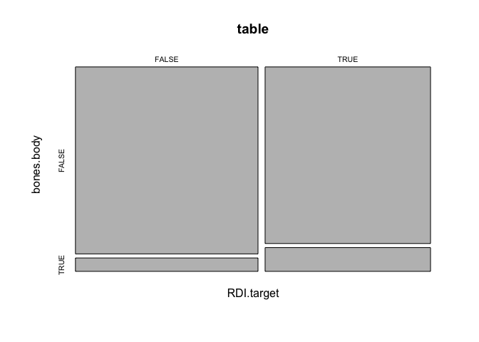 

```r
n.long %>% 
  filter(nutrient == "PROTEIN",
         bones.body.invert == FALSE) %>% 
  select(RDI.target) %>% 
table()
```

```
## .
## TRUE 
##  359
```

```r
n.long %>% 
  filter(!is.na(bones.body)) %>% 
  # arrange(desc(nutrient)) %>% 
  ggplot(., aes(x = nutrient, y = log(RDI.per), fill = bones.body, geom = "boxplot")) +
 geom_boxplot() +
  theme_minimal() +
  geom_hline(yintercept=log(.10)) +
  ylab("percentage of RDI in edible portion, log scale")
```

```
## Warning: Removed 5539 rows containing non-finite values (stat_boxplot).
```

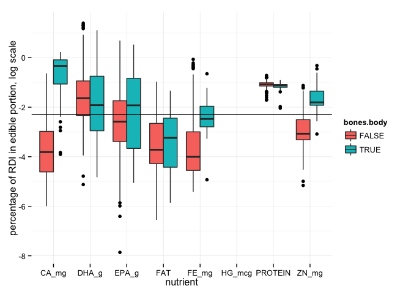 

```r
ggsave("/Users/Joey/Documents/Nutrient_Analysis/figures/bones.body-RDI.png")
```

```
## Saving 7 x 5 in image
```

```
## Warning: Removed 5539 rows containing non-finite values (stat_boxplot).
```


####Result 4. Few species reach DRI for multiple nutrients.

How many species reach RDI for each nutrient?
10% RDI: calcium: 28/99, zinc: 39/101, iron: 23/104, EPA: 117/238, DHA: 168/235, Fat: 47/277, Protein: 251/251  

```r
n.long <- read_csv("/Users/Joey/Documents/Nutrient_Analysis/data/ntbl.long.csv")
```

```
## Warning: 1188 parsing failures.
##  row col   expected actual
## 5941 RDI an integer HG_mcg
## 5942 RDI an integer HG_mcg
## 5943 RDI an integer HG_mcg
## 5944 RDI an integer HG_mcg
## 5945 RDI an integer HG_mcg
## .... ... .......... ......
## .See problems(...) for more details.
```

```r
str(n.long)
```

```
## Classes 'tbl_df', 'tbl' and 'data.frame':	9504 obs. of  16 variables:
##  $ Food.Item.ID    : int  900159 900158 900684 900123 900122 900124 900125 900225 902192 900073 ...
##  $ species         : chr  "Abramis brama" "Abramis brama" "Abramis brama" "Abramis brama" ...
##  $ taxon           : chr  "Carps, barbels and other cyprinids" "Carps, barbels and other cyprinids" "Carps, barbels and other cyprinids" "Carps, barbels and other cyprinids" ...
##  $ max_size        : num  8.9 8.9 8.9 8.9 8.9 ...
##  $ max_length      : num  82 82 82 82 82 82 82 82 82 59 ...
##  $ TL              : num  2.9 2.9 2.9 2.9 2.9 2.9 2.9 2.9 2.9 4 ...
##  $ lwA             : num  0.00871 0.00871 0.00871 0.00871 0.00871 0.00871 0.00871 0.00871 0.00871 0.0055 ...
##  $ lwB             : num  3.14 3.14 3.14 3.14 3.14 3.14 3.14 3.14 3.14 3.19 ...
##  $ Habitat         : chr  "freshwater" "freshwater" "marine" "freshwater" ...
##  $ Subgroup        : chr  "Finfish" "Finfish" "Finfish" "Finfish" ...
##  $ Abs_lat         : num  41.5 41.5 53.9 54.1 54 ...
##  $ Latitude        : num  41.5 41.5 53.9 54.1 54 ...
##  $ max_length_study: num  30 36 NA 33.2 31.6 38 50.5 NA NA 39 ...
##  $ nutrient        : chr  "CA_mg" "CA_mg" "CA_mg" "CA_mg" ...
##  $ concentration   : num  53 52 NA 11.6 20.9 ...
##  $ RDI             : int  1200 1200 1200 1200 1200 1200 1200 1200 1200 1200 ...
##  - attr(*, "problems")=Classes 'tbl_df', 'tbl' and 'data.frame':	1188 obs. of  4 variables:
##   ..$ row     : int  5941 5942 5943 5944 5945 5946 5947 5948 5949 5950 ...
##   ..$ col     : chr  "RDI" "RDI" "RDI" "RDI" ...
##   ..$ expected: chr  "an integer" "an integer" "an integer" "an integer" ...
##   ..$ actual  : chr  "HG_mcg" "HG_mcg" "HG_mcg" "HG_mcg" ...
```

```r
n.long$species <- as.factor(n.long$species)

n.long %>% 
  filter(nutrient == "PROTEIN") %>% 
  filter(!is.na(concentration)) %>%
  distinct(species) %>% 
  count()
```

```
## Source: local data frame [1 x 1]
## 
##       n
##   (int)
## 1   251
```

```r
n.long %>% 
  filter(nutrient == "PROTEIN") %>%
  mutate(RDI.10 = (concentration > (RDI/10))) %>% 
    filter(RDI.10 == "TRUE") %>% 
  distinct(species) %>% 
  count()
```

```
## Source: local data frame [1 x 1]
## 
##       n
##   (int)
## 1   251
```

#### Result 5.	Functional group diversity enhances dietary nutritional diversity and nutritional benefits that human communities may derive from seafood assemblages. (nutrient accumulation curve). 

#####How important is functional diversity?


```r
ntbl.raw <- read.csv("/Users/Joey/Documents/Nutrient_Analysis/data/ntbl2.csv")
inverts.new <- read_csv("/Users/Joey/Documents/Nutrient_Analysis/data/aquatic_inverts_micronutrients.csv")

#create a df that is just the minerals and the species info
ntbl.minerals <- ntbl.raw %>% 
  select(Subgroup, species, CA_mg, FE_mg, ZN_mg)


inverts.minerals <- inverts.new %>% 
  select(Subgroup, species, CA_mg, FE_mg, ZN_mg)
  # filter(Subgroup != "Echinoderm") 

#join the new old ntbl data with the new inverts mineral data
minerals <- bind_rows(ntbl.minerals, inverts.minerals)
```


#### SAC

```r
#step 1. create a matrix with just 0 and 1 for whether a given species reaches RDI
ntbl.RDI <- minerals %>% 
  group_by(species) %>% 
  summarise(mean.CA = mean(CA_mg, na.rm = TRUE),
            mean.ZN = mean(ZN_mg, na.rm = TRUE), 
            mean.FE = mean(FE_mg, na.rm = TRUE)) %>% 
  mutate(RDI.CA = ifelse(mean.CA > 250, 1, 0)) %>% 
  mutate(RDI.FE = ifelse(mean.FE > 4.5, 1, 0)) %>% 
  mutate(RDI.ZN = ifelse(mean.ZN > 2.75, 1, 0)) %>%
  mutate(RDI.micro.tot = rowSums(.[5:7])) %>% 
  filter(!is.na(RDI.micro.tot)) %>% 
  # arrange(., RDI.micro.tot) %>% 
  # select(., c(1,5:7))
  select(., 5:7)

#step 2. create the same matrix, but this time remove the molluscs
ntbl.RDI.noMoll <- minerals %>% 
  group_by(species) %>% 
  filter(Subgroup != "Molluscs") %>% 
  summarise(mean.CA = mean(CA_mg, na.rm = TRUE),
            mean.ZN = mean(ZN_mg, na.rm = TRUE), 
            mean.FE = mean(FE_mg, na.rm = TRUE)) %>% 
  mutate(RDI.CA = ifelse(mean.CA > 250, 1, 0)) %>% 
  mutate(RDI.FE = ifelse(mean.FE > 4.5, 1, 0)) %>% 
  mutate(RDI.ZN = ifelse(mean.ZN > 2.75, 1, 0)) %>%
  mutate(RDI.micro.tot = rowSums(.[5:7])) %>% 
  filter(!is.na(RDI.micro.tot)) %>% 
  # arrange(., RDI.micro.tot) %>% 
  # select(., c(1,5:7))
  select(., 5:7)
```

#####Create the species/nutrient accumulation curve

```r
spa.rand <- specaccum(ntbl.RDI, method = "random")
# png(filename = "sac.full.vs.noMoll.png", width = 6, height = 4, units = 'in', res = 300)
plot(spa.rand, col = "cadetblue", lwd = 2, ci = 1, ci.type = "bar", ci.lty = 3,  ci.col = "cadetblue", ylim = c(0,4), xlim = c(0,80), xlab = "number of fish species in diet", ylab = "number of distinct RDI targets reached", main = "25% RDI targets")
abline( v= 15, col = "cadetblue")
abline( v = 26, col = "pink")
```

 

```r
# dev.off()
# summary(spa.rand)

#Now create the analagous curve for the no mollusc dataset, and plot both curves on the same axis (question to self...is it a fair comparison to compare against the full dataset? should I also remove the same amount of finfish from the full dataset to make a fair comparison?)

# png(filename = "/Users/Joey/Documents/Nutrient_Analysis/figures/sac.full.vs.noMoll.png", width = 10, height = 8, units = 'in', res = 300)
spa.rand.noMoll <- specaccum(ntbl.RDI.noMoll, method = "random")
plot(spa.rand, col = "black", lwd = 4, ci = 1, ci.type = "bar", ci.lty = 3,  ci.col = "blue", ylim = c(0,3.5), xlim = c(0,60), xlab = "number of fish species in diet", ylab = "number of distinct RDI targets reached", main = "micronutrients: 25% RDI targets")
plot(spa.rand.noMoll, add = TRUE, col = "darkgrey", lwd = 4, ci = 1, ci.type = "bar", ci.lty = 3,  ci.col = "darkgrey", ylim = c(0,3.5), xlim = c(0,60), xlab = "number of fish species in diet", ylab = "number of distinct RDI targets reached", main = "25% RDI targets")
# dev.off()
legend('bottomright', legend = c("full", "no molluscs"), lty=c(1,1), lwd=c(4.4), col=c('black', 'darkgrey')) # gives the legend lines the correct color and width))
```

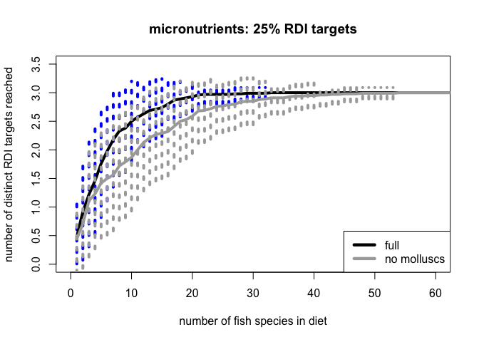 

```r
# summary(spa.rand.noMoll)

## Results from random nutrient accumulation:
## Need to sample from 14 species to get a median of all three minerals, and need to sample from 8 species to get a median of 3 minerals when molluscs are included. 
```


