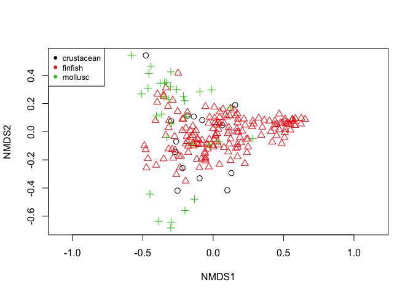
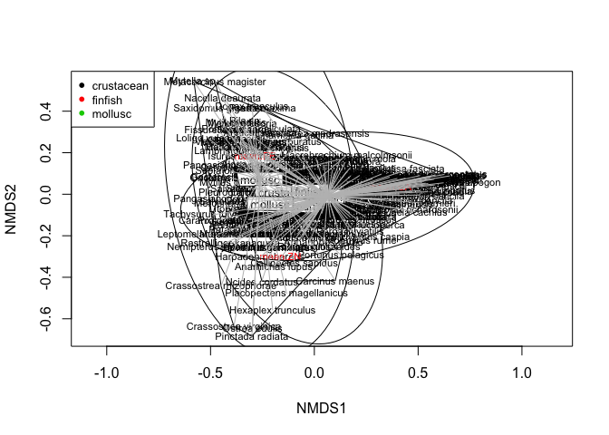
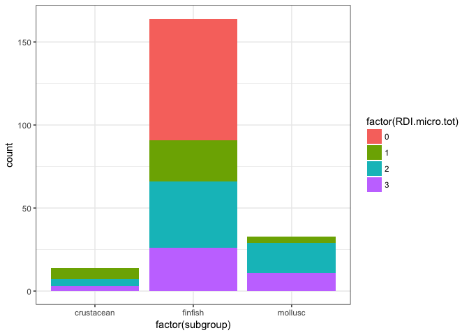
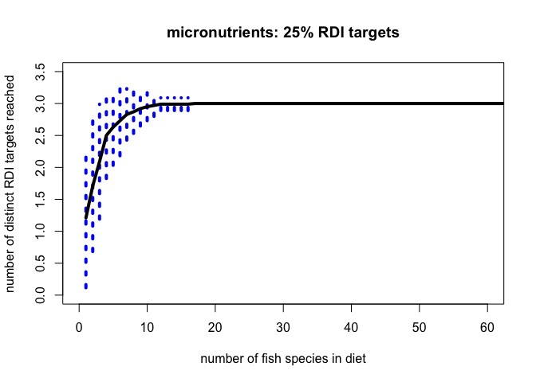
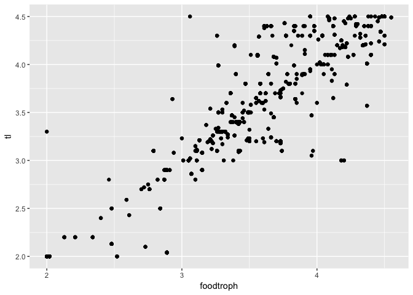
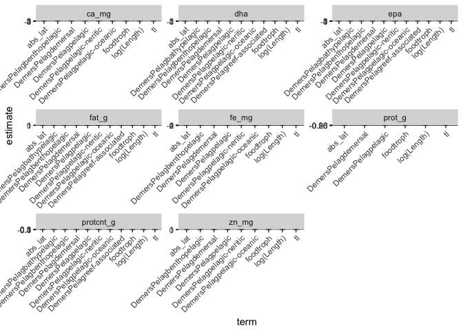
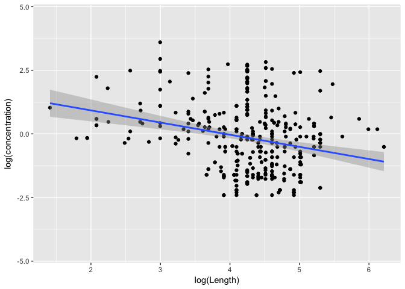

# 08 Seanuts analysis


Load libraries

```r
library(stringr)
library(tidyverse)
library(ggplot2)
library(broom)
library(coefplot)
suppressPackageStartupMessages(library(vegan))
library(purrr)
library(arm)
library(ggvegan)
library(dplyr)
```

Read in data 

```r
a22 <- read_csv("/Users/Joey/Documents/Nutrient_Analysis/data-processed/seanuts_select_8.csv")
```

### data prep

```r
# do a bit of finagling to get it into long form --------------------------

n.long <- a22 %>% 
  dplyr::select(species_name, subgroup, prot_g, protcnt_g, epa, dha, fapun3, ca_mg, fat_g, zn_mg, fe_mg, seanuts_id2, tl, food_item_id_2) %>% 
  gather(key = "nutrient", value = "concentration", prot_g, protcnt_g, epa, dha, fapun3, ca_mg, fat_g, zn_mg, fe_mg) %>% 
  filter(!is.na(concentration)) 
```


```r
# begin plots and analysis ------------------------------------------------

g <- ggplot(n.long, aes(concentration)) + geom_histogram(binwidth = 0.07)
g + facet_grid(nutrient ~ ., scales = "free_y") + theme_bw() + scale_x_log10()
```

<!-- -->


```r
# find the min and max for each nutrient ----------------------------------

n.long %>% 
  group_by(nutrient) %>% 
  distinct(species_name) %>%
  count() %>%
  knitr::kable(align = 'c', format = 'markdown', digits = 2)
```


| nutrient  |  n  |
|:---------:|:---:|
|   ca_mg   | 242 |
|    dha    | 358 |
|    epa    | 358 |
|  fapun3   | 296 |
|   fat_g   | 629 |
|   fe_mg   | 257 |
|  prot_g   | 91  |
| protcnt_g | 318 |
|   zn_mg   | 228 |

#### Multivariate stuff


```r
# onto multivariate stuff -------------------------------------------------

ntbl.minerals <- a22 %>% 
  dplyr::select(subgroup, species_name, ca_mg, fe_mg, zn_mg)


## ok let's just get rid of the one super outlier ca and fe measurement for now

ntbl.minerals$ca_mg[ntbl.minerals$ca_mg == 41206.00000] <- NA
ntbl.minerals$fe_mg[ntbl.minerals$fe_mg > 40939.00000] <- NA

minerals <- ntbl.minerals
minerals$subgroup <- as.factor(minerals$subgroup)
minerals$species_name <- as.factor(minerals$species_name)

minerals <- minerals %>% 
  filter(!is.na(species_name))

min.mat <- minerals %>% 
  mutate(species_name = as.character(species_name)) %>% 
  group_by(subgroup, species_name) %>% 
  summarise(mean.CA = mean(ca_mg*1000, na.rm = TRUE),
            mean.ZN = mean(zn_mg*1000, na.rm = TRUE), 
            mean.FE = mean(fe_mg*1000, na.rm = TRUE)) %>%
  filter(!is.na(mean.CA), !is.na(mean.ZN), !is.na(mean.FE)) %>%
  ungroup() %>% 
  dplyr::distinct(species_name, .keep_all = TRUE)


matrix.min <- data.matrix(min.mat[, 3:5])
rownames(matrix.min) <- min.mat$species_name 

min.taxon <- minerals %>%
  dplyr::distinct(species_name, subgroup)
  

min.env <- dplyr::semi_join(min.mat, min.taxon, by = "species_name") 
min.env <- min.env %>%
  dplyr::filter(!is.na(species_name)) %>% 
  dplyr::distinct(species_name, .keep_all = TRUE) %>% 
  dplyr::select(subgroup, species_name)

#### begin ordination!

ord.mine <- metaMDS(matrix.min, distance="bray", trymax=200)
```

```
## Square root transformation
## Wisconsin double standardization
## Run 0 stress 0.03528895 
## Run 1 stress 0.09484294 
## Run 2 stress 0.03528894 
## ... New best solution
## ... Procrustes: rmse 1.382472e-05  max resid 0.0001104333 
## ... Similar to previous best
## Run 3 stress 0.07074033 
## Run 4 stress 0.03528898 
## ... Procrustes: rmse 2.058439e-05  max resid 0.0002480018 
## ... Similar to previous best
## Run 5 stress 0.03528893 
## ... New best solution
## ... Procrustes: rmse 1.399251e-05  max resid 0.0001195229 
## ... Similar to previous best
## Run 6 stress 0.1053031 
## Run 7 stress 0.08778977 
## Run 8 stress 0.09352833 
## Run 9 stress 0.1185284 
## Run 10 stress 0.07074032 
## Run 11 stress 0.09478456 
## Run 12 stress 0.0875258 
## Run 13 stress 0.06747847 
## Run 14 stress 0.1162689 
## Run 15 stress 0.08787974 
## Run 16 stress 0.1458374 
## Run 17 stress 0.1146004 
## Run 18 stress 0.09352818 
## Run 19 stress 0.4165423 
## Run 20 stress 0.08779254 
## *** Solution reached
```

```r
ord.mine$stress
```

```
## [1] 0.03528893
```

```r
## try plotting the ggvegan way

autoplot(ord.mine)
```

<!-- -->

```r
ord_long <- fortify(ord.mine)

### now join the ordination results with the subgroup data

scaling <- left_join(ord_long, min.env, by = c("Label" = "species_name")) %>% 
  filter(Score == "sites")

ggplot(data = scaling, aes(x = Dim1, y = Dim2, colour = subgroup, label = Label)) + geom_point(size = 4) +
  geom_label()
```

<!-- -->

```r
ggplot(data = scaling, aes(x = Dim1, y = Dim2, colour = subgroup)) + geom_point(size = 4) 
```

<!-- -->

```r
site.scaling <- as.data.frame(ord.mine$points)

# site.scaling$nfi_plot <- row.names(site.scaling)
site.scaling$species_name <- row.names(site.scaling)

# min.env$nfi_plot <- row.names(min.env)
# str(min.env)

new.compiled <- full_join(site.scaling, min.env)


plot(ord.mine, type = "n", cex=1) ### looks like Metacarcinus magister is an outlier here
# points(new.compiled$MDS1, new.compiled$MDS2, pch= as.integer(new.compiled$Subgroup), cex = 1)
points(new.compiled$MDS1, new.compiled$MDS2, col = (as.integer(new.compiled$subgroup)), pch= as.integer(new.compiled$subgroup), cex = 1.2)
legend('topleft', legend = levels(new.compiled$subgroup), col = 1:3, pch = 16, cex = 0.8)
```

<!-- -->

```r
ordiplot(ord.mine, type = "text")
ordiellipse(ord.mine, draw = "polygon", new.compiled$subgroup, conf = 0.95, label = T)
ordihull(ord.mine, draw = "polygon", new.compiled$subgroup, conf = 0.95, label = T)
# ordicluster(ord.mine, draw = "polygon", new.compiled$subgroup, conf = 0.95, label = T)
ordispider(ord.mine, new.compiled$subgroup,col="grey")
legend('topleft', legend = levels(new.compiled$subgroup), col = 1:3, pch = 16, cex = 0.8)
```

<!-- -->

```r
### calculate Bray-Curtis distance among samples

comm.bc.dist <- vegdist(matrix.min, method = "bray")
hist(comm.bc.dist)
```

<!-- -->

```r
# cluster communities using average-linkage algorithm
comm.bc.clust <- hclust(comm.bc.dist, method = "average")

# plot cluster diagram
plot(comm.bc.clust, ylab = "Bray-Curtis dissimilarity")
```

<!-- -->

```r
## Use betadisper to test the significance of the multivariate groups
# min.subgroup <- min.env$subgroup
min.subgroup <- scaling$subgroup
length(min.subgroup)
```

```
## [1] 211
```

```r
mod <- betadisper(comm.bc.dist, min.subgroup)

## Perform test
anova(mod)
```

```
## Analysis of Variance Table
## 
## Response: Distances
##            Df Sum Sq  Mean Sq F value    Pr(>F)    
## Groups      2 0.4974 0.248680  11.668 1.574e-05 ***
## Residuals 208 4.4329 0.021312                      
## ---
## Signif. codes:  0 '***' 0.001 '**' 0.01 '*' 0.05 '.' 0.1 ' ' 1
```

```r
## Permutation test for F
permutest(mod, pairwise = TRUE, permutations = 200)
```

```
## 
## Permutation test for homogeneity of multivariate dispersions
## Permutation: free
## Number of permutations: 200
## 
## Response: Distances
##            Df Sum Sq  Mean Sq      F N.Perm   Pr(>F)   
## Groups      2 0.4974 0.248680 11.668    200 0.004975 **
## Residuals 208 4.4329 0.021312                          
## ---
## Signif. codes:  0 '***' 0.001 '**' 0.01 '*' 0.05 '.' 0.1 ' ' 1
## 
## Pairwise comparisons:
## (Observed p-value below diagonal, permuted p-value above diagonal)
##            crustacean    finfish mollusc
## crustacean            0.00497512  0.4279
## finfish    0.00015724             0.0050
## mollusc    0.43761477 0.00027032
```

```r
#### Use adonis to ask whether the group means in multivariate space are different from each other ####

min.subgroup %>% 
  dplyr::data_frame(subgrp = .) %>%
  filter(!is.na(subgrp)) %>%
  adonis(comm.bc.dist ~ subgrp, data = .)
```

```
## 
## Call:
## adonis(formula = comm.bc.dist ~ subgrp, data = .) 
## 
## Permutation: free
## Number of permutations: 999
## 
## Terms added sequentially (first to last)
## 
##            Df SumsOfSqs MeanSqs F.Model      R2 Pr(>F)   
## subgrp      2     1.839 0.91956  3.9826 0.03688  0.004 **
## Residuals 208    48.027 0.23090         0.96312          
## Total     210    49.866                 1.00000          
## ---
## Signif. codes:  0 '***' 0.001 '**' 0.01 '*' 0.05 '.' 0.1 ' ' 1
```


#### RDI analysis


```r
# RDI analysis ------------------------------------------------------------

aq.wide <- a22 %>% 
  dplyr::select(species_name, subgroup, prot_g, protcnt_g, epa, dha, fapun3, ca_mg, fat_g, zn_mg, fe_mg, seanuts_id2, tl, food_item_id_2)  
  


### how many micronutrient mineral targets does each species reach?
RDI_minerals <- aq.wide %>% 
  group_by(species_name, subgroup) %>% 
  summarise(mean.CA = mean(ca_mg, na.rm = TRUE),
            mean.ZN = mean(zn_mg, na.rm = TRUE), 
            mean.FE = mean(fe_mg, na.rm = TRUE)) %>% 
  mutate(RDI.CA = ifelse(mean.CA > 120, 1, 0)) %>% 
  mutate(RDI.FE = ifelse(mean.FE > 1.8, 1, 0)) %>% 
  mutate(RDI.ZN = ifelse(mean.ZN > 1.1, 1, 0)) %>% 
  ungroup() %>% 
  mutate(RDI.micro.tot = rowSums(.[6:8])) %>% 
  filter(!is.na(RDI.micro.tot)) %>% 
  arrange(., RDI.micro.tot)


RDI_minerals %>% 
  # group_by(species) %>% 
  # mutate(meanRDI = mean(RDI.micro.tot)) %>%
  group_by(subgroup, RDI.micro.tot) %>% 
  summarise(n = n()) %>% 
  mutate(cum.RDI = cumsum(n)) %>%
  ggplot(., aes(x = RDI.micro.tot, y = cum.RDI)) + geom_bar(stat = "identity") + facet_wrap(~ subgroup, scales = "free_y") 
```

<!-- -->

```r
qplot(factor(subgroup), data = RDI_minerals, geom = "bar", fill = factor(RDI.micro.tot)) + theme_bw()
```

<!-- -->

```r
ggplot(RDI_minerals, aes(RDI.micro.tot)) + geom_bar(binwidth = .5) + facet_wrap(~ subgroup, scales = "free_y") 
```

<!-- -->

```r
RDI_minerals %>% 
  dplyr::filter(subgroup == "Molluscs") %>% 
  # distinct(species) %>% 
  dplyr::filter(RDI.micro.tot > 0) %>% 
  dplyr::distinct(species_name) %>% 
  count()
```

```
## # A tibble: 1 × 1
##       n
##   <int>
## 1     0
```

```r
#### species accumulation curves

RDIS <- dplyr::select(RDI_minerals, 6:8)

spa.rand <- specaccum(RDIS, method = "random")
# png(filename = "sac.full.vs.noMoll.png", width = 6, height = 4, units = 'in', res = 300)
spa.rand$sites
```

```
##   [1]   1   2   3   4   5   6   7   8   9  10  11  12  13  14  15  16  17
##  [18]  18  19  20  21  22  23  24  25  26  27  28  29  30  31  32  33  34
##  [35]  35  36  37  38  39  40  41  42  43  44  45  46  47  48  49  50  51
##  [52]  52  53  54  55  56  57  58  59  60  61  62  63  64  65  66  67  68
##  [69]  69  70  71  72  73  74  75  76  77  78  79  80  81  82  83  84  85
##  [86]  86  87  88  89  90  91  92  93  94  95  96  97  98  99 100 101 102
## [103] 103 104 105 106 107 108 109 110 111 112 113 114 115 116 117 118 119
## [120] 120 121 122 123 124 125 126 127 128 129 130 131 132 133 134 135 136
## [137] 137 138 139 140 141 142 143 144 145 146 147 148 149 150 151 152 153
## [154] 154 155 156 157 158 159 160 161 162 163 164 165 166 167 168 169 170
## [171] 171 172 173 174 175 176 177 178 179 180 181 182 183 184 185 186 187
## [188] 188 189 190 191 192 193 194 195 196 197 198 199 200 201 202 203 204
## [205] 205 206 207 208 209 210 211
```

```r
plot(spa.rand, col = "cadetblue", lwd = 2, ci = 1, ci.type = "bar", ci.lty = 3,  ci.col = "cadetblue", ylim = c(0,4), xlim = c(0,80), xlab = "number of fish species in diet", ylab = "number of distinct RDI targets reached", main = "25% RDI targets")
abline( v= 15, col = "cadetblue")
abline( v = 26, col = "pink")
```

<!-- -->

```r
# dev.off()


RDI_minerals %>% 
  filter(subgroup == "finfish") %>% 
  dplyr::select(6:8) %>% 
specaccum(., method = "random") %>%
plot(., col = "black", lwd = 4, ci = 1, ci.type = "bar", ci.lty = 3,  ci.col = "blue", ylim = c(0,3.5), xlim = c(0,60), xlab = "number of fish species in diet", ylab = "number of distinct RDI targets reached", main = "micronutrients: 25% RDI targets")
```

<!-- -->

```r
spec <- RDI_minerals %>% 
  filter(subgroup == "finfish") %>% 
  dplyr::select(6:8) %>% 
  specaccum(., method = "random")

str(spec)
```

```
## List of 6
##  $ call    : language specaccum(comm = ., method = "random")
##  $ method  : chr "random"
##  $ sites   : int [1:164] 1 2 3 4 5 6 7 8 9 10 ...
##  $ richness: num [1:164] 1.2 1.78 2.09 2.31 2.57 2.72 2.83 2.87 2.92 2.94 ...
##  $ sd      : num [1:164] 1.198 1.16 1.036 0.895 0.714 ...
##  $ perm    : num [1:164, 1:100] 2 2 2 2 3 3 3 3 3 3 ...
##  - attr(*, "control")=List of 12
##   ..$ within     :List of 6
##   .. ..$ type    : chr "free"
##   .. ..$ constant: logi FALSE
##   .. ..$ mirror  : logi FALSE
##   .. ..$ ncol    : NULL
##   .. ..$ nrow    : NULL
##   .. ..$ call    : language Within()
##   .. ..- attr(*, "class")= chr "Within"
##   ..$ plots      :List of 7
##   .. ..$ strata    : NULL
##   .. ..$ type      : chr "none"
##   .. ..$ mirror    : logi FALSE
##   .. ..$ ncol      : NULL
##   .. ..$ nrow      : NULL
##   .. ..$ plots.name: chr "NULL"
##   .. ..$ call      : language Plots()
##   .. ..- attr(*, "class")= chr "Plots"
##   ..$ blocks     : NULL
##   ..$ nperm      : num 100
##   ..$ complete   : logi FALSE
##   ..$ maxperm    : num 9999
##   ..$ minperm    : num 5040
##   ..$ all.perms  : NULL
##   ..$ make       : logi TRUE
##   ..$ observed   : logi FALSE
##   ..$ blocks.name: chr "NULL"
##   ..$ call       : language how(nperm = 100)
##   ..- attr(*, "class")= chr "how"
##  - attr(*, "class")= chr "specaccum"
```

```r
spec$richness
```

```
##   [1] 1.20 1.78 2.09 2.31 2.57 2.72 2.83 2.87 2.92 2.94 2.95 2.95 2.96 2.97
##  [15] 2.98 2.99 2.99 2.99 2.99 2.99 3.00 3.00 3.00 3.00 3.00 3.00 3.00 3.00
##  [29] 3.00 3.00 3.00 3.00 3.00 3.00 3.00 3.00 3.00 3.00 3.00 3.00 3.00 3.00
##  [43] 3.00 3.00 3.00 3.00 3.00 3.00 3.00 3.00 3.00 3.00 3.00 3.00 3.00 3.00
##  [57] 3.00 3.00 3.00 3.00 3.00 3.00 3.00 3.00 3.00 3.00 3.00 3.00 3.00 3.00
##  [71] 3.00 3.00 3.00 3.00 3.00 3.00 3.00 3.00 3.00 3.00 3.00 3.00 3.00 3.00
##  [85] 3.00 3.00 3.00 3.00 3.00 3.00 3.00 3.00 3.00 3.00 3.00 3.00 3.00 3.00
##  [99] 3.00 3.00 3.00 3.00 3.00 3.00 3.00 3.00 3.00 3.00 3.00 3.00 3.00 3.00
## [113] 3.00 3.00 3.00 3.00 3.00 3.00 3.00 3.00 3.00 3.00 3.00 3.00 3.00 3.00
## [127] 3.00 3.00 3.00 3.00 3.00 3.00 3.00 3.00 3.00 3.00 3.00 3.00 3.00 3.00
## [141] 3.00 3.00 3.00 3.00 3.00 3.00 3.00 3.00 3.00 3.00 3.00 3.00 3.00 3.00
## [155] 3.00 3.00 3.00 3.00 3.00 3.00 3.00 3.00 3.00 3.00
```

```r
sum(spec$richness < 2)
```

```
## [1] 2
```

```r
#### now the accumulation curves for the all the nutrients

ntbl.RDI.all <- aq.wide %>% 
  group_by(species_name, subgroup) %>% 
  summarise(mean.CA = mean(ca_mg, na.rm = TRUE),
            mean.ZN = mean(zn_mg, na.rm = TRUE), 
            mean.FE = mean(fe_mg, na.rm = TRUE),
            mean.EPA = mean(epa, na.rm = TRUE),
            mean.DHA = mean(dha, na.rm = TRUE)) %>% 
  mutate(RDI.CA = ifelse(mean.CA > 300, 1, 0)) %>% 
  mutate(RDI.FE = ifelse(mean.FE > 4.5, 1, 0)) %>% 
  mutate(RDI.ZN = ifelse(mean.ZN > 2.75, 1, 0)) %>%
  mutate(RDI.EPA = ifelse(mean.EPA > 0.25, 1, 0)) %>% 
  mutate(RDI.DHA = ifelse(mean.DHA > 0.25, 1, 0)) %>% 
  ungroup() %>% 
  mutate(RDI.micro.tot = rowSums(.[8:12])) %>% 
  filter(!is.na(RDI.micro.tot)) 

### create spa curves for each of the subgroups individually
subgroup_spa <- ntbl.RDI.all %>%
  dplyr::select(-RDI.micro.tot) %>%
  dplyr::select(-contains("mean")) %>% 
  dplyr::select(-species_name) %>% 
  split( .$subgroup) %>% 
  map(.f = `[`, c("RDI.CA", "RDI.FE", "RDI.ZN", "RDI.EPA", "RDI.DHA")) %>%
  map(.f = specaccum, method = "random")


#### how many species do you need to sample before reaching 3 RDI targets?
subgroup_spa %>% 
  map(.f = `[`, "richness") %>% 
  unlist() %>% 
  as.data.frame() %>% 
  knitr::kable()
```

                           .
---------------------  -----
crustacean.richness1    2.23
crustacean.richness2    3.40
crustacean.richness3    4.01
crustacean.richness4    4.34
crustacean.richness5    4.69
crustacean.richness6    4.87
crustacean.richness7    5.00
finfish.richness1       1.27
finfish.richness2       1.94
finfish.richness3       2.57
finfish.richness4       2.99
finfish.richness5       3.24
finfish.richness6       3.50
finfish.richness7       3.68
finfish.richness8       3.80
finfish.richness9       4.01
finfish.richness10      4.13
finfish.richness11      4.21
finfish.richness12      4.28
finfish.richness13      4.41
finfish.richness14      4.49
finfish.richness15      4.51
finfish.richness16      4.61
finfish.richness17      4.65
finfish.richness18      4.70
finfish.richness19      4.76
finfish.richness20      4.78
finfish.richness21      4.82
finfish.richness22      4.85
finfish.richness23      4.85
finfish.richness24      4.87
finfish.richness25      4.88
finfish.richness26      4.90
finfish.richness27      4.90
finfish.richness28      4.93
finfish.richness29      4.97
finfish.richness30      4.97
finfish.richness31      4.98
finfish.richness32      4.99
finfish.richness33      4.99
finfish.richness34      4.99
finfish.richness35      4.99
finfish.richness36      4.99
finfish.richness37      5.00
finfish.richness38      5.00
finfish.richness39      5.00
finfish.richness40      5.00
finfish.richness41      5.00
finfish.richness42      5.00
finfish.richness43      5.00
finfish.richness44      5.00
finfish.richness45      5.00
finfish.richness46      5.00
finfish.richness47      5.00
finfish.richness48      5.00
finfish.richness49      5.00
finfish.richness50      5.00
finfish.richness51      5.00
finfish.richness52      5.00
finfish.richness53      5.00
finfish.richness54      5.00
finfish.richness55      5.00
finfish.richness56      5.00
finfish.richness57      5.00
finfish.richness58      5.00
finfish.richness59      5.00
finfish.richness60      5.00
finfish.richness61      5.00
finfish.richness62      5.00
finfish.richness63      5.00
finfish.richness64      5.00
finfish.richness65      5.00
finfish.richness66      5.00
finfish.richness67      5.00
finfish.richness68      5.00
finfish.richness69      5.00
finfish.richness70      5.00
finfish.richness71      5.00
finfish.richness72      5.00
finfish.richness73      5.00
finfish.richness74      5.00
finfish.richness75      5.00
finfish.richness76      5.00
finfish.richness77      5.00
finfish.richness78      5.00
finfish.richness79      5.00
finfish.richness80      5.00
finfish.richness81      5.00
finfish.richness82      5.00
finfish.richness83      5.00
finfish.richness84      5.00
finfish.richness85      5.00
finfish.richness86      5.00
finfish.richness87      5.00
mollusc.richness1       2.04
mollusc.richness2       3.09
mollusc.richness3       3.86
mollusc.richness4       4.33
mollusc.richness5       4.68
mollusc.richness6       4.88
mollusc.richness7       4.97
mollusc.richness8       4.99
mollusc.richness9       4.99
mollusc.richness10      5.00
mollusc.richness11      5.00
mollusc.richness12      5.00
mollusc.richness13      5.00
mollusc.richness14      5.00

### Traits section 


```r
# traits section ----------------------------------------------------------

# seanuts_ecology <- read_csv("data-processed/seanuts_ecology.csv")
seanuts_ecology <- read_csv("/Users/Joey/Documents/Nutrient_Analysis/data-processed/seanuts_select_8.csv")

## ok let's just get rid of the one super outlier ca and fe measurement for now

seanuts_ecology$ca_mg[seanuts_ecology$ca_mg == 41206.00000] <- NA
seanuts_ecology$fe_mg[seanuts_ecology$fe_mg > 40939.00000] <- NA


names_seanuts <- names(seanuts_ecology)
str_subset(names_seanuts, "length")
```

```
## [1] "length_from_study" "length_source"
```

```r
str_subset(names_seanuts, "Length")
```

```
## [1] "Length"          "CommonLength"    "CommonLengthF"   "CommonLengthRef"
## [5] "LengthFemale"    "MaxLengthRef"
```

```r
str_subset(names_seanuts, "sl")
```

```
## [1] "slmax"        "slmax_nov28"  "slmax_source"
```

```r
str_subset(names_seanuts, "BrackishWater")
```

```
## [1] "BrackishWater"
```

```r
names(seanuts_ecology)
```

```
##  [1] "ref_info"                                       
##  [2] "Bibliography"                                   
##  [3] "biblioid2"                                      
##  [4] "seanuts_id2"                                    
##  [5] "food_item_id_2"                                 
##  [6] "food_name_clean"                                
##  [7] "database"                                       
##  [8] "nutrient_ref"                                   
##  [9] "species_name"                                   
## [10] "genus_species"                                  
## [11] "subgroup"                                       
## [12] "prot_g"                                         
## [13] "protcnt_g"                                      
## [14] "protein_g"                                      
## [15] "fat_g"                                          
## [16] "fapun3"                                         
## [17] "fapun_all_g"                                    
## [18] "epa"                                            
## [19] "dha"                                            
## [20] "ca_mg"                                          
## [21] "zn_mg"                                          
## [22] "fe_mg"                                          
## [23] "tl"                                             
## [24] "length_from_study"                              
## [25] "length_source"                                  
## [26] "abs_lat"                                        
## [27] "latitude"                                       
## [28] "slmax"                                          
## [29] "slmax_nov28"                                    
## [30] "slmax_source"                                   
## [31] "lwa"                                            
## [32] "lwb"                                            
## [33] "country_region"                                 
## [34] "isscaap_cat"                                    
## [35] "isscaap"                                        
## [36] "season"                                         
## [37] "asfis_scientific_name_fishbase_swap_in_progress"
## [38] "season.x"                                       
## [39] "season.y"                                       
## [40] "Herbivory2"                                     
## [41] "HerbivoryRef"                                   
## [42] "FeedingType"                                    
## [43] "FeedingTypeRef"                                 
## [44] "DietTroph"                                      
## [45] "DietSeTroph"                                    
## [46] "FoodTroph"                                      
## [47] "FoodSeTroph"                                    
## [48] "IsoTroph"                                       
## [49] "IsoseTroph"                                     
## [50] "EcoTroph"                                       
## [51] "EcoseTroph"                                     
## [52] "StockCode"                                      
## [53] "SpecCode.x"                                     
## [54] "SpecCode.y"                                     
## [55] "Genus"                                          
## [56] "Species"                                        
## [57] "FBname"                                         
## [58] "Subfamily"                                      
## [59] "DemersPelag"                                    
## [60] "AnaCat"                                         
## [61] "DepthRangeShallow"                              
## [62] "DepthRangeDeep"                                 
## [63] "LTypeMaxM"                                      
## [64] "LTypeMaxF"                                      
## [65] "LTypeComM"                                      
## [66] "LTypeComF"                                      
## [67] "Length"                                         
## [68] "CommonLength"                                   
## [69] "CommonLengthF"                                  
## [70] "CommonLengthRef"                                
## [71] "Weight"                                         
## [72] "WeightFemale"                                   
## [73] "MaxWeightRef"                                   
## [74] "Sp2000_HierarchyCode"                           
## [75] "reference"                                      
## [76] "Fresh"                                          
## [77] "Marine"                                         
## [78] "BrackishWater"                                  
## [79] "Brack"                                          
## [80] "LengthFemale"                                   
## [81] "MaxLengthRef"                                   
## [82] "notes"                                          
## [83] "weight_from_study"                              
## [84] "Mar_fresh"                                      
## [85] "wild_farmed"                                    
## [86] "body_parts_included_excluded"                   
## [87] "included_excluded"                              
## [88] "X20"                                            
## [89] "vit_a_IU"                                       
## [90] "K_mg"                                           
## [91] "mg_mg"                                          
## [92] "X32"
```

```r
sum(!is.na(seanuts_ecology$Length))
```

```
## [1] 2332
```

```r
sum(!is.na(seanuts_ecology$slmax))
```

```
## [1] 1883
```

```r
sum(!is.na(seanuts_ecology$length_from_study))
```

```
## [1] 331
```

```r
seanuts_ecology <- seanuts_ecology %>% 
  rename(foodtroph = FoodTroph)

n.long <- seanuts_ecology %>% 
  dplyr::select(species_name, subgroup, prot_g, protcnt_g, epa, dha, ca_mg, fat_g,
                zn_mg, fe_mg, slmax, seanuts_id2, tl, food_item_id_2,
                Length, abs_lat, Herbivory2, DemersPelag, contains("Brack"), Marine, Fresh, contains("troph"), contains("length"), contains("weight")) %>% 
  gather(key = "nutrient", value = "concentration", prot_g, protcnt_g, epa, dha, ca_mg, fat_g, zn_mg, fe_mg) %>% 
  filter(!is.na(concentration)) 


sum(!is.na(n.long$foodtroph))
```

```
## [1] 3785
```

```r
sum(!is.na(n.long$tl))
```

```
## [1] 4254
```

```r
ggplot(aes(x = foodtroph, y = tl), data = n.long) + geom_point()
```

<!-- -->


```r
n.long %>% 
  # filter(nutrient == "CA_mg") %>% 
  # mutate_each_(funs(scale), vars = c("max_length", "TL", "Abs_lat")) %>% 
  group_by(nutrient) %>% 
  do(fit = tidy(lm(log(.$concentration) ~ log(Length) + DemersPelag + tl + abs_lat + foodtroph, data = .), conf.int = TRUE)) %>% 
  unnest(fit) %>% 
  filter(term != "(Intercept)") %>% 
  ggplot(aes(x = term, y = estimate)) + geom_point(size = 2) +
  geom_errorbar(aes(ymin = conf.low, ymax = conf.high), width = 0.1) +
  facet_wrap( ~ nutrient, scales = "free") + geom_hline(yintercept = 0) + 
  theme(axis.text.x = element_text(angle = 45, hjust = 1))
```

<!-- -->


```r
seanuts_ecology %>% 
  # mutate_each_(funs(scale), vars = c("Length", "tl", "abs_lat")) %>% 
  do(fit = tidy(lm(log(prot_g) ~ log(Length) + tl + abs_lat, data = .), conf.int = TRUE)) %>% 
  unnest(fit) %>% 
  filter(term != "(Intercept)") %>%
  ggplot(aes(x = term, y = estimate)) + geom_point(size = 2) +
  geom_errorbar(aes(ymin = conf.low, ymax = conf.high), width = 0.1) +
  geom_hline(yintercept = 0) + 
  theme(axis.text.x = element_text(angle = 45, hjust = 1))
```

<!-- -->


```r
n.long %>% 
  filter(nutrient == "epa") %>% 
  lm(log(concentration) ~ log(Length) + abs_lat, data = .) %>% 
  summary
```

```
## 
## Call:
## lm(formula = log(concentration) ~ log(Length) + abs_lat, data = .)
## 
## Residuals:
##     Min      1Q  Median      3Q     Max 
## -5.7269 -0.9635 -0.1787  0.5914  9.5729 
## 
## Coefficients:
##              Estimate Std. Error t value Pr(>|t|)    
## (Intercept) -1.134894   0.479929  -2.365 0.018344 *  
## log(Length) -0.404086   0.112121  -3.604 0.000338 ***
## abs_lat      0.012872   0.004332   2.971 0.003078 ** 
## ---
## Signif. codes:  0 '***' 0.001 '**' 0.01 '*' 0.05 '.' 0.1 ' ' 1
## 
## Residual standard error: 1.776 on 634 degrees of freedom
##   (376 observations deleted due to missingness)
## Multiple R-squared:  0.02806,	Adjusted R-squared:  0.025 
## F-statistic: 9.153 on 2 and 634 DF,  p-value: 0.0001206
```


```r
n.long %>% 
  filter(nutrient == "zn_mg") %>% 
  lm(log(concentration) ~ log(Length) + abs_lat + foodtroph, data = .) %>% 
  summary
```

```
## 
## Call:
## lm(formula = log(concentration) ~ log(Length) + abs_lat + foodtroph, 
##     data = .)
## 
## Residuals:
##     Min      1Q  Median      3Q     Max 
## -2.5280 -0.4184 -0.1099  0.3940  2.5523 
## 
## Coefficients:
##              Estimate Std. Error t value Pr(>|t|)    
## (Intercept)  1.450042   0.417397   3.474 0.000631 ***
## log(Length) -0.141694   0.093579  -1.514 0.131596    
## abs_lat     -0.035260   0.003835  -9.195  < 2e-16 ***
## foodtroph    0.097116   0.097404   0.997 0.319971    
## ---
## Signif. codes:  0 '***' 0.001 '**' 0.01 '*' 0.05 '.' 0.1 ' ' 1
## 
## Residual standard error: 0.7515 on 196 degrees of freedom
##   (351 observations deleted due to missingness)
## Multiple R-squared:  0.3339,	Adjusted R-squared:  0.3237 
## F-statistic: 32.75 on 3 and 196 DF,  p-value: < 2.2e-16
```

```r
n.long %>% 
  filter(nutrient == "fe_mg") %>% 
  ggplot(aes(x = log(Length), y = log(concentration))) + geom_point() +
  geom_smooth(method = "lm")
```

<!-- -->


