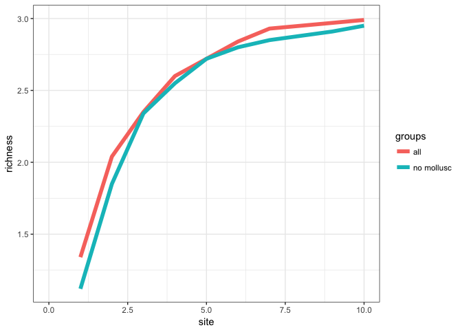

# nutrient analysis figure set


#### Dataset summaries


```r
trait_data <- read_csv("/Users/Joey/Documents/Nutrient_Analysis/data-processed/n.long_lat2.csv")
```

```
## Parsed with column specification:
## cols(
##   .default = col_character(),
##   seanuts_id2 = col_integer(),
##   concentration = col_double(),
##   abs_lat = col_double(),
##   latitude.x = col_double(),
##   bulk_mean_length = col_double(),
##   bulk_max_length = col_double(),
##   bulk_trophic_level = col_double(),
##   latitude.y = col_double(),
##   longitude = col_double(),
##   weight_from_study_g = col_double(),
##   length_from_study = col_double(),
##   X13 = col_integer(),
##   abs_lat2 = col_double()
## )
```

```
## See spec(...) for full column specifications.
```

```
## Warning: 91 parsing failures.
##  row col               expected   actual
## 2417 X13 no trailing characters  to 1988
## 2420 X13 no trailing characters  to 1988
## 2575 X13 no trailing characters  to 1988
## 3158 X13 no trailing characters  to 1988
## 3161 X13 no trailing characters  to 1988
## .... ... ...................... ........
## See problems(...) for more details.
```


```r
g <- ggplot(trait_data, aes(concentration)) + geom_histogram(binwidth = 0.07)
g + facet_grid(nutrient ~ ., scales = "free_y") + theme_bw() + scale_x_log10()
```

<!-- -->

For how many species do we have nutrient data?

```r
trait_data %>% 
  group_by(nutrient) %>% 
  distinct(species_name) %>%
  count() %>%
  knitr::kable(align = 'c', format = 'markdown', digits = 2)
```


|  nutrient   |  n  |
|:-----------:|:---:|
|    ca_mg    | 242 |
|     dha     | 358 |
|     epa     | 358 |
| fapun_all_g | 294 |
|   fapun3    | 296 |
|    fat_g    | 629 |
|    fe_mg    | 257 |
|   prot_g    | 91  |
|  protcnt_g  | 318 |
|  protein_g  | 106 |
|    zn_mg    | 228 |


### Trait analysis


```r
mod_all <- trait_data %>% 
  filter(concentration > 0) %>% 
  mutate(anacat = ifelse(subgroup != "finfish", "non-migratory", anacat)) %>% 
  filter(!is.na(bulk_max_length), !is.na(bulk_trophic_level), !is.na(feeding_level), !is.na(feeding_mode), !is.na(abs_lat)) %>% 
  mutate(log_length = log(bulk_max_length),
         log_concentration = log(concentration)) %>% 
  filter(!grepl("^Mohanty, B. P.,", ref_info))
```

##### Scatterplots


```r
trait_data %>% 
  # filter(nutrient == "ca_mg") %>% 
  filter(concentration > 0) %>%
  filter(nutrient %in% c("fe_mg", "ca_mg", "zn_mg")) %>% 
  group_by(nutrient) %>% 
ggplot(aes(y = log(concentration), x = log(bulk_mean_length)), data = .) + geom_point(size = 3, alpha = 0.5, color = "blue") + geom_smooth(method = "lm") +
  theme_bw() + ylab("ln nutrient concentration") + xlab("ln body length") + facet_wrap( ~ nutrient, scales = "free")
```

<!-- -->


```r
trait_data %>% 
  # filter(nutrient == "ca_mg") %>% 
  filter(concentration > 0) %>%
  filter(nutrient %in% c("fe_mg", "ca_mg", "zn_mg")) %>% 
  group_by(nutrient) %>% 
  ggplot(aes(y = log(concentration), x = abs_lat), data = .) + geom_point(size = 3, alpha = 0.5, color = "blue") + geom_smooth(method = "lm") +
  theme_bw() + ylab("ln nutrient concentration") + xlab("absolute latitude") + facet_wrap( ~ nutrient, scales = "free")
```

<!-- -->


```r
trait_data %>% 
  # filter(nutrient == "ca_mg") %>% 
  filter(concentration > 0) %>%
  filter(nutrient %in% c("fe_mg", "ca_mg", "zn_mg")) %>% 
  group_by(nutrient) %>% 
  ggplot(aes(y = log(bulk_mean_length), x = abs_lat), data = .) + geom_point(size = 3, alpha = 0.5, color = "blue") + geom_smooth(method = "lm") +
  theme_bw() + ylab("ln body length") + xlab("absolute latitude") + facet_wrap( ~ nutrient, scales = "free")
```

<!-- -->


```r
## prep the data
mod_all <- trait_data %>% 
  filter(concentration > 0) %>% 
  mutate(anacat = ifelse(subgroup != "finfish", "non-migratory", anacat)) %>% 
  filter(!is.na(bulk_max_length), !is.na(bulk_trophic_level), !is.na(feeding_level), !is.na(feeding_mode), !is.na(abs_lat)) %>% 
  mutate(log_length = log(bulk_max_length),
         log_concentration = log(concentration)) %>% 
  filter(!grepl("^Mohanty, B. P.,", ref_info))
```


Iron


Zinc


Calcium

```
## 
## Call:
## lm(formula = z.log_concentration ~ z.log_length + z.bulk_trophic_level + 
##     feeding_level + z.abs_lat, data = mod)
## 
## Residuals:
##     Min      1Q  Median      3Q     Max 
## -0.9879 -0.2434 -0.0274  0.2168  1.0969 
## 
## Coefficients:
##                                                         Estimate
## (Intercept)                                             0.032637
## z.log_length                                           -0.215447
## z.bulk_trophic_level                                    0.000988
## feeding_levelmainly plants/detritus (troph. 2-2.19)    -0.246541
## feeding_levelplants/detritus+animals (troph. 2.2-2.79) -0.113347
## z.abs_lat                                              -0.609922
##                                                        Std. Error t value
## (Intercept)                                              0.030352   1.075
## z.log_length                                             0.060181  -3.580
## z.bulk_trophic_level                                     0.079944   0.012
## feeding_levelmainly plants/detritus (troph. 2-2.19)      0.121574  -2.028
## feeding_levelplants/detritus+animals (troph. 2.2-2.79)   0.124915  -0.907
## z.abs_lat                                                0.058871 -10.360
##                                                        Pr(>|t|)    
## (Intercept)                                             0.28339    
## z.log_length                                            0.00042 ***
## z.bulk_trophic_level                                    0.99015    
## feeding_levelmainly plants/detritus (troph. 2-2.19)     0.04373 *  
## feeding_levelplants/detritus+animals (troph. 2.2-2.79)  0.36516    
## z.abs_lat                                               < 2e-16 ***
## ---
## Signif. codes:  0 '***' 0.001 '**' 0.01 '*' 0.05 '.' 0.1 ' ' 1
## 
## Residual standard error: 0.3856 on 228 degrees of freedom
## Multiple R-squared:  0.4181,	Adjusted R-squared:  0.4054 
## F-statistic: 32.77 on 5 and 228 DF,  p-value: < 2.2e-16
```

all microelements 

```
##  [1] "body size (log length)"      "fractional trophic position"
##  [3] "plankton feeder"             "herbivore grazer"           
##  [5] "active predator"             "selective filter feeder"    
##  [7] "variable feeding mode"       "absolute latitude"          
##  [9] "herbivore"                   "omnivore"
```

<!-- -->


