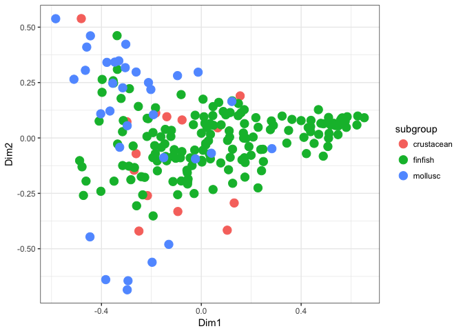
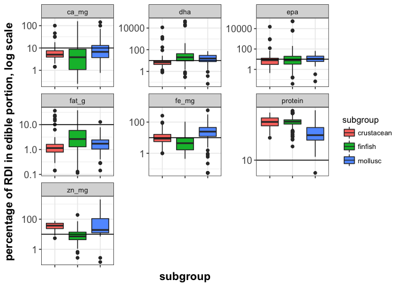
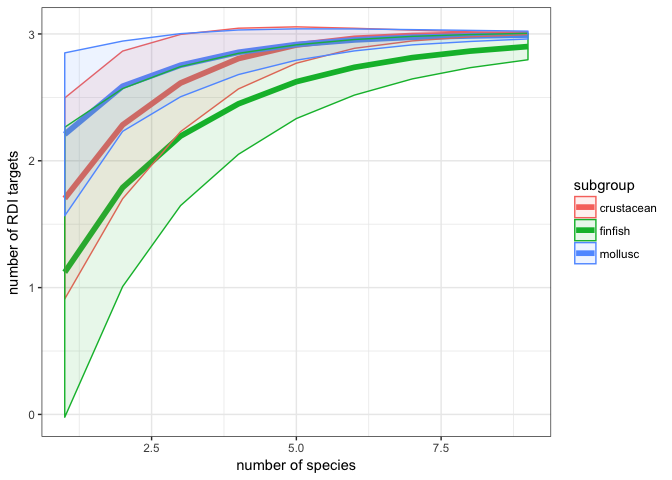
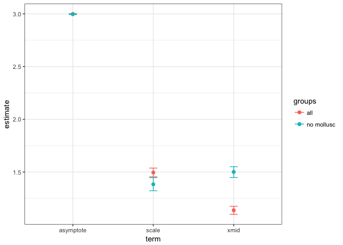
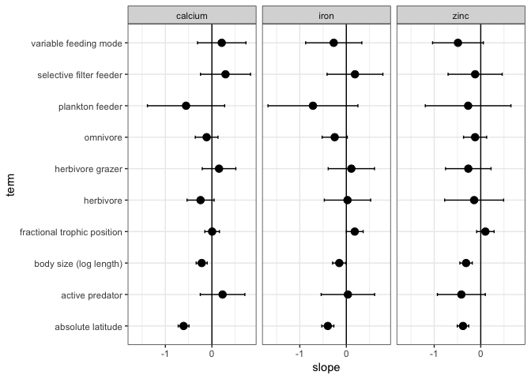

# nutrient analysis figure set


#### Background: dataset summaries


```r
trait_data <- read_csv("/Users/Joey/Documents/Nutrient_Analysis/data-processed/n.long_lat3.csv")
```

For how many species do we have nutrient data?

```r
trait_data %>% 
  group_by(nutrient) %>% 
  distinct(species_name) %>%
  count() %>%
  knitr::kable(align = 'c', format = 'markdown', digits = 2)
```


|  nutrient   |  n  |
|:-----------:|:---:|
|    ca_mg    | 242 |
|     dha     | 358 |
|     epa     | 358 |
| fapun_all_g | 294 |
|   fapun3    | 296 |
|    fat_g    | 629 |
|    fe_mg    | 257 |
|   prot_g    | 91  |
|  protcnt_g  | 318 |
|  protein_g  | 106 |
|    zn_mg    | 228 |

### Figure 1. Distribution of nutrient concentrations across species

```r
g <- ggplot(trait_data, aes(concentration)) + geom_histogram(binwidth = 0.07)
g + facet_grid(nutrient ~ ., scales = "free_y") + theme_bw() + scale_x_log10()
```

<!-- -->

### Figure 2. Few species reach RDI targets for more than one nutrient

```r
### how many micronutrient mineral targets does each species reach?
RDI_minerals <- trait_data %>% 
  spread(nutrient, concentration) %>% 
  group_by(species_name, subgroup) %>% 
  summarise(mean.CA = mean(ca_mg, na.rm = TRUE),
            mean.ZN = mean(zn_mg, na.rm = TRUE), 
            mean.FE = mean(fe_mg, na.rm = TRUE)) %>% 
  mutate(RDI.CA = ifelse(mean.CA > 120, 1, 0)) %>% 
  mutate(RDI.FE = ifelse(mean.FE > 1.8, 1, 0)) %>% 
  mutate(RDI.ZN = ifelse(mean.ZN > 1.1, 1, 0)) %>% 
  ungroup() %>% 
  mutate(RDI.micro.tot = rowSums(.[6:8])) %>% 
  filter(!is.na(RDI.micro.tot)) %>% 
  arrange(., RDI.micro.tot)
```


```r
RDI_minerals %>% 
  group_by(subgroup, RDI.micro.tot) %>% 
  summarise(n = n()) %>%  
  mutate(cum.RDI = cumsum(n)) %>% 
  ggplot(., aes(x = RDI.micro.tot, y = n)) + geom_bar(stat = "identity") + facet_wrap(~ subgroup, scales = "free_y") + theme_bw() +
  xlab("number of RDI targets in a single 100g portion") +
  ylab("number of species")
```

<!-- -->


#### Multivariate nutrient trait analysis

Get the data in order


Ordination etc


### Figure 4. Functional groups have distinct multi-nutrient profiles

```r
scaling <- left_join(ord_long, min.env, by = c("Label" = "species_name")) %>% 
  filter(Score == "sites")

# ggplot(data = scaling, aes(x = Dim1, y = Dim2, colour = subgroup, label = Label)) + geom_point(size = 2) + geom_text() + theme_bw()

ggplot(data = scaling, aes(x = Dim1, y = Dim2, colour = subgroup)) + geom_point(size = 4) +
  theme_bw()
```

<!-- -->


```r
### calculate Bray-Curtis distance among samples
comm.bc.dist <- vegdist(matrix.min, method = "bray")
# hist(comm.bc.dist)

# cluster communities using average-linkage algorithm
comm.bc.clust <- hclust(comm.bc.dist, method = "average")

# plot cluster diagram
# plot(comm.bc.clust, ylab = "Bray-Curtis dissimilarity")

## Use betadisper to test the significance of the multivariate groups
# min.subgroup <- min.env$subgroup
min.subgroup <- scaling$subgroup
length(min.subgroup)
```

```
## [1] 211
```

```r
mod <- betadisper(comm.bc.dist, min.subgroup)

## Perform test
anova(mod)
```

```
## Analysis of Variance Table
## 
## Response: Distances
##            Df Sum Sq  Mean Sq F value    Pr(>F)    
## Groups      2 0.4976 0.248812  11.652 1.598e-05 ***
## Residuals 208 4.4415 0.021353                      
## ---
## Signif. codes:  0 '***' 0.001 '**' 0.01 '*' 0.05 '.' 0.1 ' ' 1
```

```r
## Permutation test for F
permutest(mod, pairwise = TRUE, permutations = 200)
```

```
## 
## Permutation test for homogeneity of multivariate dispersions
## Permutation: free
## Number of permutations: 200
## 
## Response: Distances
##            Df Sum Sq  Mean Sq      F N.Perm   Pr(>F)   
## Groups      2 0.4976 0.248812 11.652    200 0.004975 **
## Residuals 208 4.4415 0.021353                          
## ---
## Signif. codes:  0 '***' 0.001 '**' 0.01 '*' 0.05 '.' 0.1 ' ' 1
## 
## Pairwise comparisons:
## (Observed p-value below diagonal, permuted p-value above diagonal)
##            crustacean    finfish mollusc
## crustacean            0.00497512  0.4826
## finfish    0.00015418             0.0050
## mollusc    0.43291504 0.00027915
```

```r
#### Use adonis to ask whether the group means in multivariate space are different from each other ####

min.subgroup %>% 
  dplyr::data_frame(subgrp = .) %>%
  filter(!is.na(subgrp)) %>%
  adonis(comm.bc.dist ~ subgrp, data = .)
```

```
## 
## Call:
## adonis(formula = comm.bc.dist ~ subgrp, data = .) 
## 
## Permutation: free
## Number of permutations: 999
## 
## Terms added sequentially (first to last)
## 
##            Df SumsOfSqs MeanSqs F.Model      R2 Pr(>F)    
## subgrp      2     1.826 0.91281  3.9555 0.03664  0.001 ***
## Residuals 208    48.000 0.23077         0.96336           
## Total     210    49.826                 1.00000           
## ---
## Signif. codes:  0 '***' 0.001 '**' 0.01 '*' 0.05 '.' 0.1 ' ' 1
```

### Figure 4b. Nutrient-by-nutrient boxplots


```
##  [1] "prot_g"      "fapun_all_g" "protein_g"   "fapun3"      "protcnt_g"  
##  [6] "epa"         "dha"         "ca_mg"       "fat_g"       "zn_mg"      
## [11] "fe_mg"
```

<!-- -->


### Figure 5. Functional group diversity enhances dietary nutritional diversity  


```r
#### now the accumulation curves for the all the nutrients

ntbl.RDI.all <- trait_data %>% 
  spread(nutrient, concentration) %>% 
  group_by(species_name, subgroup) %>% 
  summarise(mean.CA = mean(ca_mg, na.rm = TRUE),
            mean.ZN = mean(zn_mg, na.rm = TRUE), 
            mean.FE = mean(fe_mg, na.rm = TRUE),
            mean.EPA = mean(epa, na.rm = TRUE),
            mean.DHA = mean(dha, na.rm = TRUE)) %>% 
  mutate(RDI.CA = ifelse(mean.CA > 300, 1, 0)) %>% 
  mutate(RDI.FE = ifelse(mean.FE > 4.5, 1, 0)) %>% 
  mutate(RDI.ZN = ifelse(mean.ZN > 2.75, 1, 0)) %>%
  mutate(RDI.EPA = ifelse(mean.EPA > 0.25, 1, 0)) %>% 
  mutate(RDI.DHA = ifelse(mean.DHA > 0.25, 1, 0)) %>% 
  ungroup() %>% 
  mutate(RDI.micro.tot = rowSums(.[8:12])) %>% 
  filter(!is.na(RDI.micro.tot)) 

RDI_minerals <- trait_data %>% 
  spread(nutrient, concentration) %>% 
  group_by(species_name, subgroup) %>% 
  summarise(mean.CA = mean(ca_mg, na.rm = TRUE),
            mean.ZN = mean(zn_mg, na.rm = TRUE), 
            mean.FE = mean(fe_mg, na.rm = TRUE)) %>% 
  mutate(RDI.CA = ifelse(mean.CA > 120, 1, 0)) %>% 
  mutate(RDI.FE = ifelse(mean.FE > 1.8, 1, 0)) %>% 
  mutate(RDI.ZN = ifelse(mean.ZN > 1.1, 1, 0)) %>% 
  ungroup() %>% 
  mutate(RDI.micro.tot = rowSums(.[6:8])) %>% 
  filter(!is.na(RDI.micro.tot)) %>% 
  arrange(., RDI.micro.tot)
```


```r
#### how many species do you need to sample before reaching 3 RDI targets?
### create spa curves for each of the subgroups individually
subgroup_spa <- ntbl.RDI.all %>%
  dplyr::select(-RDI.micro.tot) %>%
  dplyr::select(-contains("mean")) %>% 
  dplyr::select(-species_name) %>%
  split( .$subgroup) %>% 
  map(.f = `[`, c("RDI.CA", "RDI.FE", "RDI.ZN", "RDI.EPA", "RDI.DHA")) %>%
  map(.f = specaccum, method = "random")
```

```
## Set of permutations < 'minperm'. Generating entire set.
```

```r
subgroup_spa <- RDI_minerals %>%
  dplyr::select(-RDI.micro.tot) %>%
  dplyr::select(-contains("mean")) %>%
  dplyr::select(-species_name) %>% 
  split( .$subgroup) %>% 
  map(.f = `[`, c("RDI.CA", "RDI.FE", "RDI.ZN")) %>%
  map(.f = specaccum, method = "random", permutations = 10000)

subgroup_spa_all <- RDI_minerals %>%
  dplyr::select(-RDI.micro.tot) %>%
  dplyr::select(-contains("mean")) %>%
  dplyr::select(-species_name) %>%
    dplyr::select(-subgroup) %>%
 specaccum(method = "random", permutations = 100)

subgroup_spa_all_no_mollusc <- RDI_minerals %>%
  filter(subgroup == "finfish") %>% 
  dplyr::select(-RDI.micro.tot) %>%
  dplyr::select(-contains("mean")) %>%
  dplyr::select(-species_name) %>%
    dplyr::select(-subgroup) %>%
 specaccum(method = "random", permutations =100)


nutraccum <- data.frame(subgroup_spa_all$richness, subgroup_spa_all$site, subgroup_spa_all$sd)
nutraccum_no_mollusc <- data.frame(subgroup_spa_all_no_mollusc$richness, subgroup_spa_all_no_mollusc$site, subgroup_spa_all_no_mollusc$sd)

nutraccum_no_mollusc$groups <- "no mollusc"
nutraccum$groups <- "all"
names(nutraccum_no_mollusc)
```

```
## [1] "subgroup_spa_all_no_mollusc.richness"
## [2] "subgroup_spa_all_no_mollusc.site"    
## [3] "subgroup_spa_all_no_mollusc.sd"      
## [4] "groups"
```

```r
nutraccum_no_mollusc <- nutraccum_no_mollusc %>% 
  rename(richness = subgroup_spa_all_no_mollusc.richness,
         site = subgroup_spa_all_no_mollusc.site, 
         sd = subgroup_spa_all_no_mollusc.sd)

nutraccum <- nutraccum %>% 
  rename(richness = subgroup_spa_all.richness, 
         site = subgroup_spa_all.site,
         sd = subgroup_spa_all.sd)
  
nutraccum_all <- bind_rows(nutraccum, nutraccum_no_mollusc)

ggplot(data = nutraccum_all, aes(x = site, y = richness, color = groups)) + geom_line(size = 2) + xlim(0,10) + 
  # geom_ribbon(aes(ymin = richness - sd, ymax = richness + sd, fill = groups), alpha = 0.5) +
  theme_bw()
```

```
## Warning: Removed 355 rows containing missing values (geom_path).
```

<!-- -->

```r
mod1 <- nls(richness ~ SSlogis(site, Asym, xmid, scale), data = nutraccum)
coef(summary(mod1))
```

```
##       Estimate  Std. Error    t value      Pr(>|t|)
## Asym  2.999401 0.000853908 3512.55744  0.000000e+00
## xmid  1.136976 0.019469965   58.39640 5.639431e-131
## scale 1.495075 0.019718767   75.81993 1.691671e-153
```

```r
mod2 <- nls(richness ~ SSlogis(site, Asym, xmid, scale), data = nutraccum_no_mollusc)
coef(summary(mod2))
```

```
##       Estimate  Std. Error    t value      Pr(>|t|)
## Asym  2.996747 0.001613948 1856.78037  0.000000e+00
## xmid  1.500477 0.025946645   57.82933 1.281524e-109
## scale 1.383327 0.027518111   50.26968 2.460337e-100
```

```r
(tidy(mod1, conf.int = TRUE))
```

```
##    term estimate   std.error  statistic       p.value conf.low conf.high
## 1  Asym 2.999401 0.000853908 3512.55744  0.000000e+00 2.997715  3.001086
## 2  xmid 1.136976 0.019469965   58.39640 5.639431e-131 1.097807  1.174840
## 3 scale 1.495075 0.019718767   75.81993 1.691671e-153 1.454188  1.537020
```

```r
accumulated_targets <- subgroup_spa %>% 
  map(.f = `[`, "richness") %>% 
  unlist() %>% 
  as.data.frame()

accumulated_targets_sd <- subgroup_spa %>% 
  map(.f = `[`, "sd") %>% 
  unlist() %>% 
  as.data.frame()

accumulated_targets$richness_level = rownames(accumulated_targets)
colnames(accumulated_targets) <- c("number_of_targets", "richness_level")

accumulated_targets_sd$sd = rownames(accumulated_targets_sd)
colnames(accumulated_targets_sd) <- c("sd", "number_of_targets")

accumulated_targets_sd <- accumulated_targets_sd %>% 
  separate(number_of_targets, into = c("subgroup", "number_of_species")) %>%
  mutate(number_of_species = str_replace(number_of_species, "sd", "")) %>%
  mutate(number_of_species = as.numeric(number_of_species))


accumulated_targets <- accumulated_targets %>% 
  separate(richness_level, into = c("subgroup", "number_of_species")) %>%
  mutate(number_of_species = str_replace(number_of_species, "richness", "")) %>%
  mutate(number_of_species = as.numeric(number_of_species))

accumulated_targets_all <- left_join(accumulated_targets, accumulated_targets_sd)
```

```
## Joining, by = c("subgroup", "number_of_species")
```

```r
accumulated_targets_all <- accumulated_targets_all %>% 
  mutate(se = sd / sqrt(number_of_species)) 

accumulated_targets_all %>%
  filter(number_of_species < 10) %>% 
ggplot(data = ., aes(x = number_of_species, y = number_of_targets, color = subgroup)) + geom_line(size =2) + theme_bw() + geom_ribbon(aes(ymin = number_of_targets - se, ymax = number_of_targets + se, fill = subgroup), alpha = 0.1) + ylab("number of RDI targets") +
  xlab("number of species")
```

<!-- -->

```r
# ntbl.RDI.all %>% 
#   dplyr::select(8:12) %>% 
# specaccum(., method = "random") %>%
# plot(., col = "black", lwd = 4, ci = 1, ci.type = "bar", ci.lty = 3,  ci.col = "blue", ylim = c(0,6), xlab = "number of fish species in diet", ylab = "number of distinct RDI targets reached", main = "micronutrients: 25% RDI targets")

RDIS <- dplyr::select(ntbl.RDI.all, 8:12)

spa.rand <- specaccum(RDIS, method = "random")
# plot(spa.rand, col = "cadetblue", lwd = 2, ci = 1, ci.type = "bar", ci.lty = 3,  ci.col = "cadetblue", ylim = c(0,6), xlim = c(0,80), xlab = "number of fish species in diet", ylab = "number of distinct RDI targets reached", main = "25% RDI targets")
# abline( v= 15, col = "cadetblue")
# abline( v = 26, col = "pink")
```


### Figure 5b. What happens when we lose the molluscs -- does the slope of the accumulation curve increase?

```r
nutraccum_all %>% 
  group_by(groups) %>% 
  do(tidy(nls(richness ~ SSlogis(site, asymptote, xmid, scale), data = .), conf.int = TRUE)) %>% 
  ggplot(data = ., aes(x = term, y = estimate, color = groups)) + geom_point(size = 2) +
  geom_errorbar(aes(ymin = conf.low, ymax = conf.high), width = 0.1) + theme_bw()
```

<!-- -->


#### Trait analysis


```r
mod_all <- trait_data %>% 
  filter(concentration > 0) %>% 
  mutate(anacat = ifelse(subgroup != "finfish", "non-migratory", anacat)) %>% 
  filter(!is.na(bulk_max_length), !is.na(bulk_trophic_level), !is.na(feeding_level), !is.na(feeding_mode), !is.na(abs_lat)) %>% 
  mutate(log_length = log(bulk_max_length),
         log_concentration = log(concentration)) %>% 
  filter(!grepl("^Mohanty, B. P.,", ref_info))
```

#### Scatterplots
### Figure 6. Micronutrient concentration decreases with increasing body size

```r
trait_data %>% 
  # filter(nutrient == "ca_mg") %>% 
  filter(concentration > 0) %>%
  filter(nutrient %in% c("fe_mg", "ca_mg", "zn_mg")) %>% 
  group_by(nutrient) %>% 
ggplot(aes(y = log(concentration), x = log(bulk_mean_length)), data = .) + geom_point(size = 3, alpha = 0.5, color = "blue") + geom_smooth(method = "lm") +
  theme_bw() + ylab("ln nutrient concentration") + xlab("ln body length") + facet_wrap( ~ nutrient, scales = "free")
```

<!-- -->


```r
trait_data %>% 
  # filter(nutrient == "ca_mg") %>% 
  filter(concentration > 0) %>%
  filter(nutrient %in% c("fe_mg", "ca_mg", "zn_mg")) %>% 
  group_by(nutrient) %>% 
  ggplot(aes(y = log(concentration), x = abs_lat), data = .) + geom_point(size = 3, alpha = 0.5, color = "blue") + geom_smooth(method = "lm") +
  theme_bw() + ylab("ln nutrient concentration") + xlab("absolute latitude") + facet_wrap( ~ nutrient, scales = "free")
```

<!-- -->


```r
trait_data %>% 
  # filter(nutrient == "ca_mg") %>% 
  filter(concentration > 0) %>%
  filter(nutrient %in% c("fe_mg", "ca_mg", "zn_mg")) %>% 
  group_by(nutrient) %>% 
  ggplot(aes(y = log(bulk_mean_length), x = abs_lat), data = .) + geom_point(size = 3, alpha = 0.5, color = "blue") + geom_smooth(method = "lm") +
  theme_bw() + ylab("ln body length") + xlab("absolute latitude") + facet_wrap( ~ nutrient, scales = "free")
```

<!-- -->


```r
## prep the data
mod_all <- trait_data %>% 
  filter(concentration > 0) %>% 
  mutate(anacat = ifelse(subgroup != "finfish", "non-migratory", anacat)) %>% 
  filter(!is.na(bulk_max_length), !is.na(bulk_trophic_level), !is.na(feeding_level), !is.na(feeding_mode), !is.na(abs_lat)) %>% 
  mutate(log_length = log(bulk_max_length),
         log_concentration = log(concentration)) %>% 
  filter(!grepl("^Mohanty, B. P.,", ref_info))
```


Iron


Zinc


Calcium

```
## 
## Call:
## lm(formula = z.log_concentration ~ z.log_length + z.bulk_trophic_level + 
##     feeding_level + z.abs_lat, data = mod)
## 
## Residuals:
##     Min      1Q  Median      3Q     Max 
## -0.9879 -0.2434 -0.0274  0.2168  1.0969 
## 
## Coefficients:
##                                                         Estimate
## (Intercept)                                             0.032637
## z.log_length                                           -0.215447
## z.bulk_trophic_level                                    0.000988
## feeding_levelmainly plants/detritus (troph. 2-2.19)    -0.246541
## feeding_levelplants/detritus+animals (troph. 2.2-2.79) -0.113347
## z.abs_lat                                              -0.609922
##                                                        Std. Error t value
## (Intercept)                                              0.030352   1.075
## z.log_length                                             0.060181  -3.580
## z.bulk_trophic_level                                     0.079944   0.012
## feeding_levelmainly plants/detritus (troph. 2-2.19)      0.121574  -2.028
## feeding_levelplants/detritus+animals (troph. 2.2-2.79)   0.124915  -0.907
## z.abs_lat                                                0.058871 -10.360
##                                                        Pr(>|t|)    
## (Intercept)                                             0.28339    
## z.log_length                                            0.00042 ***
## z.bulk_trophic_level                                    0.99015    
## feeding_levelmainly plants/detritus (troph. 2-2.19)     0.04373 *  
## feeding_levelplants/detritus+animals (troph. 2.2-2.79)  0.36516    
## z.abs_lat                                               < 2e-16 ***
## ---
## Signif. codes:  0 '***' 0.001 '**' 0.01 '*' 0.05 '.' 0.1 ' ' 1
## 
## Residual standard error: 0.3856 on 228 degrees of freedom
## Multiple R-squared:  0.4181,	Adjusted R-squared:  0.4054 
## F-statistic: 32.77 on 5 and 228 DF,  p-value: < 2.2e-16
```

### Figure 7. Within functional groups, some traits such body size and latitude are strongly associated with nutritional profile 
<!-- -->
