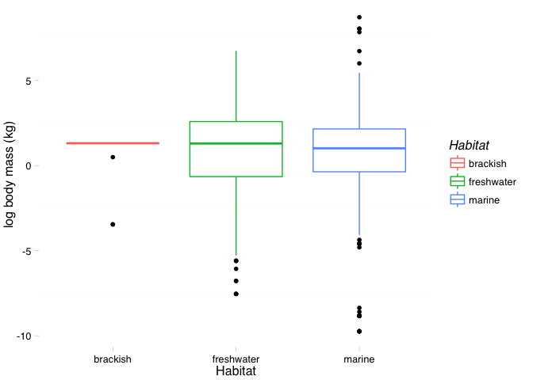
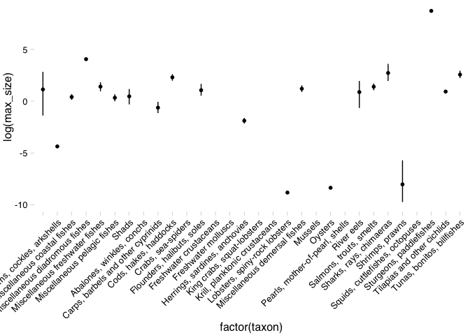
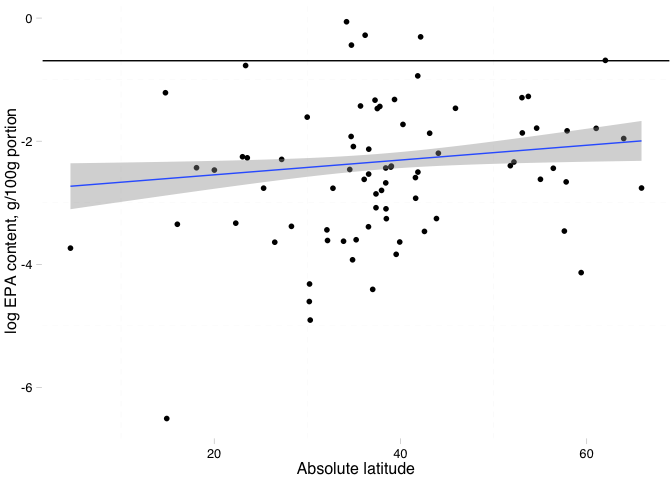

# Homework3

Initial set up

```r
library(plotrix)
library(ggthemes)
```

```
## Loading required package: ggplot2
```

```r
suppressPackageStartupMessages(library(dplyr))
library(ggplot2)
library(knitr)
suppressPackageStartupMessages(library(Hmisc))

nut <- read.csv("~/Desktop/Nutrient_databases/nut_sept22_lwr_dec3.csv", comment.char="#", stringsAsFactors=FALSE)

ntbl <- tbl_df(nut)

glimpse(ntbl)
```

```
## Observations: 1,188
## Variables: 98
## $ ASFIS.Scientific.name                 (chr) "Abramis brama", "Abrami...
## $ Food.name.in.English                  (chr) "Common bream, wild, ski...
## $ TaxonKey                              (int) NA, NA, NA, NA, NA, NA, ...
## $ lwA                                   (dbl) 0.00871, 0.00871, 0.0087...
## $ lwB                                   (dbl) 3.140, 3.140, 3.140, 3.1...
## $ SLMAX                                 (dbl) 82.0, 82.0, 82.0, 82.0, ...
## $ SLMAX_nov28                           (dbl) NA, NA, NA, NA, NA, NA, ...
## $ SLMAX_source                          (chr) "http://www.fishbase.org...
## $ TL                                    (dbl) 2.90, 2.90, 2.90, 2.90, ...
## $ TL_se                                 (dbl) 0.40, 0.40, 0.40, 0.40, ...
## $ TL_nov28                              (dbl) NA, NA, NA, NA, NA, NA, ...
## $ TLSE_nov28                            (dbl) NA, NA, NA, NA, NA, NA, ...
## $ X                                     (int) 1, 2, 3, 4, 5, 6, 7, 8, ...
## $ sci.name                              (chr) "Abramis abramis", "Abra...
## $ Food.Item.ID                          (int) 900684, 900123, 900159, ...
## $ Subgroup                              (chr) "Finfish", "Finfish", "F...
## $ country.region                        (chr) "Germany, Usedom, Baltic...
## $ Type                                  (chr) "W", "W", "W", "W", "W",...
## $ ISSCAAP                               (int) 11, 11, 11, 11, 11, 11, ...
## $ ISSCAAP_cat                           (chr) "Carps, barbels and othe...
## $ Habitat                               (chr) "marine", "freshwater", ...
## $ X3_alpha                              (chr) "FBM", "FBM", "FBM", "FB...
## $ Food.name.in.own.language             (chr) NA, NA, NA, NA, NA, NA, ...
## $ Processing                            (chr) "r", "r", "r", "r", "r",...
## $ ASFIS.English.name                    (chr) "Freshwater bream", "Fre...
## $ Season                                (chr) "3-Jul", "Jun-97", "Summ...
## $ Other                                 (chr) "fishing areas: North At...
## $ Latitude                              (dbl) 53.87537, 54.08424, 41.5...
## $ Abs_lat                               (dbl) 53.87537, 54.08424, 41.5...
## $ length_from_study                     (dbl) NA, NA, NA, NA, NA, NA, ...
## $ length_3                              (dbl) NA, NA, NA, NA, NA, NA, ...
## $ n.x                                   (int) NA, NA, NA, NA, NA, NA, ...
## $ WATER.g.                              (chr) NA, NA, NA, NA, NA, NA, ...
## $ FAT.g.                                (dbl) NA, NA, NA, NA, NA, NA, ...
## $ FATCE.g.                              (chr) NA, NA, NA, NA, NA, NA, ...
## $ FAT..g.                               (dbl) NA, NA, NA, NA, NA, NA, ...
## $ FASAT.g.                              (dbl) NA, NA, NA, NA, NA, NA, ...
## $ FAMS.g.                               (dbl) NA, NA, NA, NA, NA, NA, ...
## $ FAPU.g.                               (dbl) NA, NA, NA, NA, NA, NA, ...
## $ FAUN.g.                               (chr) NA, NA, NA, NA, NA, NA, ...
## $ FATRN.g.                              (dbl) NA, NA, NA, NA, NA, NA, ...
## $ FACID.g.                              (dbl) NA, NA, NA, NA, NA, NA, ...
## $ FAPUN3.g.                             (dbl) NA, NA, NA, NA, NA, NA, ...
## $ FAPUN6.g.                             (dbl) NA, NA, NA, NA, NA, NA, ...
## $ FAPUN9.g.                             (dbl) NA, NA, NA, NA, NA, NA, ...
## $ EPA_g                                 (dbl) NA, NA, NA, NA, NA, NA, ...
## $ DHA_g                                 (dbl) NA, NA, NA, NA, NA, NA, ...
## $ Food_item_id                          (int) 900684, 900123, 900159, ...
## $ max_length_study                      (dbl) NA, 33.2, 30.0, 31.6, 38...
## $ Comments.on.data.processing.methods.y (chr) NA, "Minerals given per ...
## $ Publication.year                      (int) 2006, 2009, 1989, 2009, ...
## $ BiblioID.y                            (chr) "fi105", "fi26", "fi32",...
## $ Compiler                              (chr) "DR", "DR", "DR", "DR", ...
## $ EDIBLE                                (dbl) NA, NA, NA, NA, NA, NA, ...
## $ ENERC_kJ._original                    (dbl) NA, NA, NA, NA, NA, NA, ...
## $ ENERC_kcal._original                  (dbl) NA, NA, NA, NA, NA, NA, ...
## $ ENERA_kcal                            (dbl) NA, NA, NA, NA, NA, NA, ...
## $ DM_g                                  (dbl) NA, NA, NA, NA, NA, NA, ...
## $ WATER_g                               (chr) NA, "78.76", "78", "80.0...
## $ XN                                    (dbl) NA, NA, 6.25, NA, NA, NA...
## $ NT_g                                  (dbl) NA, NA, NA, NA, NA, NA, ...
## $ PROTCNT_g                             (chr) NA, NA, "19", NA, NA, NA...
## $ PROTCNP_g                             (lgl) NA, NA, NA, NA, NA, NA, ...
## $ PROT_g                                (dbl) NA, NA, NA, NA, NA, NA, ...
## $ NPRO_g                                (dbl) NA, NA, NA, NA, NA, NA, ...
## $ NNP_mg                                (int) NA, NA, NA, NA, NA, NA, ...
## $ FAT_g                                 (dbl) 6.40, NA, 1.40, NA, NA, ...
## $ FATCE_g                               (chr) NA, NA, NA, NA, NA, NA, ...
## $ FAT_g.1                               (dbl) NA, NA, NA, NA, NA, NA, ...
## $ FASAT_g                               (dbl) NA, NA, NA, NA, NA, NA, ...
## $ FAMS_g                                (dbl) NA, NA, NA, NA, NA, NA, ...
## $ FAPU_g                                (dbl) NA, NA, NA, NA, NA, NA, ...
## $ FAUN_g                                (chr) NA, NA, NA, NA, NA, NA, ...
## $ CA_mg                                 (dbl) NA, 11.60, 53.00, 20.92,...
## $ FE_mg                                 (dbl) NA, 0.17, 0.60, 0.21, 0....
## $ ID_mcg                                (dbl) NA, NA, NA, NA, NA, NA, ...
## $ K_mg                                  (dbl) NA, 481.79, 570.00, 448....
## $ MG_mg                                 (dbl) NA, 20.41, 69.00, 19.74,...
## $ MN_mg                                 (chr) NA, "0.01", "0.09", "0.0...
## $ SE_mcg                                (chr) NA, NA, NA, NA, NA, NA, ...
## $ HG_mcg                                (chr) NA, NA, "6", NA, NA, NA,...
## $ PB_mcg                                (chr) NA, NA, "8", NA, NA, NA,...
## $ SR_mcg                                (chr) NA, NA, "nd", NA, NA, NA...
## $ RETOL_mcg                             (chr) NA, NA, NA, NA, NA, NA, ...
## $ RETOL13_mcg                           (int) NA, NA, NA, NA, NA, NA, ...
## $ RETOLDH_mcg                           (int) NA, NA, NA, NA, NA, NA, ...
## $ RETOLSUM_mcg                          (int) NA, NA, NA, NA, NA, NA, ...
## $ CARTA_mcg                             (dbl) NA, NA, NA, NA, NA, NA, ...
## $ CARTB_mcg                             (chr) NA, NA, NA, NA, NA, NA, ...
## $ ATX_mcg                               (dbl) NA, NA, NA, NA, NA, NA, ...
## $ ZEA_mcg                               (dbl) NA, NA, NA, NA, NA, NA, ...
## $ CARTOID_mcg                           (int) NA, NA, NA, NA, NA, NA, ...
## $ CHOCAL_mcg                            (dbl) 8.6, NA, NA, NA, NA, NA,...
## $ TOCPHA_mg                             (dbl) NA, NA, NA, NA, NA, NA, ...
## $ VITB6A_mg                             (dbl) NA, NA, NA, NA, NA, NA, ...
## $ VITB12_mcg                            (dbl) NA, NA, NA, NA, NA, NA, ...
## $ VITC_mg                               (chr) NA, NA, NA, NA, NA, NA, ...
## $ ZN_mg                                 (dbl) NA, 0.392940, 1.000000, ...
```

Change variable names to more intuitive names

```r
 ntbl <- ntbl %>%
  rename(species = ASFIS.Scientific.name,
         taxon = ISSCAAP_cat,
         max_length = SLMAX)
```

Pull out variables we will use in this analysis :blowfish:

```r
ntbl <- ntbl %>%
  select(species, taxon, max_length, TL, CA_mg, EPA_g, DHA_g, ZN_mg, HG_mcg, lwA, lwB, Habitat, Subgroup, Abs_lat)
```

Convert max length to max body size using length-weight conversion (W = a × L^b)

```r
ntbl <- ntbl %>%
  mutate(max_size = (lwA * (max_length^lwB)/1000))
ntbl %>%
  glimpse()
```

```
## Observations: 1,188
## Variables: 15
## $ species    (chr) "Abramis brama", "Abramis brama", "Abramis brama", ...
## $ taxon      (chr) "Carps, barbels and other cyprinids", "Carps, barbe...
## $ max_length (dbl) 82.0, 82.0, 82.0, 82.0, 82.0, 82.0, 82.0, 82.0, 82....
## $ TL         (dbl) 2.90, 2.90, 2.90, 2.90, 2.90, 2.90, 2.90, 2.90, 2.9...
## $ CA_mg      (dbl) NA, 11.60, 53.00, 20.92, 11.46, 12.11, 52.00, NA, N...
## $ EPA_g      (dbl) NA, NA, NA, NA, NA, NA, NA, 0.093220000, NA, 0.0016...
## $ DHA_g      (dbl) NA, NA, NA, NA, NA, NA, NA, 0.12087000, NA, 0.02100...
## $ ZN_mg      (dbl) NA, 0.392940, 1.000000, 0.373252, 0.372708, 0.36618...
## $ HG_mcg     (chr) NA, NA, "6", NA, NA, NA, "14", NA, NA, NA, NA, NA, ...
## $ lwA        (dbl) 0.00871, 0.00871, 0.00871, 0.00871, 0.00871, 0.0087...
## $ lwB        (dbl) 3.140, 3.140, 3.140, 3.140, 3.140, 3.140, 3.140, 3....
## $ Habitat    (chr) "marine", "freshwater", "freshwater", "freshwater",...
## $ Subgroup   (chr) "Finfish", "Finfish", "Finfish", "Finfish", "Finfis...
## $ Abs_lat    (dbl) 53.87537, 54.08424, 41.53000, 54.00394, 54.11710, 5...
## $ max_size   (dbl) 8.90007469, 8.90007469, 8.90007469, 8.90007469, 8.9...
```

What if we want to know the number of species in each habitat?

```r
n_obs_hab <- ntbl %>%
  group_by(Habitat) %>%
  tally
knitr::kable(n_obs_hab, align = 'c', format = 'markdown', digits = 2)
```


|  Habitat   |  n  |
|:----------:|:---:|
|  brackish  | 15  |
| freshwater | 381 |
|   marine   | 792 |


How does body size vary by habitat?

```r
hab.size <- ntbl %>%
  filter(Habitat %in% c("marine", "freshwater", "brackish")) %>%
  filter(!is.na(max_size)) %>% 
  group_by(Habitat) %>%
  summarise_each(funs(mean, median, min, max, std.error), max_size)
knitr::kable(hab.size, align = 'c', format = 'markdown', digits = 2)
```


|  Habitat   | mean  | median | min  |   max   | std.error |
|:----------:|:-----:|:------:|:----:|:-------:|:---------:|
|  brackish  | 3.08  |  3.70  | 0.03 |  3.70   |   0.35    |
| freshwater | 23.43 |  3.66  | 0.00 | 839.32  |   5.29    |
|   marine   | 34.95 |  2.75  | 0.00 | 6076.63 |   12.99   |

Oh good, it looks like body size is pretty consistent across habitats. 

```r
ggplot(ntbl, aes(x = Habitat, y = log(max_size))) + geom_boxplot(aes(group = Habitat, color = Habitat)) + ylab("log body mass (kg)") + theme_pander()
```

```
## Warning: Removed 205 rows containing non-finite values (stat_boxplot).
```

 

How does body size vary by taxon?

```r
taxon.size <- ntbl %>%
  filter(Habitat %in% c("marine", "freshwater", "brackish")) %>%
  filter(!is.na(max_size)) %>% 
  group_by(taxon) %>%
  summarise_each(funs(mean, median), max_size)
knitr::kable(taxon.size, align = 'c', format = 'markdown', digits = 2)
```


|               taxon                |  mean   | median  |
|:----------------------------------:|:-------:|:-------:|
|                                    |  14.68  |  10.45  |
|     Clams, cockles, arkshells      |  0.01   |  0.01   |
|    Miscellaneous coastal fishes    |  4.55   |  1.64   |
|  Miscellaneous diadromous fishes   |  57.65  |  59.10  |
|  Miscellaneous freshwater fishes   |  45.15  |  7.58   |
|    Miscellaneous pelagic fishes    |  5.47   |  2.61   |
|               Shads                |  2.80   |  3.70   |
| Carps, barbels and other cyprinids |  3.93   |  1.46   |
|       Cods, hakes, haddocks        |  22.22  |  12.31  |
|     Flounders, halibuts, soles     | 141.21  |  2.26   |
|   Herrings, sardines, anchovies    |  0.30   |  0.13   |
|   Lobsters, spiny-rock lobsters    |  0.00   |  0.00   |
|   Miscellaneous demersal fishes    |  9.17   |  2.31   |
|              Oysters               |  0.00   |  0.00   |
|             River eels             |  4.35   |  4.43   |
|      Salmons, trouts, smelts       |  7.74   |  4.04   |
|      Sharks, rays, chimaeras       |  62.38  |  11.49  |
|          Shrimps, prawns           |  0.05   |  0.00   |
|      Sturgeons, paddlefishes       | 6076.63 | 6076.63 |
|    Tilapias and other cichlids     |  2.84   |  3.66   |
|     Tunas, bonitos, billfishes     |  90.73  |  8.36   |

```r
ggplot(ntbl, aes(x=factor(taxon), y=log(max_size), group = 1)) +
  stat_summary(fun.data = mean_cl_boot, geom = "pointrange") + theme(axis.text.x = element_text(angle = 45, hjust = 1)) + 
  theme_pander()
```

```
## Warning: Removed 205 rows containing missing values (stat_summary).
```

```
## Warning: Removed 3 rows containing missing values (geom_segment).
```

 

How does calcium content vary across taxa?

```r
calcium <- ntbl %>%
  filter(!is.na(CA_mg)) %>%
  filter(Habitat == "marine") %>%
  group_by(taxon) %>%
  summarise_each(funs(min, max, mean), CA_mg)
knitr::kable(calcium, align = 'c', format = 'markdown', digits = 2)
```


|               taxon                |  min   |   max   |  mean  |
|:----------------------------------:|:------:|:-------:|:------:|
|                                    |  8.00  | 219.00  | 49.75  |
|     Clams, cockles, arkshells      | 62.90  | 327.00  | 192.73 |
|    Miscellaneous coastal fishes    |  6.90  | 1252.61 | 242.13 |
|    Miscellaneous pelagic fishes    |  6.00  | 637.14  | 234.23 |
|     Abalones, winkles, conchs      | 444.00 | 1200.00 | 782.60 |
| Carps, barbels and other cyprinids | 21.45  |  21.45  | 21.45  |
|       Cods, hakes, haddocks        |  7.80  |  14.20  | 10.78  |
|         Crabs, sea-spiders         | 112.00 | 115.00  | 113.50 |
|     Flounders, halibuts, soles     |  5.90  |  28.00  | 15.50  |
|   Herrings, sardines, anchovies    | 398.52 | 398.52  | 398.52 |
|   Lobsters, spiny-rock lobsters    | 72.00  | 110.00  | 90.67  |
|   Miscellaneous demersal fishes    |  6.80  |  14.00  | 10.61  |
|              Mussels               | 67.76  |  67.76  | 67.76  |
|              Oysters               | 13.14  |  13.14  | 13.14  |
|      Sharks, rays, chimaeras       | 10.00  |  12.00  | 11.00  |
|          Shrimps, prawns           | 59.10  |  62.40  | 60.38  |
|     Tunas, bonitos, billfishes     | 11.00  |  83.49  | 42.79  |

How does calcium vary with body size?

```r
ggplot(subset(ntbl, Habitat %in% c("marine", "freshwater")), aes(x=max_size, y=CA_mg, group = Habitat, color = Habitat)) + stat_summary(fun.y= "mean", geom = "point") + geom_hline(aes(yintercept=250)) + stat_smooth(method = "lm") + theme_pander() + scale_x_log10() + scale_y_log10()
```

```
## Warning: Removed 1016 rows containing missing values (stat_summary).
```

```
## Warning: Removed 297 rows containing missing values (stat_smooth).
```

```
## Warning: Removed 719 rows containing missing values (stat_smooth).
```

 

The recommended daily intake (RDI) for EPA, an essential fatty acid in the human diet is 1g/day. How many species in the dataset have 50% of RDI for EPA in one portion?

```r
EPA.RDI <- ntbl %>%
  filter(EPA_g > 0.5) %>% 
group_by(taxon) %>%
  tally

EPA.RDI.prop <- EPA.RDI %>% mutate (RDI.prop = (n/45)*100)
knitr::kable(EPA.RDI.prop, align = 'c', format = 'markdown', digits = 2)
```


|              taxon              | n  | RDI.prop |
|:-------------------------------:|:--:|:--------:|
|  Miscellaneous coastal fishes   | 4  |   8.89   |
| Miscellaneous freshwater fishes | 1  |   2.22   |
|  Miscellaneous pelagic fishes   | 8  |  17.78   |
|              Shads              | 2  |   4.44   |
|    Abalones, winkles, conchs    | 1  |   2.22   |
|      Cods, hakes, haddocks      | 1  |   2.22   |
|       Crabs, sea-spiders        | 2  |   4.44   |
|  Herrings, sardines, anchovies  | 16 |  35.56   |
|  Miscellaneous demersal fishes  | 3  |   6.67   |
|     Salmons, trouts, smelts     | 1  |   2.22   |
|   Tunas, bonitos, billfishes    | 6  |  13.33   |

```r
EPA.total <- ntbl %>%
filter(!is.na(EPA_g)) %>% 
  group_by(taxon) %>%
  tally
knitr::kable(EPA.total, align = 'c', format = 'markdown', digits = 2)
```


|               taxon                | n  |
|:----------------------------------:|:--:|
|     Clams, cockles, arkshells      | 8  |
|    Miscellaneous coastal fishes    | 84 |
|  Miscellaneous diadromous fishes   | 8  |
|  Miscellaneous freshwater fishes   | 67 |
|    Miscellaneous pelagic fishes    | 52 |
|               Shads                | 2  |
|     Abalones, winkles, conchs      | 3  |
| Carps, barbels and other cyprinids | 14 |
|       Cods, hakes, haddocks        | 27 |
|         Crabs, sea-spiders         | 8  |
|     Flounders, halibuts, soles     | 12 |
|       Freshwater crustaceans       | 4  |
|   Herrings, sardines, anchovies    | 34 |
|     King crabs, squat-lobsters     | 2  |
|   Krill, planktonic crustaceans    | 1  |
|   Lobsters, spiny-rock lobsters    | 10 |
|   Miscellaneous demersal fishes    | 35 |
|              Mussels               | 2  |
|              Oysters               | 4  |
|             River eels             | 1  |
|      Salmons, trouts, smelts       | 42 |
|      Sharks, rays, chimaeras       | 11 |
|          Shrimps, prawns           | 26 |
|  Squids, cuttlefishes, octopuses   | 23 |
|    Tilapias and other cichlids     | 17 |
|     Tunas, bonitos, billfishes     | 25 |

How does EPA content vary with latitude?
In the following figure, which shows the EPA content in g per 100g edible portion, the black line indicates the recommended daily intake. 

```r
p <- ggplot(subset(ntbl, Habitat == "marine"), aes(x=Abs_lat, y=log(EPA_g)))
p + stat_summary(aes(y = log(EPA_g)), fun.y=mean, geom = "point") + geom_hline(aes(yintercept=log(0.5))) + stat_smooth(method = "lm") + theme_pander() + xlab("Absolute latitude") + ylab("log EPA content, g/100g portion")
```

```
## Warning: Removed 418 rows containing missing values (stat_summary).
```

```
## Warning: Removed 418 rows containing missing values (stat_smooth).
```

 

