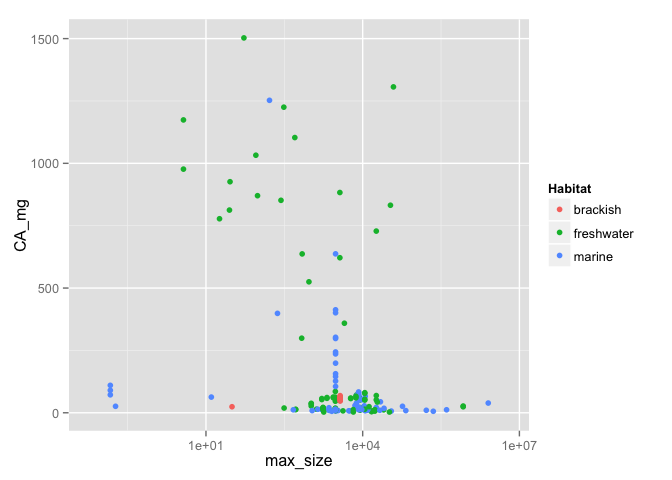
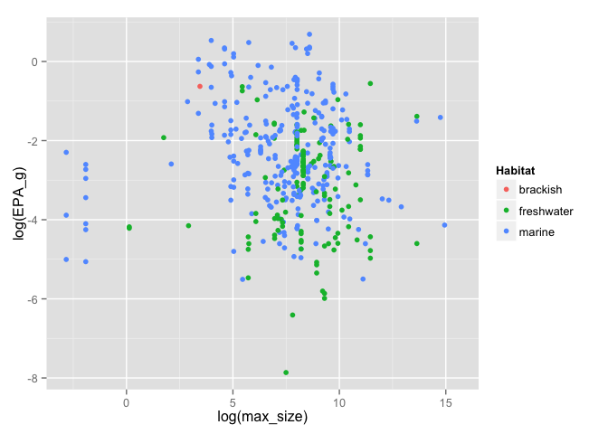
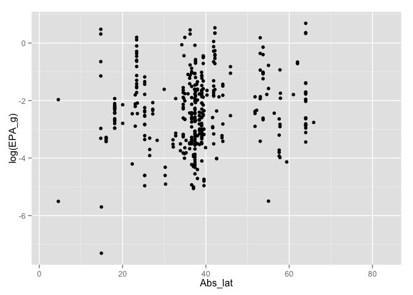
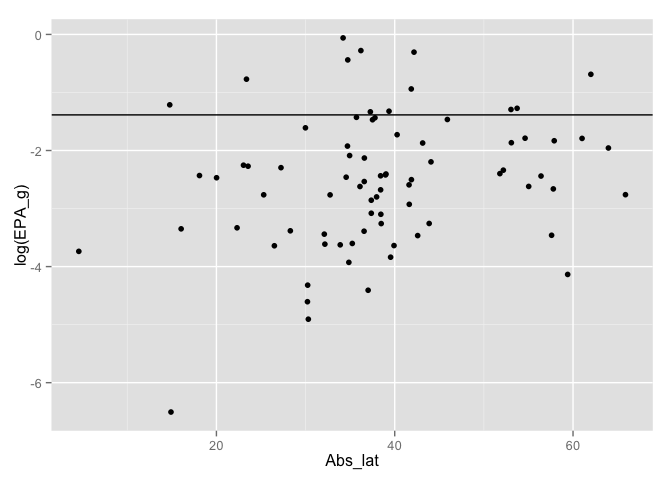
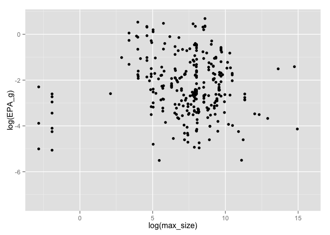
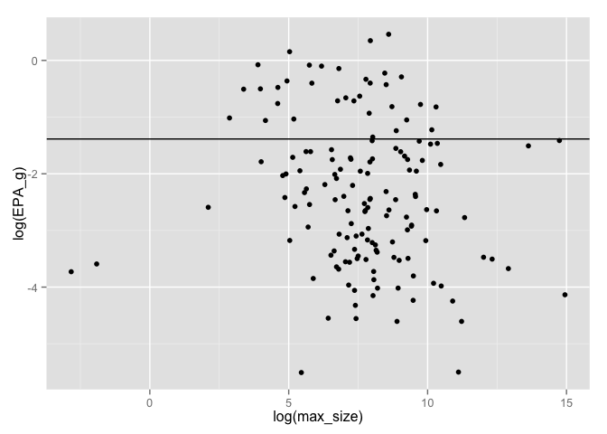

# Homework3


```r
library(ggthemes)
```

```
## Loading required package: ggplot2
```

```r
library(dplyr)
```

```
## 
## Attaching package: 'dplyr'
## 
## The following objects are masked from 'package:stats':
## 
##     filter, lag
## 
## The following objects are masked from 'package:base':
## 
##     intersect, setdiff, setequal, union
```

```r
library(ggplot2)
library(knitr)

nut <- read.csv("~/Desktop/Nutrient_databases/nut_sept22_lwr_dec3.csv", comment.char="#", stringsAsFactors=FALSE)

str(nut)
```

```
## 'data.frame':	1188 obs. of  98 variables:
##  $ ASFIS.Scientific.name                : chr  "Abramis brama" "Abramis brama" "Abramis brama" "Abramis brama" ...
##  $ Food.name.in.English                 : chr  "Common bream, wild, skinless fillet, raw" "Bream, wild, dorsal muscle, raw" "Bream, wild, skinless fillet, raw" "Bream, wild, dorsal muscle, raw" ...
##  $ TaxonKey                             : int  NA NA NA NA NA NA NA NA NA NA ...
##  $ lwA                                  : num  0.00871 0.00871 0.00871 0.00871 0.00871 0.00871 0.00871 0.00871 0.00871 0.0055 ...
##  $ lwB                                  : num  3.14 3.14 3.14 3.14 3.14 3.14 3.14 3.14 3.14 3.19 ...
##  $ SLMAX                                : num  82 82 82 82 82 82 82 82 82 59 ...
##  $ SLMAX_nov28                          : num  NA NA NA NA NA NA NA NA NA NA ...
##  $ SLMAX_source                         : chr  "http://www.fishbase.org/summary/Abramis-brama.html" "" "" "" ...
##  $ TL                                   : num  2.9 2.9 2.9 2.9 2.9 2.9 2.9 2.9 2.9 4 ...
##  $ TL_se                                : num  0.4 0.4 0.4 0.4 0.4 0.4 0.4 0.4 0.4 0.66 ...
##  $ TL_nov28                             : num  NA NA NA NA NA NA NA NA NA NA ...
##  $ TLSE_nov28                           : num  NA NA NA NA NA NA NA NA NA NA ...
##  $ X                                    : int  1 2 3 4 5 6 7 8 9 10 ...
##  $ sci.name                             : chr  "Abramis abramis" "Abramis brama" "Abramis brama" "Abramis brama" ...
##  $ Food.Item.ID                         : int  900684 900123 900159 900122 900124 900125 900158 900225 902192 900073 ...
##  $ Subgroup                             : chr  "Finfish" "Finfish" "Finfish" "Finfish" ...
##  $ country.region                       : chr  "Germany, Usedom, Baltic Sea" "Poland, Kisajno Lake" "Greece, Evros River" "Poland, Niegocin Lake" ...
##  $ Type                                 : chr  "W" "W" "W" "W" ...
##  $ ISSCAAP                              : int  11 11 11 11 11 11 11 11 11 13 ...
##  $ ISSCAAP_cat                          : chr  "Carps, barbels and other cyprinids" "Carps, barbels and other cyprinids" "Carps, barbels and other cyprinids" "Carps, barbels and other cyprinids" ...
##  $ Habitat                              : chr  "marine" "freshwater" "freshwater" "freshwater" ...
##  $ X3_alpha                             : chr  "FBM" "FBM" "FBM" "FBM" ...
##  $ Food.name.in.own.language            : chr  NA NA NA NA ...
##  $ Processing                           : chr  "r" "r" "r" "r" ...
##  $ ASFIS.English.name                   : chr  "Freshwater bream" "Freshwater bream" "Freshwater bream" "Freshwater bream" ...
##  $ Season                               : chr  "3-Jul" "Jun-97" "Summer 1988" "Jun-97" ...
##  $ Other                                : chr  "fishing areas: North Atlantic, North Sea, Barents Sea, Baltic Sea" "mean length and weight: 33.2cm, 444.1g" "mean length and weight: 30cm, 400g" "mean length and weight: 31.6cm, 361.3g" ...
##  $ Latitude                             : num  53.9 54.1 41.5 54 54.1 ...
##  $ Abs_lat                              : num  53.9 54.1 41.5 54 54.1 ...
##  $ length_from_study                    : num  NA NA NA NA NA NA NA NA NA 39 ...
##  $ length_3                             : num  NA NA NA NA NA ...
##  $ n.x                                  : int  NA NA NA NA NA NA NA NA NA 1 ...
##  $ WATER.g.                             : chr  NA NA NA NA ...
##  $ FAT.g.                               : num  NA NA NA NA NA NA NA 1 NA 0.36 ...
##  $ FATCE.g.                             : chr  NA NA NA NA ...
##  $ FAT..g.                              : num  NA NA NA NA NA NA NA NA NA NA ...
##  $ FASAT.g.                             : num  NA NA NA NA NA ...
##  $ FAMS.g.                              : num  NA NA NA NA NA ...
##  $ FAPU.g.                              : num  NA NA NA NA NA ...
##  $ FAUN.g.                              : chr  NA NA NA NA ...
##  $ FATRN.g.                             : num  NA NA NA NA NA NA NA NA NA NA ...
##  $ FACID.g.                             : num  NA NA NA NA NA NA NA NA NA NA ...
##  $ FAPUN3.g.                            : num  NA NA NA NA NA ...
##  $ FAPUN6.g.                            : num  NA NA NA NA NA ...
##  $ FAPUN9.g.                            : num  NA NA NA NA NA NA NA NA NA NA ...
##  $ EPA_g                                : num  NA NA NA NA NA ...
##  $ DHA_g                                : num  NA NA NA NA NA ...
##  $ Food_item_id                         : int  900684 900123 900159 900122 900124 900125 900158 900225 902192 900073 ...
##  $ max_length_study                     : num  NA 33.2 30 31.6 38 50.5 36 NA NA 39 ...
##  $ Comments.on.data.processing.methods.y: chr  NA "Minerals given per DM - conversion to FW" NA "Minerals given per DM - conversion to FW" ...
##  $ Publication.year                     : int  2006 2009 1989 2009 2009 2009 1989 1991 1995 2008 ...
##  $ BiblioID.y                           : chr  "fi105" "fi26" "fi32" "fi26" ...
##  $ Compiler                             : chr  "DR" "DR" "DR" "DR" ...
##  $ EDIBLE                               : num  NA NA NA NA NA NA NA NA NA NA ...
##  $ ENERC_kJ._original                   : num  NA NA NA NA NA ...
##  $ ENERC_kcal._original                 : num  NA NA NA NA NA NA NA NA NA NA ...
##  $ ENERA_kcal                           : num  NA NA NA NA NA NA NA NA NA NA ...
##  $ DM_g                                 : num  NA NA NA NA NA NA NA NA NA NA ...
##  $ WATER_g                              : chr  NA "78.76" "78" "80.04" ...
##  $ XN                                   : num  NA NA 6.25 NA NA NA 6.25 NA NA NA ...
##  $ NT_g                                 : num  NA NA NA NA NA NA NA NA NA NA ...
##  $ PROTCNT_g                            : chr  NA NA "19" NA ...
##  $ PROTCNP_g                            : logi  NA NA NA NA NA NA ...
##  $ PROT_g                               : num  NA NA NA NA NA NA NA NA NA NA ...
##  $ NPRO_g                               : num  NA NA NA NA NA NA NA NA NA NA ...
##  $ NNP_mg                               : int  NA NA NA NA NA NA NA NA NA NA ...
##  $ FAT_g                                : num  6.4 NA 1.4 NA NA NA 0.7 1 NA 0.36 ...
##  $ FATCE_g                              : chr  NA NA NA NA ...
##  $ FAT_g.1                              : num  NA NA NA NA NA NA NA NA 4 NA ...
##  $ FASAT_g                              : num  NA NA NA NA NA NA NA 0.24 NA 0.09 ...
##  $ FAMS_g                               : num  NA NA NA NA NA NA NA NA NA 0.07 ...
##  $ FAPU_g                               : num  NA NA NA NA NA NA NA NA NA 0.05 ...
##  $ FAUN_g                               : chr  NA NA NA NA ...
##  $ CA_mg                                : num  NA 11.6 53 20.9 11.5 ...
##  $ FE_mg                                : num  NA 0.17 0.6 0.21 0.18 0.19 0.7 NA NA NA ...
##  $ ID_mcg                               : num  NA NA NA NA NA NA NA NA NA NA ...
##  $ K_mg                                 : num  NA 482 570 448 306 ...
##  $ MG_mg                                : num  NA 20.4 69 19.7 19.2 ...
##  $ MN_mg                                : chr  NA "0.01" "0.09" "0.01" ...
##  $ SE_mcg                               : chr  NA NA NA NA ...
##  $ HG_mcg                               : chr  NA NA "6" NA ...
##  $ PB_mcg                               : chr  NA NA "8" NA ...
##  $ SR_mcg                               : chr  NA NA "nd" NA ...
##  $ RETOL_mcg                            : chr  NA NA NA NA ...
##  $ RETOL13_mcg                          : int  NA NA NA NA NA NA NA NA NA NA ...
##  $ RETOLDH_mcg                          : int  NA NA NA NA NA NA NA NA NA NA ...
##  $ RETOLSUM_mcg                         : int  NA NA NA NA NA NA NA NA NA NA ...
##  $ CARTA_mcg                            : num  NA NA NA NA NA NA NA NA NA NA ...
##  $ CARTB_mcg                            : chr  NA NA NA NA ...
##  $ ATX_mcg                              : num  NA NA NA NA NA NA NA NA NA NA ...
##  $ ZEA_mcg                              : num  NA NA NA NA NA NA NA NA NA NA ...
##  $ CARTOID_mcg                          : int  NA NA NA NA NA NA NA NA NA NA ...
##  $ CHOCAL_mcg                           : num  8.6 NA NA NA NA NA NA NA 13.8 NA ...
##  $ TOCPHA_mg                            : num  NA NA NA NA NA NA NA NA NA NA ...
##  $ VITB6A_mg                            : num  NA NA NA NA NA NA NA NA NA NA ...
##  $ VITB12_mcg                           : num  NA NA NA NA NA NA NA NA NA NA ...
##  $ VITC_mg                              : chr  NA NA NA NA ...
##  $ ZN_mg                                : num  NA 0.393 1 0.373 0.373 ...
```

```r
summary(nut)
```

```
##  ASFIS.Scientific.name Food.name.in.English    TaxonKey     
##  Length:1188           Length:1188          Min.   :600024  
##  Class :character      Class :character     1st Qu.:600228  
##  Mode  :character      Mode  :character     Median :600790  
##                                             Mean   :606378  
##                                             3rd Qu.:601368  
##                                             Max.   :690283  
##                                             NA's   :789     
##       lwA               lwB             SLMAX         SLMAX_nov28    
##  Min.   :0.00019   Min.   :0.8935   Min.   :  2.30   Min.   : 15.50  
##  1st Qu.:0.00646   1st Qu.:2.9990   1st Qu.: 27.00   1st Qu.: 60.00  
##  Median :0.00955   Median :3.0500   Median : 60.00   Median : 60.00  
##  Mean   :0.01066   Mean   :3.0182   Mean   : 68.63   Mean   : 79.39  
##  3rd Qu.:0.01270   3rd Qu.:3.1000   3rd Qu.: 90.00   3rd Qu.:100.00  
##  Max.   :0.08800   Max.   :3.8600   Max.   :800.00   Max.   :200.00  
##  NA's   :205       NA's   :205      NA's   :5        NA's   :1124    
##  SLMAX_source             TL            TL_se           TL_nov28    
##  Length:1188        Min.   :2.000   Min.   :0.0000   Min.   :1.600  
##  Class :character   1st Qu.:3.020   1st Qu.:0.3100   1st Qu.:3.000  
##  Mode  :character   Median :3.470   Median :0.4700   Median :3.500  
##                     Mean   :3.461   Mean   :0.4676   Mean   :3.434  
##                     3rd Qu.:4.100   3rd Qu.:0.6550   3rd Qu.:4.000  
##                     Max.   :4.500   Max.   :0.9700   Max.   :4.500  
##                     NA's   :109     NA's   :109      NA's   :832    
##    TLSE_nov28           X            sci.name          Food.Item.ID   
##  Min.   :0.0000   Min.   :   1.0   Length:1188        Min.   :900001  
##  1st Qu.:0.0000   1st Qu.: 297.8   Class :character   1st Qu.:900357  
##  Median :0.3000   Median : 594.5   Mode  :character   Median :900666  
##  Mean   :0.3025   Mean   : 594.5                      Mean   :900764  
##  3rd Qu.:0.5000   3rd Qu.: 891.2                      3rd Qu.:901043  
##  Max.   :0.8600   Max.   :1188.0                      Max.   :902297  
##  NA's   :832                                                          
##    Subgroup         country.region         Type              ISSCAAP    
##  Length:1188        Length:1188        Length:1188        Min.   :11.0  
##  Class :character   Class :character   Class :character   1st Qu.:13.0  
##  Mode  :character   Mode  :character   Mode  :character   Median :33.0  
##                                                           Mean   :30.2  
##                                                           3rd Qu.:37.0  
##                                                           Max.   :81.0  
##                                                           NA's   :14    
##  ISSCAAP_cat          Habitat            X3_alpha        
##  Length:1188        Length:1188        Length:1188       
##  Class :character   Class :character   Class :character  
##  Mode  :character   Mode  :character   Mode  :character  
##                                                          
##                                                          
##                                                          
##                                                          
##  Food.name.in.own.language  Processing        ASFIS.English.name
##  Length:1188               Length:1188        Length:1188       
##  Class :character          Class :character   Class :character  
##  Mode  :character          Mode  :character   Mode  :character  
##                                                                 
##                                                                 
##                                                                 
##                                                                 
##     Season             Other              Latitude         Abs_lat        
##  Length:1188        Length:1188        Min.   :-82.86   Min.   : 0.03333  
##  Class :character   Class :character   1st Qu.: 18.10   1st Qu.:23.37217  
##  Mode  :character   Mode  :character   Median : 37.37   Median :37.50973  
##                                        Mean   : 30.16   Mean   :35.24923  
##                                        3rd Qu.: 43.07   3rd Qu.:45.86762  
##                                        Max.   : 71.71   Max.   :82.86275  
##                                        NA's   :13       NA's   :13        
##  length_from_study    length_3             n.x           WATER.g.        
##  Min.   :  2.50    Min.   :      16   Min.   : 1.000   Length:1188       
##  1st Qu.: 18.00    1st Qu.:    5832   1st Qu.: 1.000   Class :character  
##  Median : 24.00    Median :   13824   Median : 1.000   Mode  :character  
##  Mean   : 30.35    Mean   :  192069   Mean   : 2.693                     
##  3rd Qu.: 37.00    3rd Qu.:   50653   3rd Qu.: 4.000                     
##  Max.   :251.00    Max.   :15813251   Max.   :36.000                     
##  NA's   :980       NA's   :980        NA's   :950                        
##      FAT.g.         FATCE.g.            FAT..g.           FASAT.g.     
##  Min.   : 0.100   Length:1188        Min.   : 0.1000   Min.   :0.0105  
##  1st Qu.: 0.915   Class :character   1st Qu.: 0.4752   1st Qu.:0.1612  
##  Median : 1.500   Mode  :character   Median : 1.1700   Median :0.3472  
##  Mean   : 3.108                      Mean   : 3.0569   Mean   :0.8373  
##  3rd Qu.: 3.500                      3rd Qu.: 4.3512   3rd Qu.:0.9546  
##  Max.   :26.500                      Max.   :21.6000   Max.   :9.2387  
##  NA's   :805                         NA's   :1135      NA's   :726     
##     FAMS.g.           FAPU.g.         FAUN.g.             FATRN.g.     
##  Min.   : 0.0033   Min.   :0.0140   Length:1188        Min.   :0.0006  
##  1st Qu.: 0.0978   1st Qu.:0.1840   Class :character   1st Qu.:0.0014  
##  Median : 0.2503   Median :0.3715   Mode  :character   Median :0.0036  
##  Mean   : 0.7843   Mean   :0.7305                      Mean   :0.0140  
##  3rd Qu.: 0.8414   3rd Qu.:0.7998                      3rd Qu.:0.0098  
##  Max.   :11.2927   Max.   :6.0127                      Max.   :0.0836  
##  NA's   :737       NA's   :766                         NA's   :1166    
##     FACID.g.        FAPUN3.g.        FAPUN6.g.        FAPUN9.g.     
##  Min.   :0.1900   Min.   :0.0049   Min.   :0.0018   Min.   :0.5291  
##  1st Qu.:0.2800   1st Qu.:0.1404   1st Qu.:0.0377   1st Qu.:0.6018  
##  Median :0.3700   Median :0.3103   Median :0.0675   Median :0.6745  
##  Mean   :0.4756   Mean   :0.6464   Mean   :0.1584   Mean   :0.6745  
##  3rd Qu.:0.4800   3rd Qu.:0.5996   3rd Qu.:0.1623   3rd Qu.:0.7471  
##  Max.   :1.8716   Max.   :5.9032   Max.   :1.6771   Max.   :0.8198  
##  NA's   :1153     NA's   :813      NA's   :824      NA's   :1186    
##      EPA_g            DHA_g         Food_item_id    max_length_study
##  Min.   :0.0004   Min.   :0.0007   Min.   :900001   Min.   :  1.91  
##  1st Qu.:0.0333   1st Qu.:0.0733   1st Qu.:900353   1st Qu.: 18.00  
##  Median :0.0775   Median :0.1660   Median :900660   Median : 24.00  
##  Mean   :0.1723   Mean   :0.3679   Mean   :900746   Mean   : 30.23  
##  3rd Qu.:0.1751   3rd Qu.:0.3712   3rd Qu.:901033   3rd Qu.: 38.60  
##  Max.   :1.9888   Max.   :4.0194   Max.   :902283   Max.   :251.00  
##  NA's   :666      NA's   :672      NA's   :14       NA's   :775     
##  Comments.on.data.processing.methods.y Publication.year  BiblioID.y       
##  Length:1188                           Min.   :1979     Length:1188       
##  Class :character                      1st Qu.:1997     Class :character  
##  Mode  :character                      Median :2006     Mode  :character  
##                                        Mean   :2003                       
##                                        3rd Qu.:2009                       
##                                        Max.   :2012                       
##                                        NA's   :14                         
##    Compiler             EDIBLE       ENERC_kJ._original
##  Length:1188        Min.   :0.2126   Min.   : 294.3    
##  Class :character   1st Qu.:0.4082   1st Qu.: 402.1    
##  Mode  :character   Median :0.5954   Median : 512.0    
##                     Mean   :0.6149   Mean   : 550.9    
##                     3rd Qu.:0.8700   3rd Qu.: 581.0    
##                     Max.   :0.8700   Max.   :1334.0    
##                     NA's   :1064     NA's   :1130      
##  ENERC_kcal._original   ENERA_kcal         DM_g         WATER_g         
##  Min.   : 34.00       Min.   : 95.1   Min.   : 5.10   Length:1188       
##  1st Qu.: 76.00       1st Qu.:105.9   1st Qu.:20.09   Class :character  
##  Median : 85.75       Median :114.2   Median :23.52   Mode  :character  
##  Mean   : 92.05       Mean   :115.7   Mean   :23.65                     
##  3rd Qu.: 99.45       3rd Qu.:123.2   3rd Qu.:25.90                     
##  Max.   :242.00       Max.   :145.3   Max.   :58.70                     
##  NA's   :1146         NA's   :1173    NA's   :1087                      
##        XN            NT_g        PROTCNT_g         PROTCNP_g     
##  Min.   :6.25   Min.   :2.700   Length:1188        Mode:logical  
##  1st Qu.:6.25   1st Qu.:2.900   Class :character   NA's:1188     
##  Median :6.25   Median :3.200   Mode  :character                 
##  Mean   :6.25   Mean   :3.275                                    
##  3rd Qu.:6.25   3rd Qu.:3.500                                    
##  Max.   :6.25   Max.   :4.090                                    
##  NA's   :824    NA's   :1165                                     
##      PROT_g          NPRO_g          NNP_mg          FAT_g       
##  Min.   :10.20   Min.   :2.300   Min.   :174.0   Min.   : 0.100  
##  1st Qu.:14.46   1st Qu.:2.700   1st Qu.:265.2   1st Qu.: 0.910  
##  Median :18.12   Median :2.800   Median :365.0   Median : 1.585  
##  Mean   :17.35   Mean   :2.807   Mean   :382.6   Mean   : 3.413  
##  3rd Qu.:19.80   3rd Qu.:2.900   3rd Qu.:492.0   3rd Qu.: 3.792  
##  Max.   :27.76   Max.   :3.300   Max.   :780.0   Max.   :26.500  
##  NA's   :1132    NA's   :1173    NA's   :1160    NA's   :568     
##    FATCE_g             FAT_g.1          FASAT_g           FAMS_g       
##  Length:1188        Min.   : 0.100   Min.   :0.0100   Min.   : 0.0000  
##  Class :character   1st Qu.: 0.700   1st Qu.:0.1600   1st Qu.: 0.0950  
##  Mode  :character   Median : 1.100   Median :0.3450   Median : 0.2300  
##                     Mean   : 2.358   Mean   :0.8284   Mean   : 0.7724  
##                     3rd Qu.: 3.000   3rd Qu.:0.9400   3rd Qu.: 0.8200  
##                     Max.   :21.600   Max.   :9.2400   Max.   :11.2900  
##                     NA's   :1002     NA's   :718      NA's   :729      
##      FAPU_g          FAUN_g              CA_mg             FE_mg        
##  Min.   :0.0100   Length:1188        Min.   :   2.99   Min.   :  0.010  
##  1st Qu.:0.1800   Class :character   1st Qu.:  13.47   1st Qu.:  0.200  
##  Median :0.3600   Mode  :character   Median :  53.50   Median :  0.600  
##  Mean   :0.7209                      Mean   : 173.24   Mean   :  3.063  
##  3rd Qu.:0.7700                      3rd Qu.:  88.85   3rd Qu.:  1.800  
##  Max.   :6.0100                      Max.   :1502.82   Max.   :102.000  
##  NA's   :758                         NA's   :986       NA's   :987      
##      ID_mcg            K_mg           MG_mg           MN_mg          
##  Min.   :  0.50   Min.   : 22.0   Min.   :  0.05   Length:1188       
##  1st Qu.:  4.05   1st Qu.:223.6   1st Qu.: 22.45   Class :character  
##  Median : 10.65   Median :362.1   Median : 31.65   Mode  :character  
##  Mean   : 26.68   Mean   :329.8   Mean   : 36.28                     
##  3rd Qu.: 32.77   3rd Qu.:424.3   3rd Qu.: 49.25                     
##  Max.   :380.00   Max.   :570.0   Max.   :178.70                     
##  NA's   :1108     NA's   :1028    NA's   :1044                       
##     SE_mcg             HG_mcg             PB_mcg         
##  Length:1188        Length:1188        Length:1188       
##  Class :character   Class :character   Class :character  
##  Mode  :character   Mode  :character   Mode  :character  
##                                                          
##                                                          
##                                                          
##                                                          
##     SR_mcg           RETOL_mcg          RETOL13_mcg    
##  Length:1188        Length:1188        Min.   :  0.00  
##  Class :character   Class :character   1st Qu.:  2.00  
##  Mode  :character   Mode  :character   Median :  5.00  
##                                        Mean   : 16.11  
##                                        3rd Qu.: 14.50  
##                                        Max.   :101.00  
##                                        NA's   :1142    
##   RETOLDH_mcg         RETOLSUM_mcg       CARTA_mcg      CARTB_mcg        
##  Min.   :     3.00   Min.   :    200   Min.   :0.210   Length:1188       
##  1st Qu.:    82.75   1st Qu.:   7525   1st Qu.:0.420   Class :character  
##  Median :   294.00   Median :  33500   Median :1.280   Mode  :character  
##  Mean   : 14405.03   Mean   : 126950   Mean   :2.604                     
##  3rd Qu.:  5268.25   3rd Qu.:  63150   3rd Qu.:4.960                     
##  Max.   :196800.00   Max.   :1269000   Max.   :6.150                     
##  NA's   :1128        NA's   :1174      NA's   :1183                      
##     ATX_mcg         ZEA_mcg        CARTOID_mcg     CHOCAL_mcg     
##  Min.   :296.4   Min.   :  5.55   Min.   :1040   Min.   : 0.0800  
##  1st Qu.:330.7   1st Qu.: 14.65   1st Qu.:1275   1st Qu.: 0.8425  
##  Median :364.2   Median : 19.24   Median :1590   Median : 2.6000  
##  Mean   :425.0   Mean   : 64.08   Mean   :1492   Mean   : 6.9614  
##  3rd Qu.:458.5   3rd Qu.: 68.67   3rd Qu.:1650   3rd Qu.: 8.4000  
##  Max.   :675.2   Max.   :212.28   Max.   :1810   Max.   :47.7000  
##  NA's   :1184    NA's   :1184     NA's   :1176   NA's   :1094     
##    TOCPHA_mg        VITB6A_mg        VITB12_mcg       VITC_mg         
##  Min.   :0.2200   Min.   :0.1600   Min.   : 0.730   Length:1188       
##  1st Qu.:0.5775   1st Qu.:0.2000   1st Qu.: 2.100   Class :character  
##  Median :0.8050   Median :0.2050   Median : 3.250   Mode  :character  
##  Mean   :0.7792   Mean   :0.2233   Mean   : 7.354                     
##  3rd Qu.:0.9400   3rd Qu.:0.2475   3rd Qu.: 5.862                     
##  Max.   :1.7300   Max.   :0.3100   Max.   :49.400                     
##  NA's   :1162     NA's   :1182     NA's   :1166                       
##      ZN_mg        
##  Min.   : 0.0158  
##  1st Qu.: 0.4150  
##  Median : 0.6650  
##  Mean   : 1.2491  
##  3rd Qu.: 1.3971  
##  Max.   :12.0000  
##  NA's   :992
```

```r
ntbl <- tbl_df(nut)

glimpse(ntbl)
```

```
## Observations: 1,188
## Variables: 98
## $ ASFIS.Scientific.name                 (chr) "Abramis brama", "Abrami...
## $ Food.name.in.English                  (chr) "Common bream, wild, ski...
## $ TaxonKey                              (int) NA, NA, NA, NA, NA, NA, ...
## $ lwA                                   (dbl) 0.00871, 0.00871, 0.0087...
## $ lwB                                   (dbl) 3.140, 3.140, 3.140, 3.1...
## $ SLMAX                                 (dbl) 82.0, 82.0, 82.0, 82.0, ...
## $ SLMAX_nov28                           (dbl) NA, NA, NA, NA, NA, NA, ...
## $ SLMAX_source                          (chr) "http://www.fishbase.org...
## $ TL                                    (dbl) 2.90, 2.90, 2.90, 2.90, ...
## $ TL_se                                 (dbl) 0.40, 0.40, 0.40, 0.40, ...
## $ TL_nov28                              (dbl) NA, NA, NA, NA, NA, NA, ...
## $ TLSE_nov28                            (dbl) NA, NA, NA, NA, NA, NA, ...
## $ X                                     (int) 1, 2, 3, 4, 5, 6, 7, 8, ...
## $ sci.name                              (chr) "Abramis abramis", "Abra...
## $ Food.Item.ID                          (int) 900684, 900123, 900159, ...
## $ Subgroup                              (chr) "Finfish", "Finfish", "F...
## $ country.region                        (chr) "Germany, Usedom, Baltic...
## $ Type                                  (chr) "W", "W", "W", "W", "W",...
## $ ISSCAAP                               (int) 11, 11, 11, 11, 11, 11, ...
## $ ISSCAAP_cat                           (chr) "Carps, barbels and othe...
## $ Habitat                               (chr) "marine", "freshwater", ...
## $ X3_alpha                              (chr) "FBM", "FBM", "FBM", "FB...
## $ Food.name.in.own.language             (chr) NA, NA, NA, NA, NA, NA, ...
## $ Processing                            (chr) "r", "r", "r", "r", "r",...
## $ ASFIS.English.name                    (chr) "Freshwater bream", "Fre...
## $ Season                                (chr) "3-Jul", "Jun-97", "Summ...
## $ Other                                 (chr) "fishing areas: North At...
## $ Latitude                              (dbl) 53.87537, 54.08424, 41.5...
## $ Abs_lat                               (dbl) 53.87537, 54.08424, 41.5...
## $ length_from_study                     (dbl) NA, NA, NA, NA, NA, NA, ...
## $ length_3                              (dbl) NA, NA, NA, NA, NA, NA, ...
## $ n.x                                   (int) NA, NA, NA, NA, NA, NA, ...
## $ WATER.g.                              (chr) NA, NA, NA, NA, NA, NA, ...
## $ FAT.g.                                (dbl) NA, NA, NA, NA, NA, NA, ...
## $ FATCE.g.                              (chr) NA, NA, NA, NA, NA, NA, ...
## $ FAT..g.                               (dbl) NA, NA, NA, NA, NA, NA, ...
## $ FASAT.g.                              (dbl) NA, NA, NA, NA, NA, NA, ...
## $ FAMS.g.                               (dbl) NA, NA, NA, NA, NA, NA, ...
## $ FAPU.g.                               (dbl) NA, NA, NA, NA, NA, NA, ...
## $ FAUN.g.                               (chr) NA, NA, NA, NA, NA, NA, ...
## $ FATRN.g.                              (dbl) NA, NA, NA, NA, NA, NA, ...
## $ FACID.g.                              (dbl) NA, NA, NA, NA, NA, NA, ...
## $ FAPUN3.g.                             (dbl) NA, NA, NA, NA, NA, NA, ...
## $ FAPUN6.g.                             (dbl) NA, NA, NA, NA, NA, NA, ...
## $ FAPUN9.g.                             (dbl) NA, NA, NA, NA, NA, NA, ...
## $ EPA_g                                 (dbl) NA, NA, NA, NA, NA, NA, ...
## $ DHA_g                                 (dbl) NA, NA, NA, NA, NA, NA, ...
## $ Food_item_id                          (int) 900684, 900123, 900159, ...
## $ max_length_study                      (dbl) NA, 33.2, 30.0, 31.6, 38...
## $ Comments.on.data.processing.methods.y (chr) NA, "Minerals given per ...
## $ Publication.year                      (int) 2006, 2009, 1989, 2009, ...
## $ BiblioID.y                            (chr) "fi105", "fi26", "fi32",...
## $ Compiler                              (chr) "DR", "DR", "DR", "DR", ...
## $ EDIBLE                                (dbl) NA, NA, NA, NA, NA, NA, ...
## $ ENERC_kJ._original                    (dbl) NA, NA, NA, NA, NA, NA, ...
## $ ENERC_kcal._original                  (dbl) NA, NA, NA, NA, NA, NA, ...
## $ ENERA_kcal                            (dbl) NA, NA, NA, NA, NA, NA, ...
## $ DM_g                                  (dbl) NA, NA, NA, NA, NA, NA, ...
## $ WATER_g                               (chr) NA, "78.76", "78", "80.0...
## $ XN                                    (dbl) NA, NA, 6.25, NA, NA, NA...
## $ NT_g                                  (dbl) NA, NA, NA, NA, NA, NA, ...
## $ PROTCNT_g                             (chr) NA, NA, "19", NA, NA, NA...
## $ PROTCNP_g                             (lgl) NA, NA, NA, NA, NA, NA, ...
## $ PROT_g                                (dbl) NA, NA, NA, NA, NA, NA, ...
## $ NPRO_g                                (dbl) NA, NA, NA, NA, NA, NA, ...
## $ NNP_mg                                (int) NA, NA, NA, NA, NA, NA, ...
## $ FAT_g                                 (dbl) 6.40, NA, 1.40, NA, NA, ...
## $ FATCE_g                               (chr) NA, NA, NA, NA, NA, NA, ...
## $ FAT_g.1                               (dbl) NA, NA, NA, NA, NA, NA, ...
## $ FASAT_g                               (dbl) NA, NA, NA, NA, NA, NA, ...
## $ FAMS_g                                (dbl) NA, NA, NA, NA, NA, NA, ...
## $ FAPU_g                                (dbl) NA, NA, NA, NA, NA, NA, ...
## $ FAUN_g                                (chr) NA, NA, NA, NA, NA, NA, ...
## $ CA_mg                                 (dbl) NA, 11.60, 53.00, 20.92,...
## $ FE_mg                                 (dbl) NA, 0.17, 0.60, 0.21, 0....
## $ ID_mcg                                (dbl) NA, NA, NA, NA, NA, NA, ...
## $ K_mg                                  (dbl) NA, 481.79, 570.00, 448....
## $ MG_mg                                 (dbl) NA, 20.41, 69.00, 19.74,...
## $ MN_mg                                 (chr) NA, "0.01", "0.09", "0.0...
## $ SE_mcg                                (chr) NA, NA, NA, NA, NA, NA, ...
## $ HG_mcg                                (chr) NA, NA, "6", NA, NA, NA,...
## $ PB_mcg                                (chr) NA, NA, "8", NA, NA, NA,...
## $ SR_mcg                                (chr) NA, NA, "nd", NA, NA, NA...
## $ RETOL_mcg                             (chr) NA, NA, NA, NA, NA, NA, ...
## $ RETOL13_mcg                           (int) NA, NA, NA, NA, NA, NA, ...
## $ RETOLDH_mcg                           (int) NA, NA, NA, NA, NA, NA, ...
## $ RETOLSUM_mcg                          (int) NA, NA, NA, NA, NA, NA, ...
## $ CARTA_mcg                             (dbl) NA, NA, NA, NA, NA, NA, ...
## $ CARTB_mcg                             (chr) NA, NA, NA, NA, NA, NA, ...
## $ ATX_mcg                               (dbl) NA, NA, NA, NA, NA, NA, ...
## $ ZEA_mcg                               (dbl) NA, NA, NA, NA, NA, NA, ...
## $ CARTOID_mcg                           (int) NA, NA, NA, NA, NA, NA, ...
## $ CHOCAL_mcg                            (dbl) 8.6, NA, NA, NA, NA, NA,...
## $ TOCPHA_mg                             (dbl) NA, NA, NA, NA, NA, NA, ...
## $ VITB6A_mg                             (dbl) NA, NA, NA, NA, NA, NA, ...
## $ VITB12_mcg                            (dbl) NA, NA, NA, NA, NA, NA, ...
## $ VITC_mg                               (chr) NA, NA, NA, NA, NA, NA, ...
## $ ZN_mg                                 (dbl) NA, 0.392940, 1.000000, ...
```

Change variable names to more intuitive names

```r
 ntbl <- ntbl %>%
  rename(species = ASFIS.Scientific.name,
         taxon = ISSCAAP_cat,
         max_length = SLMAX)
```

Pull out variables we will use in this analysis

```r
ntbl <- ntbl %>%
  select(species, taxon, max_length, TL, CA_mg, EPA_g, DHA_g, ZN_mg, HG_mcg, lwA, lwB, Habitat, Subgroup, Abs_lat)
```

Convert max length to max body size using length-weight conversion (W = a × L^b)

```r
ntbl <- ntbl %>%
  mutate(max_size = lwA * (max_length^lwB))
ntbl %>%
  glimpse()
```

```
## Observations: 1,188
## Variables: 15
## $ species    (chr) "Abramis brama", "Abramis brama", "Abramis brama", ...
## $ taxon      (chr) "Carps, barbels and other cyprinids", "Carps, barbe...
## $ max_length (dbl) 82.0, 82.0, 82.0, 82.0, 82.0, 82.0, 82.0, 82.0, 82....
## $ TL         (dbl) 2.90, 2.90, 2.90, 2.90, 2.90, 2.90, 2.90, 2.90, 2.9...
## $ CA_mg      (dbl) NA, 11.60, 53.00, 20.92, 11.46, 12.11, 52.00, NA, N...
## $ EPA_g      (dbl) NA, NA, NA, NA, NA, NA, NA, 0.093220000, NA, 0.0016...
## $ DHA_g      (dbl) NA, NA, NA, NA, NA, NA, NA, 0.12087000, NA, 0.02100...
## $ ZN_mg      (dbl) NA, 0.392940, 1.000000, 0.373252, 0.372708, 0.36618...
## $ HG_mcg     (chr) NA, NA, "6", NA, NA, NA, "14", NA, NA, NA, NA, NA, ...
## $ lwA        (dbl) 0.00871, 0.00871, 0.00871, 0.00871, 0.00871, 0.0087...
## $ lwB        (dbl) 3.140, 3.140, 3.140, 3.140, 3.140, 3.140, 3.140, 3....
## $ Habitat    (chr) "marine", "freshwater", "freshwater", "freshwater",...
## $ Subgroup   (chr) "Finfish", "Finfish", "Finfish", "Finfish", "Finfis...
## $ Abs_lat    (dbl) 53.87537, 54.08424, 41.53000, 54.00394, 54.11710, 5...
## $ max_size   (dbl) 8900.07469, 8900.07469, 8900.07469, 8900.07469, 890...
```

How many observations are there per habitat?

```r
ntbl %>%
  group_by(Habitat) %>%
  summarize(n_obs = n())
```

```
## Source: local data frame [3 x 2]
## 
##      Habitat n_obs
##        (chr) (int)
## 1   brackish    15
## 2 freshwater   381
## 3     marine   792
```


```r
ntbl %>%
  group_by(Habitat) %>%
  tally
```

```
## Source: local data frame [3 x 2]
## 
##      Habitat     n
##        (chr) (int)
## 1   brackish    15
## 2 freshwater   381
## 3     marine   792
```

What if we want to know the number of species in each habitat?

```r
ntbl %>%
  filter(Habitat %in% c("marine")) %>%
  filter(!is.na(max_size)) %>% 
  group_by(Habitat) %>%
  summarise_each(funs(mean, median), max_size)
```

```
## Source: local data frame [1 x 3]
## 
##   Habitat     mean   median
##     (chr)    (dbl)    (dbl)
## 1  marine 34954.39 2753.823
```

```r
mean.size <- ntbl %>%
  filter(!is.na(max_size)) %>% 
  group_by(Habitat) %>%
  summarise_each(funs(mean, median), max_size)
knitr::kable(mean.size)
```


Habitat            mean     median
-----------  ----------  ---------
brackish       3076.059   3703.477
freshwater    23428.190   3658.227
marine        34954.391   2753.823

```r
ntbl %>%
  filter(!is.na(max_size)) %>% 
  group_by(taxon) %>%
  summarise_each(funs(mean, median), max_size)
```

```
## Source: local data frame [21 x 3]
## 
##                                 taxon         mean      median
##                                 (chr)        (dbl)       (dbl)
## 1                                      14681.79330 10445.97158
## 2           Clams, cockles, arkshells     12.67195    12.67195
## 3        Miscellaneous coastal fishes   4552.76846  1641.50191
## 4     Miscellaneous diadromous fishes  57650.91850 59097.79551
## 5     Miscellaneous freshwater fishes  45154.25052  7582.46744
## 6        Miscellaneous pelagic fishes   5472.45047  2610.79301
## 7                               Shads   2796.98838  3703.47653
## 8  Carps, barbels and other cyprinids   3933.27114  1456.16610
## 9               Cods, hakes, haddocks  22216.97698 12308.95159
## 10         Flounders, halibuts, soles 141206.47064  2261.37504
## ..                                ...          ...         ...
```


```r
ggplot(ntbl, aes(x = max_size, y = CA_mg, color = Habitat)) + geom_point() +
  scale_x_log10()
```

```
## Warning: Removed 1018 rows containing missing values (geom_point).
```

 

```r
ggplot(ntbl, aes(x = log(max_size), y = log(EPA_g), color = Habitat)) + geom_point()
```

```
## Warning: Removed 760 rows containing missing values (geom_point).
```

 

```r
p <- ggplot(subset(ntbl, Habitat == "marine"), aes(x=Abs_lat, y=log(EPA_g)))
p + geom_point()
```

```
## Warning: Removed 418 rows containing missing values (geom_point).
```

 

```r
p + stat_summary(aes(y = log(EPA_g)), fun.y=mean, geom = "point") + geom_hline(aes(yintercept=log(0.25)))
```

```
## Warning: Removed 418 rows containing missing values (stat_summary).
```

 

```r
p <- ggplot(subset(ntbl, Habitat == "marine"), aes(x=log(max_size), y=log(EPA_g)))
p + geom_point()
```

```
## Warning: Removed 501 rows containing missing values (geom_point).
```

 

```r
p + stat_summary(aes(y = log(EPA_g)), fun.y=mean, geom = "point") + geom_hline(aes(yintercept=log(0.25)))
```

```
## Warning: Removed 501 rows containing missing values (stat_summary).
```

 

