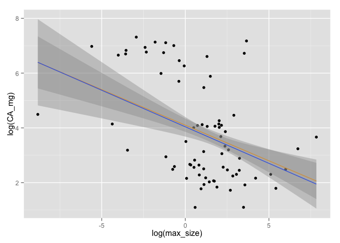
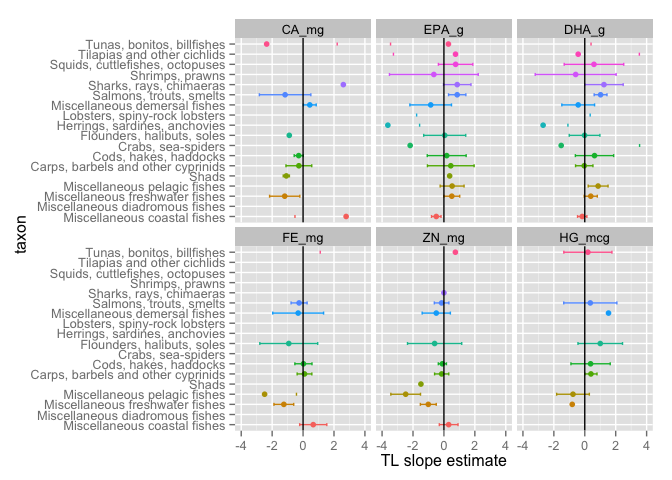
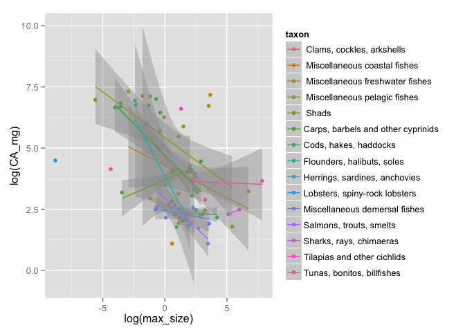
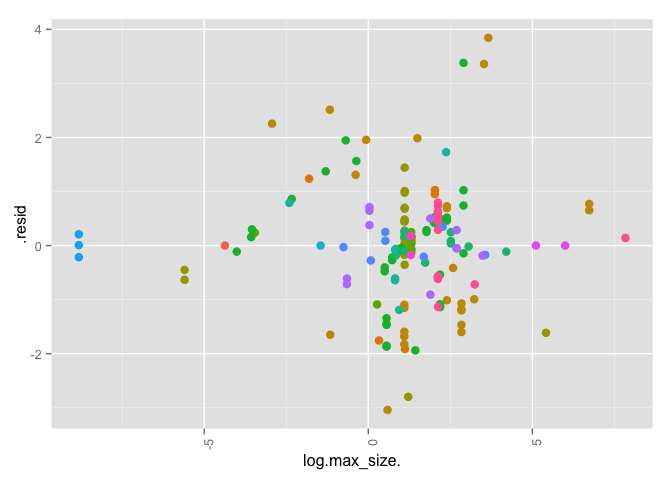
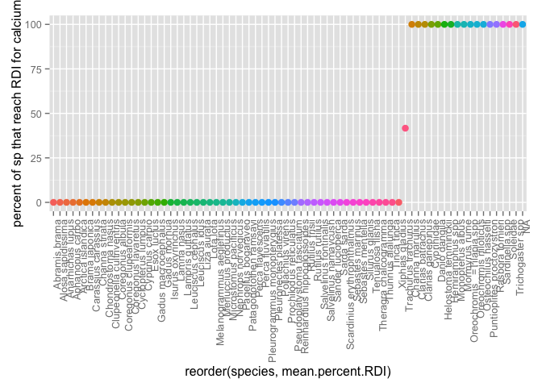

# Nutrient analysis plots and models

Some background on the project: 

*One of the most widely studied and universally important benefits that humans derive from natural ecosystems is food provisioning. Indeed, many coastal human communities rely on wild harvests from local aquatic ecosystems to meet nutritional requirements for macronutrients, such as protein and fats, and micronutrients, such as vitamins and minerals. The value of a fish species in terms of human nutrition benefits can be quantified as the nutrient content in an edible portion relative to Recommended Daily Intake (RDI) values. The RDI is the daily intake level of a nutrient that is considered to be sufficient to meet the requirements of 97–98% of healthy individuals in every demographic. Although fisheries productivity is studied extensively, there has been surprisingly little consideration of the drivers of the nutritional quality of fisheries yields.*

Thus, the main questions I'll be adressing with this data are: 

1. What is the range of nutrient content across species? 
2. Does nutrient content vary with fish species' traits such as body size or trophic level? 

To do this I'll take a model selection approach, wherein I'll compare models which contain different species' traits as parameters to see which models fit the data best, and thus which species traits vary with nutrient content. 

I've collected nutrient and fish trait data from the peer-reviewed literature and databases such as [FishBase](https://en.wikipedia.org/wiki/FishBase). 

#### Loading required packages.

```r
library(ggplot2)
library(plotrix)
library(broom)
library(ggthemes)
suppressPackageStartupMessages(library(dplyr))
library(knitr)
suppressPackageStartupMessages(library(Hmisc))
suppressPackageStartupMessages(library(robustbase))
library(tidyr)

nut <- read.csv("~/Desktop/Nutrient_databases/nut_sept22_lwr_dec3.csv", comment.char="#", stringsAsFactors=TRUE, na.strings=c("",".","NA"))
ntbl <- tbl_df(nut)
```

#### Data cleaning and wrangling

Let's change variable names to more intuitive names.


```r
 ntbl <- ntbl %>%
  mutate(HG_mcg = as.numeric(HG_mcg)) %>% 
   rename(species = ASFIS.Scientific.name,
         taxon = ISSCAAP_cat,
         max_length = SLMAX) 
```

Pull out variables we will use in this analysis. 


```r
ntbl <- ntbl %>%
  select(species, taxon, max_length, TL, CA_mg, EPA_g, DHA_g, ZN_mg, HG_mcg, lwA, lwB, Habitat, Subgroup, Abs_lat)
```

Convert max length to max body size using length-weight conversion (W = a × L^b). For more information about this conversion approach, see this [explanation](http://www.fishbase.ca/manual/FishBaseThe_LENGTH_WEIGHT_Table.htm) on FishBase. 

```r
ntbl <- ntbl %>%
  mutate(max_size = (lwA * (max_length^lwB)/1000))
```

Let's clean up the df to trim out any NA values, because they were giving me some trouble. This just makes fitting the models easier. Here I'm removing any rows that have missing info for any of my variables of interest. Here I'll create two tbl_dfs which I'll call on later. One will be for calcium (a nutrient essential for bone formation and ion regulation in fish), and EPA, an omega-3 fatty acid. 

```r
ntbl.CA <- ntbl %>%
  filter(!is.na(max_size)) %>% 
  filter(!is.na(CA_mg)) %>% 
  filter(!is.na(taxon))

ntbl.EPA <- ntbl %>%
  filter(!is.na(Abs_lat)) %>% 
  filter(!is.na(EPA_g)) %>% 
  filter(!is.na(taxon))

ntbl.HG <- ntbl %>%
  filter(!is.na(Abs_lat)) %>% 
  filter(!is.na(HG_mcg)) %>% 
  filter(!is.na(taxon))

str(ntbl.HG)
```

```
## Classes 'tbl_df', 'tbl' and 'data.frame':	100 obs. of  15 variables:
##  $ species   : Factor w/ 433 levels "Abramis brama",..: 1 1 9 15 23 31 31 45 53 53 ...
##  $ taxon     : Factor w/ 29 levels " Clams, cockles, arkshells",..: 8 8 6 18 1 8 8 5 8 8 ...
##  $ max_length: num  82 82 62 150 11 120 120 61 64 64 ...
##  $ TL        : num  2.9 2.9 3.19 3.2 2 4.5 4.5 4.4 3.1 3.1 ...
##  $ CA_mg     : num  53 52 14.4 6.8 62.9 70 70 8.8 59 57 ...
##  $ EPA_g     : num  NA NA NA NA NA NA NA NA NA NA ...
##  $ DHA_g     : num  NA NA NA NA NA NA NA NA NA NA ...
##  $ ZN_mg     : num  1 0.9 0.379 0.78 0.84 ...
##  $ HG_mcg    : num  60 24 54 25 8 68 64 14 68 68 ...
##  $ lwA       : num  0.00871 0.00871 0.0065 0.00347 0.02301 ...
##  $ lwB       : num  3.14 3.14 2.96 3.22 2.63 ...
##  $ Habitat   : Factor w/ 3 levels "brackish","freshwater",..: 2 2 2 3 3 2 2 3 2 2 ...
##  $ Subgroup  : Factor w/ 3 levels "Crustacean","Finfish",..: 2 2 2 2 3 2 2 2 2 2 ...
##  $ Abs_lat   : num  41.5 41.5 46 64 64 ...
##  $ max_size  : num  8.9001 8.9001 1.308 35.265 0.0127 ...
```


#### Exploring the range of variability in nutrient content among fish taxa 


First, I'll write out our models. The question I'm asking here is: Does calcium content of fish tissues vary with the body size of the fish? I.e. are smaller fish (such as sardines) better sources of calcium than large fish (such as tuna)? So, I'll fit a model of calcium content as a function of body size. 


Here is a function that will allow me to run a lm for any set of variables:

```r
lm_gen<- function(df, y, x, ...) {
#   lm_formula <-
#     substitute(y ~ x,
#                list(y = substitute(y), x = substitute(x)))
  lm_form_char <- paste0(y, " ~ ", x)
  lm_formula <- as.formula(lm_form_char)
  # browser()
  # eval(lm(lm_formula, data = df, ...))
  lm(lm_formula, data = df, ...)
}

lm_gen(ntbl.CA, "log(max_size)", "log(CA_mg)") #' here I test it with calcium as function of max body size. looks like it works!
```

```
## 
## Call:
## lm(formula = lm_formula, data = df)
## 
## Coefficients:
## (Intercept)   log(CA_mg)  
##      3.4799      -0.6187
```


Here's an even more general function for fitting lms (thanks to Jenny's [post](http://stat545-ubc.github.io/block025_lm-poly.html) for this code). I think this is about as general it's going to get! Nice, it looks like this works. 

```r
lm_general<- function(df, y, x, ...) {
  lm_formula <-
    substitute(y ~ x,
               list(y = substitute(y), x = substitute(x)))
  eval(lm(lm_formula, data = df, ...))
}

lm_general(ntbl.CA, log(max_size), log(CA_mg))
```

```
## 
## Call:
## lm(formula = lm_formula, data = df)
## 
## Coefficients:
## (Intercept)   log(CA_mg)  
##      3.4799      -0.6187
```

```r
size.fits3 <- ntbl.CA %>% group_by(taxon) %>% do(tidy(lm_general(., log(max_size), log(CA_mg))))
(size.fits3)
```

```
## Source: local data frame [28 x 6]
## Groups: taxon [15]
## 
##                                 taxon        term  estimate std.error
##                                (fctr)       (chr)     (dbl)     (dbl)
## 1           Clams, cockles, arkshells (Intercept) -4.368365       NaN
## 2        Miscellaneous coastal fishes (Intercept)  2.938447 1.4589489
## 3        Miscellaneous coastal fishes  log(CA_mg) -0.500871 0.3403379
## 4     Miscellaneous freshwater fishes (Intercept)  3.119484 0.8580236
## 5     Miscellaneous freshwater fishes  log(CA_mg) -0.337518 0.2047178
## 6        Miscellaneous pelagic fishes (Intercept)  7.024622 1.9301798
## 7        Miscellaneous pelagic fishes  log(CA_mg) -1.240157 0.3569467
## 8                               Shads (Intercept) -6.465633 2.5608105
## 9                               Shads  log(CA_mg)  1.890944 0.6541407
## 10 Carps, barbels and other cyprinids (Intercept)  4.351822 0.7231912
## ..                                ...         ...       ...       ...
## Variables not shown: statistic (dbl), p.value (dbl)
```


Now let's apply the CA as function of body size to each of the taxa separately.


```r
size.fitsCA <- ntbl.CA %>% group_by(taxon) %>% do(tidy(lm_gen(., "log(CA_mg)", "log(max_size)"), conf.int = TRUE))

#' And here I plot the slope estimates for each taxon.
ggplot(subset(size.fitsCA, term == "log(max_size)"), aes(estimate, taxon, color = taxon)) +
    geom_point() +
    geom_errorbarh(aes(xmin = conf.low, xmax = conf.high, height = .3)) +
    geom_vline() + theme(legend.position="none") + xlab("body size slope estimate")
```

 


#### repeating for the other nutrients

```r
# nuts <- ntbl %>% names %>% .[5:8]
# 
# indep_var <- lapply(nuts, function(nutname) paste0("log(", nutname, ")"))
# 
# names(indep_var) <- nuts
# 
# responses <- indep_var


# for (k in nuts[[1]]){
#   responses[[k]] <- ntbl %>% 
#     group_by(taxon) %>% 
#     do(tidy(lm_gen(.,
#                    y = indep_var[[k]],
#                    x = "log(max_size)"),
#             conf.int = TRUE))
# }


ntbl %>% 
  gather("nutrient", "value", CA_mg:HG_mcg) %>% 
  group_by(taxon, nutrient) %>% 
  mutate(logmass = log(max_size),
         lognutr = log(value)) %>% 
  filter(!is.na(value)) %>% 
  filter(!is.na(logmass)) %>% 
  do(tidy(lm(lognutr ~ logmass, data = .),
          conf.int = TRUE)
     ) %>% 
  filter(term == "logmass") %>% 
  ggplot(aes(estimate, taxon, color = taxon)) +
    geom_point() +
    geom_errorbarh(aes(xmin = conf.low, xmax = conf.high, height = .3)) +
    geom_vline() + theme(legend.position="none") + xlab("body size slope estimate") +
  facet_wrap(~nutrient) + scale_x_continuous(limits=c(-2, 2))
```

 

```r
ggsave("slope_estimates.png")
```

```
## Saving 7 x 5 in image
```

```r
#' now for trophic level subset(dftm, C!="Foo")
ntbl %>% 
  filter(taxon!= "Miscellaneous diadromous fishes") %>% 
  gather("nutrient", "value", CA_mg:HG_mcg) %>% 
  group_by(taxon, nutrient) %>% 
  mutate(lognutr = log(value)) %>% 
  filter(!is.na(value)) %>% 
  filter(!is.na(TL)) %>% 
  do(tidy(lm(lognutr ~ TL, data = .),
          conf.int = TRUE)
     ) %>% 
  filter(term == "TL") %>% 
  ggplot(aes(estimate, taxon, color = taxon)) +
    geom_point() +
    geom_errorbarh(aes(xmin = conf.low, xmax = conf.high, height = .3)) +
    geom_vline() + theme(legend.position="none") + xlab("TL slope estimate") +
  facet_wrap(~nutrient) + scale_x_continuous(limits=c(-4, 4))
```

 

```r
ggsave("slope_estimates.png")
```

```
## Saving 7 x 5 in image
```


Mercury

```r
ntbl.HG <- ntbl %>%
  filter(!is.na(HG_mcg)) %>% 
  filter(!is.na(taxon)) %>% 
  filter(!is.na(TL))

size.HG <- tidy(lm(log(HG_mcg) ~ TL, data = ntbl.HG), conf.int = TRUE)

summary(size.HG)
```

```
##      term              estimate        std.error        statistic    
##  Length:2           Min.   :0.2455   Min.   :0.1056   Min.   :2.326  
##  Class :character   1st Qu.:0.8587   1st Qu.:0.1776   1st Qu.:3.457  
##  Mode  :character   Median :1.4718   Median :0.2497   Median :4.588  
##                     Mean   :1.4718   Mean   :0.2497   Mean   :4.588  
##                     3rd Qu.:2.0849   3rd Qu.:0.3218   3rd Qu.:5.720  
##                     Max.   :2.6980   Max.   :0.3938   Max.   :6.851  
##     p.value             conf.low         conf.high     
##  Min.   :1.000e-09   Min.   :0.03589   Min.   :0.4552  
##  1st Qu.:5.553e-03   1st Qu.:0.50588   1st Qu.:1.2114  
##  Median :1.111e-02   Median :0.97586   Median :1.9677  
##  Mean   :1.111e-02   Mean   :0.97586   Mean   :1.9677  
##  3rd Qu.:1.666e-02   3rd Qu.:1.44585   3rd Qu.:2.7239  
##  Max.   :2.221e-02   Max.   :1.91583   Max.   :3.4802
```

```r
ggplot(ntbl.HG, aes(TL, log(HG_mcg))) + stat_summary(fun.y= "mean", geom = "point") + stat_smooth(method = "lm")
```

 

```r
TL.fitsHG <- ntbl.HG %>% group_by(taxon) %>% do(tidy(lm_general(., log(HG_mcg), TL), conf.int = TRUE))


#' And here I plot the slope estimates for each taxon.
ggplot(subset(TL.fitsHG, term == "TL"), aes(estimate, taxon, color = taxon)) +
    geom_point() +
    geom_errorbarh(aes(xmin = conf.low, xmax = conf.high, height = .3)) +
    geom_vline() + theme(legend.position="none") + xlab("TL slope estimate")
```

 


Let's plot those two fits. Neither one looks all that great at this point. 

```r
ntbl.CA %>% ggplot(aes(x = log(max_size), y = log(CA_mg), color=taxon)) + stat_summary(fun.y= "mean", geom = "point") + geom_smooth(method = 'lm')
```

 

Residuals, grouped by taxon.

```r
ntbl.CA %>%
  group_by(taxon) %>% 
  do(augment(lm(log(CA_mg) ~ log(max_size), data = .),
          conf.int = TRUE)) %>% 
ggplot(., aes(x= taxon, y=.resid, color = taxon)) + geom_point(size = 3) + theme(axis.text.x = element_text(angle = 90, hjust = 1)) + theme(legend.position="none")
```

 

And now, plot the residuals, by size. Well at least this doesn't look too funnel-shaped or anything too weird. That's somewhat reassuring!

```r
ntbl.CA %>%
  group_by(taxon) %>% 
  do(augment(lm(log(CA_mg) ~ log(max_size), data = .),
          conf.int = TRUE)) %>% 
ggplot(., aes(x= log.max_size., y=.resid, color = taxon)) + geom_point(size = 3) + theme(axis.text.x = element_text(angle = 90, hjust = 1)) + theme(legend.position="none")
```

 

Here's a function for finding the max residuals. This function allows us to figure out which taxon has the highest residual values...an indication of worst fit. Again, here we see that the group 'Miscellaneous freshwater fishes' has the highest residuals, i.e. worst fit to the linear model, which does make sense since it's the most 'grab bag' of the groups, being 'miscellaneous' and all. 

```r
mean_resid <- function(df) {
    size.fit <- lm(log(CA_mg) ~ log(max_size), df)
    x <- mean(abs(resid(size.fit)))
    y <- setNames(data.frame(t(x)), c("mean_residual"))
    y
}

mean_resid(ntbl.CA %>% filter(Habitat == "marine"))
```

```
##   mean_residual
## 1       1.12163
```

```r
resid_1 <- ntbl.CA %>%
group_by(taxon) %>% 
do(mean_resid(.)) %>% 
  unnest(mean_residual) %>% 
  arrange(desc(mean_residual))
(resid_1)
```

```
## Source: local data frame [15 x 2]
## 
##                                 taxon mean_residual
##                                (fctr)         (dbl)
## 1     Miscellaneous freshwater fishes     1.4097088
## 2        Miscellaneous coastal fishes     1.2239459
## 3  Carps, barbels and other cyprinids     0.8418547
## 4          Flounders, halibuts, soles     0.8390861
## 5        Miscellaneous pelagic fishes     0.7570829
## 6          Tunas, bonitos, billfishes     0.5991824
## 7             Salmons, trouts, smelts     0.4584627
## 8       Miscellaneous demersal fishes     0.1958452
## 9                               Shads     0.1942327
## 10        Tilapias and other cichlids     0.1755142
## 11              Cods, hakes, haddocks     0.1451338
## 12      Lobsters, spiny-rock lobsters     0.1437684
## 13          Clams, cockles, arkshells     0.0000000
## 14      Herrings, sardines, anchovies     0.0000000
## 15            Sharks, rays, chimaeras     0.0000000
```

Now let's run the same models, but group by habitat. Tidy as before. Weird! Both the marine and freshwater groups show significant negative slopes and the brackish group shows a positive relationship between calcium content and body size. I can think of no biological explanation for this!

```r
  tidy.fit.hab <- ntbl.CA %>%
  group_by(Habitat) %>% 
  do(tidy(lm(log(CA_mg) ~ log(max_size), data = .),
          conf.int = TRUE)) 

  
  ggplot(subset(tidy.fit.hab, term == "log(max_size)"), aes(estimate, Habitat, color = Habitat)) +
    geom_point() +
    geom_errorbarh(aes(xmin = conf.low, xmax = conf.high, height = .3)) +
    geom_vline() + theme(legend.position="none")
```

 


##### Putting nutrient variability in the context of human nutrition

Now, let's explore some of the variability in nutrient content that we saw above, but this time in the context of how this matters to humans: recommended daily intake (RDI) values. Recommended daily intake values may be familiar to you in the context of those numbers printed on food products' nutrition labels (i.e. one serving of milk gives you 30% of your RDI of calcium). These target intake values are typically set by a country's government nutritionists. 

Let's find the % of each taxon that, in one portion, has EPA (an omega-3 fatty acid) values above RDI. 

So, for one taxon, what would this look like?

```r
#' Let's try for one taxon
EPA.RDI <- ntbl.EPA %>%
  filter(taxon == "Salmons, trouts, smelts") %>% 
  mutate(RDI = ifelse(EPA_g > 0.25, 1, 0)) %>% 
  group_by(species) %>% 
 mutate(per.RDI = sum(RDI)/n_distinct(EPA_g)) %>% 
  mutate(mean.per.RDI= mean(per.RDI))    
```
Here's a function for calculating the percentage of species in a taxon that reach 25% of RDI in a single portion (i.e. 100g of fish tissue). 

```r
epa.prop <- function(df) {
  (EPA.RDI <- df %>%
  mutate(RDI = ifelse(EPA_g > 0.25, 1, 0)) %>% 
  group_by(species) %>% 
 mutate(per.RDI = sum(RDI)/n_distinct(EPA_g)) %>% 
  mutate(mean.per.RDI= mean(per.RDI))) 
}
```

Here it is applied to my dataset, grouped by taxon, and unnested, summarised etc. The final output that I want is the percentage of fish species in each taxon that reaches a threshold of 25% of RDI in one portion.

```r
epa.prp <- ntbl.EPA %>%
  do(EPA.prp=epa.prop(.)) %>% 
    unnest(EPA.prp) %>%
  group_by(taxon) %>% 
  summarise(meanRDI = mean(mean.per.RDI)) %>% 
  mutate(mean.percent.RDI = meanRDI * 100) %>% 
  arrange(mean.percent.RDI)
```

And this graph shows these percentages ordered by increasing percentage. Yahoo! Success!

```r
ggplot(epa.prp, aes(x = reorder(taxon, mean.percent.RDI), y = mean.percent.RDI, color = taxon)) + geom_point(size = 3) + theme(axis.text.x = element_text(angle = 90, hjust = 1)) + theme(legend.position="none")
```

 

```r
head(epa.prp)
```

```
## Source: local data frame [6 x 3]
## 
##                              taxon meanRDI mean.percent.RDI
##                             (fctr)   (dbl)            (dbl)
## 1        Clams, cockles, arkshells       0                0
## 2  Miscellaneous diadromous fishes       0                0
## 3           Freshwater crustaceans       0                0
## 4       King crabs, squat-lobsters       0                0
## 5    Krill, planktonic crustaceans       0                0
## 6                          Oysters       0                0
```
    


```r
ntbl.DHA <- ntbl %>%
  filter(!is.na(Abs_lat)) %>% 
  filter(!is.na(DHA_g)) %>% 
  filter(!is.na(taxon))

ggplot(ntbl, aes(x=taxon, y=DHA_g)) + geom_point(size = 3) + theme(axis.text.x = element_text(angle = 90, hjust = 1)) +geom_hline(aes(yintercept=0.25))
```

```
## Warning: Removed 672 rows containing missing values (geom_point).
```

 

```r
dha.prop <- function(df) {
  (DHA.RDI <- df %>%
  mutate(RDI = ifelse(DHA_g > 0.25, 1, 0)) %>% 
  group_by(species) %>% 
 mutate(per.RDI = sum(RDI)/n_distinct(DHA_g)) %>% 
  mutate(mean.per.RDI= mean(per.RDI))) 
}

dha.prp <- ntbl.DHA%>%
  do(DHA.prp=dha.prop(.)) %>% 
    unnest(DHA.prp) %>%
  group_by(taxon) %>% 
  summarise(meanRDI = mean(mean.per.RDI)) %>% 
  mutate(mean.percent.RDI = meanRDI * 100) %>% 
  arrange(mean.percent.RDI)

ggplot(dha.prp, aes(x = reorder(taxon, mean.percent.RDI), y = mean.percent.RDI, color = taxon)) + geom_point(size = 3) + theme(axis.text.x = element_text(angle = 90, hjust = 1)) + theme(legend.position="none")
```

 


Now, let's look at some latitudinal patterns in EPA. Because EPA is required by aquatic species to maintain membrane fluidity at cold water temperatures, I hypothesize that EPA content would be higher in cold water fish species. Here I'm using latitude from the which the fish was caught as a proxy for cold water adaptations. OK, let's look at latitude patterns.


This figure shows how EPA content varies as a function of latitude. 

```r
p <- ggplot(subset(ntbl.EPA, Habitat == "marine"), aes(x=Abs_lat, y=log(EPA_g)))
p + stat_summary(aes(y = log(EPA_g)), fun.y=mean, geom = "point") + geom_hline(aes(yintercept=log(0.5))) + stat_smooth(method = "lm") + theme_pander() + xlab("Absolute latitude") + ylab("log EPA content, g/100g portion") + theme(legend.position="none")
```

 


Here I apply my EPA RDI function to the whole dataset and arrange the results by decreasing latitude. 

```r
epa.prp2 <- ntbl.EPA %>%
  do(EPA.prp=epa.prop(.)) %>% 
    unnest(EPA.prp) %>%
arrange(desc(Abs_lat))
```

This figure shows the percentage of each taxon that reaches RDI, as arranged by increasing latitude. This figure probably isn't the best way to visualize this, but one thing that you can see is that many of the taxa that score on the RDI scale are also lower latitude, consistent the cold water adaptation hypothesis. 


```r
ggplot(epa.prp2, aes(x = reorder(taxon, Abs_lat), y = mean.per.RDI, color = taxon)) + stat_summary(fun.y= "mean", geom = "point") + theme(axis.text.x = element_text(angle = 90, hjust = 1)) + theme(legend.position="none")
```

 
   
Here I tried to apply this function to all taxa individually, but couldn't figure out. See below for where I was getting errors.     

```r
#' this doesn't work, because I can't figure out how to pull out the right column to unnest.
#' epa.prop2 <- function(df) {
#'  (EPA.RDI <- df %>%
#'  mutate(RDI = ifelse(EPA_g > 0.25, 1, 0)) %>% 
#'  group_by(species) %>% 
#' mutate(per.RDI = sum(RDI)/n_distinct(EPA_g)) %>% 
#'  mutate(mean.per.RDI= mean(per.RDI))) %>%  
#'  unnest(.[,2]) %>% ##this is where I run into problems. 
#'  group_by(taxon) %>% 
#'  summarise(meanRDI = mean(mean.per.RDI)) %>% 
#'  mutate(mean.percent.RDI = meanRDI * 100)
#'}
#'epa.prop2(ntbl.EPA)
#'head(epa.prp)
```

OK, now we've seen that some fish species' traits (i.e. body size, latitude) are related to nutritional profile. But what if I want to uncover which traits vary with nutritional profile in a more systematic way? I could create a set of models which contain different subsets of the variables I think might influence nutritional profile, and then compare how to models fit the data. Here I write out two such candiate models. 

```r
library(MuMIn)
EPA.1 <- lm(log(EPA_g) ~ log(max_size)*TL + log(max_size)*Abs_lat + log(max_size)*Habitat, data=ntbl.EPA)
EPA.2 <- lm(log(EPA_g) ~ log(max_size)*Abs_lat + log(max_size)*Habitat, data=ntbl.EPA)

model.sel(EPA.1, EPA.2)
```

```
## Model selection table 
##        (Int) Abs_lat Hbt log(max_siz)      TL Abs_lat:log(max_siz)
## EPA.2 -1.253 0.01606   +     -0.02843                    0.0003885
## EPA.1 -1.268 0.01671   +      0.23830 0.03674            0.0001372
##       Hbt:log(max_siz) log(max_siz):TL df   logLik   AICc delta weight
## EPA.2                +                  8 -702.914 1422.2  0.00  0.652
## EPA.1                +        -0.07451 10 -701.447 1423.4  1.25  0.348
## Models ranked by AICc(x)
```

This function allows me to average the top models and then prints out a table with the relevant AIC values, and importance weights. One thing I would like it to be able to do, but haven't yet figured out, is to select the top model set and then average them, all in one function. Right now I need to do the model selection process outside the function and plop in the top models into the function. It'd be great if I could automate that process somehow!


```r
AIC.table <- function(mod1, mod2) {
  model.average <-  model.avg(mod1, mod2)
  return((msTable <- model.average$msTable))
  }

(AIC.table(EPA.1, EPA.2))
```

```
##         df    logLik     AICc    delta    weight
## 12356    8 -702.9139 1422.172 0.000000 0.6515007
## 1234567 10 -701.4473 1423.424 1.251284 0.3484993
```

