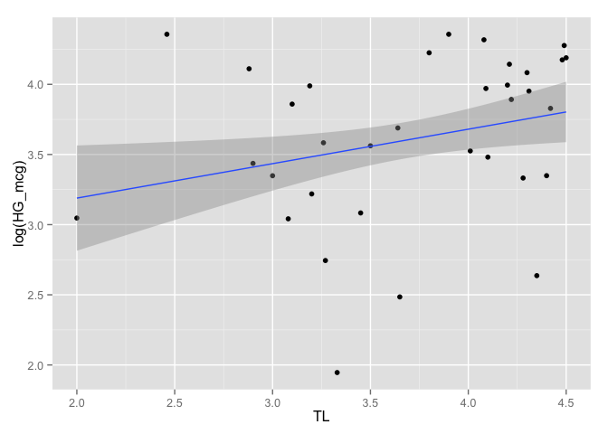
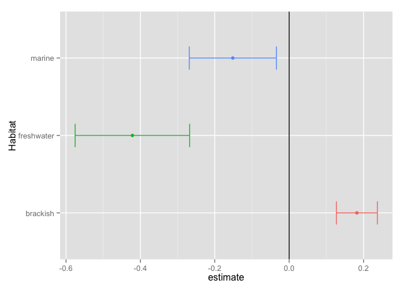
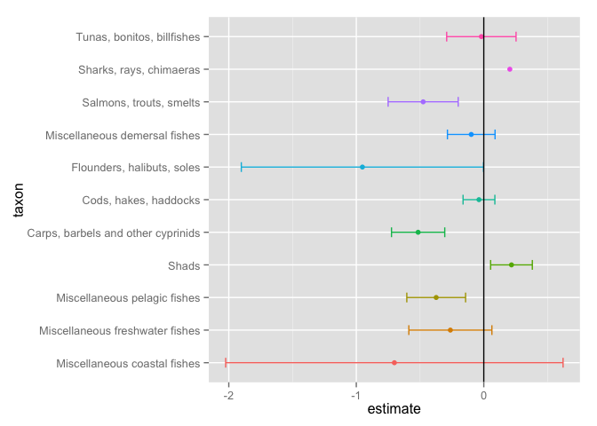
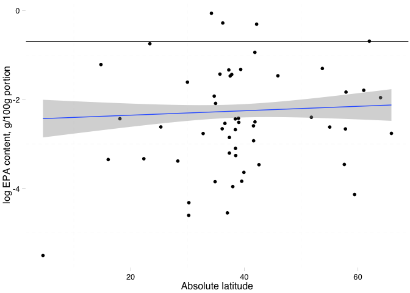

# plots and models

Oct 15: OK, what I've done so far:

fit a linear model for CA content as a function of size, separately for each taxon, and also for each habitat

I've also done the same thing using a robust lm, with quite similar fits. Only issue here is that I can't use tidy on the lmrob outputs. This is aggravating!!

Next up, compare alternative models using AIC. write a function to do this.


```r
library(ggplot2)
library(plotrix)
library(broom)
library(ggthemes)
suppressPackageStartupMessages(library(dplyr))
library(knitr)
suppressPackageStartupMessages(library(Hmisc))
suppressPackageStartupMessages(library(robustbase))
library(tidyr)

nut <- read.csv("~/Desktop/Nutrient_databases/nut_sept22_lwr_dec3.csv", comment.char="#", stringsAsFactors=TRUE, na.strings=c("",".","NA"))
ntbl <- tbl_df(nut)
```

Let's change variable names to more intuitive names.


```r
 ntbl <- ntbl %>%
  rename(species = ASFIS.Scientific.name,
         taxon = ISSCAAP_cat,
         max_length = SLMAX)
```

Pull out variables we will use in this analysis. 


```r
ntbl <- ntbl %>%
  select(species, taxon, max_length, TL, CA_mg, EPA_g, DHA_g, ZN_mg, HG_mcg, lwA, lwB, Habitat, Subgroup, Abs_lat)
```

Convert max length to max body size using length-weight conversion (W = a × L^b). For more information about this conversion approach, see this [explanation](http://www.fishbase.ca/manual/FishBaseThe_LENGTH_WEIGHT_Table.htm) on FishBase. 

```r
ntbl <- ntbl %>%
  mutate(max_size = (lwA * (max_length^lwB)/1000))
```

Let's clean up the df to trim out any NA values, because they were giving me some trouble. This just makes fitting the models easier. Here I'm removing any rows that have missing info for any of my variables of interest. 

```r
ntbl.CA <- ntbl %>%
  filter(!is.na(max_size)) %>% 
  filter(!is.na(CA_mg)) %>% 
  filter(!is.na(taxon))
```

First things, first, let's write out our models. Here we are interested in comparing the fits of the linear model using OLS and the robust fit, using robustbase. 

```r
size.fit.lm <- lm(log(CA_mg) ~ log(max_size), ntbl.CA)
size.fit.lmrob <- lmrob(log(CA_mg) ~ log(max_size), ntbl.CA)
```

let's compare the fits of these two models

```r
lm.table <- cbind(summary(size.fit.lm)$coeff, confint(size.fit.lm))
knitr::kable(lm.table, align = 'c', format = 'markdown', digits = 4)
```


|              | Estimate | Std. Error | t value | Pr(>&#124;t&#124;) |  2.5 %  | 97.5 %  |
|:-------------|:--------:|:----------:|:-------:|:------------------:|:-------:|:-------:|
|(Intercept)   |  4.0985  |   0.1236   | 33.1643 |         0          | 3.8544  | 4.3426  |
|log(max_size) | -0.2600  |   0.0471   | -5.5216 |         0          | -0.3531 | -0.1670 |

```r
lmrob.table <- cbind(summary(size.fit.lmrob)$coeff, confint(size.fit.lmrob))
knitr::kable(lmrob.table, align = 'c', format = 'markdown', digits = 4)
```


|              | Estimate | Std. Error | t value | Pr(>&#124;t&#124;) |  2.5 %  | 97.5 %  |
|:-------------|:--------:|:----------:|:-------:|:------------------:|:-------:|:-------:|
|(Intercept)   |  4.0395  |   0.1813   | 22.2781 |       0e+00        | 3.6814  | 4.3976  |
|log(max_size) | -0.2670  |   0.0737   | -3.6250 |       4e-04        | -0.4125 | -0.1215 |

Let's plot those

```r
cols <- c('lm() fit' = 'orange', 'lmrob() fit' = 'royalblue')
ntbl.CA %>% ggplot(aes(x = log(max_size), y = log(CA_mg))) + stat_summary(fun.y= "mean", geom = "point") + geom_smooth(aes(color = 'lm() fit'), method = 'lm') + geom_smooth(aes(color = 'lmrob() fit'), method = 'lmrob') +  scale_colour_manual(name="Linear Fits", values=cols)
```

 

OK, now set up the initial function

```r
size.fit <- function(df) {
  (CA.fit <- lm(log(CA_mg) ~ log(max_size), df))
}
```

Here is a slightly more general function to do the same thing. More general in that here we allow the nutrient to be variable.

```r
size.fit2 <- function(df, nutrient) {
  model <- lm(log(nutrient) ~ log(max_size), data = df)
  y   = coef(model)[2]
  ylo = confint(model)[2]
  yhi = confint(model)[4]
  setNames(data.frame(t(c(y, ylo, yhi))), c("beta", "ylo", "yhi"))
}


size.fit2(ntbl.CA, ntbl.CA$CA_mg)
```

```
##         beta        ylo        yhi
## 1 -0.2600487 -0.3530635 -0.1670339
```

```r
test<- ntbl.CA %>%  
  group_by(taxon) %>% 
  do(size.fit2(., .$CA_mg)) %>% 
  ungroup() %>% 
  arrange(desc(beta))
```

```
## Warning in qt(a, object$df.residual): NaNs produced
```

```
## Warning in qt(a, object$df.residual): NaNs produced
```

```
## Warning in qt(a, object$df.residual): NaNs produced
```

```
## Warning in qt(a, object$df.residual): NaNs produced
```

```
## Warning in qt(a, object$df.residual): NaNs produced
```

```
## Warning in qt(a, object$df.residual): NaNs produced
```

```r
test  
```

```
## Source: local data frame [15 x 4]
## 
##                                 taxon        beta         ylo          yhi
##                                (fctr)       (dbl)       (dbl)        (dbl)
## 1                               Shads  0.21708865  0.05346372  0.380713576
## 2             Sharks, rays, chimaeras  0.20415019         NaN          NaN
## 3          Tunas, bonitos, billfishes -0.01902145 -0.29107574  0.253032847
## 4               Cods, hakes, haddocks -0.03791203 -0.16263333  0.086809273
## 5       Miscellaneous demersal fishes -0.09844436 -0.28519516  0.088306435
## 6     Miscellaneous freshwater fishes -0.26217407 -0.58790934  0.063561198
## 7        Miscellaneous pelagic fishes -0.37334532 -0.60381916 -0.142871482
## 8             Salmons, trouts, smelts -0.47549595 -0.75030801 -0.200683891
## 9  Carps, barbels and other cyprinids -0.51506580 -0.72391948 -0.306212120
## 10       Miscellaneous coastal fishes -0.70131198 -2.02438810  0.621764140
## 11         Flounders, halibuts, soles -0.95205118 -1.90178944 -0.002312919
## 12          Clams, cockles, arkshells          NA          NA           NA
## 13      Herrings, sardines, anchovies          NA          NA           NA
## 14      Lobsters, spiny-rock lobsters          NA          NA           NA
## 15        Tilapias and other cichlids          NA          NA           NA
```

```r
test$taxon <- factor(test$taxon, levels=unique(test$taxon))
ggplot(test, aes(x=taxon, y=beta, ymin=ylo, ymax=yhi)) +
  geom_pointrange() + 
  coord_flip() + 
  geom_hline(aes(x=0), lty=2) +
  xlab('taxon') +
  ylab('Regression Coefficient') 
```

```
## Warning: Removed 1 rows containing missing values (geom_segment).
```

```
## Warning: Removed 1 rows containing missing values (geom_segment).
```

```
## Warning: Removed 1 rows containing missing values (geom_point).
```

```
## Warning: Removed 1 rows containing missing values (geom_segment).
```

```
## Warning: Removed 1 rows containing missing values (geom_point).
```

```
## Warning: Removed 1 rows containing missing values (geom_segment).
```

```
## Warning: Removed 1 rows containing missing values (geom_point).
```

```
## Warning: Removed 1 rows containing missing values (geom_segment).
```

```
## Warning: Removed 1 rows containing missing values (geom_point).
```

 

And now a more general function for fitting lms

```r
lm_general<- function(df, y, x, ...) {
  lm_formula <-
    substitute(y ~ x,
               list(y = substitute(y), x = substitute(x)))
  eval(lm(lm_formula, data = df, ...))
}

lm_general(ntbl.CA, log(max_size), log(CA_mg))
```

```
## 
## Call:
## lm(formula = lm_formula, data = df)
## 
## Coefficients:
## (Intercept)   log(CA_mg)  
##      3.4799      -0.6187
```

```r
size.fits3 <- ntbl.CA %>% group_by(taxon) %>% do(tidy(lm_general(., log(max_size), log(CA_mg))))
```

```
## Warning in summary.lm(x): essentially perfect fit: summary may be
## unreliable
```

```r
(size.fits3)
```

```
## Source: local data frame [28 x 6]
## Groups: taxon [15]
## 
##                                 taxon        term  estimate std.error
##                                (fctr)       (chr)     (dbl)     (dbl)
## 1           Clams, cockles, arkshells (Intercept) -4.368365       NaN
## 2        Miscellaneous coastal fishes (Intercept)  2.938447 1.4589489
## 3        Miscellaneous coastal fishes  log(CA_mg) -0.500871 0.3403379
## 4     Miscellaneous freshwater fishes (Intercept)  3.119484 0.8580236
## 5     Miscellaneous freshwater fishes  log(CA_mg) -0.337518 0.2047178
## 6        Miscellaneous pelagic fishes (Intercept)  7.024622 1.9301798
## 7        Miscellaneous pelagic fishes  log(CA_mg) -1.240157 0.3569467
## 8                               Shads (Intercept) -6.465633 2.5608105
## 9                               Shads  log(CA_mg)  1.890944 0.6541407
## 10 Carps, barbels and other cyprinids (Intercept)  4.351822 0.7231912
## ..                                ...         ...       ...       ...
## Variables not shown: statistic (dbl), p.value (dbl)
```


same function, just using robustlm

```r
size.fit.rob <- function(df) {
  (CA.fit <- lmrob(log(CA_mg) ~ log(max_size), df))
}
```

use the function, group by taxon

```r
size.fits.lm <- ntbl.CA %>%
  group_by(taxon) %>% 
  do(fit=size.fit(.))
size.fits.lm
```

```
## Source: local data frame [15 x 2]
## Groups: <by row>
## 
##                                 taxon     fit
##                                (fctr)   (chr)
## 1           Clams, cockles, arkshells <S3:lm>
## 2        Miscellaneous coastal fishes <S3:lm>
## 3     Miscellaneous freshwater fishes <S3:lm>
## 4        Miscellaneous pelagic fishes <S3:lm>
## 5                               Shads <S3:lm>
## 6  Carps, barbels and other cyprinids <S3:lm>
## 7               Cods, hakes, haddocks <S3:lm>
## 8          Flounders, halibuts, soles <S3:lm>
## 9       Herrings, sardines, anchovies <S3:lm>
## 10      Lobsters, spiny-rock lobsters <S3:lm>
## 11      Miscellaneous demersal fishes <S3:lm>
## 12            Salmons, trouts, smelts <S3:lm>
## 13            Sharks, rays, chimaeras <S3:lm>
## 14        Tilapias and other cichlids <S3:lm>
## 15         Tunas, bonitos, billfishes <S3:lm>
```

Here, let's tidy the parameter estimates

```r
tidy.fits.lm <- size.fits.lm %>% 
  tidy(fit, conf.int = TRUE)
```

```
## Warning in qt(a, object$df.residual): NaNs produced
```

```
## Warning in qt(a, object$df.residual): NaNs produced
```

```
## Warning in qt(a, object$df.residual): NaNs produced
```

```r
head(tidy.fits.lm)
```

```
## Source: local data frame [6 x 8]
## Groups: taxon [3]
## 
##                              taxon          term   estimate std.error
##                             (fctr)         (chr)      (dbl)     (dbl)
## 1        Clams, cockles, arkshells   (Intercept)  4.1415462       NaN
## 2        Clams, cockles, arkshells   (Intercept)  4.1415462       NaN
## 3     Miscellaneous coastal fishes   (Intercept)  4.6305332 0.8014623
## 4     Miscellaneous coastal fishes log(max_size) -0.7013120 0.4765360
## 5  Miscellaneous freshwater fishes   (Intercept)  4.2901387 0.4295241
## 6  Miscellaneous freshwater fishes log(max_size) -0.2621741 0.1590188
## Variables not shown: statistic (dbl), p.value (dbl), conf.low (dbl),
##   conf.high (dbl)
```

```r
augment.fits.lm <- size.fits.lm %>% augment(fit)
```

plot the residuals, by taxon

```r
ggplot(augment.fits.lm, aes(x= taxon, y=.resid, color = taxon)) + geom_point(size = 3) + theme(axis.text.x = element_text(angle = 90, hjust = 1)) 
```

 

plot the residuals, by size

```r
ggplot(augment.fits.lm, aes(x= log.max_size., y=.resid, color = taxon)) + geom_point(size = 3) + theme(axis.text.x = element_text(angle = 90, hjust = 1)) 
```

 

Let's plot those estimates! This is the most satisfying plot yet! From this plot, we can clearly see for which taxa there is a positive or negative relationship between body size and calcium content. 

```r
  ggplot(subset(tidy.fits.lm, term == "log(max_size)"), aes(estimate, taxon, color = taxon)) +
    geom_point() +
    geom_errorbarh(aes(xmin = conf.low, xmax = conf.high, height = .3)) +
    geom_vline() + theme(legend.position="none")
```

 

Now let's run the same models, but group by habitat. Tidy as before. 

```r
  size.hab <- ntbl.CA %>%
  group_by(Habitat) %>% 
  do(fit=size.fit(.))

tidy.fit.hab <- size.hab %>% 
  tidy(fit, conf.int = TRUE)

  
  ggplot(subset(tidy.fit.hab, term == "log(max_size)"), aes(estimate, Habitat, color = Habitat)) +
    geom_point() +
    geom_errorbarh(aes(xmin = conf.low, xmax = conf.high, height = .3)) +
    geom_vline()
```

 


Now let's try to fit with a robust approach.

```r
#' MASS::rlm(x ~ y, data = df)$coefficients
  
  lmrob.fit <- lmrob(log(CA_mg) ~ log(max_size), ntbl)
  lm.fit <- lm(log(CA_mg) ~ log(max_size), ntbl)
  rlm.fit <- MASS::rlm(log(CA_mg) ~ log(max_size), ntbl.CA, model = TRUE, x.ret = TRUE, y.ret = FALSE)
  
  summary(rlm.fit)
```

```
## 
## Call: rlm(formula = log(CA_mg) ~ log(max_size), data = ntbl.CA, model = TRUE, 
##     x.ret = TRUE, y.ret = FALSE)
## Residuals:
##     Min      1Q  Median      3Q     Max 
## -2.7803 -1.0348  0.1450  0.9159  4.1060 
## 
## Coefficients:
##               Value   Std. Error t value
## (Intercept)    4.0296  0.1283    31.4017
## log(max_size) -0.2625  0.0489    -5.3682
## 
## Residual standard error: 1.465 on 159 degrees of freedom
```

```r
  tidy.rlm.fit <- tidy(rlm.fit)
head(tidy.rlm.fit)
```

```
##            term   estimate  std.error statistic
## 1   (Intercept)  4.0295580 0.12832278 31.401737
## 2 log(max_size) -0.2625197 0.04890304 -5.368168
```

```r
  summary(lmrob.fit)
```

```
## 
## Call:
## lmrob(formula = log(CA_mg) ~ log(max_size), data = ntbl)
##  \--> method = "MM"
## Residuals:
##     Min      1Q  Median      3Q     Max 
## -2.7463 -1.0273  0.1675  0.7722  4.0487 
## 
## Coefficients:
##               Estimate Std. Error t value Pr(>|t|)    
## (Intercept)    3.97813    0.18236  21.814  < 2e-16 ***
## log(max_size) -0.23281    0.07202  -3.233  0.00148 ** 
## ---
## Signif. codes:  0 '***' 0.001 '**' 0.01 '*' 0.05 '.' 0.1 ' ' 1
## 
## Robust residual standard error: 1.368 
## Multiple R-squared:  0.1343,	Adjusted R-squared:  0.1291 
## Convergence in 14 IRWLS iterations
## 
## Robustness weights: 
##  4 weights are ~= 1. The remaining 166 ones are summarized as
##    Min. 1st Qu.  Median    Mean 3rd Qu.    Max. 
##  0.3609  0.8797  0.9548  0.9088  0.9841  0.9989 
## Algorithmic parameters: 
##        tuning.chi                bb        tuning.psi        refine.tol 
##         1.548e+00         5.000e-01         4.685e+00         1.000e-07 
##           rel.tol         solve.tol       eps.outlier             eps.x 
##         1.000e-07         1.000e-07         5.882e-04         1.605e-11 
## warn.limit.reject warn.limit.meanrw 
##         5.000e-01         5.000e-01 
##      nResample         max.it       best.r.s       k.fast.s          k.max 
##            500             50              2              1            200 
##    maxit.scale      trace.lev            mts     compute.rd fast.s.large.n 
##            200              0           1000              0           2000 
##                   psi           subsampling                   cov 
##            "bisquare"         "nonsingular"         ".vcov.avar1" 
## compute.outlier.stats 
##                  "SM" 
## seed : int(0)
```

```r
  summary(lm.fit)
```

```
## 
## Call:
## lm(formula = log(CA_mg) ~ log(max_size), data = ntbl)
## 
## Residuals:
##     Min      1Q  Median      3Q     Max 
## -2.8159 -1.1021  0.0944  0.6965  3.9693 
## 
## Coefficients:
##               Estimate Std. Error t value Pr(>|t|)    
## (Intercept)    4.04591    0.11876  34.068  < 2e-16 ***
## log(max_size) -0.22962    0.04393  -5.227 5.06e-07 ***
## ---
## Signif. codes:  0 '***' 0.001 '**' 0.01 '*' 0.05 '.' 0.1 ' ' 1
## 
## Residual standard error: 1.404 on 168 degrees of freedom
##   (1018 observations deleted due to missingness)
## Multiple R-squared:  0.1399,	Adjusted R-squared:  0.1348 
## F-statistic: 27.32 on 1 and 168 DF,  p-value: 5.064e-07
```

```r
  summary(rlm.fit)
```

```
## 
## Call: rlm(formula = log(CA_mg) ~ log(max_size), data = ntbl.CA, model = TRUE, 
##     x.ret = TRUE, y.ret = FALSE)
## Residuals:
##     Min      1Q  Median      3Q     Max 
## -2.7803 -1.0348  0.1450  0.9159  4.1060 
## 
## Coefficients:
##               Value   Std. Error t value
## (Intercept)    4.0296  0.1283    31.4017
## log(max_size) -0.2625  0.0489    -5.3682
## 
## Residual standard error: 1.465 on 159 degrees of freedom
```

```r
  lmrob.table <- cbind(summary(lmrob.fit)$coeff, confint(lmrob.fit))
  lm.table <- cbind(summary(lm.fit)$coeff, confint(lm.fit))
  knitr::kable(lmrob.table, align = 'c', format = 'markdown', digits = 4)
```


|              | Estimate | Std. Error | t value | Pr(>&#124;t&#124;) |  2.5 %  | 97.5 %  |
|:-------------|:--------:|:----------:|:-------:|:------------------:|:-------:|:-------:|
|(Intercept)   |  3.9781  |   0.1824   | 21.8142 |       0.0000       | 3.6181  | 4.3381  |
|log(max_size) | -0.2328  |   0.0720   | -3.2328 |       0.0015       | -0.3750 | -0.0906 |

```r
  knitr::kable(lm.table, align = 'c', format = 'markdown', digits = 4)
```


|              | Estimate | Std. Error | t value | Pr(>&#124;t&#124;) |  2.5 %  | 97.5 %  |
|:-------------|:--------:|:----------:|:-------:|:------------------:|:-------:|:-------:|
|(Intercept)   |  4.0459  |   0.1188   | 34.0685 |         0          | 3.8115  | 4.2804  |
|log(max_size) | -0.2296  |   0.0439   | -5.2269 |         0          | -0.3163 | -0.1429 |

```r
(tidy.lmrob.fit <- tidy(lmrob.table))
```

```
##       .rownames   Estimate Std..Error   t.value     Pr...t..     X2.5..
## 1   (Intercept)  3.9781269 0.18236436 21.814168 6.934470e-51  3.6181059
## 2 log(max_size) -0.2328128 0.07201683 -3.232756 1.475822e-03 -0.3749874
##       X97.5..
## 1  4.33814795
## 2 -0.09063825
```

```r
tidy(summary(lmrob.fit)$coeff, conf.int = TRUE)
```

```
##       .rownames   Estimate Std..Error   t.value     Pr...t..
## 1   (Intercept)  3.9781269 0.18236436 21.814168 6.934470e-51
## 2 log(max_size) -0.2328128 0.07201683 -3.232756 1.475822e-03
```

```r
tidy.rlm.fit <- tidy(rlm.fit)
head(tidy.lmrob.fit)
```

```
##       .rownames   Estimate Std..Error   t.value     Pr...t..     X2.5..
## 1   (Intercept)  3.9781269 0.18236436 21.814168 6.934470e-51  3.6181059
## 2 log(max_size) -0.2328128 0.07201683 -3.232756 1.475822e-03 -0.3749874
##       X97.5..
## 1  4.33814795
## 2 -0.09063825
```

```r
results.rlm <- augment(rlm.fit)
results.rlm$.resid
```

```
##   [1] -1.00466919  0.51461763 -0.41496865 -1.01681158 -0.96164273
##   [6]  0.49556943 -1.29184783 -1.17730666 -1.25415634 -1.41667527
##  [11] -1.03479374 -1.53518183  0.51383667  0.47935050  4.10600573
##  [16]  0.76494442  0.14502471  0.07226536  1.56964169  3.61999780
##  [21] -1.75151830 -1.66441892 -1.56143653 -1.71304497 -1.71304497
##  [26] -1.37657273 -0.38577824 -0.45149631 -0.71761620 -1.51909124
##  [31]  1.57478779  2.12689292  2.33137815  3.32309731 -0.20195975
##  [36]  0.68355933  0.96642211  1.87107909 -1.33839530 -1.20486391
##  [41] -0.80860774 -0.91874555 -0.93674699 -0.78127983 -0.94424114
##  [46] -0.98949773 -0.76272415  2.77324997  1.38527619  1.56919698
##  [51]  0.03048786 -0.38628365 -0.81619890  0.37815109  0.32936092
##  [56]  0.63232819  0.63232819 -1.80472557 -0.73205598 -1.52011428
##  [61] -1.46837644 -1.59097876 -1.33881063 -1.37300200 -0.80966643
##  [66]  2.21646664  2.24669532 -2.06862193 -1.84547838 -1.64480768
##  [71]  2.74322117  3.09424958  2.79571762  0.16684402  0.66216546
##  [76]  0.73738888  2.62954512 -1.85384762 -2.78028045  0.70594434
##  [81]  0.09374020  0.39216351 -0.83504730 -0.89243087 -1.41901404
##  [86] -1.56665004 -1.33445665 -1.29805078 -0.07482892 -0.92437114
##  [91] -1.38987988 -0.15266529  2.37680606  1.73355195 -2.00745666
##  [96] -1.62618745 -1.31702008 -0.93277181 -0.91309225 -0.80942547
## [101] -1.33562527 -2.40156536 -0.99136548 -2.01709368  0.58814307
## [106]  0.53098466  0.98816127  0.95432820 -0.75041989  0.77701340
## [111] -0.97404399 -0.41395839  0.95253099 -0.41961079  0.68308699
## [116] -0.45764184  0.79161013  0.89978043 -0.41442821  0.61192999
## [121]  0.45037135  1.57669144  0.27235685  0.22192599 -0.87040529
## [126] -1.74279105  1.03371786  0.91593482  2.27861333  0.47021828
## [131]  0.44627359  0.42846223  0.46298441  0.54462840  0.16451200
## [136]  0.35033731  0.32402706  0.23195791  0.22256817  0.37079435
## [141]  0.39253620 -1.17614668 -1.08785407 -1.44856128 -0.28779814
## [146]  0.59114430  0.68645448  1.95760324  2.28419278  1.75757035
## [151]  1.31423713  2.71817053  1.97382422  0.92093418  1.23929322
## [156]  1.55363131  1.10717759  2.25481830  1.72484342  2.51570374
## [161]  1.69137465
```
Let's make a function to compare the robust and regular lm fits. Note to self: add AIC here.

```r
suppressPackageStartupMessages(require(MASS))
compare_models <- function(df, nutrient) {
  model_lm <- lm(log(nutrient) ~ log(max_size), data = df)
  lm_df <- data.frame(slope = coef(model_lm)[2], intercept = coef(model_lm)[1], model = "normal")
  model_rlm <- rlm(log(nutrient) ~ log(max_size), data = df, method = "MM")
  rlm_df <- data.frame(slope = coef(model_rlm)[2], intercept = coef(model_rlm)[1], model = "robust")
  return(rbind(lm_df, rlm_df))
}

knitr::kable(compare_models(ntbl.CA, ntbl.CA$CA_mg), format = "markdown")
```


|               |      slope| intercept|model  |
|:--------------|----------:|---------:|:------|
|log(max_size)  | -0.2600487|  4.098491|normal |
|log(max_size)1 | -0.2670055|  4.039429|robust |

OK, now let's apply this function across all taxa. OK this doesn't work...maybe because the different fitting approaches drop different numbers of taxa??

```r
#'model.comparison <- ntbl.CA %>% group_by(taxon) %>% do(model.comp = compare_models(., ntbl.CA$CA_mg))
```


Function for finding the max residuals. This function allows us to figure out which taxon has the highest residual values...an indication of worst fit. 

```r
mean_resid <- function(df) {
    size.fit <- lm(log(CA_mg) ~ log(max_size), df)
    x <- mean(abs(resid(size.fit)))
    y <- setNames(data.frame(t(x)), c("mean_residual"))
    y
}

mean_resid(ntbl.CA %>% filter(Habitat == "marine"))
```

```
##   mean_residual
## 1       1.12163
```

```r
resid_1 <- ntbl.CA %>%
group_by(taxon) %>% 
do(mean_resid(.)) %>% 
  unnest(mean_residual) %>% 
  arrange(desc(mean_residual))
(resid_1) #' here we see that the group 'Miscellaneous freshwater fishes' has the highest residuals, i.e. worst fit to the linear model, which does make sense since it's the most 'grab bag' of the groups, being 'miscellaneous' and all. 
```

```
## Source: local data frame [15 x 2]
## 
##                                 taxon mean_residual
##                                (fctr)         (dbl)
## 1     Miscellaneous freshwater fishes     1.4097088
## 2        Miscellaneous coastal fishes     1.2239459
## 3  Carps, barbels and other cyprinids     0.8418547
## 4          Flounders, halibuts, soles     0.8390861
## 5        Miscellaneous pelagic fishes     0.7570829
## 6          Tunas, bonitos, billfishes     0.5991824
## 7             Salmons, trouts, smelts     0.4584627
## 8       Miscellaneous demersal fishes     0.1958452
## 9                               Shads     0.1942327
## 10        Tilapias and other cichlids     0.1755142
## 11              Cods, hakes, haddocks     0.1451338
## 12      Lobsters, spiny-rock lobsters     0.1437684
## 13          Clams, cockles, arkshells     0.0000000
## 14      Herrings, sardines, anchovies     0.0000000
## 15            Sharks, rays, chimaeras     0.0000000
```

New function idea! Let's find the % of each taxon that has EPA values above RDI

So, for one taxon, what would this look like?

```r
ntbl.EPA <- ntbl %>%
  filter(!is.na(Abs_lat)) %>% 
  filter(!is.na(EPA_g)) %>% 
  filter(!is.na(taxon))

#' Let's try for one taxon
EPA.RDI <- ntbl.EPA %>%
  filter(taxon == "Salmons, trouts, smelts") %>% 
  mutate(RDI = ifelse(EPA_g > 0.25, 1, 0)) %>% 
  group_by(species) %>% 
 mutate(per.RDI = sum(RDI)/n_distinct(EPA_g)) %>% 
  mutate(mean.per.RDI= mean(per.RDI))    

#' Here's the function
epa.prop <- function(df) {
  (EPA.RDI <- df %>%
  mutate(RDI = ifelse(EPA_g > 0.25, 1, 0)) %>% 
  group_by(species) %>% 
 mutate(per.RDI = sum(RDI)/n_distinct(EPA_g)) %>% 
  mutate(mean.per.RDI= mean(per.RDI))) 
}

#' Here it is applied to my dataset, grouped by taxon, and unnested, summarised etc. The final output that I want is the percentage of fish species in each taxon that reaches a threshold of 25% of RDI in one portion.
epa.prp <- ntbl.EPA %>%
  do(EPA.prp=epa.prop(.)) %>% 
    unnest(EPA.prp) %>%
  group_by(taxon) %>% 
  summarise(meanRDI = mean(mean.per.RDI)) %>% 
  mutate(mean.percent.RDI = meanRDI * 100) %>% 
  arrange(mean.percent.RDI)

#' And this graph shows these percentages ordered by increasing percentage. Yahoo! Success!
ggplot(epa.prp, aes(x = reorder(taxon, mean.percent.RDI), y = mean.percent.RDI, color = taxon)) + geom_point(size = 6) + theme(axis.text.x = element_text(angle = 90, hjust = 1)) 
```

 

```r
head(epa.prp)
```

```
## Source: local data frame [6 x 3]
## 
##                              taxon meanRDI mean.percent.RDI
##                             (fctr)   (dbl)            (dbl)
## 1        Clams, cockles, arkshells       0                0
## 2  Miscellaneous diadromous fishes       0                0
## 3           Freshwater crustaceans       0                0
## 4       King crabs, squat-lobsters       0                0
## 5    Krill, planktonic crustaceans       0                0
## 6                          Oysters       0                0
```
    
 Here's let's look at latitude

```r
epa.prp2 <- ntbl.EPA %>%
  do(EPA.prp=epa.prop(.)) %>% 
    unnest(EPA.prp) %>%
arrange(desc(Abs_lat))


#' this figure shows the percentage of each taxon that reaches RDI, as arranged by increasing latitude
ggplot(epa.prp2, aes(x = reorder(taxon, Abs_lat), y = mean.per.RDI, color = taxon)) + stat_summary(fun.y= "mean", geom = "point") + theme(axis.text.x = element_text(angle = 90, hjust = 1)) 
```

 

```r
p <- ggplot(subset(ntbl.EPA, Habitat == "marine"), aes(x=Abs_lat, y=log(EPA_g)))
p + stat_summary(aes(y = log(EPA_g)), fun.y=mean, geom = "point") + geom_hline(aes(yintercept=log(0.5))) + stat_smooth(method = "lm") + theme_pander() + xlab("Absolute latitude") + ylab("log EPA content, g/100g portion")
```

 
   
    
         
this doesn't work, because I can't figure out how to pull out the right column to unnest.
epa.prop2 <- function(df) {
  (EPA.RDI <- df %>%
  mutate(RDI = ifelse(EPA_g > 0.25, 1, 0)) %>% 
  group_by(species) %>% 
 mutate(per.RDI = sum(RDI)/n_distinct(EPA_g)) %>% 
  mutate(mean.per.RDI= mean(per.RDI))) %>%  
  unnest(.[,2]) %>% ##this is where I run into problems. 
  group_by(taxon) %>% 
  summarise(meanRDI = mean(mean.per.RDI)) %>% 
  mutate(mean.percent.RDI = meanRDI * 100)
}
epa.prop2(ntbl.EPA)
head(epa.prp)


```r
library(MuMIn)
EPA.1 <- lm(log(EPA_g) ~ log(max_size)*TL + log(max_size)*Abs_lat + log(max_size)*Habitat, data=ntbl.EPA)
EPA.2 <- lm(log(EPA_g) ~ log(max_size)*Abs_lat + log(max_size)*Habitat, data=ntbl.EPA)

model.sel(EPA.1, EPA.2)
```

```
## Model selection table 
##        (Int) Abs_lat Hbt log(max_siz)      TL Abs_lat:log(max_siz)
## EPA.2 -1.253 0.01606   +     -0.02843                    0.0003885
## EPA.1 -1.268 0.01671   +      0.23830 0.03674            0.0001372
##       Hbt:log(max_siz) log(max_siz):TL df   logLik   AICc delta weight
## EPA.2                +                  8 -702.914 1422.2  0.00  0.652
## EPA.1                +        -0.07451 10 -701.447 1423.4  1.25  0.348
## Models ranked by AICc(x)
```

```r
#' this function allows me to average the top models and then prints out a table with the relevant AIC values, and importance weights. One thing I would like it to be able to do, but haven't yet figured out, is to select the top model set and then average them, all in one function. Right now I need to do the model selection process outside the function and plop in the top models into the function. It'd be great if I could automate that process somehow!
AIC.table <- function(mod1, mod2) {
  model.average <-  model.avg(mod1, mod2)
  return((msTable <- model.average$msTable))
  }

(AIC.table(EPA.1, EPA.2))
```

```
##         df    logLik     AICc    delta    weight
## 12356    8 -702.9139 1422.172 0.000000 0.6515007
## 1234567 10 -701.4473 1423.424 1.251284 0.3484993
```


