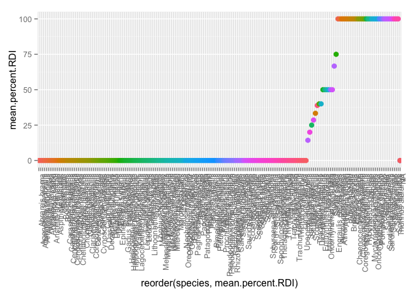
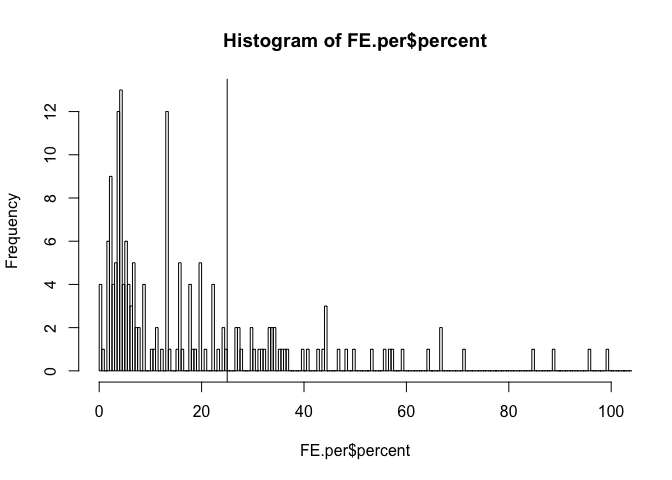

# plots and models

Welcome to my homework 4! Like last [time](https://github.com/STAT545-UBC/joanna_bernhardt/blob/master/Homework_3/Homework_3.md), I'll be using a different dataset than Gapminder. This is a dataset that I'm working with as one of my PhD projects. 

See this [issue](https://github.com/STAT545-UBC/joanna_bernhardt/issues/7), where I ask Jenny for permission to use my data, and she approves.

The data I will be using include the nutrient content (i.e. vitamins, minerals, essential fatty acids) of several hundred species of fish :blowfish: :fish: :tropical_fish:. I've also added data on fish body size, trophic level (i.e. predator, herbivore), and latitude of where the fish was caught. 

Here's some background on the project: 

*One of the most widely studied and universally important benefits that humans derive from natural ecosystems is food provisioning. Indeed, many coastal human communities rely on wild harvests from local aquatic ecosystems to meet nutritional requirements for macronutrients, such as protein and fats, and micronutrients, such as vitamins and minerals. The value of a fish species in terms of human nutrition benefits can be quantified as the nutrient content in an edible portion relative to Recommended Daily Intake (RDI) values. The RDI is the daily intake level of a nutrient that is considered to be sufficient to meet the requirements of 97–98% of healthy individuals in every demographic. Although fisheries productivity is studied extensively, there has been surprisingly little consideration of the drivers of the nutritional quality of fisheries yields.*

Thus, the main questions I'll be adressing in this data are: 

1. What is the range of nutrient content across species? 
2. Does nutrient content vary with fish species' traits such as body size or trophic level? 

To do this I'll take a model selection approach, wherein I'll compare models which contain different species' traits as parameters to see which models fit the data best, and thus which species traits vary with nutrient content. 

I've collected nutrient and fish trait data from the peer-reviewed literature and databases such as [FishBase](https://en.wikipedia.org/wiki/FishBase). 

Loading required packages.

```r
library(ggplot2)
library(plotrix)
library(broom)
library(ggthemes)
suppressPackageStartupMessages(library(dplyr))
library(knitr)
suppressPackageStartupMessages(library(Hmisc))
suppressPackageStartupMessages(library(robustbase))
library(tidyr)

nut <- read.csv("~/Desktop/Nutrient_databases/nut_sept22_lwr_dec3.csv", comment.char="#", stringsAsFactors=TRUE, na.strings=c("",".","NA"))
ntbl <- tbl_df(nut)
```

Let's change variable names to more intuitive names.


```r
 ntbl <- ntbl %>%
  rename(species = ASFIS.Scientific.name,
         taxon = ISSCAAP_cat,
         max_length = SLMAX)
```

Pull out variables we will use in this analysis. 


```r
ntbl <- ntbl %>%
  select(species, taxon, max_length, TL, CA_mg, EPA_g, DHA_g, ZN_mg, HG_mcg, lwA, lwB, Habitat, Subgroup, Abs_lat)
```

Convert max length to max body size using length-weight conversion (W = a × L^b). For more information about this conversion approach, see this [explanation](http://www.fishbase.ca/manual/FishBaseThe_LENGTH_WEIGHT_Table.htm) on FishBase. 

```r
ntbl <- ntbl %>%
  mutate(max_size = (lwA * (max_length^lwB)/1000))
```

Let's clean up the df to trim out any NA values, because they were giving me some trouble. This just makes fitting the models easier. Here I'm removing any rows that have missing info for any of my variables of interest. Here I'll create two tbl_dfs which I'll call on later. One will be for calcium (a nutrient essential for bone formation and ion regulation in fish), and EPA, an omega-3 fatty acid. 

```r
ntbl.CA <- ntbl %>%
  filter(!is.na(max_size)) %>% 
  filter(!is.na(CA_mg)) %>% 
  filter(!is.na(taxon))

ntbl.EPA <- ntbl %>%
  filter(!is.na(Abs_lat)) %>% 
  filter(!is.na(EPA_g)) %>% 
  filter(!is.na(taxon))
```


##### Exploring the range of variability in nutrient content among fish taxa 


First things, first, let's write out our models. The question I'm asking here is: Does calcium content of fish tissues vary with the body size of the fish? I.e. are smaller fish (such as sardines) better sources of calcium than large fish (such as tuna)? So, I'll fit a model of calcium content as a function of body size. 

Here I'm interested in comparing the fits of the linear model using OLS and the robust fit, using robustbase, as suggested by Jenny. 

```r
size.fit.lm <- lm(log(CA_mg) ~ log(max_size), ntbl.CA)
size.fit.lmrob <- lmrob(log(CA_mg) ~ log(max_size), ntbl.CA)
```

Let's compare the fits of these two models. As you can see from the tables below, they have pretty similar fits (similar coefficient (slope) estimates and confidence intervals). Does this mean that there aren't many crazy outliers?

```r
lm.table <- cbind(summary(size.fit.lm)$coeff, confint(size.fit.lm))
knitr::kable(lm.table, align = 'c', format = 'markdown', digits = 4)
```


|              | Estimate | Std. Error | t value | Pr(>&#124;t&#124;) |  2.5 %  | 97.5 %  |
|:-------------|:--------:|:----------:|:-------:|:------------------:|:-------:|:-------:|
|(Intercept)   |  4.0985  |   0.1236   | 33.1643 |         0          | 3.8544  | 4.3426  |
|log(max_size) | -0.2600  |   0.0471   | -5.5216 |         0          | -0.3531 | -0.1670 |

```r
lmrob.table <- cbind(summary(size.fit.lmrob)$coeff, confint(size.fit.lmrob))
knitr::kable(lmrob.table, align = 'c', format = 'markdown', digits = 4)
```


|              | Estimate | Std. Error | t value | Pr(>&#124;t&#124;) |  2.5 %  | 97.5 %  |
|:-------------|:--------:|:----------:|:-------:|:------------------:|:-------:|:-------:|
|(Intercept)   |  4.0395  |   0.1813   | 22.2781 |       0e+00        | 3.6814  | 4.3976  |
|log(max_size) | -0.2670  |   0.0737   | -3.6250 |       4e-04        | -0.4125 | -0.1215 |

Let's make a function to compare the robust and regular lm fits. Thanks to [tony_hui](https://github.com/STAT545-UBC/tony_hui) for inspiration on this model comparison code. As you can see from the table below, the fits are pretty much the same!

```r
suppressPackageStartupMessages(require(MASS))
compare_models <- function(df, nutrient) {
  model_lm <- lm(log(nutrient) ~ log(max_size), data = df)
  lm_df <- data.frame(slope = coef(model_lm)[2], intercept = coef(model_lm)[1], model = "normal")
  model_rlm <- rlm(log(nutrient) ~ log(max_size), data = df, method = "MM")
  rlm_df <- data.frame(slope = coef(model_rlm)[2], intercept = coef(model_rlm)[1], model = "robust")
  return(rbind(lm_df, rlm_df))
}

knitr::kable(compare_models(ntbl.CA, ntbl.CA$CA_mg), format = "markdown")
```


|               |      slope| intercept|model  |
|:--------------|----------:|---------:|:------|
|log(max_size)  | -0.2600487|  4.098491|normal |
|log(max_size)1 | -0.2670055|  4.039429|robust |

OK, now let's apply this function across all taxa. OK this doesn't work...maybe because the different fitting approaches drop different numbers of taxa??

```r
#'model.comparison <- ntbl.CA %>% group_by(taxon) %>% do(model.comp = compare_models(., ntbl.CA$CA_mg))
```


Let's plot those two fits. Neither one looks all that great at this point. 

```r
cols <- c('lm() fit' = 'orange', 'lmrob() fit' = 'purple')
ntbl.CA %>% ggplot(aes(x = log(max_size), y = log(CA_mg))) + stat_summary(fun.y= "mean", geom = "point") + geom_smooth(aes(color = 'lm() fit'), method = 'lm') + geom_smooth(aes(color = 'lmrob() fit'), method = 'lmrob') +  scale_colour_manual(name="model approach", values=cols)
```

 


OK, now let's set up the initial linear model function, in its simplest form. 

```r
size.fit <- function(df) {
  (CA.fit <- lm(log(CA_mg) ~ log(max_size), df))
}
```

Here is a slightly more general function to do the same thing. More general in that here we allow the nutrient to be variable. I put this together thanks to inspiration from [adam_baimel](https://github.com/STAT545-UBC/adam_baimel/issues/6#issuecomment-144514497).

```r
size.fit2 <- function(df, nutrient) {
  model <- lm(log(nutrient) ~ log(max_size), data = df)
  y   = coef(model)[2]
  ylo = confint(model)[2]
  yhi = confint(model)[4]
  setNames(data.frame(t(c(y, ylo, yhi))), c("beta", "ylo", "yhi"))
}
```

Looks like the function works for the dataset as a whole!

```r
(size.fit2(ntbl.CA, ntbl.CA$CA_mg))
```

```
##         beta        ylo        yhi
## 1 -0.2600487 -0.3530635 -0.1670339
```

Now let's apply it by groups: taxon by taxon. 

```r
test<- ntbl.CA %>%  
  group_by(taxon) %>% 
  do(size.fit2(., .$CA_mg)) %>% 
  ungroup() %>% 
  arrange(desc(beta))
```

```
## Warning in qt(a, object$df.residual): NaNs produced
```

```
## Warning in qt(a, object$df.residual): NaNs produced
```

```
## Warning in qt(a, object$df.residual): NaNs produced
```

```
## Warning in qt(a, object$df.residual): NaNs produced
```

```
## Warning in qt(a, object$df.residual): NaNs produced
```

```
## Warning in qt(a, object$df.residual): NaNs produced
```

```r
test  
```

```
## Source: local data frame [15 x 4]
## 
##                                 taxon        beta         ylo          yhi
##                                (fctr)       (dbl)       (dbl)        (dbl)
## 1                               Shads  0.21708865  0.05346372  0.380713576
## 2             Sharks, rays, chimaeras  0.20415019         NaN          NaN
## 3          Tunas, bonitos, billfishes -0.01902145 -0.29107574  0.253032847
## 4               Cods, hakes, haddocks -0.03791203 -0.16263333  0.086809273
## 5       Miscellaneous demersal fishes -0.09844436 -0.28519516  0.088306435
## 6     Miscellaneous freshwater fishes -0.26217407 -0.58790934  0.063561198
## 7        Miscellaneous pelagic fishes -0.37334532 -0.60381916 -0.142871482
## 8             Salmons, trouts, smelts -0.47549595 -0.75030801 -0.200683891
## 9  Carps, barbels and other cyprinids -0.51506580 -0.72391948 -0.306212120
## 10       Miscellaneous coastal fishes -0.70131198 -2.02438810  0.621764140
## 11         Flounders, halibuts, soles -0.95205118 -1.90178944 -0.002312919
## 12          Clams, cockles, arkshells          NA          NA           NA
## 13      Herrings, sardines, anchovies          NA          NA           NA
## 14      Lobsters, spiny-rock lobsters          NA          NA           NA
## 15        Tilapias and other cichlids          NA          NA           NA
```

Let's plot that, again, thanks to [adam_baimel](https://github.com/STAT545-UBC/adam_baimel/issues/6#issuecomment-144514497)

```r
test$taxon <- factor(test$taxon, levels=unique(test$taxon))
ggplot(test, aes(x=taxon, y=beta, ymin=ylo, ymax=yhi)) +
  geom_pointrange() + 
  coord_flip() + 
  geom_hline(aes(x=0), lty=2) +
  xlab('taxon') +
  ylab('Regression Coefficient') + theme(legend.position="none")
```

```
## Warning: Removed 1 rows containing missing values (geom_segment).
```

```
## Warning: Removed 1 rows containing missing values (geom_segment).
```

```
## Warning: Removed 1 rows containing missing values (geom_point).
```

```
## Warning: Removed 1 rows containing missing values (geom_segment).
```

```
## Warning: Removed 1 rows containing missing values (geom_point).
```

```
## Warning: Removed 1 rows containing missing values (geom_segment).
```

```
## Warning: Removed 1 rows containing missing values (geom_point).
```

```
## Warning: Removed 1 rows containing missing values (geom_segment).
```

```
## Warning: Removed 1 rows containing missing values (geom_point).
```

 


Here's the same function as my initial lm function, just using robustlm this time. 

```r
size.fit.rob <- function(df) {
  (CA.fit <- lmrob(log(CA_mg) ~ log(max_size), df))
}
```

Here we apply the function, group by taxon.

```r
size.fits.lm <- ntbl.CA %>%
  group_by(taxon) %>% 
  do(fit=size.fit(.))
size.fits.lm
```

```
## Source: local data frame [15 x 2]
## Groups: <by row>
## 
##                                 taxon     fit
##                                (fctr)   (chr)
## 1           Clams, cockles, arkshells <S3:lm>
## 2        Miscellaneous coastal fishes <S3:lm>
## 3     Miscellaneous freshwater fishes <S3:lm>
## 4        Miscellaneous pelagic fishes <S3:lm>
## 5                               Shads <S3:lm>
## 6  Carps, barbels and other cyprinids <S3:lm>
## 7               Cods, hakes, haddocks <S3:lm>
## 8          Flounders, halibuts, soles <S3:lm>
## 9       Herrings, sardines, anchovies <S3:lm>
## 10      Lobsters, spiny-rock lobsters <S3:lm>
## 11      Miscellaneous demersal fishes <S3:lm>
## 12            Salmons, trouts, smelts <S3:lm>
## 13            Sharks, rays, chimaeras <S3:lm>
## 14        Tilapias and other cichlids <S3:lm>
## 15         Tunas, bonitos, billfishes <S3:lm>
```

Here, let's tidy the parameter estimates.

```r
tidy.fits.lm <- size.fits.lm %>% 
  tidy(fit, conf.int = TRUE)
```

```
## Warning in qt(a, object$df.residual): NaNs produced
```

```
## Warning in qt(a, object$df.residual): NaNs produced
```

```
## Warning in qt(a, object$df.residual): NaNs produced
```

```r
head(tidy.fits.lm)
```

```
## Source: local data frame [6 x 8]
## Groups: taxon [3]
## 
##                              taxon          term   estimate std.error
##                             (fctr)         (chr)      (dbl)     (dbl)
## 1        Clams, cockles, arkshells   (Intercept)  4.1415462       NaN
## 2        Clams, cockles, arkshells   (Intercept)  4.1415462       NaN
## 3     Miscellaneous coastal fishes   (Intercept)  4.6305332 0.8014623
## 4     Miscellaneous coastal fishes log(max_size) -0.7013120 0.4765360
## 5  Miscellaneous freshwater fishes   (Intercept)  4.2901387 0.4295241
## 6  Miscellaneous freshwater fishes log(max_size) -0.2621741 0.1590188
## Variables not shown: statistic (dbl), p.value (dbl), conf.low (dbl),
##   conf.high (dbl)
```

```r
augment.fits.lm <- size.fits.lm %>% augment(fit)
```

Here I plot the residuals, by taxon. What this shows me is that some groups, such as the miscellaneous freshwater fishes have much higher variability and worse fit that say the tunas, bonitos and billifishes. This makes sense because some of these groups are much more closely related than others. 

```r
ggplot(augment.fits.lm, aes(x= taxon, y=.resid, color = taxon)) + geom_point(size = 3) + theme(axis.text.x = element_text(angle = 90, hjust = 1)) + theme(legend.position="none")
```

 

And now, plot the residuals, by size. Well at least this doesn't look too funnel-shaped or anything too weird. That's somewhat reassuring!

```r
ggplot(augment.fits.lm, aes(x= log.max_size., y=.resid, color = taxon)) + geom_point(size = 3) + theme(axis.text.x = element_text(angle = 90, hjust = 1)) + theme(legend.position="none")
```

 

Here's a function for finding the max residuals. This function allows us to figure out which taxon has the highest residual values...an indication of worst fit. Again, here we see that the group 'Miscellaneous freshwater fishes' has the highest residuals, i.e. worst fit to the linear model, which does make sense since it's the most 'grab bag' of the groups, being 'miscellaneous' and all. 

```r
mean_resid <- function(df) {
    size.fit <- lm(log(CA_mg) ~ log(max_size), df)
    x <- mean(abs(resid(size.fit)))
    y <- setNames(data.frame(t(x)), c("mean_residual"))
    y
}

mean_resid(ntbl.CA %>% filter(Habitat == "marine"))
```

```
##   mean_residual
## 1       1.12163
```

```r
resid_1 <- ntbl.CA %>%
group_by(taxon) %>% 
do(mean_resid(.)) %>% 
  unnest(mean_residual) %>% 
  arrange(desc(mean_residual))
(resid_1)
```

```
## Source: local data frame [15 x 2]
## 
##                                 taxon mean_residual
##                                (fctr)         (dbl)
## 1     Miscellaneous freshwater fishes     1.4097088
## 2        Miscellaneous coastal fishes     1.2239459
## 3  Carps, barbels and other cyprinids     0.8418547
## 4          Flounders, halibuts, soles     0.8390861
## 5        Miscellaneous pelagic fishes     0.7570829
## 6          Tunas, bonitos, billfishes     0.5991824
## 7             Salmons, trouts, smelts     0.4584627
## 8       Miscellaneous demersal fishes     0.1958452
## 9                               Shads     0.1942327
## 10        Tilapias and other cichlids     0.1755142
## 11              Cods, hakes, haddocks     0.1451338
## 12      Lobsters, spiny-rock lobsters     0.1437684
## 13          Clams, cockles, arkshells     0.0000000
## 14      Herrings, sardines, anchovies     0.0000000
## 15            Sharks, rays, chimaeras     0.0000000
```

Let's plot those slope estimates! This is the most satisfying plot yet! From this plot, we can clearly see for which taxa there is a positive or negative relationship between body size and calcium content. Check out that variability--some groups have less calcium as fish body size gets bigger, and others show the opposite pattern. It would be intersting to dig further into these patterns. What could the underlying biological processes responsible for these patterns?

```r
  ggplot(subset(tidy.fits.lm, term == "log(max_size)"), aes(estimate, taxon, color = taxon)) +
    geom_point() +
    geom_errorbarh(aes(xmin = conf.low, xmax = conf.high, height = .3)) +
    geom_vline() + theme(legend.position="none")
```

 

Now let's run the same models, but group by habitat. Tidy as before. Weird! Both the marine and freshwater groups show significant negative slopes and the brackish group shows a positive relationship between calcium content and body size. I can think of no biological explanation for this!

```r
  size.hab <- ntbl.CA %>%
  group_by(Habitat) %>% 
  do(fit=size.fit(.))

tidy.fit.hab <- size.hab %>% 
  tidy(fit, conf.int = TRUE)

  
  ggplot(subset(tidy.fit.hab, term == "log(max_size)"), aes(estimate, Habitat, color = Habitat)) +
    geom_point() +
    geom_errorbarh(aes(xmin = conf.low, xmax = conf.high, height = .3)) +
    geom_vline() + theme(legend.position="none")
```

 

And now, to conclude this section, here's an even more general function for fitting lms (thanks to Jenny's [post](http://stat545-ubc.github.io/block025_lm-poly.html) for this code). I think this is about as general it's going to get! Nice, it looks like this works. 

```r
lm_general<- function(df, y, x, ...) {
  lm_formula <-
    substitute(y ~ x,
               list(y = substitute(y), x = substitute(x)))
  eval(lm(lm_formula, data = df, ...))
}

lm_general(ntbl.CA, log(max_size), log(CA_mg))
```

```
## 
## Call:
## lm(formula = lm_formula, data = df)
## 
## Coefficients:
## (Intercept)   log(CA_mg)  
##      3.4799      -0.6187
```

```r
size.fits3 <- ntbl.CA %>% group_by(taxon) %>% do(tidy(lm_general(., log(max_size), log(CA_mg))))
```

```
## Warning in summary.lm(x): essentially perfect fit: summary may be
## unreliable
```

```r
(size.fits3)
```

```
## Source: local data frame [28 x 6]
## Groups: taxon [15]
## 
##                                 taxon        term  estimate std.error
##                                (fctr)       (chr)     (dbl)     (dbl)
## 1           Clams, cockles, arkshells (Intercept) -4.368365       NaN
## 2        Miscellaneous coastal fishes (Intercept)  2.938447 1.4589489
## 3        Miscellaneous coastal fishes  log(CA_mg) -0.500871 0.3403379
## 4     Miscellaneous freshwater fishes (Intercept)  3.119484 0.8580236
## 5     Miscellaneous freshwater fishes  log(CA_mg) -0.337518 0.2047178
## 6        Miscellaneous pelagic fishes (Intercept)  7.024622 1.9301798
## 7        Miscellaneous pelagic fishes  log(CA_mg) -1.240157 0.3569467
## 8                               Shads (Intercept) -6.465633 2.5608105
## 9                               Shads  log(CA_mg)  1.890944 0.6541407
## 10 Carps, barbels and other cyprinids (Intercept)  4.351822 0.7231912
## ..                                ...         ...       ...       ...
## Variables not shown: statistic (dbl), p.value (dbl)
```


##### Putting nutrient variability in the context of human nutrition

Now, let's explore some of the variability in nutrient content that we saw above, but this time in the context of how this matters to humans: recommended daily intake (RDI) values. Recommended daily intake values may be familiar to you in the context of those numbers printed on food products' nutrition labels (i.e. one serving of milk gives you 30% of your RDI of calcium). These target intake values are typically set by a country's government nutritionists. 

Let's find the % of each taxon that, in one portion, has EPA (an omega-3 fatty acid) values above RDI. 

So, for one taxon, what would this look like?

```r
#' Let's try for one taxon
EPA.RDI <- ntbl.EPA %>%
  filter(taxon == "Salmons, trouts, smelts") %>% 
  mutate(RDI = ifelse(EPA_g > 0.25, 1, 0)) %>% 
  group_by(species) %>% 
 mutate(per.RDI = sum(RDI)/n_distinct(EPA_g)) %>% 
  mutate(mean.per.RDI= mean(per.RDI))    
```
Here's a function for calculating the percentage of species in a taxon that reach 25% of RDI in a single portion (i.e. 100g of fish tissue). 

```r
epa.prop <- function(df) {
  (EPA.RDI <- df %>%
  mutate(RDI = ifelse(EPA_g > 0.25, 1, 0)) %>% 
  group_by(species) %>% 
 mutate(per.RDI = sum(RDI)/n_distinct(EPA_g)) %>% 
  mutate(mean.per.RDI= mean(per.RDI))) 
}
```

Here it is applied to my dataset, grouped by taxon, and unnested, summarised etc. The final output that I want is the percentage of fish species in each taxon that reaches a threshold of 25% of RDI in one portion.

```r
epa.prp <- ntbl.EPA %>%
  do(EPA.prp=epa.prop(.)) %>% 
    unnest(EPA.prp) %>%
  group_by(taxon) %>% 
  summarise(meanRDI = mean(mean.per.RDI)) %>% 
  mutate(mean.percent.RDI = meanRDI * 100) %>% 
  arrange(mean.percent.RDI)
```

And this graph shows these percentages ordered by increasing percentage. Yahoo! Success!

```r
ggplot(epa.prp, aes(x = reorder(taxon, mean.percent.RDI), y = mean.percent.RDI, color = taxon)) + geom_point(size = 6) + theme(axis.text.x = element_text(angle = 90, hjust = 1)) + theme(legend.position="none")
```

 

```r
head(epa.prp)
```

```
## Source: local data frame [6 x 3]
## 
##                              taxon meanRDI mean.percent.RDI
##                             (fctr)   (dbl)            (dbl)
## 1        Clams, cockles, arkshells       0                0
## 2  Miscellaneous diadromous fishes       0                0
## 3           Freshwater crustaceans       0                0
## 4       King crabs, squat-lobsters       0                0
## 5    Krill, planktonic crustaceans       0                0
## 6                          Oysters       0                0
```
    

Now, let's look at some latitudinal patterns in EPA. Because EPA is required by aquatic species to maintain membrane fluidity at cold water temperatures, I would hypothesize that EPA content would be higher in cold water fish species. Here I'm using latitude from the which the fish was caught as a proxy for cold water adaptations. OK, let's look at latitude patterns.


This figure shows how EPA content varies as a function of latitude. 

```r
p <- ggplot(subset(ntbl.EPA, Habitat == "marine"), aes(x=Abs_lat, y=log(EPA_g)))
p + stat_summary(aes(y = log(EPA_g)), fun.y=mean, geom = "point") + geom_hline(aes(yintercept=log(0.5))) + stat_smooth(method = "lm") + theme_pander() + xlab("Absolute latitude") + ylab("log EPA content, g/100g portion") + theme(legend.position="none")
```

 


Here I apply my EPA RDI function to the whole dataset and arrange the results by decreasing latitude. 

```r
epa.prp2 <- ntbl.EPA %>%
  do(EPA.prp=epa.prop(.)) %>% 
    unnest(EPA.prp) %>%
arrange(desc(Abs_lat))
```

This figure shows the percentage of each taxon that reaches RDI, as arranged by increasing latitude. This figure probably isn't the best way to visualize this, but one thing that you can see is that many of the taxa that score on the RDI scale are also lower latitude, consistent the cold water adaptation hypothesis. 


```r
ggplot(epa.prp2, aes(x = reorder(taxon, Abs_lat), y = mean.per.RDI, color = taxon)) + stat_summary(fun.y= "mean", geom = "point") + theme(axis.text.x = element_text(angle = 90, hjust = 1)) + theme(legend.position="none")
```

 
   
Here I tried to apply this function to all taxa individually, but couldn't figure out. See below for where I was getting errors.     

```r
#' this doesn't work, because I can't figure out how to pull out the right column to unnest.
#' epa.prop2 <- function(df) {
#'  (EPA.RDI <- df %>%
#'  mutate(RDI = ifelse(EPA_g > 0.25, 1, 0)) %>% 
#'  group_by(species) %>% 
#' mutate(per.RDI = sum(RDI)/n_distinct(EPA_g)) %>% 
#'  mutate(mean.per.RDI= mean(per.RDI))) %>%  
#'  unnest(.[,2]) %>% ##this is where I run into problems. 
#'  group_by(taxon) %>% 
#'  summarise(meanRDI = mean(mean.per.RDI)) %>% 
#'  mutate(mean.percent.RDI = meanRDI * 100)
#'}
#'epa.prop2(ntbl.EPA)
#'head(epa.prp)
```

OK, now we've seen that some fish species' traits (i.e. body size, latitude) are related to nutritional profile. But what if I want to uncover which traits vary with nutritional profile in a more systematic way? I could create a set of models which contain different subsets of the variables I think might influence nutritional profile, and then compare how to models fit the data. Here I write out two such candiate models. 

```r
library(MuMIn)
EPA.1 <- lm(log(EPA_g) ~ log(max_size)*TL + log(max_size)*Abs_lat + log(max_size)*Habitat, data=ntbl.EPA)
EPA.2 <- lm(log(EPA_g) ~ log(max_size)*Abs_lat + log(max_size)*Habitat, data=ntbl.EPA)

model.sel(EPA.1, EPA.2)
```

```
## Model selection table 
##        (Int) Abs_lat Hbt log(max_siz)      TL Abs_lat:log(max_siz)
## EPA.2 -1.253 0.01606   +     -0.02843                    0.0003885
## EPA.1 -1.268 0.01671   +      0.23830 0.03674            0.0001372
##       Hbt:log(max_siz) log(max_siz):TL df   logLik   AICc delta weight
## EPA.2                +                  8 -702.914 1422.2  0.00  0.652
## EPA.1                +        -0.07451 10 -701.447 1423.4  1.25  0.348
## Models ranked by AICc(x)
```

This function allows me to average the top models and then prints out a table with the relevant AIC values, and importance weights. One thing I would like it to be able to do, but haven't yet figured out, is to select the top model set and then average them, all in one function. Right now I need to do the model selection process outside the function and plop in the top models into the function. It'd be great if I could automate that process somehow!


```r
AIC.table <- function(mod1, mod2) {
  model.average <-  model.avg(mod1, mod2)
  return((msTable <- model.average$msTable))
  }

(AIC.table(EPA.1, EPA.2))
```

```
##         df    logLik     AICc    delta    weight
## 12356    8 -702.9139 1422.172 0.000000 0.6515007
## 1234567 10 -701.4473 1423.424 1.251284 0.3484993
```

#### The end! 
Thanks for sticking with me to this point. To sum up what I did and reflect on the process...I created several functions, some of which were meant to run simple linear models across the entire fish dataset, one taxon at a time. Another function was meant to compare the fits of the OLS lm and the robust lm fits. From that, I saw that the two approaches yielded quite similar results. I also examined how the slope estimates and model fits, via residual analysis, varied across taxa. I saw, not suprisingly, that the groups that contained a more diverse set of species, showed higher variability. 

Also, I wrote some functions to see how taxa vary in terms of the number of species that reach RDI in a single portion. Interestingly, there is quite high variability in nutrient content! That means that not all fish are created equal when it comes to nutrition. Some are much better sources of key nutrients than others.

Finally, I wrote a function that could help me in the model selection process, by comparing AIC values.

Upon reflection, what caused me the most trouble was figuring out how to put out the relevant parameters from the model fitting attempts. Also, I have to give credit to some of my classmates Tony Hui, Matt Strimas-Mackey and Adam Baimel, from whom I took some nice code :) It is certainly really helpful to be able to learn/copy from my peers...

