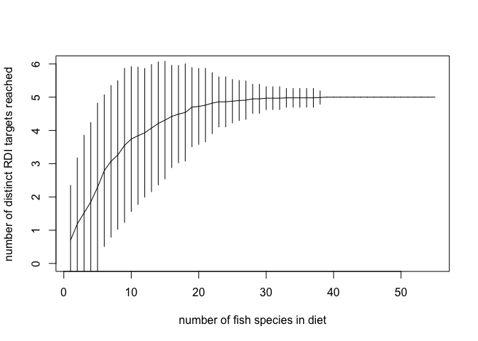
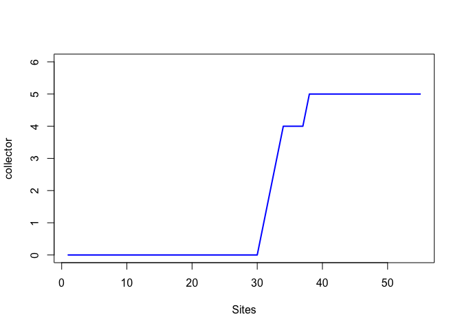
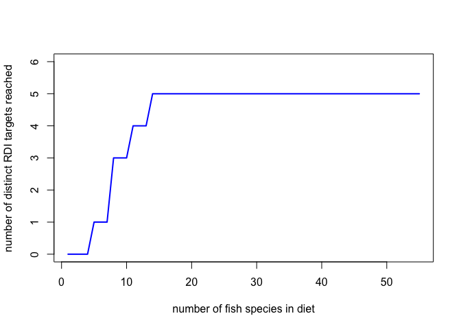

# rarefaction_practice


```r
###Rarefaction
suppressPackageStartupMessages(library(dplyr))
library(readr)
suppressPackageStartupMessages(library(vegan))
```

Examples from Jenna Jacob's website

```r
# ##### Examples from Jenna Jacob's website:
# # source("http://www.jennajacobs.org/R/rarefaction.txt")
# #Try this example dataset from Work et al (2010):
# # 1) import the emend dataset from my website
# emend<-read.csv("http://www.jennajacobs.org/R/EMEND.csv", row.names=1)
# 
# # 2) load the vegan library
# library(vegan)
# 
# # 3) The the rarefaction function
# source("C:\\Program Files\\R\\functions\\rarefaction.txt")
# #or 
# source("http://www.jennajacobs.org/R/rarefaction.txt")
# 
# # 4) Rarefy your dataset
# emend.rare<-rarefaction(emend, col=F) # I'm a big fan of B&W
# 
# 
# # 5) The rarefaction function creates 3 objects to access them type
# 
# emend.rare$richness # a matrix of the mean richness at each subsample
# emend.rare$SE  # a matrix of the iterative SE of the mean richness at each subsample
# emend.rare$subsample # the subsample sizes used to find the means
# 
# # You can then use these files to create pretty graphs in R or if you must you can export then with
# # 
# # write.csv(emend.rare$richness, file="EMENDrichness.csv")
```

### With my data now:
Load the data (which is posted in the Nutrient_Analysis repo)

```r
ntbl <- read_csv("ntbl.csv")
```


Step 1. create RDI target matrix, unordered in terms of increasing number of RDI targets reached.

```r
ntbl.RDI <- ntbl %>% 
  group_by(species) %>% 
  summarise(mean.CA = mean(CA_mg, na.rm = TRUE),
            mean.EPA = mean(EPA_g, na.rm = TRUE), 
            mean.DHA = mean(DHA_g, na.rm = TRUE), 
            mean.ZN = mean(ZN_mg, na.rm = TRUE), 
            mean.FE = mean(FE_mg, na.rm = TRUE)) %>% 
  mutate(RDI.CA = ifelse(mean.CA > 300, 1, 0)) %>% 
  mutate(RDI.FE = ifelse(mean.FE > 4.5, 1, 0)) %>% 
  mutate(RDI.ZN = ifelse(mean.ZN > 2.75, 1, 0)) %>% 
  mutate(RDI.EPA = ifelse(mean.EPA > 0.25, 1, 0)) %>% 
  mutate(RDI.DHA = ifelse(mean.DHA > 0.25, 1, 0)) %>% 
  mutate(RDI.micro.tot = rowSums(.[7:11])) %>% 
  filter(!is.na(RDI.micro.tot)) %>% 
  arrange(., RDI.micro.tot) %>% 
  select(., 7:11)
```

Step 2. create RDI target matrix, ordered

```r
ntbl.RDI.no <- ntbl %>% 
  group_by(species) %>% 
  summarise(mean.CA = mean(CA_mg, na.rm = TRUE),
            mean.EPA = mean(EPA_g, na.rm = TRUE), 
            mean.DHA = mean(DHA_g, na.rm = TRUE), 
            mean.ZN = mean(ZN_mg, na.rm = TRUE), 
            mean.FE = mean(FE_mg, na.rm = TRUE)) %>% 
  mutate(RDI.CA = ifelse(mean.CA > 300, 1, 0)) %>% 
  mutate(RDI.FE = ifelse(mean.FE > 4.5, 1, 0)) %>% 
  mutate(RDI.ZN = ifelse(mean.ZN > 2.75, 1, 0)) %>% 
  mutate(RDI.EPA = ifelse(mean.EPA > 0.25, 1, 0)) %>% 
  mutate(RDI.DHA = ifelse(mean.DHA > 0.25, 1, 0)) %>% 
  mutate(RDI.micro.tot = rowSums(.[7:11])) %>% 
  filter(!is.na(RDI.micro.tot)) %>% 
  # arrange(., RDI.micro.tot) %>% 
  select(., 7:11)
```

### Create SACs
Option 1: SAC method = random

```r
spa.rand <- specaccum(ntbl.RDI, method = "random")
plot(spa.rand, ylim = c(0,6))
```

 

Option 2: SAC method = collector, adding species arranged in ascending order of total number of RDI targets reached. 

```r
spa.coll <- specaccum(ntbl.RDI, method = "collector")
plot(spa.coll, ci.type="poly", col="blue", lwd=2, ci.lty=0, ci.col="lightblue", ylim = c(0,6)) #males a prettier plot
```

 

Option 3: SAC method = collector, adding species arranged in alphabetical order.

```r
spa.coll <- specaccum(ntbl.RDI.no, method = "collector")
plot(spa.coll, ci.type="poly", col="blue", lwd=2, ci.lty=0, ci.col="lightblue", ylim = c(0,6)) #males a prettier plot
```

 

Below was my attempt to make a SAC with the nutrient quantitative values as species


```r
# ### turn the RDI matrix into integer values in micrograms
# RDI.um <- RDI.mat %>% 
#   mutate_each(funs(um = .*1000)) %>% 
#   mutate_each(funs(um = as.integer(.)))
# 
# RDI.rare <- rarefaction(RDI.um)

RDI.rare <- rarefy(ntbl.RDI, 2, MARGIN = 2)
RDI.rare
```

```
##  RDI.CA  RDI.FE  RDI.ZN RDI.EPA RDI.DHA 
##       2       2       2       2       2 
## attr(,"Subsample")
## [1] 2
```
