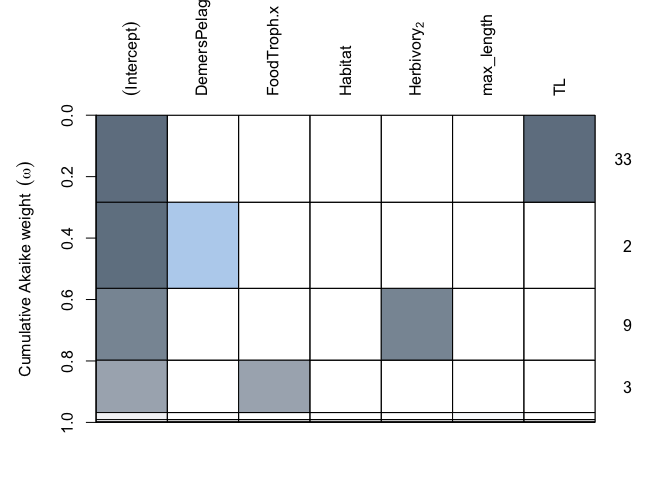
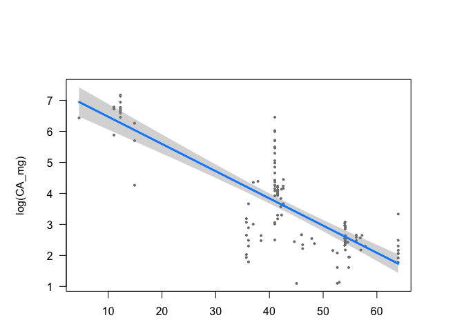
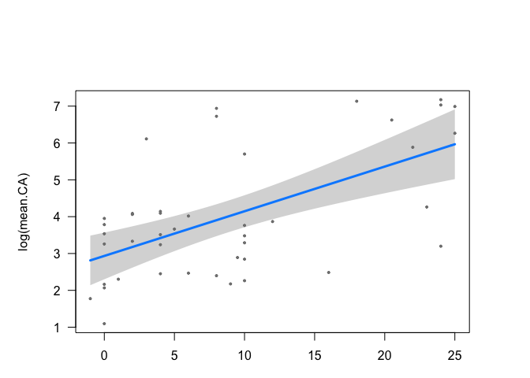
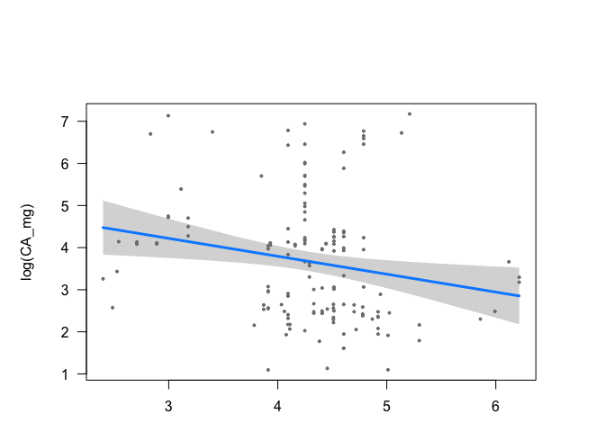
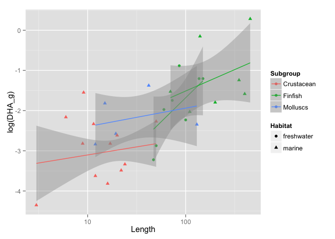
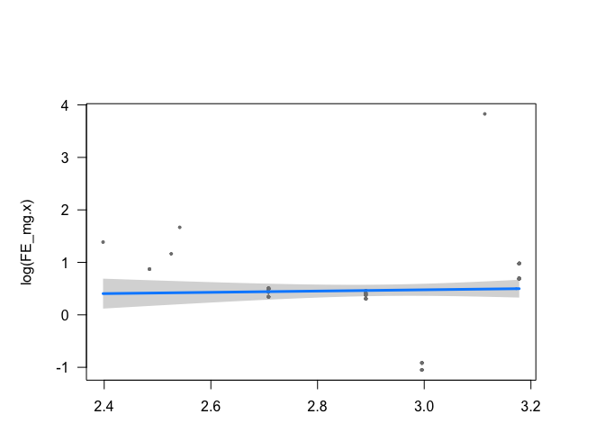
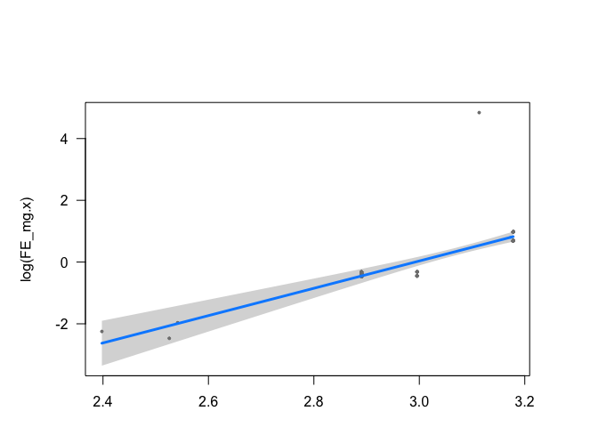

# rfishbase-models

Load packages

```r
library(devtools)
library(rfishbase)
library(ggplot2)
library(plyr)
suppressPackageStartupMessages(library(dplyr))
library(knitr)
library(tidyr)
library(readr)
library(ggthemes)
library(MuMIn)
library(visreg)
```

Load the data

```r
fb.all <- read_csv("/Users/Joey/Documents/Nutrient_Analysis/data/fb.all.csv")
length(unique(fb.all$species))
```

```
## [1] 281
```

```r
names(fb.all)
```

```
##   [1] "species"              "taxon"                "max_size"            
##   [4] "max_length"           "TL"                   "CA_mg"               
##   [7] "EPA_g"                "DHA_g"                "FE_mg"               
##  [10] "ZN_mg"                "HG_mcg"               "FAT"                 
##  [13] "PROTCNT_g"            "lwA"                  "lwB"                 
##  [16] "Habitat"              "Subgroup"             "Abs_lat"             
##  [19] "Genus"                "Species"              "SpeciesRefNo"        
##  [22] "Author"               "FBname"               "PicPreferredName"    
##  [25] "PicPreferredNameM"    "PicPreferredNameF"    "PicPreferredNameJ"   
##  [28] "FamCode"              "Subfamily"            "GenCode"             
##  [31] "SubGenCode"           "BodyShapeI"           "Source"              
##  [34] "AuthorRef"            "Remark"               "TaxIssue"            
##  [37] "Fresh"                "Brack"                "Saltwater"           
##  [40] "DemersPelag"          "AnaCat"               "MigratRef"           
##  [43] "DepthRangeShallow"    "DepthRangeDeep"       "DepthRangeRef"       
##  [46] "DepthRangeComShallow" "DepthRangeComDeep"    "DepthComRef"         
##  [49] "LongevityWild"        "LongevityWildRef"     "LongevityCaptive"    
##  [52] "LongevityCapRef"      "Vulnerability"        "Length"              
##  [55] "LTypeMaxM"            "LengthFemale"         "LTypeMaxF"           
##  [58] "MaxLengthRef"         "CommonLength"         "LTypeComM"           
##  [61] "CommonLengthF"        "LTypeComF"            "CommonLengthRef"     
##  [64] "Weight"               "WeightFemale"         "MaxWeightRef"        
##  [67] "Pic"                  "PictureFemale"        "LarvaPic"            
##  [70] "EggPic"               "ImportanceRef"        "Importance"          
##  [73] "PriceCateg"           "PriceReliability"     "Remarks7"            
##  [76] "LandingStatistics"    "Landings"             "MainCatchingMethod"  
##  [79] "II"                   "MSeines"              "MGillnets"           
##  [82] "MCastnets"            "MTraps"               "MSpears"             
##  [85] "MTrawls"              "MDredges"             "MLiftnets"           
##  [88] "MHooksLines"          "MOther"               "UsedforAquaculture"  
##  [91] "LifeCycle"            "AquacultureRef"       "UsedasBait"          
##  [94] "BaitRef"              "Aquarium"             "AquariumFishII"      
##  [97] "AquariumRef"          "GameFish"             "GameRef"             
## [100] "Dangerous"            "DangerousRef"         "Electrogenic"        
## [103] "ElectroRef"           "Complete"             "GoogleImage"         
## [106] "Comments"             "Profile"              "PD50"                
## [109] "Emblematic"           "Entered.x"            "DateEntered"         
## [112] "Modified.x"           "DateModified"         "Expert.x"            
## [115] "DateChecked"          "TS.x"                 "SpecCode.x"          
## [118] "StockCode.x"          "DietTroph.x"          "DietSeTroph.x"       
## [121] "FoodTroph.x"          "FoodSeTroph.x"        "SpecCode.y"          
## [124] "autoctr"              "StockCode.y"          "EcologyRefNo"        
## [127] "HabitatsRef"          "Neritic"              "SupraLittoralZone"   
## [130] "Saltmarshes"          "LittoralZone"         "TidePools"           
## [133] "Intertidal"           "SubLittoral"          "Caves"               
## [136] "Oceanic"              "Epipelagic"           "Mesopelagic"         
## [139] "Bathypelagic"         "Abyssopelagic"        "Hadopelagic"         
## [142] "Estuaries"            "Mangroves"            "MarshesSwamps"       
## [145] "CaveAnchialine"       "Stream"               "Lakes"               
## [148] "Cave"                 "Cave2"                "Herbivory2"          
## [151] "HerbivoryRef"         "FeedingType"          "FeedingTypeRef"      
## [154] "DietTroph.y"          "DietSeTroph.y"        "DietTLu"             
## [157] "DietseTLu"            "DietRemark"           "DietRef"             
## [160] "FoodTroph.y"          "FoodSeTroph.y"        "FoodRemark"          
## [163] "FoodRef"              "AddRems"              "AssociationRef"      
## [166] "Parasitism"           "Solitary"             "Symbiosis"           
## [169] "Symphorism"           "Commensalism"         "Mutualism"           
## [172] "Epiphytic"            "Schooling"            "SchoolingFrequency"  
## [175] "SchoolingLifestage"   "Shoaling"             "ShoalingFrequency"   
## [178] "ShoalingLifestage"    "SchoolShoalRef"       "AssociationsWith"    
## [181] "AssociationsRemarks"  "OutsideHost"          "OHRemarks"           
## [184] "InsideHost"           "IHRemarks"            "SubstrateRef"        
## [187] "Benthic"              "Sessile"              "Mobile"              
## [190] "Demersal"             "Endofauna"            "Pelagic"             
## [193] "Megabenthos"          "Macrobenthos"         "Meiobenthos"         
## [196] "SoftBottom"           "Sand"                 "Coarse"              
## [199] "Fine"                 "Level"                "Sloping"             
## [202] "Silt"                 "Mud"                  "Ooze"                
## [205] "Detritus"             "Organic"              "HardBottom"          
## [208] "Rocky"                "Rubble"               "SpecialHabitatRef"   
## [211] "Macrophyte"           "BedsBivalve"          "BedsRock"            
## [214] "SeaGrassBeds"         "BedsOthers"           "CoralReefs"          
## [217] "ReefExclusive"        "DropOffs"             "ReefFlats"           
## [220] "Lagoons"              "Burrows"              "Tunnels"             
## [223] "Crevices"             "Vents"                "Seamounts"           
## [226] "DeepWaterCorals"      "Vegetation"           "Leaves"              
## [229] "Stems"                "Roots"                "Driftwood"           
## [232] "OInverterbrates"      "OIRemarks"            "Verterbrates"        
## [235] "VRemarks"             "Pilings"              "BoatHulls"           
## [238] "Corals"               "SoftCorals"           "OnPolyp"             
## [241] "BetweenPolyps"        "HardCorals"           "OnExoskeleton"       
## [244] "InterstitialSpaces"   "Entered.y"            "Dateentered"         
## [247] "Modified.y"           "Datemodified"         "Expert.y"            
## [250] "Datechecked"          "TS.y"                 "SpecCode"
```

```r
temps.fb <- read_csv("/Users/Joey/Documents/Nutrient_Analysis/data/temps.fb.csv")
temps.fb <- select(temps.fb, -SpecCode)
temps.fb <- temps.fb %>% 
  dplyr::rename(species = sciname) %>% 
  mutate(species = as.factor(species))
fb.temps <- inner_join(fb.all, temps.fb, by = "species")
```

```
## Warning in inner_join_impl(x, y, by$x, by$y): joining character vector and
## factor, coercing into character vector
```

```r
names(fb.temps)
```

```
##   [1] "species"              "taxon"                "max_size"            
##   [4] "max_length"           "TL"                   "CA_mg"               
##   [7] "EPA_g"                "DHA_g"                "FE_mg"               
##  [10] "ZN_mg"                "HG_mcg"               "FAT"                 
##  [13] "PROTCNT_g"            "lwA"                  "lwB"                 
##  [16] "Habitat"              "Subgroup"             "Abs_lat"             
##  [19] "Genus"                "Species"              "SpeciesRefNo"        
##  [22] "Author"               "FBname"               "PicPreferredName"    
##  [25] "PicPreferredNameM"    "PicPreferredNameF"    "PicPreferredNameJ"   
##  [28] "FamCode"              "Subfamily"            "GenCode"             
##  [31] "SubGenCode"           "BodyShapeI"           "Source"              
##  [34] "AuthorRef"            "Remark"               "TaxIssue"            
##  [37] "Fresh"                "Brack"                "Saltwater"           
##  [40] "DemersPelag"          "AnaCat"               "MigratRef"           
##  [43] "DepthRangeShallow"    "DepthRangeDeep"       "DepthRangeRef"       
##  [46] "DepthRangeComShallow" "DepthRangeComDeep"    "DepthComRef"         
##  [49] "LongevityWild"        "LongevityWildRef"     "LongevityCaptive"    
##  [52] "LongevityCapRef"      "Vulnerability"        "Length"              
##  [55] "LTypeMaxM"            "LengthFemale"         "LTypeMaxF"           
##  [58] "MaxLengthRef"         "CommonLength"         "LTypeComM"           
##  [61] "CommonLengthF"        "LTypeComF"            "CommonLengthRef"     
##  [64] "Weight"               "WeightFemale"         "MaxWeightRef"        
##  [67] "Pic"                  "PictureFemale"        "LarvaPic"            
##  [70] "EggPic"               "ImportanceRef"        "Importance"          
##  [73] "PriceCateg"           "PriceReliability"     "Remarks7"            
##  [76] "LandingStatistics"    "Landings"             "MainCatchingMethod"  
##  [79] "II"                   "MSeines"              "MGillnets"           
##  [82] "MCastnets"            "MTraps"               "MSpears"             
##  [85] "MTrawls"              "MDredges"             "MLiftnets"           
##  [88] "MHooksLines"          "MOther"               "UsedforAquaculture"  
##  [91] "LifeCycle"            "AquacultureRef"       "UsedasBait"          
##  [94] "BaitRef"              "Aquarium"             "AquariumFishII"      
##  [97] "AquariumRef"          "GameFish"             "GameRef"             
## [100] "Dangerous"            "DangerousRef"         "Electrogenic"        
## [103] "ElectroRef"           "Complete"             "GoogleImage"         
## [106] "Comments"             "Profile"              "PD50"                
## [109] "Emblematic"           "Entered.x"            "DateEntered"         
## [112] "Modified.x"           "DateModified"         "Expert.x"            
## [115] "DateChecked"          "TS.x"                 "SpecCode.x"          
## [118] "StockCode.x"          "DietTroph.x"          "DietSeTroph.x"       
## [121] "FoodTroph.x"          "FoodSeTroph.x"        "SpecCode.y"          
## [124] "autoctr"              "StockCode.y"          "EcologyRefNo"        
## [127] "HabitatsRef"          "Neritic"              "SupraLittoralZone"   
## [130] "Saltmarshes"          "LittoralZone"         "TidePools"           
## [133] "Intertidal"           "SubLittoral"          "Caves"               
## [136] "Oceanic"              "Epipelagic"           "Mesopelagic"         
## [139] "Bathypelagic"         "Abyssopelagic"        "Hadopelagic"         
## [142] "Estuaries"            "Mangroves"            "MarshesSwamps"       
## [145] "CaveAnchialine"       "Stream"               "Lakes"               
## [148] "Cave"                 "Cave2"                "Herbivory2"          
## [151] "HerbivoryRef"         "FeedingType"          "FeedingTypeRef"      
## [154] "DietTroph.y"          "DietSeTroph.y"        "DietTLu"             
## [157] "DietseTLu"            "DietRemark"           "DietRef"             
## [160] "FoodTroph.y"          "FoodSeTroph.y"        "FoodRemark"          
## [163] "FoodRef"              "AddRems"              "AssociationRef"      
## [166] "Parasitism"           "Solitary"             "Symbiosis"           
## [169] "Symphorism"           "Commensalism"         "Mutualism"           
## [172] "Epiphytic"            "Schooling"            "SchoolingFrequency"  
## [175] "SchoolingLifestage"   "Shoaling"             "ShoalingFrequency"   
## [178] "ShoalingLifestage"    "SchoolShoalRef"       "AssociationsWith"    
## [181] "AssociationsRemarks"  "OutsideHost"          "OHRemarks"           
## [184] "InsideHost"           "IHRemarks"            "SubstrateRef"        
## [187] "Benthic"              "Sessile"              "Mobile"              
## [190] "Demersal"             "Endofauna"            "Pelagic"             
## [193] "Megabenthos"          "Macrobenthos"         "Meiobenthos"         
## [196] "SoftBottom"           "Sand"                 "Coarse"              
## [199] "Fine"                 "Level"                "Sloping"             
## [202] "Silt"                 "Mud"                  "Ooze"                
## [205] "Detritus"             "Organic"              "HardBottom"          
## [208] "Rocky"                "Rubble"               "SpecialHabitatRef"   
## [211] "Macrophyte"           "BedsBivalve"          "BedsRock"            
## [214] "SeaGrassBeds"         "BedsOthers"           "CoralReefs"          
## [217] "ReefExclusive"        "DropOffs"             "ReefFlats"           
## [220] "Lagoons"              "Burrows"              "Tunnels"             
## [223] "Crevices"             "Vents"                "Seamounts"           
## [226] "DeepWaterCorals"      "Vegetation"           "Leaves"              
## [229] "Stems"                "Roots"                "Driftwood"           
## [232] "OInverterbrates"      "OIRemarks"            "Verterbrates"        
## [235] "VRemarks"             "Pilings"              "BoatHulls"           
## [238] "Corals"               "SoftCorals"           "OnPolyp"             
## [241] "BetweenPolyps"        "HardCorals"           "OnExoskeleton"       
## [244] "InterstitialSpaces"   "Entered.y"            "Dateentered"         
## [247] "Modified.y"           "Datemodified"         "Expert.y"            
## [250] "Datechecked"          "TS.y"                 "SpecCode"            
## [253] "StockDefs"            "TempMin"              "TempMax"
```

```r
str(fb.temps)
```

```
## Classes 'tbl_df', 'tbl' and 'data.frame':	3460 obs. of  255 variables:
##  $ species             : chr  "Abramis brama" "Abramis brama" "Abramis brama" "Abramis brama" ...
##  $ taxon               : chr  "Carps, barbels and other cyprinids" "Carps, barbels and other cyprinids" "Carps, barbels and other cyprinids" "Carps, barbels and other cyprinids" ...
##  $ max_size            : num  8.9 8.9 8.9 8.9 8.9 ...
##  $ max_length          : num  82 82 82 82 82 82 82 82 82 210 ...
##  $ TL                  : num  2.9 2.9 2.9 2.9 2.9 2.9 2.9 2.9 2.9 4.3 ...
##  $ CA_mg               : num  NA 11.6 53 20.9 11.5 ...
##  $ EPA_g               : num  NA NA NA NA NA ...
##  $ DHA_g               : num  NA NA NA NA NA ...
##  $ FE_mg               : num  NA 0.17 0.6 0.21 0.18 0.19 0.7 NA NA NA ...
##  $ ZN_mg               : num  NA 0.393 1 0.373 0.373 ...
##  $ HG_mcg              : int  NA NA 61 NA NA NA 25 NA NA NA ...
##  $ FAT                 : num  NA NA NA NA NA NA NA 1 NA NA ...
##  $ PROTCNT_g           : int  NA NA 138 NA NA NA 180 NA NA NA ...
##  $ lwA                 : num  0.00871 0.00871 0.00871 0.00871 0.00871 0.00871 0.00871 0.00871 0.00871 0.00102 ...
##  $ lwB                 : num  3.14 3.14 3.14 3.14 3.14 3.14 3.14 3.14 3.14 3.25 ...
##  $ Habitat             : chr  "marine" "freshwater" "freshwater" "freshwater" ...
##  $ Subgroup            : chr  "Finfish" "Finfish" "Finfish" "Finfish" ...
##  $ Abs_lat             : num  53.9 54.1 41.5 54 54.1 ...
##  $ Genus               : chr  "Abramis" "Abramis" "Abramis" "Abramis" ...
##  $ Species             : chr  "brama" "brama" "brama" "brama" ...
##  $ SpeciesRefNo        : int  59043 59043 59043 59043 59043 59043 59043 59043 59043 1371 ...
##  $ Author              : chr  "(Linnaeus, 1758)" "(Linnaeus, 1758)" "(Linnaeus, 1758)" "(Linnaeus, 1758)" ...
##  $ FBname              : chr  "Freshwater bream" "Freshwater bream" "Freshwater bream" "Freshwater bream" ...
##  $ PicPreferredName    : chr  "Abbra_ue.jpg" "Abbra_ue.jpg" "Abbra_ue.jpg" "Abbra_ue.jpg" ...
##  $ PicPreferredNameM   : chr  NA NA NA NA ...
##  $ PicPreferredNameF   : chr  NA NA NA NA ...
##  $ PicPreferredNameJ   : chr  NA NA NA NA ...
##  $ FamCode             : int  122 122 122 122 122 122 122 122 122 185 ...
##  $ Subfamily           : chr  "Leuciscinae" "Leuciscinae" "Leuciscinae" "Leuciscinae" ...
##  $ GenCode             : int  50 50 50 50 50 50 50 50 50 4776 ...
##  $ SubGenCode          : int  NA NA NA NA NA NA NA NA NA NA ...
##  $ BodyShapeI          : chr  "fusiform / normal" "fusiform / normal" "fusiform / normal" "fusiform / normal" ...
##  $ Source              : chr  "O" "O" "O" "O" ...
##  $ AuthorRef           : chr  NA NA NA NA ...
##  $ Remark              : chr  NA NA NA NA ...
##  $ TaxIssue            : int  0 0 0 0 0 0 0 0 0 0 ...
##  $ Fresh               : int  -1 -1 -1 -1 -1 -1 -1 -1 -1 0 ...
##  $ Brack               : int  -1 -1 -1 -1 -1 -1 -1 -1 -1 0 ...
##  $ Saltwater           : int  0 0 0 0 0 0 0 0 0 -1 ...
##  $ DemersPelag         : chr  "benthopelagic" "benthopelagic" "benthopelagic" "benthopelagic" ...
##  $ AnaCat              : chr  "potamodromous" "potamodromous" "potamodromous" "potamodromous" ...
##  $ MigratRef           : int  51243 51243 51243 51243 51243 51243 51243 51243 51243 NA ...
##  $ DepthRangeShallow   : int  1 1 1 1 1 1 1 1 1 140 ...
##  $ DepthRangeDeep      : int  NA NA NA NA NA NA NA NA NA 3500 ...
##  $ DepthRangeRef       : int  9696 9696 9696 9696 9696 9696 9696 9696 9696 50550 ...
##  $ DepthRangeComShallow: int  NA NA NA NA NA NA NA NA NA 700 ...
##  $ DepthRangeComDeep   : int  NA NA NA NA NA NA NA NA NA 1100 ...
##  $ DepthComRef         : int  NA NA NA NA NA NA NA NA NA 56476 ...
##  $ LongevityWild       : num  23 23 23 23 23 23 23 23 23 56 ...
##  $ LongevityWildRef    : int  796 796 796 796 796 796 796 796 796 39270 ...
##  $ LongevityCaptive    : num  17 17 17 17 17 17 17 17 17 NA ...
##  $ LongevityCapRef     : int  72462 72462 72462 72462 72462 72462 72462 72462 72462 NA ...
##  $ Vulnerability       : num  61.9 61.9 61.9 61.9 61.9 ...
##  $ Length              : num  82 82 82 82 82 82 82 82 82 210 ...
##  $ LTypeMaxM           : chr  "TL" "TL" "TL" "TL" ...
##  $ LengthFemale        : num  NA NA NA NA NA NA NA NA NA NA ...
##  $ LTypeMaxF           : chr  NA NA NA NA ...
##  $ MaxLengthRef        : int  6114 6114 6114 6114 6114 6114 6114 6114 6114 56527 ...
##  $ CommonLength        : num  25 25 25 25 25 25 25 25 25 85 ...
##  $ LTypeComM           : chr  "TL" "TL" "TL" "TL" ...
##  $ CommonLengthF       : num  NA NA NA NA NA NA NA NA NA NA ...
##  $ LTypeComF           : chr  NA NA NA NA ...
##  $ CommonLengthRef     : int  3561 3561 3561 3561 3561 3561 3561 3561 3561 56527 ...
##  $ Weight              : num  6010 6010 6010 6010 6010 6010 6010 6010 6010 86000 ...
##  $ WeightFemale        : num  NA NA NA NA NA NA NA NA NA NA ...
##  $ MaxWeightRef        : int  4699 4699 4699 4699 4699 4699 4699 4699 4699 56527 ...
##  $ Pic                 : chr  "ABBRA_U0" "ABBRA_U0" "ABBRA_U0" "ABBRA_U0" ...
##  $ PictureFemale       : chr  NA NA NA NA ...
##  $ LarvaPic            : chr  NA NA NA NA ...
##  $ EggPic              : chr  NA NA NA NA ...
##  $ ImportanceRef       : int  4931 4931 4931 4931 4931 4931 4931 4931 4931 1371 ...
##  $ Importance          : chr  "highly commercial" "highly commercial" "highly commercial" "highly commercial" ...
##  $ PriceCateg          : chr  "unknown" "unknown" "unknown" "unknown" ...
##  $ PriceReliability    : chr  NA NA NA NA ...
##  $ Remarks7            : chr  NA NA NA NA ...
##  $ LandingStatistics   : chr  "from 50,000 to 100,000" "from 50,000 to 100,000" "from 50,000 to 100,000" "from 50,000 to 100,000" ...
##  $ Landings            : chr  "Russia (Ref. 9988)" "Russia (Ref. 9988)" "Russia (Ref. 9988)" "Russia (Ref. 9988)" ...
##  $ MainCatchingMethod  : chr  "seines" "seines" "seines" "seines" ...
##  $ II                  : chr  NA NA NA NA ...
##  $ MSeines             : int  0 0 0 0 0 0 0 0 0 0 ...
##  $ MGillnets           : int  -1 -1 -1 -1 -1 -1 -1 -1 -1 0 ...
##  $ MCastnets           : int  0 0 0 0 0 0 0 0 0 0 ...
##  $ MTraps              : int  -1 -1 -1 -1 -1 -1 -1 -1 -1 0 ...
##  $ MSpears             : int  0 0 0 0 0 0 0 0 0 0 ...
##  $ MTrawls             : int  -1 -1 -1 -1 -1 -1 -1 -1 -1 0 ...
##  $ MDredges            : int  0 0 0 0 0 0 0 0 0 0 ...
##  $ MLiftnets           : int  -1 -1 -1 -1 -1 -1 -1 -1 -1 0 ...
##  $ MHooksLines         : int  -1 -1 -1 -1 -1 -1 -1 -1 -1 -1 ...
##  $ MOther              : int  0 0 0 0 0 0 0 0 0 0 ...
##  $ UsedforAquaculture  : chr  "commercial" "commercial" "commercial" "commercial" ...
##  $ LifeCycle           : chr  NA NA NA NA ...
##  $ AquacultureRef      : int  12108 12108 12108 12108 12108 12108 12108 12108 12108 NA ...
##  $ UsedasBait          : chr  "usually" "usually" "usually" "usually" ...
##  $ BaitRef             : int  NA NA NA NA NA NA NA NA NA NA ...
##  $ Aquarium            : chr  "never/rarely" "never/rarely" "never/rarely" "never/rarely" ...
##  $ AquariumFishII      : chr  NA NA NA NA ...
##  $ AquariumRef         : int  274 274 274 274 274 274 274 274 274 NA ...
##  $ GameFish            : int  -1 -1 -1 -1 -1 -1 -1 -1 -1 0 ...
##  $ GameRef             : int  4699 4699 4699 4699 4699 4699 4699 4699 4699 NA ...
##   [list output truncated]
```

```r
ntbl <- read_csv("/Users/Joey/Documents/Nutrient_Analysis/data/ntbl.csv")
table(fb.all$Herbivory2)
```

```
## 
##        mainly animals (troph. 2.8 and up) 
##                                       719 
##    mainly plants/detritus (troph. 2-2.19) 
##                                        79 
## plants/detritus+animals (troph. 2.2-2.79) 
##                                        60
```


```r
?MuMIn
options(na.action = "na.fail")
fb.all <- read_csv("/Users/Joey/Documents/Nutrient_Analysis/data/fb.all.csv")
fb.all <- fb.all %>% filter(!is.na(CA_mg),
                            !is.na(max_size),
                            !is.na(DemersPelag),
                            !is.na(TL),
                            !is.na(Habitat),
                            !is.na(FoodTroph.x),
                            !is.na(Herbivory2),
                            !is.na(taxon),
                            !is.na(Abs_lat))
length(unique(fb.all$species))
```

```
## [1] 61
```

```r
fb.all <- fb.all %>% 
  filter(!is.na(ZN_mg),
         !is.na(max_size), 
         !is.na(DemersPelag),
         !is.na(TL),
         !is.na(Habitat),
         !is.na(FoodTroph.x),
         !is.na(taxon),
         !is.na(Abs_lat))
summary(fb.all$CA_mg)
```

```
##    Min. 1st Qu.  Median    Mean 3rd Qu.    Max. 
##    2.99   11.60   24.00  136.00   71.00 1306.00
```

```r
### this model contains all the traits I'm considering: body size, ocean zone use (DemersPelag), trophic level, habitat (marine/freshwater), trophic level of diet, herbivory, 
ZN.all <- lm(log(ZN_mg) ~ max_length + DemersPelag + TL + Habitat + FoodTroph.x + Herbivory2, data = fb.all)
CA.all <- lm(log(CA_mg) ~ max_length + DemersPelag + TL + Habitat + FoodTroph.x + Herbivory2, data = fb.all)

summary(CA.all)
```

```
## 
## Call:
## lm(formula = log(CA_mg) ~ max_length + DemersPelag + TL + Habitat + 
##     FoodTroph.x + Herbivory2, data = fb.all)
## 
## Residuals:
##     Min      1Q  Median      3Q     Max 
## -3.6085 -0.8813 -0.0334  0.5985  4.2781 
## 
## Coefficients:
##                                                       Estimate Std. Error
## (Intercept)                                          3.0579779  2.0506063
## max_length                                          -0.0003644  0.0020197
## DemersPelagbenthopelagic                             0.3249195  0.8081130
## DemersPelagdemersal                                  0.1323556  0.7907755
## DemersPelagpelagic                                   0.9428658  1.0001876
## DemersPelagpelagic-neritic                           1.8350524  0.7546885
## DemersPelagpelagic-oceanic                           0.1705766  0.9125912
## TL                                                   0.0071413  0.4248327
## Habitatfreshwater                                    2.1661632  1.4831194
## Habitatmarine                                        1.7615567  1.4675663
## FoodTroph.x                                         -0.5688595  0.5829525
## Herbivory2mainly plants/detritus (troph. 2-2.19)     0.9073486  0.9337678
## Herbivory2plants/detritus+animals (troph. 2.2-2.79)  0.5046910  0.4875450
##                                                     t value Pr(>|t|)  
## (Intercept)                                           1.491   0.1385  
## max_length                                           -0.180   0.8571  
## DemersPelagbenthopelagic                              0.402   0.6883  
## DemersPelagdemersal                                   0.167   0.8674  
## DemersPelagpelagic                                    0.943   0.3477  
## DemersPelagpelagic-neritic                            2.432   0.0165 *
## DemersPelagpelagic-oceanic                            0.187   0.8520  
## TL                                                    0.017   0.9866  
## Habitatfreshwater                                     1.461   0.1468  
## Habitatmarine                                         1.200   0.2324  
## FoodTroph.x                                          -0.976   0.3311  
## Herbivory2mainly plants/detritus (troph. 2-2.19)      0.972   0.3332  
## Herbivory2plants/detritus+animals (troph. 2.2-2.79)   1.035   0.3027  
## ---
## Signif. codes:  0 '***' 0.001 '**' 0.01 '*' 0.05 '.' 0.1 ' ' 1
## 
## Residual standard error: 1.391 on 120 degrees of freedom
## Multiple R-squared:  0.2335,	Adjusted R-squared:  0.1568 
## F-statistic: 3.046 on 12 and 120 DF,  p-value: 0.0009022
```

```r
dd <- dredge(CA.all, m.lim = c(NA, 1), extra = list(
    "R^2", "*" = function(x) {
        s <- summary(x)
        c(Rsq = s$r.squared, adjRsq = s$adj.r.squared,
            F = s$fstatistic[[1]])
    })
)
```

```
## Fixed term is "(Intercept)"
```

```r
dd
```

```
## Global model call: lm(formula = log(CA_mg) ~ max_length + DemersPelag + TL + Habitat + 
##     FoodTroph.x + Herbivory2, data = fb.all)
## ---
## Model selection table 
##    (Int) DmP   FdT.x Hbt Hr2   max_lng      TL      R^2    *.Rsq  *.adjRsq
## 33 5.823                               -0.6112 0.068110 0.068110  0.060990
## 2  2.348   +                                   0.127000 0.127000  0.092660
## 9  3.454                   +                   0.080230 0.080230  0.066080
## 3  5.972     -0.6493                           0.060950 0.060950  0.053780
## 17 3.949                     -0.003583         0.032210 0.032210  0.024830
## 1  3.619                                       0.000000 0.000000  0.000000
## 5  3.186               +                       0.008828 0.008828 -0.006421
##       *.F df   logLik  AICc delta weight
## 33 9.5740  3 -238.736 483.7  0.00  0.284
## 2  3.6960  7 -234.393 483.7  0.02  0.280
## 9  5.6700  4 -237.865 484.0  0.38  0.234
## 3  8.5020  3 -239.245 484.7  1.02  0.170
## 17 4.3610  3 -241.249 488.7  5.03  0.023
## 1          2 -243.427 490.9  7.29  0.007
## 5  0.5789  4 -242.837 494.0 10.33  0.002
## Models ranked by AICc(x)
```

```r
subset(dd, delta < 4)
```

```
## Global model call: lm(formula = log(CA_mg) ~ max_length + DemersPelag + TL + Habitat + 
##     FoodTroph.x + Herbivory2, data = fb.all)
## ---
## Model selection table 
##    (Int) DmP   FdT.x Hr2      TL     R^2   *.Rsq *.adjRsq   *.F df
## 33 5.823                 -0.6112 0.06811 0.06811  0.06099 9.574  3
## 2  2.348   +                     0.12700 0.12700  0.09266 3.696  7
## 9  3.454               +         0.08023 0.08023  0.06608 5.670  4
## 3  5.972     -0.6493             0.06095 0.06095  0.05378 8.502  3
##      logLik  AICc delta weight
## 33 -238.736 483.7  0.00  0.293
## 2  -234.393 483.7  0.02  0.289
## 9  -237.865 484.0  0.38  0.242
## 3  -239.245 484.7  1.02  0.176
## Models ranked by AICc(x)
```

```r
par(mar = c(3,5,6,4))
plot(dd, labAsExpr = TRUE)
```

 

```r
model.sel(dd)
```

```
## Global model call: lm(formula = log(CA_mg) ~ max_length + DemersPelag + TL + Habitat + 
##     FoodTroph.x + Herbivory2, data = fb.all)
## ---
## Model selection table 
##    (Int) DmP   FdT.x Hbt Hr2   max_lng      TL      R^2    *.Rsq  *.adjRsq
## 33 5.823                               -0.6112 0.068110 0.068110  0.060990
## 2  2.348   +                                   0.127000 0.127000  0.092660
## 9  3.454                   +                   0.080230 0.080230  0.066080
## 3  5.972     -0.6493                           0.060950 0.060950  0.053780
## 17 3.949                     -0.003583         0.032210 0.032210  0.024830
## 1  3.619                                       0.000000 0.000000  0.000000
## 5  3.186               +                       0.008828 0.008828 -0.006421
##       *.F df   logLik  AICc delta weight
## 33 9.5740  3 -238.736 483.7  0.00  0.284
## 2  3.6960  7 -234.393 483.7  0.02  0.280
## 9  5.6700  4 -237.865 484.0  0.38  0.234
## 3  8.5020  3 -239.245 484.7  1.02  0.170
## 17 4.3610  3 -241.249 488.7  5.03  0.023
## 1          2 -243.427 490.9  7.29  0.007
## 5  0.5789  4 -242.837 494.0 10.33  0.002
## Models ranked by AICc(x)
```

```r
# Model average models with delta AICc < 4
model.avg(dd, subset = delta < 4)
```

```
## 
## Call:
## model.avg.model.selection(object = dd, subset = delta < 4)
## 
## Component models: 
## '4' '1' '3' '2'
## 
## Coefficients: 
##        (Intercept)         TL DemersPelagbenthopelagic DemersPelagdemersal
## full      4.270985 -0.1790195                0.4237416           0.2436840
## subset    4.270985 -0.6112455                1.4639248           0.8418694
##        DemersPelagpelagic DemersPelagpelagic-neritic
## full             0.438530                  0.5811804
## subset           1.515015                  2.0078378
##        DemersPelagpelagic-oceanic
## full                   0.06784547
## subset                 0.23438970
##        Herbivory2mainly plants/detritus (troph. 2-2.19)
## full                                          0.4478713
## subset                                        1.8535343
##        Herbivory2plants/detritus+animals (troph. 2.2-2.79) FoodTroph.x
## full                                             0.2350244  -0.1143006
## subset                                           0.9726583  -0.6493004
```

```r
#or as a 95% confidence set:
model.avg(dd, subset = cumsum(weight) <= .95) # get averaged coefficients
```

```
## 
## Call:
## model.avg.model.selection(object = dd, subset = cumsum(weight) <= 
##     0.95)
## 
## Component models: 
## '3' '1' '2'
## 
## Coefficients: 
##        (Intercept)         TL DemersPelagbenthopelagic DemersPelagdemersal
## full      3.907505 -0.2172663                0.5142724           0.2957462
## subset    3.907505 -0.6112455                1.4639248           0.8418694
##        DemersPelagpelagic DemersPelagpelagic-neritic
## full            0.5322202                  0.7053474
## subset          1.5150150                  2.0078378
##        DemersPelagpelagic-oceanic
## full                    0.0823404
## subset                  0.2343897
##        Herbivory2mainly plants/detritus (troph. 2-2.19)
## full                                          0.5435573
## subset                                        1.8535343
##        Herbivory2plants/detritus+animals (troph. 2.2-2.79)
## full                                             0.2852364
## subset                                           0.9726583
```

```r
#'Best' model
summary(get.models(dd, 1)[[1]])
```

```
## 
## Call:
## lm(formula = log(CA_mg) ~ TL + 1, data = fb.all)
## 
## Residuals:
##     Min      1Q  Median      3Q     Max 
## -2.7969 -1.0611 -0.2983  0.9999  4.1025 
## 
## Coefficients:
##             Estimate Std. Error t value Pr(>|t|)    
## (Intercept)   5.8231     0.7236   8.048 4.45e-13 ***
## TL           -0.6112     0.1975  -3.094  0.00241 ** 
## ---
## Signif. codes:  0 '***' 0.001 '**' 0.01 '*' 0.05 '.' 0.1 ' ' 1
## 
## Residual standard error: 1.468 on 131 degrees of freedom
## Multiple R-squared:  0.06811,	Adjusted R-squared:  0.06099 
## F-statistic: 9.574 on 1 and 131 DF,  p-value: 0.002413
```

```r
#### Calcium models ####
CA_old <- read_csv("/Users/Joey/Desktop/Nutrient_databases/nutmassCA_Feb24.csv")
CA_old2 <- read_csv("/Users/Joey/Desktop/Nutrient_databases/nut_sept22_lwr_dec3.csv")
CA_old3 <- read.csv("/Users/Joey/Desktop/Nutrient_databases/nut_mass_feb10_ff.csv")
ntbl <- read.csv("/Users/Joey/Documents/Nutrient_Analysis/data/ntbl.csv")

options(na.action = "na.omit")
CA.lat <- lm(log(CA_mg) ~ Abs_lat, data = fb.all)
CA.size1 <- lm(log(CA_mg) ~ Length, data = fb.all)
CA.size2 <- lm(log(CA_mg) ~ max_length, data = fb.all)
CA.size3 <- lm(log(CA_mg) ~ log(max_size), data = ntbl)
summary(CA.size1)
```

```
## 
## Call:
## lm(formula = log(CA_mg) ~ Length, data = fb.all)
## 
## Residuals:
##     Min      1Q  Median      3Q     Max 
## -2.6506 -1.1794 -0.3839  0.7067  3.7711 
## 
## Coefficients:
##              Estimate Std. Error t value Pr(>|t|)    
## (Intercept)  3.874401   0.215256  17.999   <2e-16 ***
## Length      -0.002571   0.001722  -1.493    0.138    
## ---
## Signif. codes:  0 '***' 0.001 '**' 0.01 '*' 0.05 '.' 0.1 ' ' 1
## 
## Residual standard error: 1.508 on 131 degrees of freedom
## Multiple R-squared:  0.01672,	Adjusted R-squared:  0.009215 
## F-statistic: 2.228 on 1 and 131 DF,  p-value: 0.138
```

```r
fb.CA.temps <- fb.temps %>%
  group_by(species) %>% 
    summarise(mean.CA = mean(CA_mg, na.rm = TRUE),
              mean.temp = mean(TempMin, na.rm = TRUE))

  
CA.temp <- lm(log(mean.CA) ~ mean.temp, data = fb.CA.temps)
visreg(CA.lat, xvar = "Abs_lat")
```

 

```r
visreg(CA.size3, xvar = "max_size", xtrans = log)
```

 

```r
visreg(CA.temp, xvar = "mean.temp")
```

 

```r
summary(CA.temp)
```

```
## 
## Call:
## lm(formula = log(mean.CA) ~ mean.temp, data = fb.CA.temps)
## 
## Residuals:
##     Min      1Q  Median      3Q     Max 
## -2.6456 -1.0035  0.1231  0.8966  3.0356 
## 
## Coefficients:
##             Estimate Std. Error t value Pr(>|t|)    
## (Intercept)  2.93415    0.31360   9.356 9.96e-12 ***
## mean.temp    0.12125    0.02591   4.680 3.12e-05 ***
## ---
## Signif. codes:  0 '***' 0.001 '**' 0.01 '*' 0.05 '.' 0.1 ' ' 1
## 
## Residual standard error: 1.397 on 41 degrees of freedom
##   (238 observations deleted due to missingness)
## Multiple R-squared:  0.3482,	Adjusted R-squared:  0.3323 
## F-statistic:  21.9 on 1 and 41 DF,  p-value: 3.124e-05
```

```r
?visreg
length(unique(fb.all$species))
```

```
## [1] 58
```

```r
#### merge FB and SLB basic info ####
intbl.basic <- read_csv("/Users/Joey/Documents/Nutrient_Analysis/data/intbl.basic.csv")
fb.length <- fb.all %>% 
  select(species, CA_mg, ZN_mg, FE_mg, EPA_g, DHA_g, Length, max_length, Subgroup, Habitat) %>% filter(Habitat != "brackish")

slb.length <- intbl.basic %>% 
  select(species, CA_mg, ZN_mg, FE_mg, EPA_g, DHA_g, Length, max_length, Subgroup, Habitat)

length.CA <- dplyr::bind_rows(fb.length, slb.length)
CA.length <- lm(log(CA_mg) ~ log(Length), data = length.CA) 
summary(CA.length)
```

```
## 
## Call:
## lm(formula = log(CA_mg) ~ log(Length), data = length.CA)
## 
## Residuals:
##     Min      1Q  Median      3Q     Max 
## -2.7365 -1.0824 -0.2075  0.6504  3.8949 
## 
## Coefficients:
##             Estimate Std. Error t value Pr(>|t|)    
## (Intercept)   5.4952     0.7053   7.792 1.07e-12 ***
## log(Length)  -0.4252     0.1634  -2.603   0.0102 *  
## ---
## Signif. codes:  0 '***' 0.001 '**' 0.01 '*' 0.05 '.' 0.1 ' ' 1
## 
## Residual standard error: 1.423 on 148 degrees of freedom
##   (118 observations deleted due to missingness)
## Multiple R-squared:  0.04376,	Adjusted R-squared:  0.0373 
## F-statistic: 6.773 on 1 and 148 DF,  p-value: 0.01019
```

```r
visreg(CA.length, xvar = "Length", xtrans = log)
```

 

```r
ggplot(length.CA, aes(x = Length, y = log(DHA_g), color = Subgroup, shape = Habitat)) + stat_summary(fun.y= "mean", geom = "point") + scale_x_log10() + geom_smooth(method = 'lm')
```

```
## Warning: Removed 187 rows containing missing values (stat_summary).
```

```
## Warning: Removed 5 rows containing missing values (stat_smooth).
```

```
## Warning: Removed 44 rows containing missing values (stat_smooth).
```

```
## Warning: Removed 54 rows containing missing values (stat_smooth).
```

```
## Warning: Removed 49 rows containing missing values (stat_smooth).
```

```
## Warning: Removed 35 rows containing missing values (stat_smooth).
```

 

```r
#### inverts ecology ####
intbl.all <- read_csv("/Users/Joey/Documents/Nutrient_Analysis/data/intbl.all.csv")

length(unique(intbl.all$species))
```

```
## [1] 43
```

```r
CA.inverts <- lm(log(FE_mg.x) ~ log(Length) + FoodTroph + Subgroup.x, data = intbl.all)

CA.inverts.size <- lm(log(FE_mg.x) ~ log(Length), data = intbl.all)
visreg(CA.inverts.size, xvar = "Length", xtrans = log)
```

 

```r
visreg(CA.inverts, xvar = "Length", xtrans = log)
```

 

```r
summary(CA.inverts.size)
```

```
## 
## Call:
## lm(formula = log(FE_mg.x) ~ log(Length), data = intbl.all)
## 
## Residuals:
##     Min      1Q  Median      3Q     Max 
## -1.5263 -0.0853  0.0469  0.1946  3.3379 
## 
## Coefficients:
##             Estimate Std. Error t value Pr(>|t|)
## (Intercept)   0.1139     0.7475   0.152    0.879
## log(Length)   0.1210     0.2553   0.474    0.636
## 
## Residual standard error: 0.6089 on 122 degrees of freedom
##   (675 observations deleted due to missingness)
## Multiple R-squared:  0.001838,	Adjusted R-squared:  -0.006343 
## F-statistic: 0.2247 on 1 and 122 DF,  p-value: 0.6363
```

```r
summary(CA.inverts)
```

```
## 
## Call:
## lm(formula = log(FE_mg.x) ~ log(Length) + FoodTroph + Subgroup.x, 
##     data = intbl.all)
## 
## Residuals:
##     Min      1Q  Median      3Q     Max 
## -0.4658 -0.1347 -0.0220  0.1280  4.3036 
## 
## Coefficients:
##                    Estimate Std. Error t value Pr(>|t|)    
## (Intercept)        -10.6667     1.4381  -7.417 9.30e-11 ***
## log(Length)          4.4243     0.5326   8.308 1.58e-12 ***
## FoodTroph           -0.8958     0.1262  -7.099 3.91e-10 ***
## Subgroup.xMolluscs   2.8547     0.3927   7.269 1.82e-10 ***
## ---
## Signif. codes:  0 '***' 0.001 '**' 0.01 '*' 0.05 '.' 0.1 ' ' 1
## 
## Residual standard error: 0.5122 on 83 degrees of freedom
##   (712 observations deleted due to missingness)
## Multiple R-squared:  0.5088,	Adjusted R-squared:  0.491 
## F-statistic: 28.66 on 3 and 83 DF,  p-value: 8.15e-13
```
