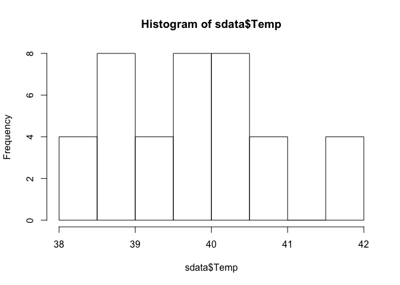
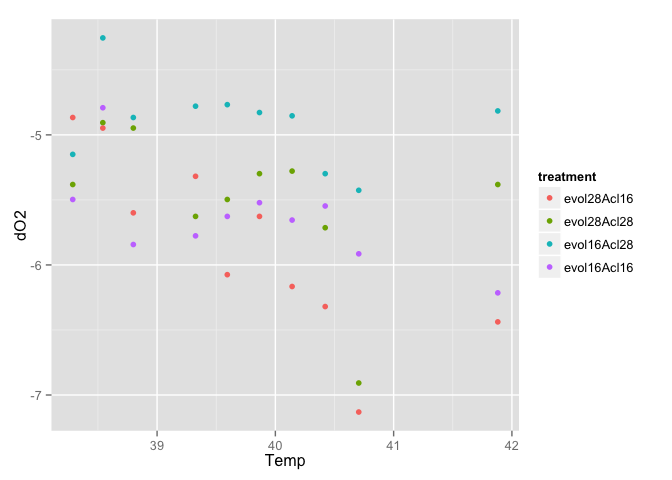
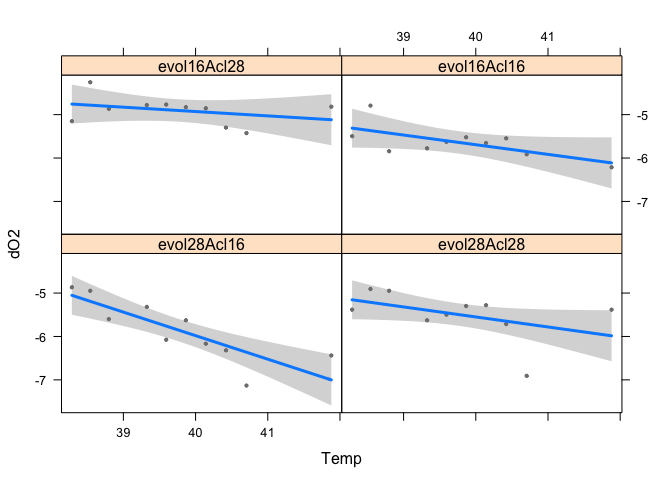
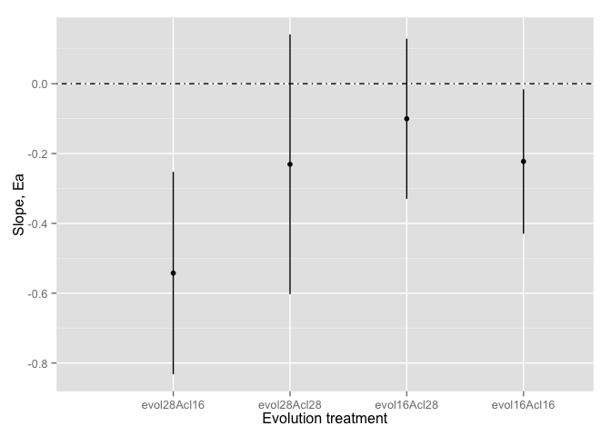

# Scott's experiment plots and models

### Loading data and packages


First, import your data using read.csv. In this case, we decided to call your data 'sdata'.

```r
sdata <- read.csv("/Users/Joey/Documents/Nutrient_Analysis/data/Book1.csv")
```
Then, load packages. 

(remember that to install these packages we use install.packages("packagename"), but you only need to do that once, once they are installed, you just need to load them from your library using the library() command.)

```r
library(plyr) 
library(ggplot2)
library(visreg)
suppressPackageStartupMessages(library(dplyr))
```

### Smell test the data

The next step is to look at your data...A nice first step is to use the str() function. Str stands for structure, and gives you a nice summary of the data structure. 

```r
str(sdata)
```

```
## 'data.frame':	40 obs. of  6 variables:
##  $ Temp     : num  38.3 38.5 38.8 41.9 39.3 ...
##  $ dO2      : num  -5.5 -4.79 -5.84 -6.21 -5.78 ...
##  $ treatment: Factor w/ 4 levels "B2","D2","E2",..: 4 4 4 4 4 4 4 4 4 4 ...
##  $ T.ev     : int  16 16 16 16 16 16 16 16 16 16 ...
##  $ T.acc    : int  16 16 16 16 16 16 16 16 16 16 ...
##  $ Diff     : logi  NA NA NA NA NA NA ...
```


You should notice that the variables 'Temp' and 'dO2' are numeric, and your treatment is a factor. We'll talk more about the different types of variables next week. But for now, this looks good.

The glimpse() function is another way to glance at your data.

```r
glimpse(sdata)
```

```
## Observations: 40
## Variables: 6
## $ Temp      (dbl) 38.28689, 38.54129, 38.79909, 41.88061, 39.32518, 39...
## $ dO2       (dbl) -5.496768, -4.791500, -5.843045, -6.214608, -5.77635...
## $ treatment (fctr) G2, G2, G2, G2, G2, G2, G2, G2, G2, G2, D2, D2, D2,...
## $ T.ev      (int) 16, 16, 16, 16, 16, 16, 16, 16, 16, 16, 28, 28, 28, ...
## $ T.acc     (int) 16, 16, 16, 16, 16, 16, 16, 16, 16, 16, 28, 28, 28, ...
## $ Diff      (lgl) NA, NA, NA, NA, NA, NA, NA, NA, NA, NA, NA, NA, NA, ...
```

What if you wanted to know a bit more about the data...say the column names, or number of rows etc? Try these to smell test the data and make sure everything looks right. To find out more about any of these functions, just type ?head, ?tail etc.


```r
head(sdata)
```

```
##       Temp       dO2 treatment T.ev T.acc Diff
## 1 38.28689 -5.496768        G2   16    16   NA
## 2 38.54129 -4.791500        G2   16    16   NA
## 3 38.79909 -5.843045        G2   16    16   NA
## 4 41.88061 -6.214608        G2   16    16   NA
## 5 39.32518 -5.776353        G2   16    16   NA
## 6 39.59361 -5.626821        G2   16    16   NA
```

```r
tail(sdata)
```

```
##        Temp       dO2 treatment T.ev T.acc Diff
## 35 39.32518 -4.779524        E2   16    28   NA
## 36 39.59361 -4.767689        E2   16    28   NA
## 37 39.86573 -4.828314        E2   16    28   NA
## 38 40.14162 -4.853632        E2   16    28   NA
## 39 40.42135 -5.298317        E2   16    28   NA
## 40 40.70501 -5.426151        E2   16    28   NA
```

```r
ncol(sdata)
```

```
## [1] 6
```

```r
dim(sdata)
```

```
## [1] 40  6
```

```r
nrow(sdata)
```

```
## [1] 40
```
Using the $ helps you pull out just a single column in the dataset. The hist function creates a basic histogram.

```r
head(sdata$Temp)
```

```
## [1] 38.28689 38.54129 38.79909 41.88061 39.32518 39.59361
```

```r
hist(sdata$Temp)
```

 

The next step was to rename your treatments to give them more common-sense names...but you can change them any way you like. Here we are using the 'revalue' function from plyr, and the 'mutate' function from dplyr. These are just handy ways of playing around with your data right here in R, vs going back to excel to change things like variable names. Don't worry about the syntax using the %>%, which is called a 'pipe', we'll get to that next week.

```r
 sdata <- sdata %>% 
   mutate(treatment = revalue(treatment, 
                              c("G2" = "evol16Acl16",
                                "B2" = "evol28Acl16",
                                "E2" = "evol16Acl28",
                                "D2" = "evol28Acl28")))
```

### Visualize the data with plots

First, we visualized the data using ggplot: 

```r
ggplot(sdata, aes(x= Temp, y = dO2, color = treatment)) + geom_point()
```

 


Then we used the handy visreg function to create some quick and dirty plots of the relationship between O2 consumption and temperature, by treatment. Visreg is a nice way of visualizing simple linear models like the ones we are working with. Here mod1 is your oxygen consumption as a function of Temp, treatment and a temp*treatment interaction. We use overlay = FALSE to display each treatment separately.


```r
mod1 <- lm(dO2 ~ Temp*treatment, data = sdata)
visreg(mod1, xvar = "Temp", by = "treatment", overlay = "FALSE")
```

 

### Analysis

Next, I wrote a function which will do two things: First, it will run a basic linear model of DO2 as function of temperature. It will then pull out the parameter estimates we want: slope and confidence intervals. I called the function temp.fit.

```r
 temp.fit <- function(df) {
   model <- lm(dO2 ~ Temp, data = df) ## this is the linear model
   y   = coef(model)[2] ## this is your slope estimate, using coef()
   ylo = confint(model)[2] ## this gives your lower confidence interval
   yhi = confint(model)[4] ## this gives the upper confidence interval 
   setNames(data.frame(t(c(y, ylo, yhi))), c("beta", "ylo", "yhi")) ## this just renames those estimates
 }
```

Here we run function on your sdata. This shows the slope and confidence intervals for the effect of temp on all of your treatments lumped together.

```r
 temp.fit(sdata)
```

```
##         beta        ylo        yhi
## 1 -0.2741507 -0.4417532 -0.1065482
```

Now we apply the function to sdata, but we run separate models for each treatment, using the group_by function. 

```r
 test <- sdata %>%  
   group_by(treatment) %>% 
   do(temp.fit(.)) %>% 
   ungroup()
```

Now we use ggplot to plot the slope estimates and confidence intervals (this is the Ea you want, I think.) You can change the axis labels etc. by changing the xlab and ylab lines etc. We use the command ggsave to save the figure as a png. 

```r
 test$treatment <- factor(test$treatment, levels=unique(test$treatment))
 ggplot(test, aes(x=treatment, y=beta, ymin=ylo, ymax=yhi)) +
   geom_pointrange() + 
   # coord_flip() + 
   geom_hline(aes(x=0), lty=4) +
   xlab('Evolution treatment') +
   ylab('Slope, Ea') + theme(legend.position="none")
```

 

```r
 ggsave("figure2.png")
```

```
## Saving 7 x 5 in image
```
 
